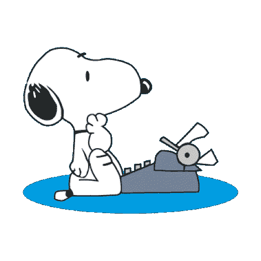

# 提交研究论文后如何应对审稿人的拒绝

> 原文：<https://towardsdatascience.com/dealing-with-rejection-by-reviewers-after-submitting-a-research-paper-9cddc932f2af?source=collection_archive---------55----------------------->

## 会经常发生的！

**我要从头开始吗？** [知识共享 4.0 BY-NC](https://creativecommons.org/licenses/by-nc/4.0/)

你花了几个月甚至几年的时间，小心翼翼地将你的研究成果写成论文，提交给同行评议的期刊。你提心吊胆地等了两个月到 18 个月(迄今为止我的最小和最大范围)，想听听你认为会成为你领域专家的人的意见(并不总是不幸的)。你们中的一些人担心自己的作品不够好，评论者会指出致命的缺陷。在他们内心深处的其他人会认为或者至少希望评论者会认识到他们有多聪明。通知来了，你的心沉了下去。编辑礼貌地拒绝了发表你作品的机会。

## 应对拒绝——接下来该怎么办？

尤其是研究生问我的最常见的问题之一是，在收到一封附有详细评论的拒绝信后，下一步该怎么做？首先要注意的是，拒绝是非常普遍的，所以不要过度担心。我仍然记得我在读博士时收到的第一个审稿人的评论。一位评论家的语气让我大吃一惊。他们似乎没有抓住论文的重点，表现得极其粗鲁和傲慢。

当时，我并没有意识到审稿人和编辑的评论会有多么多变。审阅过程可能非常随机，很难在多个审阅者之间获得一致性，如果编辑要让您进入下一阶段，通常需要这种一致性。事实上，在经济学领域，假设你的论文会被拒绝通常是最好的，尤其是如果你是一名早期职业研究员。这并不意味着你不应该期望发表你的论文，而是可能需要平均多次尝试，尝试的次数将取决于论文有多好，你在期刊选择方面有多雄心勃勃，以及你有多幸运。*这里坚持是真正的关键。*

## 在重新提交给另一个期刊之前，我应该对我的论文做些什么修改？

我收到了来自拒绝我论文的审稿人的非常有见地的评论，但我也收到了非常无用的评论，这些评论似乎在很大程度上反映了他们自己的主观偏见和成见，而不是对具体论文的优点或其他方面的任何仔细评估。作为一名研究生，很难分清哪个是哪个。我注意到有些人完全忽略了评论者的评论，直接重新提交到其他地方，而其他人可能会花几个月的时间在重新提交之前尽可能多地处理评论。

在决定如何做时，将审稿人的意见分为三大类可能会有所帮助，这种分类适用于任何特定论文的程度当然会有很大不同。

## ***1。极有帮助***

这可能采取的形式是被指向你不知道的新的相关文献。一个新的潜在渠道，可以帮助解释主要结果。一种稳健性或敏感性检查，可以进一步增加调查结果的权重。一个重要的方法细节被忽略或没有非常清楚地提出。关键论点表述不一致。一个未曾想到的关键政策含义。一般来说，那些不厌其烦地提供像这样有帮助的评论的评论者也会小心翼翼地用一种通融的语气来表达。话虽如此，即使语气似乎很严厉，也要试着超越这一点。

## ***2。*很少或没有用**

这些完全没有抓住论文的要点。很难简单地描述，但可能采取对整个研究领域(如幸福经济学)或方法(如我不喜欢调查)的敌对评论的形式，而不是对具体论文的优点进行评估。评论也可能反映了这样一个事实，即该评论者有一篇与之竞争的论文，或者仅仅是这篇论文与他们以前的工作相矛盾，这反过来可能会损害(通常是无意识地)评论的公正性。居高临下或幼稚的评论——这通常采取批评方法的形式(例如使用固定效果),同时误解其实际涉及的内容，并经常使用高人一等的语气试图说服编辑他们有多么博学。更广泛地说，试图用过于复杂的批评和“抓住问题”的心态来打动编辑也是很不幸的。

## ***3。*之间的东西**

我发现这些评论与写作风格和结构有关。例如，通过扩展背景部分，你可以更仔细地阐述与任何相关的丰富文献，这份报告将会有很大的改进。浓缩结论。扩展结论。你把 X 解释得太详细了。你解释的太详细了，等等。等等。

我的建议是，在重新提交之前，尽量处理好上面 1 条中的评论。审稿人和编辑之间的差异当然非常非常大(在未来的帖子中会有更多)，但即使在与新审稿人打交道时不太可能出现这些相同的评论，你的论文也会通过考虑这些要点而得到加强。这反过来可能会增加*未来评论者对你论文的*喜欢程度。同样很有可能的是，同一位审稿人被要求再次审阅你的论文，他们很可能会欣赏你在回应他们的意见时所做的任何修改，或者如果你没有采纳他们的意见，他们会感到恼火。我建议安全地忽略第二类评论。他们不会改进你应该关心的论文。的确，你可能会再次得到同一个评论者，但很可能无论你做什么，评论者都会再次发现一些*【致命缺陷】*，并建议拒绝。

是否处理最后一类中的任何评论是一种平衡行为。你能做的任何提高论文清晰度的事情都会增加你的机会，但是有*收益递减*。你必须意识到所涉及的时间，特别是如果你还有新的研究机会去追求的话。同样值得记住的是，例如，如果一个评论者为一个更详细的阐述提出了令人信服的理由，另一个评论者可能会觉得有太多的细节掩盖了你的关键贡献。因此，如果你不小心的话，你可能会有点追不上你的尾巴。

虽然来自评论者关于风格和结构的评论可能是有帮助的，但我发现*时间的流逝通常比任何评论者的评论*更有效。当我收到拒绝后再次看论文时，我几乎总能找到各种方法让我的文章更清晰。事实上，即使我没有发现审稿人的评论特别有启发性，但我在收到拒绝后六个月彻底修改论文的情况并不少见。这可能反映了这样一个事实，即写作的清晰度在不断提高，我自己对相关主题的知识也可能在这段时间里有所提高，没有什么比用新的眼光看待事物更好的了，即使它们是你自己的。