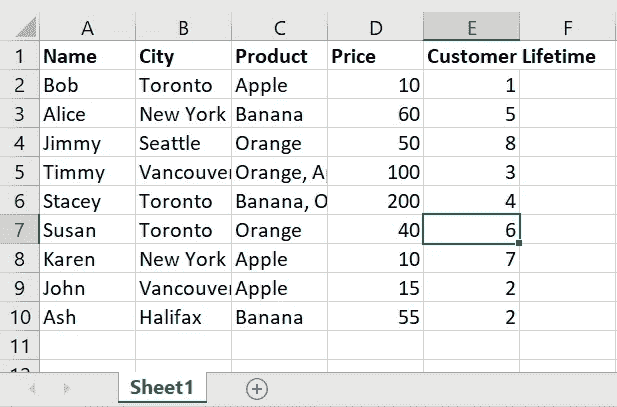

# 亲爱的企业，首先是完美的电子表格和 SQL

> 原文：<https://towardsdatascience.com/dear-businesses-perfect-spreadsheets-and-sql-first-747e2cbef825?source=collection_archive---------26----------------------->

## 让数据科学更贴近企业，并为企业的成功做好准备


照片由[大卫·布鲁克·马丁](https://unsplash.com/@dbmartin00)在 [Unsplash](https://unsplash.com/photos/qa4-KH8UjRA)

让我们面对现实吧。尽管围绕数据科学已经炒作了几十年，但任何企业都很难采用它。

但是为什么呢？

如果你回到任何一家公司的历史，你首先会看到一个最独特的产品(MVP)的诞生。然后，支持公司可伸缩性的部门，如营销、运营和产品(包括工程)进入场景。接下来是让公司承担责任的支持部门，如财务和人力资源部门。一旦你获得了牵引力，你可能最终会开始考虑是否有一个专门的分析团队来为你构建可持续的报告。如果你愿意，可以称之为“支持支持部门”。

自从[哈佛商业评论称“数据科学家”是 21 世纪最性感的工作](https://hbr.org/2012/10/data-scientist-the-sexiest-job-of-the-21st-century)让学习者一头扎进数据科学 101 以来，无数的在线课程、博客和教程视频激增。因此，我们创造了一群“数据科学”员工候选人。雇主呢？雇主是否知道公司正处于雇佣合适人才的哪个阶段，这些人才将推动公司利用数据科学？

在本文中，我将使用一个轶事来概述许多企业中的一个常见场景，并且我将讨论许多公司在为数据科学做好准备之前所经历的阶段。如果您希望了解更多关于**让数据科学与任何业务相关**的信息，请点击本文末尾的相关资源超链接。

# 介绍…Excel，您的测试版报告的诞生地

我们都经历过。当我们渴望知道答案，并且现在就想知道答案的时候。我们有这 6 个月的销售数据，我们只想知道收集的指标(客户详细信息，如年龄、居住地、他们选择的产品、支付的价格、他们成为客户多久了，*等。给我们介绍一下我们的业务。*

因此，我们打开一个新的工作表，开始键入我们已经有的 10 行，或者从已经很好地将其放入表格的人那里复制。或者进阶导入一些。csv 文件导入到电子表格中。



作者图片:贵公司的第一张纸 1

你可能不需要用图表来告诉你，在你的前 10 个(特殊的)客户中，3/10 来自多伦多(6/10 来自东海岸)。“苹果”是你最喜欢的产品，其次是“桔子”。你的平均客户生命周期是 4 个月。在 6 个月的时间里，这 10 个客户中，你总共从他们身上赚了 540 美元。

这就是了。你不需要一个分析团队，因为你还负担不起，数据样本仍然很小，你和电子表格可以一起完成这项工作。

# 大约 2 到 3 年后，“伟大的电子表格”诞生了

业务增长了，你，创始人，雇了一个分析师(Linda ),他会为你汇总所有的销售数据。首先，你教她你是如何做报告的，然后你给她一个方向或一个要求，她有自主权以她自己的方式构建报告。

GIF via [GIPHY](http://giphy.com)

除了这一次，你注意到报告上的数字一点也不一致。你让琳达重新做报告，但是数字看起来还是不太对。你试图进一步调查，要求她发送她用来整理报告的原始数据，但这太过分了。她从这份极其丰富多彩的报告中复制并粘贴了一行，并在至少两张纸上做了一个又一个 Vlookup，以首先获得参考文件或映射，然后获得数字。由于无法承受大量的手工工作，Linda 在处理了两年的报告后辞职了。

你的新员工 Jerry 受到了 Linda 和其他人创建的“伟大的电子表格”的欢迎。他开始做的正是琳达所做的，即使在周末也非常努力。又过了半年，Jerry 向您提出了对数据仓库的需求，并请求您提供资金。有趣的是，你问 Jerry 他是否解决了他一直激烈批评的“大电子表格”问题。

杰瑞有备而来。

他列举了自己为移除“大电子表格”所做的基础工作:

1.  **定义一个业务流程和所需的核心数据。** 对于已经升级为成本报告仪表板的销售数据，他每周都会将供应商的发票(他让他们按照一定的格式)下载到一个 google drive 中。他一直在和工程团队的伙伴聊天，他正在学习如何按计划有计划地下载发票。其次，他与市场部建立了一个共享的 google sheet，这样他就可以收集客户订购的东西，并进行严格的数据验证，以标记无效的值。随着客户数据的积累，他根据日期将历史数据分块归档。
2.  从简化的数据处理中自动构建报告。
    财务部门需要供应商的发票来调节任何差异，因此他为他们提供了查看权限。在幕后，他在 Google Apps 脚本中有一个脚本计算，以方便对账，他将一周内所有订购产品 X 的客户与产品 X 的发票总额进行匹配。这解释了当客户订单和发票金额之间的数字不一致时，您在仪表板上看到的条件格式。他刚刚开始将运营成本纳入仪表板，以进一步帮助财务部门和您分析额外的业务支出。
3.  **记录整个业务流程，让事情变得简单。他很快意识到他不能仅仅因为知道东西在哪里就花一整天来回答人们的问题。他已经在管理数据的每个驱动器中创建了文档，因此用户可以在开始使用驱动器中的数据之前进行自我指导。随着他的所有权的增长，他审查和编辑他的关于新的或修改的业务流程的文档，并且如果其他用户没有遵循某些指导方针并最终得到糟糕的报告，他通常能够让他们承担责任。**

你对此深信不疑，接着问 Jerry 为什么需要数据仓库。

Jerry 向您解释说，自从他加入以来，无论是产品数量、客户数量、运营成本类型还是其他方面，数据都在增长。当电子表格随意放置时，做更多的映射和 Vlookups 也变得越来越困难，而数据仓库可以通过连接轻松解决这个问题。他已经建立了一个系统来简化向数据仓库的迁移，因为他还有一整套 SQL 技能没有充分利用。

# 再见，伟大的电子表格；你好，SQL 数据库

在您批准了 Jerry 的数据仓库提议之后，您已经看到他再次忙于将数据推入数据仓库。您有幸成为第一批登录数据仓库的用户，了解他的数据迁移情况。他已经对您进行了关系数据库和 SQL 的一些基础培训，因此您了解了如何浏览表和运行一些查询。

欢迎您的是组织有序的模式和表。您可以看到`customer,`和类似`customer_address, customer_orders`的客户周围的维度表。在`customer_orders,`下面，您可以看到每个`product_id`都与每个订单相关联。更简洁的是在`supplier`模式下，你甚至可以看到`supplier_product_id`到`product_id.`的映射，你肯定财务部门看到这个也会非常兴奋！当然，`operations`模式仍在构建中，但是已经可以看到一个计划将`product_id`映射到每个`cost_type`的表。

Jerry 告诉你，在未来，他不再需要担心他的“电子表格管道”是否能正确地将数据输入到仪表板中。他只需要将仪表板与查询挂钩，该查询将为他提供电子表格管道所能提供的一切，如下所示:

```
SELECT date,
       customer_firstname, 
       customer_lastname, 
       customer_address, 
       product_name, 
       customer_ordered_price, 
       SUM(customer_ordered_price) OVER (PARTITION BY product_name,   date) AS ordered_product_total, 
       SUM(supplier_invoiced_price) OVER (PARTITION BY product_name, date) AS invoiced_product_total,
       ordered_product_total — invoiced_product_total AS total_delta
FROM product_supplier_joined_view
WHERE SUBDATE(NOW(), INTERVAL 7 DAY);
```

尽管在工程团队开发进一步简化 Jerry 定义的业务流程的应用程序之前，电子表格仍然需要作为数据收集和转换的权宜之计，但这只是从应用程序而不是电子表格切换管道数据的问题。

Jerry 还提醒您，仍然有许多优秀的电子表格放在各个部门，因为这是每个人在处理临时报告时感觉最舒服的地方。他相信，只要有业务需求，并且业务需求被明确定义，他就能够通过将新数据合并到他的数据仓库中，将临时报告转变为常规报告。

# 好吧，我们可以开始数据科学了吗？


Artem Maltsev 在 [Unsplash](https://unsplash.com?utm_source=medium&utm_medium=referral) 上拍摄的照片

尽管如此，这个轶事是一个关于企业如何尝试数字化转型的理想主义案例研究。通常，“伟大的电子表格”是一个集体的努力，每个利益相关者可能有他们对报告格式的解释。数据收集过程可能根本不存在(例如，供应商发票仍然在纸面上或非结构化的 PDF 文件中)。您的分析师当时不具备所需的技能，也不具备简化报告渠道的远见。工程团队可能很难实现迎合业务需求的变化。现实世界是复杂的，你可能会在很长一段时间内被“伟大的电子表格”所困扰，直到有领导带领你远离它。

假设一家公司或多或少遵循了理想场景，它将更有能力开创数据科学。任何导致新流程的业务变化都意味着整个流程(数据收集、数据转换、数据消费)都应该经过深思熟虑的设计和记录。数据集成只是使数据对数据消费者可用的过程的一部分。例如，如果 Jerry 决定与公司的竞争对手进行价格匹配，他将需要确定在哪里以及如何(经常)获得数据，并在修改标识符后将其合并到他的数据仓库中，然后将该报告提交给相关的利益相关方。

本·韦伯撰写的“创业公司的数据科学”系列是游戏和金融科技行业经验丰富的数据科学家将他在公司建立数据基础设施的旅程转变为工具书的一个例子。

[](/data-science-for-startups-introduction-80d022a18aec) [## 创业数据科学:简介

### 我最近换了行业，加入了一家初创公司，负责建立数据科学…

towardsdatascience.com](/data-science-for-startups-introduction-80d022a18aec) 

韦伯用一种非常有趣的方式描述了[“数据管道的演变”](/data-science-for-startups-data-pipelines-786f6746a59a)。我还认为数据本身经历了一次进化:

1.  **手动电子表格时代:**分析师和数据制作者开始创建一个电子表格生态系统，它可以很好地处理几兆字节的数据，并且在处理临时报告时非常用户友好
2.  **公式/宏时代:**增加了更多的业务逻辑，数据增长了，可以通过公式将数据“查询”到另一张表中作为参考。某些循环计算，映射，或格式可以写在谷歌应用程序脚本/VBA。
3.  **数据库时代:**处理 8 张以上的 Vlookup 或等待后台宏完成运行不再是可持续的，处理数据的 web 应用程序可能已经启动，因此数据可以从 UI 或 API 导出。

虽然我同意 Weber 的观点，即由于可扩展性问题，公司应该尽最大努力避免电子表格，但我认为电子表格对于企业来说就像 SQL 对于数据库一样，是一种不会很快消失的通用语言。此外，除非证明报告原型对决策者有用，否则通常不会有正式的业务流程和工具支持，如 web 应用程序和/或数据库。有点进退两难的局面。

猫演示第 22 条军规

为了避免这种进退两难的局面，也为了避免让更多希望专注于更多统计建模(和更少的数据清理)的人才失望，我们必须从解决需求层次的底层开始。大多数企业不一定有那么多数据源(例如*“测井”、“传感器”等。除了“伟大的电子表格”，所以在更精简的流程出现之前，没有任何捷径可以让电子表格系统尽可能地保持有序。*

最后但同样重要的是，一份好的报告通常来自一个好的问题。除了报告可以回答的一些描述性测量(例如，这个月的销售额是多少？我们有什么样的客户统计数据？)，还有说明性的衡量标准(例如，本月我们的活动有多少浏览量？我们产品的价格是如何波动的？).每当我们试图度量任何业务度量时，我们必须问自己这个特定的业务度量意味着什么，以及对它进行实验是否会影响或产生额外的业务度量。*伊森·诺克斯的文章中有更多很棒的例子。*

[](/is-your-company-too-dumb-to-be-data-driven-696932d597c3) [## 你的公司是不是太笨了，不能数据驱动？

### 利用信息是一种熟练的行为，而不是数据产品的输出。

towardsdatascience.com](/is-your-company-too-dumb-to-be-data-driven-696932d597c3) 

只有这样，我们才能正式进入数据科学的领域。

# 离别的思绪

如果你正在读这篇文章，你一定听说过关于数据科学的炒作。关于“洞察力驱动的企业”、“用机器学习预测你的企业”和“人工智能如何加速信息时代”的头条流行语。但帮助企业实现数据科学的最新分步指南仍然缺失。

> 为了将企业纳入这一系列数据科学宣传中，我们需要开始关注的是，在“数据驱动”之前，首先努力做到“数据就绪”。

“遗留系统”也可能意味着电子表格的海洋，其组织关系到向数据库迁移的容易程度。即使在 SQL 数据库启动并运行之后，还有一系列全新的问题，例如与其他数据源集成，以继续开发新的或现有的[数据产品](/designing-data-products-b6b93edf3d23)。

暂时忘掉数据驱动吧，**您的公司是否有可靠的数据基础架构，数据是否衡量正确的事物？**

我想用另一篇哈佛商业评论文章中的一段话来结束这篇文章，这篇文章强调了数字化转型的挑战。

> 成功需要汇集和协调比大多数领导者所意识到的更大范围的努力。在四个相互关联的领域(技术、数据、流程或组织变革能力)中，任何一个领域表现不佳，都可能破坏一项精心策划的变革。****真正重要的事情，从创造和传达一个令人信服的愿景，到制定一个计划并即时调整，再到钻研细节，都与人有关。****

**[](https://hbr-org.cdn.ampproject.org/c/s/hbr.org/amp/2020/05/digital-transformation-comes-down-to-talent-in-4-key-areas) [## 数字化转型归结于 4 个关键领域的人才

### 多年来，我们参与、建议或研究了数百次数字化转型。这样做，我们已经…

hbr-org.cdn.ampproject.org](https://hbr-org.cdn.ampproject.org/c/s/hbr.org/amp/2020/05/digital-transformation-comes-down-to-talent-in-4-key-areas)** 

***文章中未直接引用但仍然相关的资源:***

**[数据科学和分析领域的通才与专家](/generalists-vs-specialists-in-data-science-and-analytics-fe5d8b55f1e6?source=bookmarks---------0------------------)**

**[Excel 与 SQL:概念上的比较](/excel-vs-sql-a-conceptual-comparison-dcfbee640c83)**

**我的前一篇文章已经讨论了数据工程为什么以及如何帮助一个组织“数据就绪”。**

**[](/voicing-for-data-engineering-the-unsung-hero-b91b6ef39dcd) [## 为数据工程发声，无名英雄

### 我如何改变策略来帮助企业启动其数据基础设施和报告渠道

towardsdatascience.com](/voicing-for-data-engineering-the-unsung-hero-b91b6ef39dcd) 

如果您想阅读更多关于以下方面的深度文章

*   电子表格最佳实践
*   SQL 数据库的威力和局限性
*   如何在公司中扩展数据分析

请在下面评论，并随时让 [Iris Huang](https://medium.com/u/5b7c8c1ea76f?source=post_page-----747e2cbef825--------------------------------) 了解贵公司如何处理数据！:)**