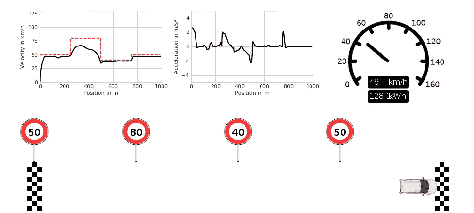

# 自动驾驶汽车，如何应对不确定性？

> 原文：<https://towardsdatascience.com/dear-self-driving-car-how-do-you-deal-with-uncertainties-dc5a7e2d1c87?source=collection_archive---------29----------------------->

## 不确定条件下的强化学习优化。

在这里，我与卢卡斯·沃格特、简·杜门和克里斯托弗·弗里贝尔一起展示了这项研究。

**TL；技术系统的控制可以在模拟中得到优化。然而，事实上，无数的未知在等着我们。在这篇文章中，我们展示了噪声和传感器误差的增加如何影响强化学习代理的优化结果。**

照片由[凯尔·格伦](https://unsplash.com/@kylejglenn?utm_source=unsplash&utm_medium=referral&utm_content=creditCopyText)在 [Unsplash](https://unsplash.com/?utm_source=unsplash&utm_medium=referral&utm_content=creditCopyText) 拍摄

# 动机

> **“安全总比后悔好！”**

大多数汽车司机都遵循这种想法，因为从长远来看，有时获得一个次优的结果比每次争取一个最佳结果更有利。例如，驾车者很少将车辆的性能发挥到极限，他们更愿意将可能导致事故的误判的可能性降至最低，并接受他们将比理论上可能的时间晚到达目的地的事实。在自动驾驶的发展过程中，这一观察提出了自动驾驶汽车的控制算法在考虑不确定性的情况下如何表现的问题，特别是因为不确定性可能导致误判，从而导致不当行为，这可能导致事故。

# 远程控制

 [## 要不要用强化学习训练一辆简化的自动驾驶汽车？

### 试试我们新的远程控制环境

towardsdatascience.com](/do-you-want-to-train-a-simplified-self-driving-car-with-reinforcement-learning-be1263622e9e) 

作为我们之前提到的问题的研究的基线，我们使用了 OpenAI 健身房的 LongiControl 环境[1]，它提供了一种通过强化学习(RL)来训练代理的容易实现的可能性。我们将在以下段落中总结有关 LongiControl 的关键事实，但您可以在我们的第一篇文章 [**此处**](/do-you-want-to-train-a-simplified-self-driving-car-with-reinforcement-learning-be1263622e9e) 或已发表的论文 [**此处**](https://www.researchgate.net/publication/342747549_LongiControl_A_Reinforcement_Learning_Environment_for_Longitudinal_Vehicle_Control) 中找到更多信息。另外，你可以自己尝试一下 LongiControl，源代码可以在 GitHub [**这里**](https://github.com/dynamik1703/gym_longicontrol) 找到。

远程控制环境

**关键事实**在远程控制环境中，车辆的目标是在给定时间内尽可能节能地完成单车道路线，而不造成事故。总之，这对应于在从 *t₀* 到 *T* 的间隔中使用的总能量 *E* 的最小化，作为功率 p 的函数:

根据外部要求，如其他道路使用者或速度限制，必须同时满足以下边界条件:

其中 *v* 为速度， *a* 为加速度，a_dot 为急动度，其中()ₗᵢₘ,ₘᵢₙ和()ₗᵢₘ,ₘₐₓ分别代表下限和上限。因此，RL 代理试图通过他选择的动作来满足所有这些标准，同时最小化车辆的总能量消耗。

# 为什么要考虑不确定性？

并不是所有发生在现实世界应用中的影响都可以提前看到。未来是未知的，传感器误差会突然出现，最小的偏差都会导致不希望的结果:

为了弥合现实世界中的代理行为和模拟中的自动驾驶之间的差距，将现实的不确定性融入到模拟中是很重要的。这一研究领域通常被称为“ **Sim 到 Real Transfer** ”，如果你想了解更多，进一步的例子在[2]和[3]中给出。这一努力的第一步是在 RL 代理的训练环境中实现随机噪声和干扰。结果，典型的代理-环境交互的流程图现在看起来与通常不同。代理请求的动作和环境的新状态都通过随机发生的干扰来修改。

图 1:没有不确定性的主体-环境相互作用

图 2:具有不确定性的主体-环境相互作用

# 实现的不确定性

我们选择实施以下四种不同类型的干扰，以在代理的训练过程中制造不确定性。

S 在我们的场景中，滑移是重要的，因为它影响车辆的加速度，即代理的动作。

图 3:滑移对代理行为的影响

速度传感器的暂时故障是一种不太可能但有可能发生的事件，通常由传感器和控制板之间的数据传输错误触发。环境的状态向量包含车辆的当前速度。因此，智能体的行为对速度变化很敏感，需要学习如何处理当前车速的不确定性。

图 4:传感器故障对代理行为的影响

图 4 显示了暂时故障速度信号在 3 个位置的影响。从而速度值突然跳到零，然后再次显示正确的值。车辆在这些点继续行驶。只有强化学习代理接收到临时故障信号。

**故障交通标志检测**包含两种不同类型的随机干扰。首先，错误检测交通标志，尤其是速度限制。摄像机系统可以将给定的 50 公里/小时的速度限制识别为 60 公里/小时。这些错误可能导致代理对其环境的错误假设，这可能导致代理的不适当行为。正如您在图 5 中看到的，对即将到来的速度限制的不确定性导致了小的加速和减速交替阶段。这是由于希望在不同速度区之间建立平滑过渡，但即将到来的速度限制(过渡的目标值)是不确定的，因此过渡过程变得不确定，即显示随机偏差。

图 5:故障交通标志检测对代理人行为的影响

其次，直到下一个速度限制的距离的不精确测量。代理通过环境的状态向量接收这个距离，并相应地选择他的动作。距离信息对于确保不同速度限制的区域之间的平滑过渡而不超过当前速度限制是必要的。由于这些不确定性，代理人无法准确预测下一个速度限制生效之前还剩多少时间。因此，他开始加速汽车，以确保平稳过渡到下一个速度限制，但在加速后不久，代理人决定减速汽车，以避免因超速而受到奖励处罚。这个循环重复几次，因为代理基于不确定的(错误的)信息过早地启动了加速过程。

图 6:错误的距离测量对代理行为的影响

# 不确定条件下的优化

[康纳·乐迪](https://unsplash.com/@opticonor?utm_source=unsplash&utm_medium=referral&utm_content=creditCopyText)在 [Unsplash](https://unsplash.com/?utm_source=unsplash&utm_medium=referral&utm_content=creditCopyText) 上的照片

## **不确定情况下的行为**

正如所料，在随机干扰环境中接受训练的智能体，在不确定的环境中比没有处理随机事件经验的标准智能体表现得更好。从图 7 和图 8 中可以看出，尽管环境嘈杂且行为随机偏差，但受过不确定性训练的智能体避免了超速。

图 7:没有不确定性的训练的代理

图 8:带着不确定性训练的代理

## **没有不确定性的行为**

有一个考虑到可能的随机偏差影响的代理，并不意味着代理应该总是在有干扰的情况下工作。因此，在某个环境中没有偏差的行为也是智能体能力的一个有趣指标。在图 9 和图 10 中，您可以看到两个代理在无偏差环境中的行为。显而易见，不确定代理人与限速保持安全距离。通过这种行为，如果意外的随机偏差导致汽车突然加速，这将导致超过当前速度限制，则代理获得短时间的反应窗口。

图 9:没有不确定性的训练的代理

图 10:带着不确定性训练的代理

## **通过不确定性进行行为控制**

不确定性的实现，除了增加训练过的代理的鲁棒性之外，还提供了在不改变回报计算结构的情况下改变代理的行为的可能性。为了训练代理，其行为可以在通过最终用户的训练过程之后被改变，有必要在训练期间改变所实现的不确定性的参数(例如，标准偏差或期望值)。例如，随机干扰的标准偏差越大，导致的防御行为越多，因为代理人期望抵消更大的偏差。因此，最终用户通过选择不同的行为模式来改变代理人的期望。所选择的行为模式改变环境状态向量中的值。该值影响分布的标准偏差和期望值，用于计算不确定性的随机影响。在图 11、12 和 13 中，你可以看到代理人的期望是如何影响最终行为的。

图 11:预期的大偏差→防御行为

图 12:预期的正常偏差→正常行为

图 13:预期的小偏差→攻击行为

# 摘要

在本文的最后，我们将总结最重要的几点。

在我们的第一篇文章中，我们展示了在建议的 RL 环境中，它适应于 OpenAI Gym 标准化，很容易原型化和实现最先进的 RL 算法。此外，LongiControl 环境适用于各种检查。除了 RL 算法的比较和安全算法的评估，在多目标强化学习领域的研究也是可能的。在我们的第二篇文章中，我们展示了不确定性对受过训练的代理人行为的影响。我们表明，不确定性本身就足以实现具有不同行为的智能体，并且不确定性可以对智能体的训练速度产生积极的影响。未来可能的研究目标是与已知路线的规划算法进行比较，并考虑非常长期的目标，如在特定时间到达。

**LongiControl** 旨在使社区能够利用强化学习的最新策略来解决自动驾驶领域的现实世界和高影响问题。

由[弗兰基·查马基](https://unsplash.com/@franki?utm_source=unsplash&utm_medium=referral&utm_content=creditCopyText)在 [Unsplash](https://unsplash.com/s/photos/artificial-intelligence?utm_source=unsplash&utm_medium=referral&utm_content=creditCopyText) 上拍摄的照片

享受使用它😉

# 参考

[1] G. Brockman 和 V. Cheung 和 L. Pettersson 和 J. Schneider 和 J. Schulman 和 J. Tang 和 W. Zaremba，[开放健身房](https://arxiv.org/abs/1606.01540) (2016)，CoRR

[2]薛斌鹏(音译)，[具有动力学随机化的机器人控制的虚拟到真实转移](https://arxiv.org/pdf/1710.06537.pdf) (2017)，CoRR

[3] JoshuaTobinu.a .，[将深度神经网络从模拟转移到现实世界的域随机化](https://arxiv.org/pdf/1703.06907.pdf) (2017)，CoRR

 [## 德国萨克森州 Roman liener-Dresden |职业简介| LinkedIn

### 查看 Roman liener 在 LinkedIn 上的职业资料。LinkedIn 是世界上最大的商业网络，帮助…

www.linkedin.com](https://www.linkedin.com/in/roman-lie%C3%9Fner-56346113b/)