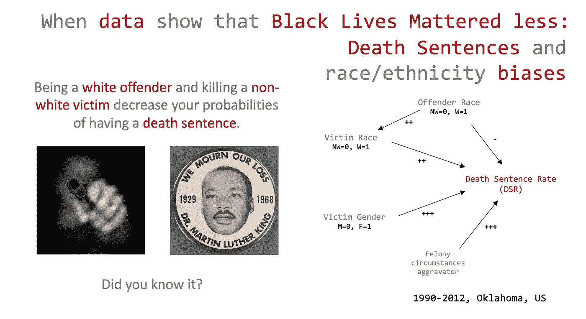
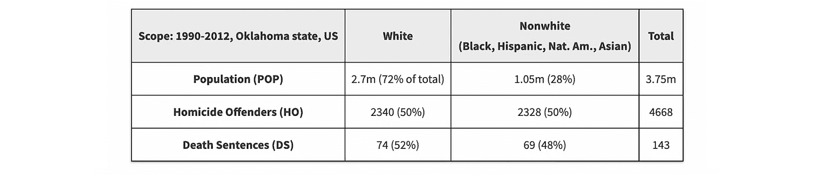
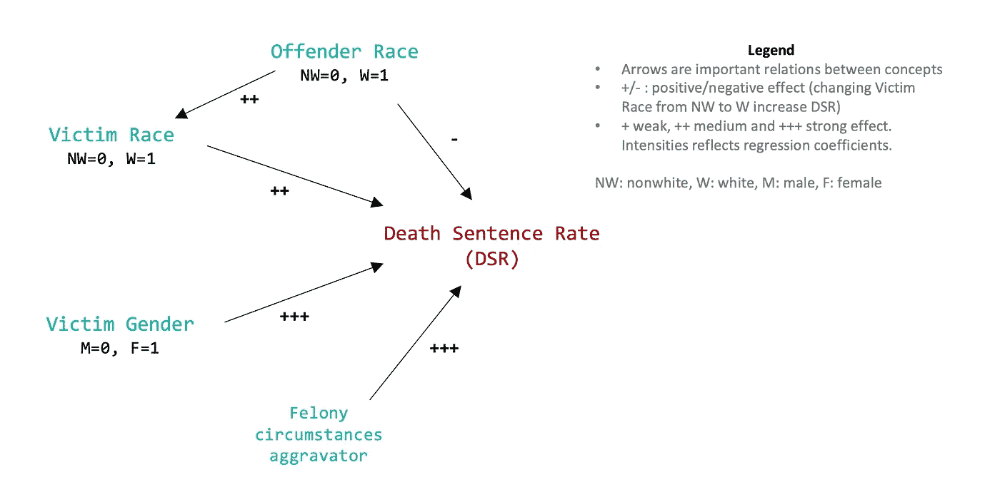

# 死刑判决和种族偏见

> 原文：<https://towardsdatascience.com/death-sentences-and-race-ethnicity-biases-4712e439a8c7?source=collection_archive---------55----------------------->

## 当数据显示黑人的生命不那么重要时

这篇文章讨论了我们后奴隶制、后殖民主义和后种族隔离时代的一个非常严肃的话题。为什么当法律明确谴责不同的治疗或结果时，仍然有明显的差异？这些差异影响了部分公众舆论——顺便说一下，这应该影响到所有人，因为这个问题不会只在少数族裔身上得到解决。

这篇文章将揭露和解释**黑人的生命不那么重要**的情况。在俄克拉荷马州，从 1990 年到 2012 年，143 名罪犯被判处死刑。2017 年，皮尔斯等人收集并分析了杀人数据(4668 名罪犯)和死刑判决。它表明死刑判决的结果涉及到几个种族/民族的影响。这张[纸](https://scholarlycommons.law.northwestern.edu/cgi/viewcontent.cgi?article=7615&context=jclc)包含了所有的细节。使用的术语(“非白人”、“种族”)来自该文件。我不喜欢“非白人”这个词，但我不能每次都用黑人、西班牙人、美洲原住民和亚洲人来代替它。我会在这个帖子里坚持下去。

# 1.有根据的猜测死刑的最佳/最差可能性？

虽然这个话题非常严肃，但我想知道你对潜在偏见的第一想法。假设有一个罪犯，因“故意(非过失)杀人”而被审判。我们对他一无所知。

什么会降低他被判死刑的可能性？

1.  如果**罪犯**是**白人**则少判死刑。
2.  如果**被害人**是**不是白**就少判死刑。
3.  几率差不多，司法系统是公平的，不是吗？
4.  你的问题有失偏颇(请说如何，有意思)。

你怎么想呢?你可以把你的答案写在下面的评论里。

# 2.从杀人罪犯到死刑，一个明显平等的结果

让我们回到俄克拉荷马州，那里的作者已经收集了 1990 年至 2012 年期间的凶杀案和死刑判决。

1990-2012 年俄克拉荷马州杀人罪犯和死刑判决统计。资料来源:Pierce 等人[的论文](https://scholarlycommons.law.northwestern.edu/cgi/viewcontent.cgi?article=7615&context=jclc)

按种族/民族的概述让我们对这个故事有了初步的了解:

*   凶杀率(HR = HO/POP) :非白种人在凶杀罪犯中明显过多。尽管任何旨在减少凶杀案的预防/缓解战略都应考虑到这一点，但我们将遵循这篇文章，重点关注死刑率，因为这是司法系统的核心，而不是上游。
*   **死刑判决率(DSR = DS/HO)** : DSR 的白人与非白人杀人罪犯非常相似(3.2%比 3.0%)。

> ****【DSR】****的平等在这里是公平的核心概念，我们将从多个维度来计算它。DSR 被定义为死刑数量除以杀人罪犯数量。**

***结果均等**意味着**类似的杀人案**(在类似的重罪情节程度下)应该导致**类似的死刑判决率** (DSR)。*

*所以，不管罪犯是什么种族，DSR 看起来都是相似的。俄克拉何马州的整个故事已经讲完了吗？不，没有，远不止这些。*

# *3.按受害者的种族/民族划分的死刑率讲述了另一个故事*

*另一个角度是考虑受害者的种族/民族，而不是罪犯的种族/民族。从字面上讲，这就是“黑人的命也是命”座右铭背后的思想。*

**

*1990-2012 年俄克拉荷马州按受害者种族/民族划分的死刑判决和 DSR 统计数据。资料来源:Pierce 等人[的论文](https://scholarlycommons.law.northwestern.edu/cgi/viewcontent.cgi?article=7615&context=jclc)*

*结论是惊人的:与非白人受害者相比，白人受害者被判死刑的几率是白人受害者的两倍(2.05 =**3.9%/1.9%**)。*

*然而，在得出这些结果的差异是歧视性的结论之前，是否应该考虑其他强烈的 DSR 差异。*

# *4.受害者性别也有很大的影响*

*应该考虑受害者的另一个特征:性别。它实际上有一个很大的影响:**女性受害者的 DSR**是 **7.2%** vs **1.6%** 。换句话说，女性受害者被判死刑的几率是男性受害者的 4.5 倍(7.2%/1.6%)。*

***2 效果**(受害者种族/民族和性别)**如何组合？我们可以在这里争辩说，也许白人受害者中有更多的女性，这可以解释为什么白人受害者的 DSR 更高。在这种情况下，可能不存在歧视性影响(假设当受害者是女性时，可以更严厉地谴责)。***

*当我们计算**跨种族跨性别的死刑判决率**时，这种假设情景消失了:*

**

*1990-2012 年俄克拉荷马州按受害者种族/民族和性别统计的死刑率。资料来源:皮尔斯等人[的论文](https://scholarlycommons.law.northwestern.edu/cgi/viewcontent.cgi?article=7615&context=jclc)*

*没有[辛普森式的](https://en.wikipedia.org/wiki/Simpson%27s_paradox)扭曲效果:无论是女性还是男性，都有明显的**白人与非白人的 DSR 差异**。对于男性受害者来说，这种影响更为显著:与非白人受害者相比，白人受害者被判死刑的几率是 T4 的 2.9 倍(2.3%/0.8%)。*

*在总结之前，让我们考虑潜在的其他因素。*

# *5.其他影响:重罪情节加重*

*在从之前的分析跳到关于受害者的种族/民族的歧视性影响的结论之前，我们需要思考和测试可能的混淆因素。*

*首先想到的是杀人案的重罪情节的程度。三级重罪情节加重犯被考虑在内，他们与 DSR 有最强的联系。它们的相对危险度分别为 1.7%(无强化者)、6.2%(有 1 个强化者)和 30.2%(少数有 2 个强化者)。*

# *6.一个“因果”交互图来总结它*

*为了解释可能的混杂效应和推理*其他条件不变的情况下*，作者对之前提到的所有变量进行了逻辑回归。我鼓励你去看看论文中的结果(表 11)。但是为了简单起见，我把它翻译成了一个“因果图”，同时用指向 **DSR** 的箭头(+/-)表示回归系数的方向和强度。从*犯罪者种族*到*受害者种族*的最后一个箭头说明了白人犯罪者杀死大多数白人受害者，反之亦然。*

**

*死刑率的因果交互图。只画出重要的关系。来自[datajms.com](https://datajms.com/post/fairness_justice_death_sentence/)*

*画面变得更加清晰，死刑率是:*

*   *主要是由犯罪的严重程度决定的(最坏和最好情况的概率乘以 13)*
*   *然后由受害者的**性别**决定(女性受害者的几率大约乘以 5)*
*   *第三，受受害者的**种族/民族驱使(白人受害者的几率大约是 1.8 倍。但请注意，仅在男性中，白人与非白人的比例为 3.2。***
*   *最后，受**罪犯种族/民族**的微弱驱动(非白人罪犯的几率增加约 1.3 倍)。*

# *7.关于潜在种族/民族公平问题的结论*

1.  *与其他影响相比，**直接歧视(通过罪犯种族)**相对较小。它是如此之小，以至于论文作者得出结论，没有证据支持这种直接影响。然而，逻辑回归表明，仍然有一个小的影响，但不是非常显著。
    想象一个非白人罪犯的死刑率为 2%的案例。如果是白人，其 DSR 将降至 1.5%(几率除以 1.3)。*
2.  *有一个明显的“黑人生活不重要”效应，这在男性中更为明显。
    想象一个白人受害者案件，死刑率为 2%。在同样的条件下，非白人男性受害者的 DSR 下降到 0.6%(男性的几率除以 3.2)。*

*请注意，这两种效果一般都是**部分抵消**。我们提到典型案例是白人罪犯杀害白人受害者和非白人罪犯杀害非白人受害者。在这些情况下，这两种效应会部分抵消，所以观察到的 DSR 是相似的。然而，在**不太频繁的“跨种族”杀人案**中，**的影响累积起来**并导致 DSR 的显著差异。*

*所以，回答我们的第一个问题，给定一个杀人罪犯，我们对他了解不多:*

*   *答案 1(如果罪犯是白人，少判死刑)会使**几率降低 23%**(1–1/1.3)*
*   *答案 2(如果受害者不是白人，则少判死刑)一般来说会将几率降低 44%(1–1/1.8)，如果受害者是男性，则降低 69%。*

***答案 2** 正确:*

> *****受害者种族/民族*** *效应(杀害白人受害者的凶手受到更严厉的惩罚)强于* ***犯罪者种族/民族*** *效应(非白人犯罪者受到更严厉的惩罚)。***

**请注意，这份声明来自对 1990 年至 2012 年俄克拉荷马州死刑判决的分析。**

**更一般地说，注意到在美国的刑事司法系统中有**压倒性的**证据表明**歧视性影响**。这两篇华盛顿邮报的文章列了很多。**

***原载于 2020 年 6 月 3 日*[*【https://datajms.com】*](https://datajms.com/post/fairness_justice_death_sentence/)*。***