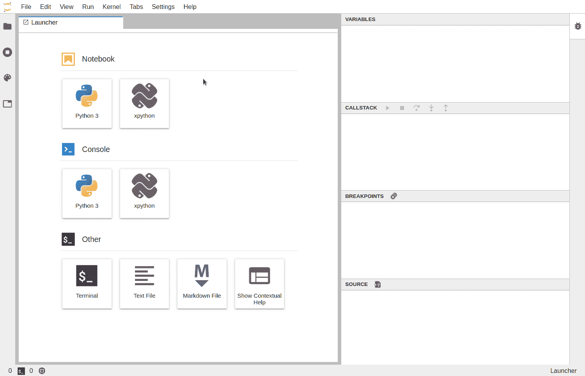

# 调试 Jupyter 笔记本电脑将提高您的工作效率

> 原文：<https://towardsdatascience.com/debugging-jupyter-notebooks-will-boost-your-productivity-a33387f4fa62?source=collection_archive---------8----------------------->

## 使用调试提高 Jupyter 笔记本电脑的工作效率


蒂莫西·戴克斯在 [Unsplash](https://unsplash.com/s/photos/debugging?utm_source=unsplash&utm_medium=referral&utm_content=creditCopyText) 拍摄的照片

# 天真的方式——伐木

我们在开发程序时都会遇到代码中的错误，日志记录是调试代码的一种很好的方式，可能也是最直观的方式。通常的做法是在代码中添加 *print* 语句，这有助于我们追踪许多问题的根源。

```
import random
def find_max (values):
   max = 0
   print(f”Initial max is {max}”)
   for val in values:
      if val > max:
         max = val
   return max
find_max(random.sample(range(100), 10))
```

## 优势:

*   容易的
*   不需要安装

## **缺点:**

*   可能是垃圾邮件
*   很难确定容易出错的位置

# 古典之路——PDB

我们看到打印声明帮助我们找到关于问题的相关信息，但是这些工具不足以找到每个根本原因。当我们需要更强大的东西时，就该试试 Python 内置的交互式调试器了。

pdb 模块为开发者调试 Python 程序(包括 jupyter 笔记本)提供了一个交互式调试环境。要启动调试器，我们所要做的就是导入 *pdb* 内置模块并运行其 *set_trace* 函数。

```
import random
def find_max (values):
   max = 0
   import pdb; pdb.set_trace()
   for val in values:
      if val > max:
         max = val
   return max
find_max(random.sample(range(100), 10))
```

**演示:**

资料来源:https://www.youtube.com/watch?v=ZrM42wnZjt8

## 优势:

*   动态。
*   不需要安装。
*   成熟(更多的特性，好的文档，更少的 bug)。

## **缺点:**

*   非常吓人。
*   陡峭的学习曲线。

## 其他资源:

*   [PDB 简介](https://www.youtube.com/watch?v=vfPtGsSJldg)
*   [pdb 的辉煌集迹](https://www.youtube.com/watch?v=2FftatTS3jc)

# Pixie 调试器

有些人会理直气壮地指出 Jupyter 已经支持 pdb 了，这就足够了，但是作为开发人员，我们倾向于选择简单的方式，也就是 GUI。

PixieDebugger 是 Jupyter 笔记本的第一个可视化 Python 调试器，包括源代码编辑器、局部变量检查器、控制台输出、在当前上下文中评估 Python 表达式的能力、断点管理和用于控制代码执行的工具栏。

```
import contextlib
with contextlib.redirect_stdout(None):
   import pixiedust# New Cell
%%pixie_debugger
def find_max (values):
   max = 0
   import pdb; pdb.set_trace()
   for val in values:
      if val > max:
         max = val
   return max
find_max(random.sample(range(100), 10))
```

## 演示:

来源:[https://medium . com/codait/the-visual-python-debugger-for-jupyter-notebooks-youve-always-wanted-761713 babc 62](https://medium.com/codait/the-visual-python-debugger-for-jupyter-notebooks-youve-always-wanted-761713babc62)

## 优势:

*   动态。
*   简单。

## 缺点:

*   需要额外安装。
*   在木星笔记本上工作，但不是在木星实验室。
*   不成熟(错误文档和任务评估失败)。

## 设置:

```
pip install pixiedust
```

## 其他资源:

*   [中等岗位](https://medium.com/codait/the-visual-python-debugger-for-jupyter-notebooks-youve-always-wanted-761713babc62)

# Jupyter 实验室调试器

非常类似于 Jupyter 实验室自己制作的 pixie-dust GUI 调试器，它仍然很新，但是我们可以在笔记本单元格和源文件中设置断点，检查变量，导航调用堆栈等等。

```
import contextlib
with contextlib.redirect_stdout(None):
   import pixiedust# New Cell
def find_max (values):
   max = 0
   import pdb; pdb.set_trace()
   for val in values:
      if val > max:
         max = val
   return max
find_max(random.sample(range(100), 10))
```

## 演示:



来源:[https://blog . jupyter . org/a-visual-debugger-for-jupyter-914 e 61716559](https://blog.jupyter.org/a-visual-debugger-for-jupyter-914e61716559)

## 优势:

*   动态。
*   简单。
*   没有额外的代码。

## 缺点:

*   需要额外安装。
*   需要一个新的翻译。
*   在木星笔记本上工作，但不是在木星实验室。
*   安装有些困难。
*   不成熟(错误文档和任务评估失败)。

## 设置:

对于每个 conda 环境

```
conda install -y -c conda-forge xeus-python=0.6.12 notebook=6 ptvsd
jupyter labextension install [@jupyterlab/debugger](http://twitter.com/jupyterlab/debugger)
```

## 其他资源:

*   [Xeus 口译员](https://blog.jupyter.org/a-new-python-kernel-for-jupyter-fcdf211e30a8)
*   [可视化调试器](https://blog.jupyter.org/a-visual-debugger-for-jupyter-914e61716559)

# 荣誉奖

*   [](https://github.com/gotcha/ipdb)**——服用类固醇的 pdb。**
*   **[**pudb**](https://github.com/inducer/pudb)**——**PDB 与 GUI。**

# **遗言**

**总之，有许多技术可以用来调试 Jupiter 笔记本:**

*   **首先，人们应该使用日志来隔离问题**
*   **超级用户应该花时间学习 pdb，因为你永远不知道它会对你有益。**
*   **最后，根据您使用的是裸机还是 Jupyter Lab，您应该使用 pixiedust 和 Jupyter 调试器。**

**我希望这篇文章能让人们在笔记本环境中更有效率。我希望我能够分享我对这个迷人话题的热情，并且你会发现它是有用的，并且一如既往地，我愿意接受任何建设性的反馈。**