# 用 PyTorch 和 W&B 调试神经网络

> 原文：<https://towardsdatascience.com/debugging-neural-networks-with-pytorch-and-w-b-2e20667baf72?source=collection_archive---------22----------------------->

## [生产中的机器学习](https://towardsdatascience.com/tagged/production-ml)

## 调试神经网络的技巧和诀窍


由[埃菲社](https://unsplash.com/@efekurnaz?utm_source=medium&utm_medium=referral)在 [Unsplash](https://unsplash.com?utm_source=medium&utm_medium=referral) 上拍摄的照片

## 点击查看互动报道[。所有代码都可以在](https://app.wandb.ai/ayush-thakur/debug-neural-nets/reports/Visualizing-and-Debugging-Neural-Networks-with-PyTorch-and-W%26B--Vmlldzo2OTUzNA?utm_source=tds&utm_medium=report&utm_campaign=report_author)[这里](https://github.com/ayulockin/debugNNwithWandB)获得。

在这篇文章中，我们将看到是什么使神经网络表现不佳，以及我们可以通过可视化梯度和其他与模型训练相关的参数来调试它的方法。我们还将讨论渐变消失和爆炸的问题以及克服它们的方法。

最后，我们将了解为什么适当的权重初始化是有用的，如何正确地进行初始化，并深入研究正则化方法(如剔除和批量归一化)如何影响模型性能。

## 神经网络 bug 从何而来？

如这篇[文章](https://medium.com/@keeper6928/how-to-unit-test-machine-learning-code-57cf6fd81765)所示，神经网络错误很难捕捉，因为:

1.代码不会崩溃，不会引发异常，甚至不会变慢。
2。网络仍在训练，损失仍会下降。
3。几个小时后，这些值收敛，但结果很差

如果你想更深入地了解这个话题，我强烈推荐你阅读安德烈·卡尔帕蒂的《训练神经网络的诀窍》。

调试神经网络时，没有一套确定的步骤可以遵循。但是这里有一个概念列表，如果实施得当，可以帮助调试你的神经网络。

## 那么我们如何更好地调试我们的神经网络呢？

调试神经网络时，没有一套确定的步骤可以遵循。但是这里有一个概念列表，如果实施得当，可以帮助调试你的神经网络。

## 模型输入

***1。关于数据的决策:*** 我们必须了解数据的细微差别——数据的类型、存储方式、目标和特性的类平衡、数据的价值尺度一致性等。

***2。数据预处理* :** 我们必须考虑数据预处理，并尝试将领域知识融入其中。通常在两种情况下使用数据预处理:

*   *数据清洗*:如果去掉数据中的某些部分，即所谓的工件，目标任务就可以轻松完成。
*   *数据扩充*:当我们拥有有限的训练数据时，我们以多种方式转换每个数据样本，以用于训练模型(例如缩放、移动、旋转图像)。
    这篇文章的重点不是糟糕的数据预处理所导致的问题。

***3。在小数据集上过度拟合:*** 如果我们有一个 50–60 个数据样本的小数据集，模型将快速过度拟合，即损失将在 2–5 个时期内为零。为了克服这一点，请确保从模型中移除任何正则化。如果你的模型没有过度拟合，可能是因为你的模型架构不正确，或者你的损失选择不正确。当您尝试进行多类分类时，可能会使用 sigmoid 激活输出图层。这些错误可能是容易漏掉的错误。点击这里查看我演示这个[的笔记本。](https://github.com/ayulockin/debugNNwithWandB/blob/master/MNIST_pytorch_wandb_Overfit_Small.ipynb)

那么，如何避免这样的错误呢？继续读。

## 模型架构

***1。从一个小的架构开始:*** 使用花哨的正则化器和调度器可能有些矫枉过正。如果出现错误，调试一个小型网络会更容易。常见的错误包括忘记将张量从一层传递到另一层，输入与输出神经元的比例不合理等。

***2。预训练的模型(权重):*** 如果你的模型架构是建立在标准主干之上的，比如 VGG、Resnet、Inception 等，你可以在标准数据集上使用预训练的权重——如果可以的话，在你正在处理的数据集上找一个。最近一篇有趣的论文[Transfusion:Understanding Transfer Learning for Medical Imaging](https://arxiv.org/abs/1902.07208)表明，使用预训练 ImageNet 模型的几个早期层就可以提高训练速度和医学成像模型的最终准确性。因此，您应该使用通用的预训练模型，即使它不在您正在解决的问题的领域内。当应用于医学成像时，ImageNet 预训练模型的改进量不是很大。因此，也没有太多的保证。更多的话，我推荐阅读杰瑞米·霍华德的这篇惊人的博客文章。

## ‍Loss

***1。选择正确的损失函数* :** 首先，确保你对给定的任务使用正确的损失函数。对于多类分类器来说，二元损失函数不会有助于提高准确率，所以分类交叉熵是正确的选择。

***2。确定理论损失* :** 如果您的模型是通过随机猜测开始的(即没有预训练模型)，请检查初始损失是否接近您的预期损失。如果你使用交叉熵损失，检查一下你的初始损失大约是`-log(1/num_classes`。你可以在这里获得更多建议[。](http://cs231n.github.io/neural-networks-3/#loss)

***3。学习率* :** 该参数决定每次迭代的步长，同时向损失函数的最小值移动。你可以根据损失函数的陡度或平滑度来调整学习速率。但是这可能是一个耗费时间和资源的步骤。你能自动找到最佳的学习速度吗？

Leslie N. Smith 提出了一个非常聪明和简单的方法，在短时间和最少的资源内系统地找到学习率。你所需要的只是一个模型和一套训练集。该模型以小的学习率初始化，并对一批数据进行训练。相关的损失和学习率被保存。然后，学习率线性或指数地增加，并且用该学习率更新模型。

在本笔记本的[中，您会发现这种方法在 PyTorch 中的实现。我实现了一个类`LRfinder`。方法`range_test`支持上面描述的逻辑。使用`wandb.log()`，我能够记录学习率和相应的损失。](https://github.com/ayulockin/debugNNwithWandB/blob/master/MNIST_pytorch_wandb_LRFinder.ipynb)

```
if logwandb:
  wandb.log({'lr': lr_schedule.get_lr()[0], 'loss': loss})
```

使用这个`LRFinder`来自动找到你的模型的最佳学习率。

```
lr_finder = LRFinder(net, optimizer, device)

lr_finder.range_test(trainloader, end_lr=10, num_iter=100, logwandb=True)
```

你现在可以前往你的 W&B 运行页面，找到 LR 曲线的最小值。以此作为你的学习率，在整批训练集中进行训练。

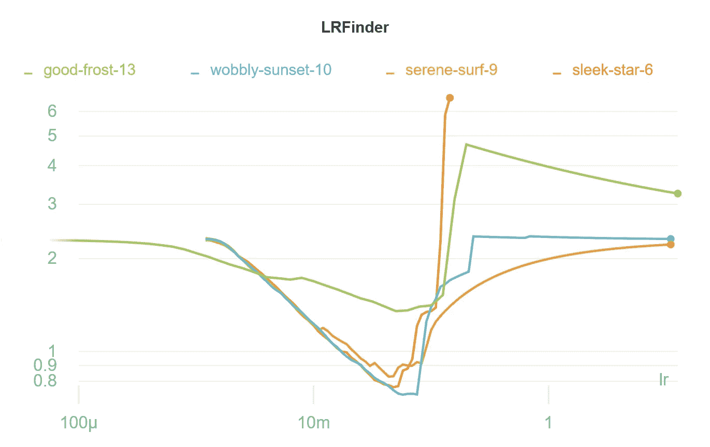

图 LRFinder 的结果。从[这里捕获](https://app.wandb.ai/ayush-thakur/debug-neural-nets?workspace=user-ayush-thakur)。

当学习率太低时，模型不能学习任何东西，并且它保持稳定。当学习率足够大时，它开始学习，你会发现曲线突然下降。曲线的最小值就是你正在寻找的最佳学习率。当学习率很高时，损失会爆炸，即损失突然增加。

如果你正在使用 Keras 建立你的模型，你可以使用**学习率查找器**，正如 [PyImageSearch](https://www.pyimagesearch.com/) 在[博客](https://www.pyimagesearch.com/2019/08/05/keras-learning-rate-finder/)中所展示的。你也可以参考这个[博客](https://mc.ai/how-to-find-a-descent-learning-rate-using-tensorflow-2/)来了解 TensorFlow 2.0 中的实现。

## 激活功能

**1。消失梯度的问题:**10 年前，由于使用了 sigmoid/tanh 激活函数，在训练深度神经网络时存在一个主要问题。为了理解这个问题，读者应该理解前馈和反向传播算法以及基于梯度的优化。我建议你观看这个[视频](https://www.youtube.com/watch?v=JIWXbzRXk1I&t=312s)或者阅读这个[博客](https://ayearofai.com/rohan-4-the-vanishing-gradient-problem-ec68f76ffb9b)来更好地理解这个问题。

简而言之，当执行反向传播时，计算损耗相对于每层权重的梯度，并且当我们在网络中继续向后移动时，损耗倾向于变小。每一层的梯度可以使用微分链规则来计算。由于 sigmoid 的导数范围仅为 0–0.25，数值上计算的梯度非常小，因此发生的重量更新可以忽略不计。由于这个问题，模型无法收敛或者需要很长时间才能收敛。

假设您正在构建一个不那么传统的神经网络架构。调试这种网络最简单的方法是可视化梯度。如果你使用 PyTorch W&B 构建网络，它会自动绘制每一层的渐变。点击查看我的笔记本[。](https://github.com/ayulockin/debugNNwithWandB/blob/master/MNIST_pytorch_wandb_Vanishing_Gradient.ipynb)

你可以在笔记本里找到两个型号，`NetwithIssue`和`Net`。第一个模型使用 sigmoid 作为每层的激活函数。后者使用`ReLU`。两个模型中的最后一层都使用了一个`softmax`激活函数。

W&B 为 PyTorch 提供一流的支持。要自动记录梯度并存储网络拓扑，可以在 PyTorch 模型中调用 watch 并传递。如果还想记录参数值的直方图，可以将`log='all'`参数传递给观察方法。

在 W&B 项目页面中，在运行页面的`Vanishing_Grad_1`、`VG_Converge` 和`VG_solved_Relu` 中查找梯度图。为此，单击运行名称，然后单击梯度部分。

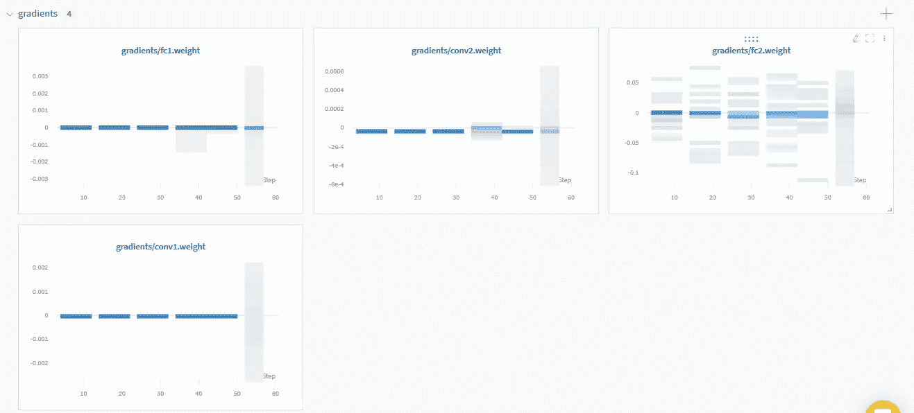

图 2: VG_Converge 梯度图。从[这里抓拍](https://app.wandb.ai/ayush-thakur/debug-neural-nets/runs/neo43xm0)。

在这次运行中，该模型在 MNIST 手写数据集上被训练了 40 个时期。它最终以超过 80%的训练测试准确率收敛。您可以注意到大多数历元的梯度为零。

2.**死亡的 ReLU:**ReLU 不是一颗神奇的子弹，因为当它们被喂食小于零的值时会“死亡”。如果大多数神经元在短期训练内死亡，网络的很大一部分可能会停止学习。在这种情况下，仔细看看你的初始重量或者给你的重量增加一个小的初始偏差。如果这不起作用，你可以试着用`Maxout`、Leaky ReLUs 和`ReLU6` 做实验，如`MobileNetV2` 论文中所示。

3.**爆炸梯度问题:**这个问题发生在后面的层比初始层学习得慢的时候，不像消失梯度问题，前面的层比后面的层学习得慢。当我们在各层中向后移动时，梯度呈指数增长，就会出现这个问题。实际上，当梯度爆炸时，由于数值溢出，梯度可能变成`NaN`,或者我们可能在训练损失曲线中看到不规则的振荡。在消失梯度的情况下，权重更新非常小，而在爆炸梯度的情况下，这些更新是巨大的，因为这错过了局部最小值并且模型不收敛。你可以观看这个[视频](https://www.youtube.com/watch?v=IJ9atfxFjOQ&t=12s)来更好地理解这个问题，或者浏览这个[博客](http://neuralnetworksanddeeplearning.com/chap5.html)。

让我们试着想象一下爆炸梯度的情况。看看这个笔记本[这里](https://github.com/ayulockin/debugNNwithWandB/blob/master/MNIST_pytorch_wandb_Exploding_Gradient.ipynb)我故意用一个大值 100 初始化权重，这样它们就会爆炸。

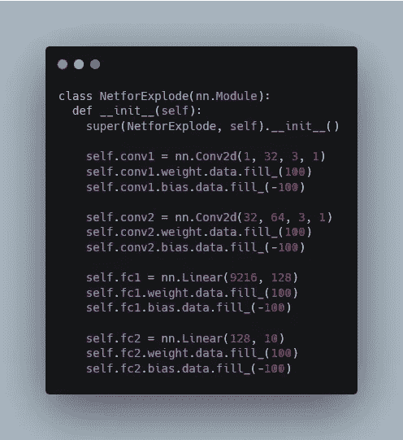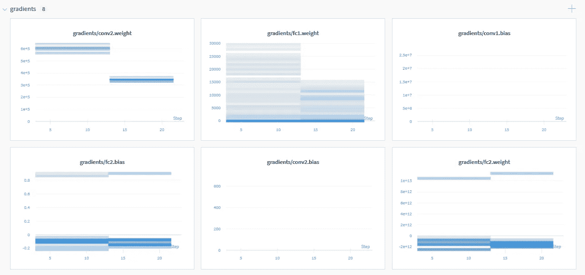

图 3:演示爆炸梯度。从[这里抓拍](https://app.wandb.ai/ayush-thakur/debug-neural-nets/runs/7gygoykn?workspace=user-ayush-thakur)。

注意梯度是如何向后呈指数增长的。conv1 的梯度值约为 10⁷，而 conv2 的梯度值约为 10⁵.错误的权重初始化可能是该问题的一个原因。

在基于 CNN 的架构中，通常不会遇到爆炸梯度。对于复发的神经营养不良来说，它们更是一个问题。查看这个[线程](https://www.quora.com/Why-are-the-exploding-gradient-problems-mostly-encountered-in-recurrent-neural-networks)以获得更多信息。由于爆炸梯度引起的数值不稳定，你可能会得到`NaN`作为你的损失。这个笔记本[这里](https://github.com/ayulockin/debugNNwithWandB/blob/master/Pytorch_wandb_Exploding_Gradient_NaN.ipynb)演示了这个问题。

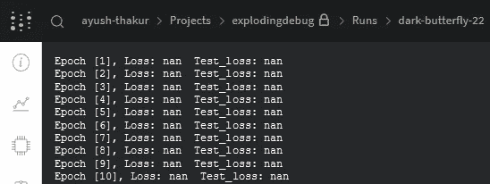

图 4:南的损失。

有两种简单的方法可以解决这个问题。它们是:

1.渐变缩放
2。渐变剪辑

在[链接笔记本](https://github.com/ayulockin/debugNNwithWandB/blob/master/Pytorch_wandb_Exploding_Gradient_NaN.ipynb)中，我使用了渐变剪辑来克服这个问题。渐变裁剪将“裁剪”渐变或将其限制在某个阈值，以防止渐变变得过大。在 PyTorch 中，只需一行代码就可以做到这一点。

```
torch.nn.utils.clip_grad_norm_(model.parameters(), 4.0)
```

这里 4.0 是门槛。这个值适用于我的演示用例。查看笔记本中的`trainModified`函数，查看其实现。

## 权重初始化和其他正则化

**1。权重初始化:**这是训练神经网络最重要的方面之一。像图像分类、情感分析或下围棋这样的问题是无法用确定性算法解决的。你需要一个非确定性的算法来解决这样的问题。这些算法在算法执行期间做出决策时使用了随机性元素。这些算法充分利用了随机性。使用称为随机梯度下降的随机优化算法来训练人工神经网络。训练神经网络只是对“好”解决方案的非确定性搜索。

随着搜索过程(训练)的展开，我们有陷入搜索空间不利区域的风险。陷入困境并返回一个“不太好”的解决方案的想法被称为陷入局部最优。有时，消失/爆炸梯度会阻止网络学习。为了对抗这种权重初始化，一种方法是在搜索问题中引入仔细的随机性。这种随机性是在开始时引入的。使用小批量来训练`shuffle=True`是在搜索过程中引入随机性的另一种方法。为了更清楚地了解基本概念，请查看这个[博客](https://machinelearningmastery.com/why-initialize-a-neural-network-with-random-weights/)。

好的初始化有很多好处。它帮助网络实现基于梯度的优化算法的全局最小值(只是拼图的一部分)。它防止消失/爆炸梯度问题。良好的初始化也可以加快训练时间。这个博客[在这里](/weight-initialization-in-neural-networks-a-journey-from-the-basics-to-kaiming-954fb9b47c79)很好地解释了权重初始化背后的基本思想。

初始化方法的选择取决于激活函数。要了解更多关于初始化的信息，请查看这篇文章[。](https://www.deeplearning.ai/ai-notes/initialization/)

*   当使用 ReLU 或泄漏 ReLU 时，使用 He 初始化，也称为明凯初始化。
*   当使用 SELU 或 ELU 时，使用 LeCun 初始化。
*   使用 softmax 或 tanh 时，使用 Glorot 初始化，也称为 Xavier 初始化。

大多数初始化方法都是统一的和正态分布的。查看这个 PyTorch [doc](https://pytorch.org/docs/stable/nn.init.html?highlight=nn%20init#torch.nn.init.zeros_) 获取更多信息。

查看我的笔记本[这里](https://github.com/ayulockin/debugNNwithWandB/blob/master/Cifar10_pytorch_wandb_Wt_Init.ipynb)看看你如何在 PyTorch 中初始化权重。

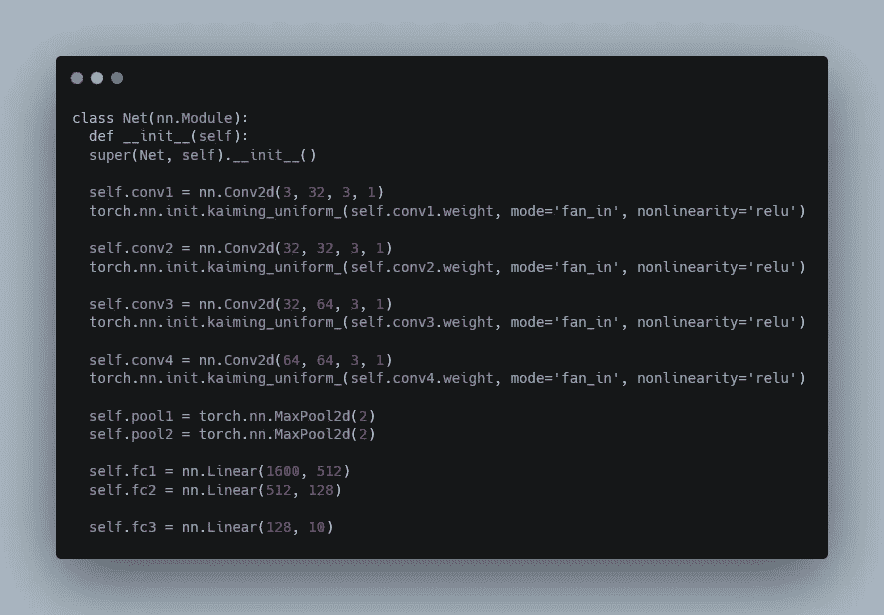

注意这些层是如何用`kaiming_uniform`初始化的。你会注意到这个模型非常适合。通过简化模型，你可以很容易地克服这个问题。

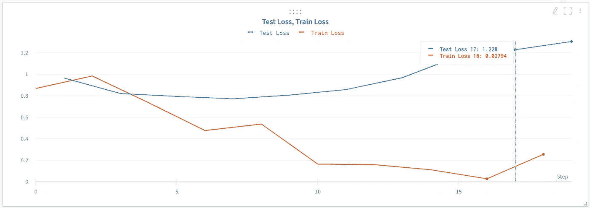

图 5:用更好的权重初始化训练的模型。从[这里抓拍](https://app.wandb.ai/ayush-thakur/debug-neural-nets/runs/2a5qddz3?workspace=user-ayush-thakur)。

**2。Dropout 和 Batch Normalization:** Dropout 是一种正则化技术，它随机“退出”或“停用”神经网络中的少数神经元，以避免过拟合的问题。在训练期间，在应用了丢弃之后的层中的一些神经元被“关闭”。具有更少参数的神经网络集成(更简单的模型)减少了过拟合。与网络的快照集相反，丢失模拟了这种现象，而没有训练和维护多个模型的额外计算费用。它将噪声引入到神经网络中，以迫使它学习足够好的概括来处理噪声。

批处理规范化是一种改进优化的技术。在对输入数据进行训练之前对其进行标准化是一个很好的做法，这样可以防止学习算法出现振荡。我们可以说一层的输出是下一层的输入。如果该输出在被用作输入之前能够被标准化，则学习过程能够被稳定。这极大地减少了训练深度网络所需的训练时期的数量。批次规范化使规范化成为模型架构的一部分，并在训练时在小批次上执行。批处理规范化还允许使用更高的学习速率，并且让我们不必太在意初始化。

让我们实现上面讨论的概念，看看结果。查看我的笔记本[这里](https://github.com/ayulockin/debugNNwithWandB/blob/master/Cifar10_pytorch_wandb_Dropout_BN.ipynb)，看看如何在 Pytorch 中使用批处理规范化和丢弃。我从一个基本模型开始，为这项研究设定基准。实现的架构很简单，导致过拟合。

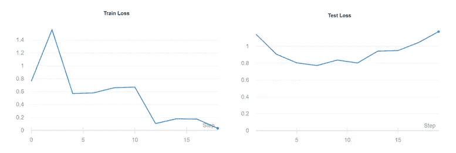

图 6:注意测试损失最终是如何增加的。从[这里抓拍](https://app.wandb.ai/ayush-thakur/debug-neural-nets/runs/dxdz06vk)。

注意测试损失最终是如何增加的。然后，在 Conv 阻塞后，我应用了丢弃率为 0.5 的丢弃层。要在 PyTorch 中初始化这一层，只需调用`torch.nn`的 Dropout 方法。

```
self.drop = torch.nn.Dropout()
```

退出防止了过度拟合，但是模型没有像预期的那样快速收敛。这意味着集合网络需要更长的时间来学习。在辍学的情况下，学习时不是每个神经元都可用。

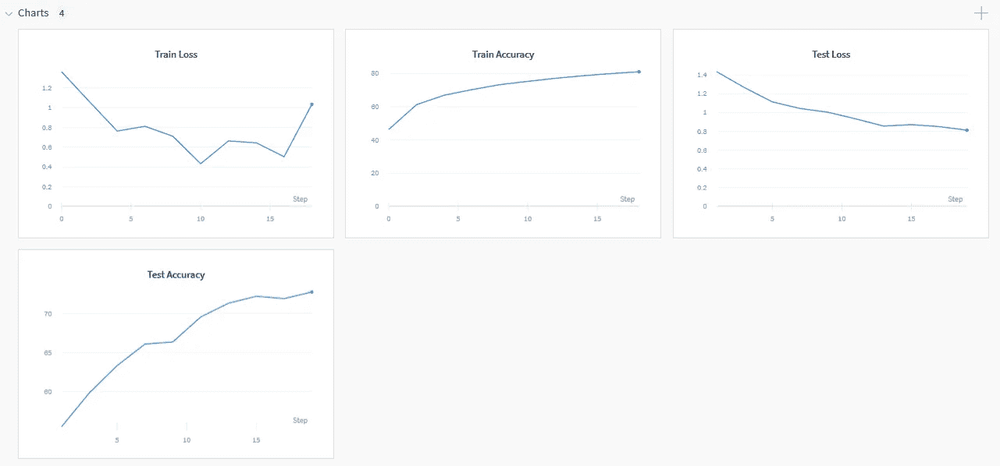

图 7:使用压差作为正则项的损耗和度量图。从[这里](https://app.wandb.ai/ayush-thakur/debug-neural-nets/runs/tlf4e8fm)捕捉。

接下来是批量标准化。要在 PyTorch 中初始化这一层，只需调用`torch.nn`的`BatchNorm2d`方法。

```
self.bn = torch.nn.BatchNorm2d(32)
```

批处理规范化用较少的步骤来收敛模型。由于模型简单，过度拟合是不可避免的。

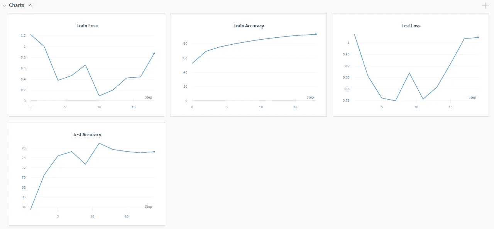

图 8:使用批量标准化的损失和度量图。从[这里抓拍](https://app.wandb.ai/ayush-thakur/debug-neural-nets/runs/pntlvpic)。

现在让我们一起使用这两层。如果你同时使用 BN 和 Dropout，请遵循这个顺序(查看[这篇](https://arxiv.org/abs/1801.05134)文章了解更多信息)。

```
CONV/FC -> BatchNorm -> ReLU(or other activation) -> Dropout -> CONV/FC
```

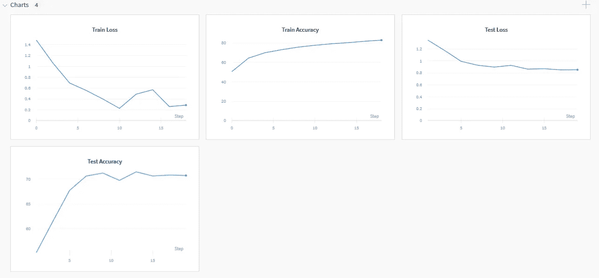

图 9:使用批量标准化和漏失的损失和度量图。从[这里抓拍](https://app.wandb.ai/ayush-thakur/debug-neural-nets/runs/1e5c7bk2)。

请注意，通过使用丢弃和批量标准化，可以消除过度拟合，同时模型收敛更快。

当您有一个大型数据集时，优化很重要，而正则化不那么重要，因此批量正则化对于大型数据集更重要。当然，您可以同时使用批处理规范化和删除，尽管批处理规范化也可以作为正则化，在某些情况下可以消除删除的需要。

# 笔记

1.  文章[调试神经网络的清单](/checklist-for-debugging-neural-networks-d8b2a9434f21)将是一个很好的下一步。
2.  对神经网络进行单元测试并不容易。本文讨论[如何对机器学习代码](https://medium.com/@keeper6928/how-to-unit-test-machine-learning-code-57cf6fd81765)进行单元测试
3.  我强烈推荐阅读[为什么深度神经网络很难训练？](http://neuralnetworksanddeeplearning.com/chap5.html)
4.  关于梯度裁剪的更深入的解释，请查看[如何避免在使用梯度裁剪的神经网络中爆发梯度？](https://machinelearningmastery.com/how-to-avoid-exploding-gradients-in-neural-networks-with-gradient-clipping/)
5.  Sayak Paul 撰写的《权重初始化对神经网络的影响》,他深入讨论了权重初始化的不同影响。

希望这篇博客对机器学习社区的每一个人都有帮助。我试着分享我自己的一些见解和许多好的阅读材料，以加深对这些话题的理解。调试神经网络最重要的方面是跟踪您的实验，以便您可以在以后重现它们。当涉及到跟踪你的实验时，重量和偏差真的很方便。有了可视化实验的所有最新方法，一天比一天简单。

我要感谢拉旺亚给我这个机会。在这个过程中我学到了很多东西。感谢 Sayak Paul 不断的指导。