# 调试你的神经网络，检查你的梯度

> 原文：<https://towardsdatascience.com/debugging-your-neural-nets-and-checking-your-gradients-f4d7f55da167?source=collection_archive---------27----------------------->

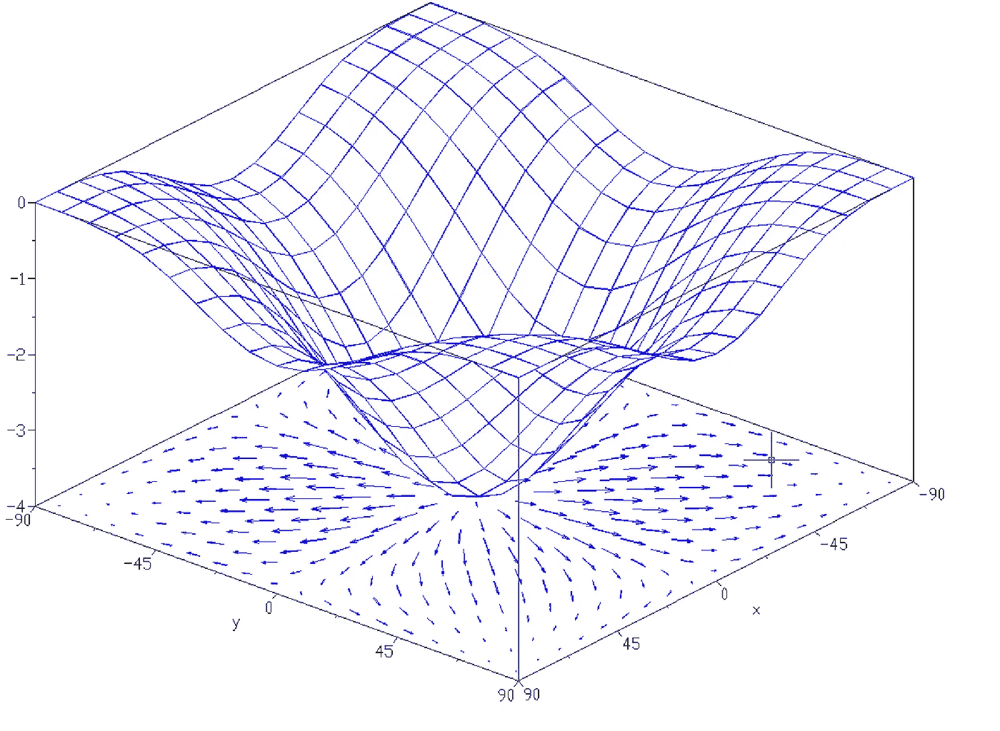

来源:[https://upload . wikimedia . org/Wikipedia/commons/3/31/gradient 99 . png](https://upload.wikimedia.org/wikipedia/commons/3/31/Gradient99.png)

当实现神经网络时，反向传播可以说是更容易出错的地方。那么，如果我们能够实现一些东西，让我们能够轻松地调试我们的神经网络，那该有多酷呢？在这里，我们将看到梯度检查的方法。简而言之，这种方法包括使用数值方法来近似梯度。如果它接近计算的梯度，则反向传播被正确地执行。但是还有更多，让我们看看。有时，可以看到网络在几个时期内停滞不前，然后继续快速收敛。我们还将看看如何解决这个问题。让我们开始吧！

博客中使用的所有可视化和 latex 代码都可以在这里找到

[](https://github.com/Rishit-dagli/Debugging-Neural-Nets) [## rishit-dagli/调试-神经网络

### 了解如何调试你的神经网络梯度检查这个仓库包含可视化和纹理文件…

github.com](https://github.com/Rishit-dagli/Debugging-Neural-Nets) 

# 梯度的数值近似

为了让我们建立梯度检查，我们首先需要看看如何在数字上近似梯度。我发现用一个例子来解释很容易，所以让我们取一个函数 f(θ) = θ。让我们看看这个函数的图表

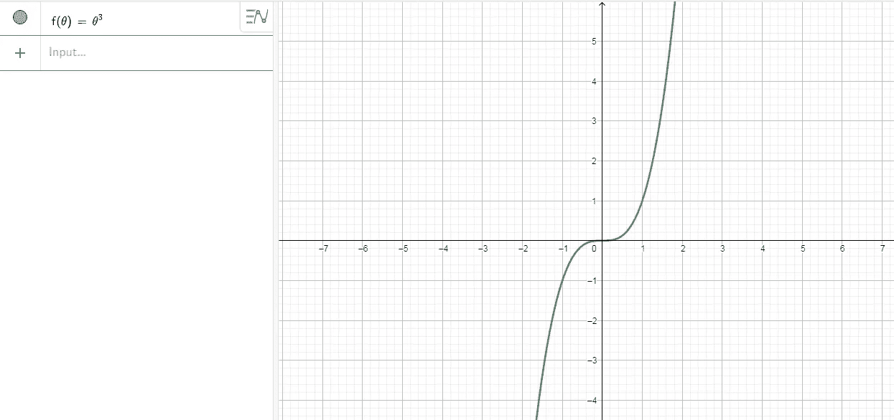

你可能已经猜到了一个简单的图表。像往常一样，让我们从θ的某个值开始，现在我们说θ = 1。所以，现在我们要做的是，不仅向右微移θ，得到(θ + ϵ)，而且向左微移，得到(θ-ϵ).出于示例目的，我们假设ϵ = 0.01。现在让我们想象一下，忽略图中的比例，这只是为了演示。

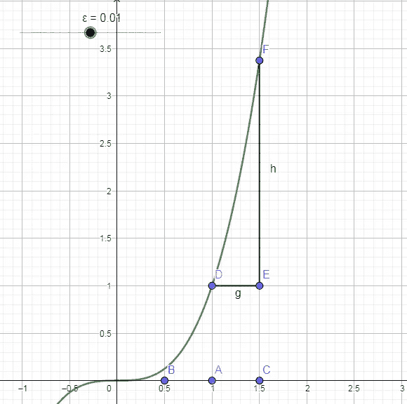

所以现在我们的点(θ-ϵ)被命名为 b，而(θ + ϵ)被命名为 c。在这个图中，我们之前使用的是三角形 DEF，并计算它的高度/宽度，在这种情况下是`EF/DE`。事实证明，如果你用(θ + ϵ)和(θ-ϵ)之间的一个更大的三角形，你可以得到一个更好的梯度估计，为了说明我的意思，我指的是这个红色的三角形

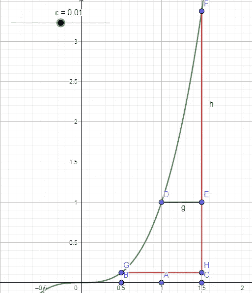

因此，有一些论文讨论了为什么使用这个更大的三角形可以更好地逼近θ处的梯度，但就本文的范围而言，我不会详细讨论它们。简单解释一下，你现在有两个较小的三角形，你在这里用较大的三角形来考虑-

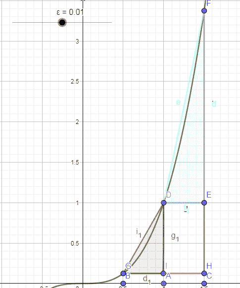

所以，我们刚刚看到了为什么你应该使用更大的三角形，这样做了，让我们得到那个三角形的数学。如果我们看到这里，我们可以简单地说

```
H = f(θ-ϵ) and,
F = f(θ+ϵ)
```

有了这两个结果，你可以说较大三角形的高度(`h`)为

```
h = f(θ+ϵ)-f(θ-ϵ)
```

用类似的论点，你也可以很容易地算出，这个三角形的宽度(`w`)是-

```
w = 2 ⋅ ϵ
```

# 双边导数

所以，如果你知道一点导数，你可以很容易地推断出-

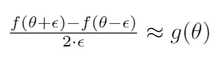

其中`g(θ)`是指梯度。

现在让我们通过插入我们刚刚讨论的例子的值来检查我们上面写的等式有多真实。所以我会得到这样的结果。

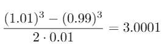

现在让我们计算它的实际导数。我知道 f(θ) = θ，通过简单的导数 g(θ)=3 ⋅ θ，我们得到 g(θ)=3。我们做了一个很好的近似，近似误差只有 0.0001。现在让我们看看如果我们使用片面的传统方法会得到什么。如果你用单侧差来计算，你会得到近似误差为 0.0301 的`3.0301`。因此，我们在这里做了一个了不起的工作，大大减少了我们的近似误差！

你刚刚看到双边衍生品的表现比传统方法好得多。这给了你更大的信心，θ的 g 可能是 f(θ)导数的正确实现。这听起来好得难以置信！这种方法也有不好的一面。结果是运行速度是使用单边方法的两倍。但是我相信在实践中使用这种方法是值得的，因为它更加准确。

# 再深入一点

让我们回顾一下导数的正式定义。

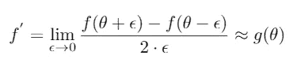

这里需要注意的一件重要事情是限制。所以，对于非零的ϵ值，你可以证明，这个近似的误差，在ϵ的数量级。ϵ是一个非常小的数字，趋向于 0。所以，总结一下

```
error = O(ϵ²)
```

这里的`O`指的是骑士团。

但是你可以用简单的数学证明，如果你用单侧导数，你的误差会是，ϵ或者

```
error = O(ϵ)
```

ϵ是一个很小的数字，当然小于 1，所以ϵ >> ϵ。现在你可能明白为什么你应该使用双面差而不是单面差，我们将看到这如何帮助我们进行梯度检查。

# 梯度检查

梯度检查是一项非常有用的技术，多次帮助我轻松调试或找到我的神经网络中的错误。现在，我们将看到如何使用这种奇妙的技术来调试或验证您的实现和反向传播是正确的。这并不是什么新东西，但是让我们快速地看一下单个神经元的示意图，作为复习-


记住`[x₁, x₂ ... x_n]` go 作为输入，对于其中的每一个，我们都有参数(w，b ) (w，b)……(wⁿ，bⁿ).因此，要实现梯度检查，你应该做的第一件事是把你所有的参数，并重新塑造成巨大的矢量数据。所以，你要做的是把所有这些 w 和 b，分别改造成一个向量。然后你把所有这些向量连接成一个巨大的向量，叫做θ。所以现在我们可以用θ来写成本函数`J`，就像这样

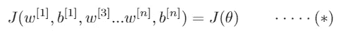

所以现在我们的`J`或者成本函数就是θ的函数。

现在，你的 w 和 b 以同样的方式排序，你也可以把`dw¹`、`db¹` … `dwⁿ`、`dbⁿ`连接成一个大向量，我们称之为`dθ`，它的维数与θ相同。我们将用一个类似的程序来做这件事，我们把所有的`dw`都做成向量，因为它们是矩阵，而`b`已经是向量了，那么就把它们连接起来。我觉得有一点可能会有帮助，w 的维数与 dw 的维数相同，b 的维数与 db 的维数相同，依此类推。这也意味着您可以使用同样的调整大小和连接操作。所以，现在你可能会有一个问题，“这里的`dθ`是θ的梯度或斜率吗？”我们稍后会讨论这个问题。

**实施梯度检查**

还记得我们把`J`写成θ的函数，现在我们把它写成这样-

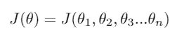

做完这些，让我们经历一个θ也许是θ₅.的过程我们现在要做的是，计算θ₅的近似导数，精确地说，是对函数 j 的偏导数，还要注意，我们会用到之前讨论过的双侧导数。用数学的方式来表达它-

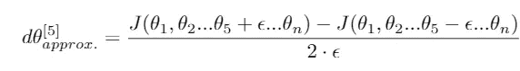

通过之前对双侧导数的讨论，我们也可以说，这是 j 对θ₅的偏导数，或者-

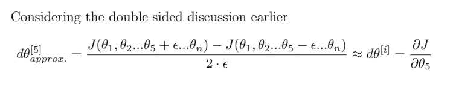

清楚了这一点，我们现在可以不仅对θ₅，而且对所有的`i`重复同样的过程，这样`i ∈ (1, n)`。所以这个的伪 Python 代码应该是这样的-

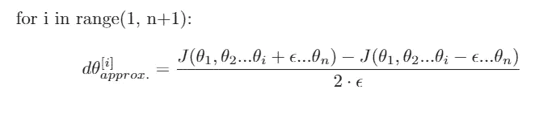

# 接近结果

所以，现在我们有两个向量`dθ[approx]`和`dθ`。而这些应该几乎是彼此相等的。但是现在我们会有另一个问题，那就是“我怎么知道两个向量是否近似相等？”

我现在要做的是计算两个向量之间的欧几里德距离。我们要做的是求差的元素的平方和，然后计算它的平方根，得到欧几里德距离。上面这句话可能看起来很混乱，相信我，确实如此！读两三遍，一旦你非常清楚这一点，继续前进。我们将进一步应用另一种方法，我们将归一化这些向量的长度。要做到这一点，我们只需简单地将它们各自的长度相加，然后除以它们之间的欧几里德距离。如果你现在感到困惑，坚持一个能帮助你的等式。

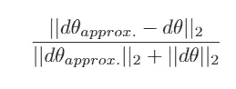

注意:这里我使用了矢量的 L₂范数的常规符号。如果你想知道为什么我们要归一化这个距离，这只是为了防止其中一个向量非常大或者非常小。

# 在实践中实施梯度检查

在对许多项目实施梯度检查时，我观察到ϵ = 10⁻⁶或 10⁻⁷的值在大多数时候起作用。所以，有了上面提到的相似性公式和ϵ的这个值，你会发现这个公式得出的值小于 10⁻⁷或 10⁻⁸，这太棒了。这意味着你的导数近似值很可能是正确的。如果是 10⁻⁵，我会说没问题。但是我会仔细检查我的向量的分量，检查没有一个分量太大，如果这个差的一些分量非常大，可能你有一个 bug。如果它给你 10⁻，那么我会非常担心，也许有一个错误。万一你得到比这个更大的值，那就真的有问题了！你也许应该看看θ的各个分量。这样做你可能会发现`dθ[i]`的值与`dθ[approx.]`非常不同，并使用它来找出你的哪个导数是不正确的。

我做了一个很棒的表格供你在做 ML 申请时参考-

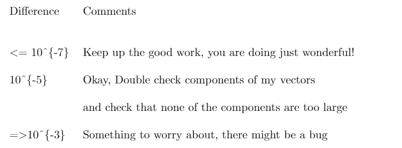

参考表

在一个理想的情况下，当你实现一个神经网络时，你会做什么，经常发生的是，你会实现前向传播，实现反向传播。然后你可能会发现这张毕业支票的价值相对较大。然后怀疑肯定有 bug，进去，调试，。在调试一段时间后，如果您发现它通过了 grad 检查，并且值很小，那么您就可以更加确信它是正确的(并且也有一种解脱的感觉:)。这种特殊的方法经常帮助我发现我的神经网络中的错误，我建议你在调试你的网络时也使用这种方法。

# 更多提示

*   不要在培训中使用，仅用于调试

每个时期的毕业生报到会使它变得非常慢

*   如果算法梯度检查失败，请查看组件

如果你的算法没有通过等级检查，查看组件会有很大帮助。有时它还会提示您错误可能在哪里。

*   正规化

如果你的 J 或成本函数有一个额外的正则化项，那么你也要计算它的导数并把它们相加

*   针对辍学者的不同策略

辍学者所做的是随机移除一些神经元，这使得很难获得他们执行梯度下降的成本函数。结果是，丢弃可以被视为优化某个成本函数 J，但是它的成本函数 J 是通过对它们可以在任何迭代中消除的所有节点的指数大子集求和来定义的。所以成本函数 J 是很难计算的，你只是在每次剔除那些我们使用 dropout 的随机子集时对成本函数进行采样。因此，很难使用 grad check 来复查有遗漏的计算。所以我通常做的是在不辍学的情况下实施毕业检查。因此，如果您愿意，可以将 keep-prob 和 dropout 设置为等于 1.0。然后打开辍学，并希望我的辍学实施是正确的。

您也可以使用一些非常优雅的泰勒展开式来实现这一点，但是由于本文的范围，我们在这里不讨论这一点。

# 结束的

就是这样，你只是看到了如何轻松地调试你的神经网络，并很容易地找到其中的问题。我希望梯度检查能帮助你发现问题或者调试你的网络，就像它帮助我一样

# 关于我

大家好，我是里希特·达利

[LinkedIn](https://www.linkedin.com/in/rishit-dagli-440113165/)—l【inkedin.com/in/rishit-dagli-440113165/ 

[网站](https://rishit.tech/) — rishit.tech

如果你想问我一些问题，报告任何错误，提出改进建议，给出反馈，你可以随时给我发邮件——

*   rishit.dagli@gmail.com
*   hello@rishit.tech