# 分散强化学习

> 原文：<https://towardsdatascience.com/decentralized-reinforcement-learning-eefb718f2e34?source=collection_archive---------38----------------------->

## 强化学习新范式的详细概述

世界上许多协会，如生物生态系统、政府和企业，在物理上是分散的，但在功能上是统一的。例如，一家金融机构的全球经营政策是利润最大化，因此看起来像一个单一的实体；然而，这种实体抽象是一种错觉，因为金融机构是由一组独立的人类代理组成的，他们在没有协作的情况下解决他们的优化问题。在深度强化学习中，最大化目标函数的过程将策略参数化为从状态到动作的函数。策略函数参数根据定义的目标函数的梯度进行微调。这种方法被称为 ***整体决策框架*** ，因为策略函数的学习参数仅使用目标函数进行全局耦合。

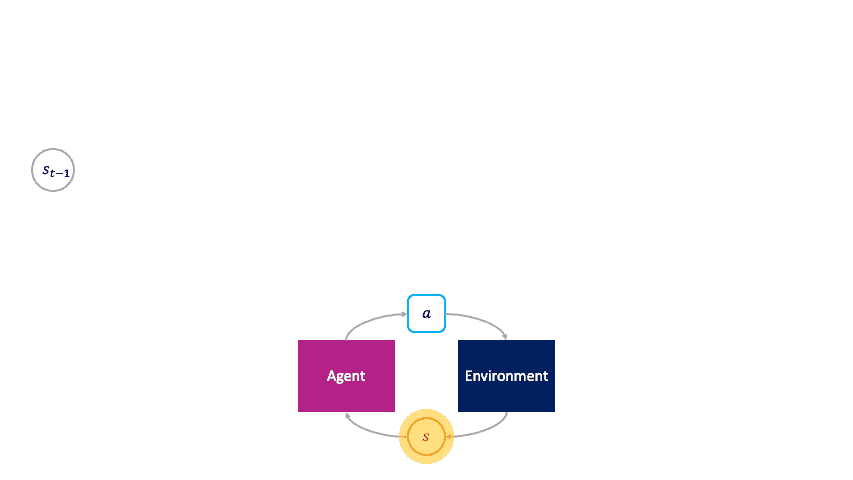

*注意在* ***整体决策框架*** *中行动是如何被代理被动选择的。来源:*[https://bair.berkeley.edu/blog/2020/07/11/auction/](https://bair.berkeley.edu/blog/2020/07/11/auction/)

在简要介绍了集中式强化学习框架的背景之后，让我们继续讨论一些有前途的分散式强化学习框架。

# 分散强化学习:通过本地经济交易的全球决策

文献[1]提出了一类分散式 RL 算法，该算法在不同抽象层次上建立了社会(全局策略或超级代理)和代理(动作)之间的关系。一个 ***社会决策框架*** 被定义在*最高*抽象层次上，以理解由代理局部解决的优化问题和由社会全局解决的优化问题之间的关系。在每个州，地方一级的代理人在拍卖中出价，拍卖的获胜者将州从一个转变为另一个；之后，它将转换后的状态出售给其他代理，从而传播当地的经济交易链。现在出现了一个关于拍卖机制和社会的特征的问题，这使得简单地从代理优化他们的拍卖效用的全局解决方案的隐含出现成为可能。通过 ***克隆的维克瑞社会*** 在抽象的第*第二*阶段提供了上述问题的解决方案，这确保了*代理的支配策略均衡匹配社会的最优策略*。[2]中详述的维克瑞拍卖的*真实性*属性保证了上述结果。在*第三*抽象级别，提出了一类 ***分散强化学习算法*** ，其利用代理的拍卖效用作为优化目标，并因此仅使用针对代理的可学习参数的*信用分配*来学习在空间和时间上是全局的社会政策，该可学习参数在空间和时间上是局部保存的。*第四*抽象级别涉及克隆维克瑞协会的实现，该协会利用提议的分散强化学习算法，并提出一组名为 ***信用保存维克瑞实现*** 的最佳设计选择，该设计选择在全局和局部级别都表现最佳。

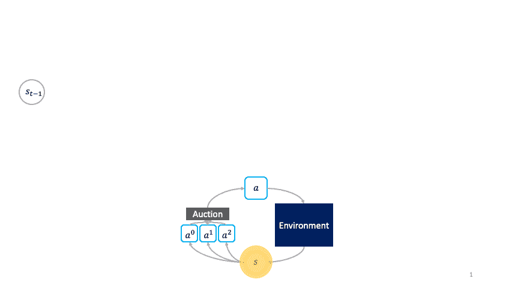

*注意在* ***社会决策框架*** *中，行动如何主动选择何时激活。来源:*[https://bair.berkeley.edu/blog/2020/07/11/auction/](https://bair.berkeley.edu/blog/2020/07/11/auction/)

## 社会决策

让我们通过将马尔可夫决策过程(MDP)和拍卖机制联系在一个统一的符号下来建立基于社会的决策框架。

在 MDP(全局)环境中，输入空间是状态空间*，输出空间是动作空间*。一个代理代表一个策略 ***π: S → A*** 。使用转移函数***τ:s×a→s***、奖励函数*r****:******s×a→ℝ***和折扣因子γ指定一个目标函数如下:**

**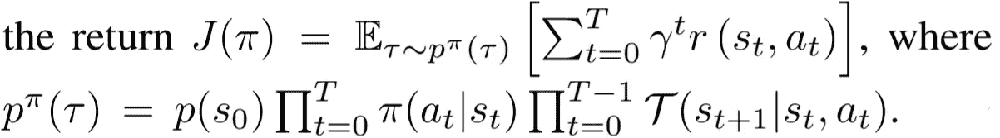**

**在给定的状态 s 下，代理执行使 J(π)最大化的任务，并因此找到如下定义的最优动作:**

**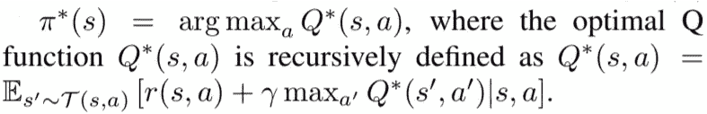**

**在拍卖(本地)环境中，输入空间是单个拍卖项目 s，输出空间是出价空间𝔅.n 个代理中的每一个使用其各自的投标策略在竞争中对拍卖项目投标ψᵢ: {s} → 𝔅.设 **b** 是代表 n 个代理人出价的向量，那么每个代理人的效用可以用 **vₛ** 来定义:这个向量表示每个代理人对投标物品 s 的评价，以及由*分配规则****x****:*𝔅ⁿ→*定价规则****p*组成的**拍卖机制**因此，效用函数可以规定如下:****

**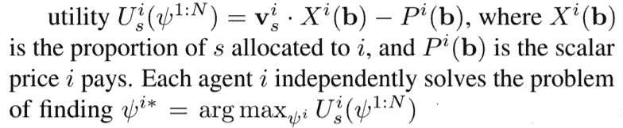**

**在拍卖理论中，一次拍卖是一个*显性策略激励相容* (DSIC)如果在拍卖中独立于其他参与者的出价策略，对一个人的评估出价是最优的。维克瑞拍卖【2】将 Pᵢ(b 设定为第二高的出价，如果代理人 *i* 获胜则 Xᵢ(b)=1 为 0，如果代理人 *i* 失败则为 0，这就是 DSIC，意味着当每个代理人如实出价*时会出现优势策略均衡。这导致社会福利最大化(∑vᵢ×Xᵢ(b)，因此选择评价最高的投标人。DSIC 财产在*维克瑞拍卖*中的存在消除了代理在执行优化时考虑其他代理的需要，因此使用*维克瑞拍卖*构建的*分散强化学习算法*非合作地运行*。****

****定义****

> **“一个 ***原语*** (代理)*ω*是一个元组(ψ，ϕ)，其中ψ: S→𝔅代表竞价策略，ϕ: S→S 代表转换。一个 ***社会*** 是一组被表示为ω^{1:N}.的原语****
> 
> *****最优出价**(如[3]中所述):假设在每个州 s，如果代理 I 获胜，本地拍卖分配 Xᵢ(b)=1，如果代理 I 失败，分配 Xᵢ(b)=0。然后，所有的原始ω^i 投标各自的最优社会 q 值作为一个整体产生一个最优的全球政策。***
> 
> *****最优竞价的优势策略**(如[1]中所述):如果每个状态 s 的 vᵢ估值是最有利的社会 q 值，那么社会的最优全球政策与维克瑞机制下的原语的独特优势策略均衡相一致。*——****

## ***经济交易视角***

***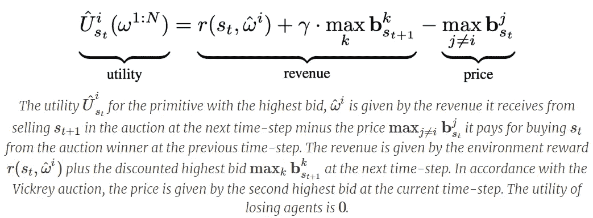***

***市场经济视角及其解释。来源:[https://bair.berkeley.edu/blog/2020/07/11/auction/](https://bair.berkeley.edu/blog/2020/07/11/auction/)***

***因此，上述系统中的货币基于所收到的回报，并且财富分配的发生取决于未来的基元决定出价购买过去的基元所承担的信息处理劳动的成果，目的是将一种状态转换为另一种状态。***

***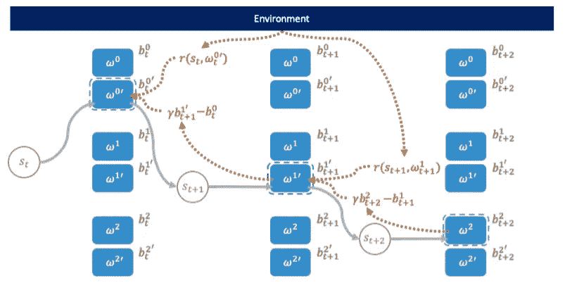***

***克隆的维克瑞协会。图 1 来源于[1]***

***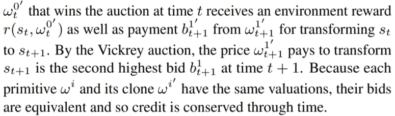***

***对描述 clove Vickrey society 机制的上图的简明解释。来源:图 1[1]***

## ***基于策略的分散强化学习算法***

***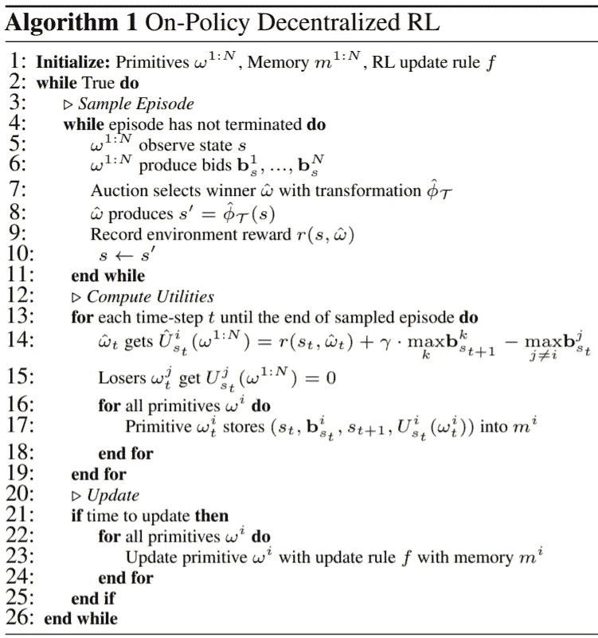***

***来源:第 6 节[1]***

***在学习了利用克隆的 Vickrey 拍卖机制的分散强化学习算法的内部工作原理之后，如果您想了解更多关于使用该算法执行的实验，请参考第 7 节标题为[1]的实验。***

***在[1]中描述的分散强化学习算法模拟了由于使用克隆的维克瑞协会而导致的不合作的特征。在接下来的章节中，我们将熟悉另一种分散强化学习算法，但是是在合作控制环境中。***

# ***用于协同控制的深度分散强化学习***

## ***形式问题定义***

***给定一个由 N 个*智能体控制的离散时间系统 ***f: X × U → U*** 表示为****

******

***来源:文献[4]中的等式(1)***

***其中 xₖ ∈ X ⊆ ℝⁿ表示系统在时间步 k 的状态，
u_{i，k} ∈ Uᵢ ⊆ ℝ对智能体的控制 *i* ∈ ℕ *=* {1，…， *N* }和 *U=U₁×U₂×…×U_{N}* 联合控制空间。每个智能体 *i* ∈ ℕ根据当前状态 xₖ和控制 u_{i，k}，从奖励函数 ***g: X × U → ℝ*** 中获得奖励 rᵢ。***

***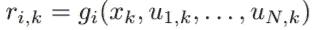***

***来源:文献[4]中的等式(2)***

***每个代理的目标是适应他的控制律πᵢ: X → Uᵢ，在控制律元组
π=(π₁，π₂,…，π_{N})和γᵢ ∈ [0，1]作为折扣因子下，最大化他的长期折扣报酬***

***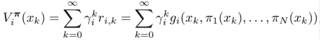***

***来源:文献[4]中的等式(3)***

***因此，确定性博弈可以由元组
G = (X， *f* ，U₁,…，U_{N}，g₁,…，g_{N}，γ₁,…，γ_{N})来定义，问题可以描述为:***

*****问题陈述*****

> ***给定博弈 g，每个代理人 i∈ N 知道系统动力学 f 和他自己的奖励函数 gᵢ.此外，每个代理 i∈ N 在时间步 k 接收他的当前报酬 r_{i，k}，并且能够推导出其他代理的先前控制 u_{j，k1 }，
> ∀ j∈ N\{i}，但是不能访问当前控制 u_{j，k}，其他代理的控制法则πⱼ，它们的报酬函数 gⱼ或实际报酬。在这种情况下，每个智能体 i∈ N 的目标是调整其控制律πᵢ，以最大化上述定义的 Vᵢ^{π}。*——*【4】***

## ***分散协同控制方法***

***为了解决上一节中提出的问题，*用于协同控制的深度分散强化学习*提出了一种依赖于时间的*时间经验重放* (TER) 来解释由多个智能体组成的非平稳环境，使用*虚拟经验重放* (IER) 来灌输系统的已知动态，并利用具有*影响 Q 学习* (IQL) 的变量学习来诱导协调。这些机制是模块化的，因此让我们先介绍它们，然后再组合它们。***

*****时间体验回放(TER)*****

***提出*时间体验重放*背后的基本概念是根据类似于*优先体验重放的优先因子，将偏好更近的体验的想法与体验重放中可能的体验采样相结合。*但是这里我们的关注点更倾向于最近的经历，因此我们引入了*时间优先化* τ，它与收集状态转换后经过的时间成比例。***

***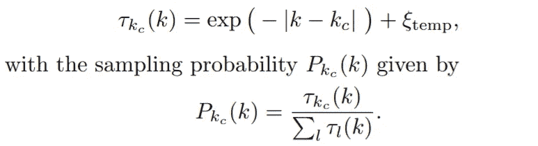***

***来源:[4]中的等式(7)和(8)***

***因此，需要通过附加当前时间步长来生成新的体验元组，以灌输上述时间优先化因素。***

***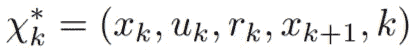***

***来源:[4]中的等式(9)***

***然而，上述的 TER 方法在实践中导致了两个主要问题:(1)太多偏向于最近的经验可能导致代理的策略过拟合，以及(2)由于需要在每个时间步长为每个经验元组计算τ，这增加了采样过程的计算复杂度，使得 TER 在实践中不可行。为了克服上述问题，引入了两步采样过程。首先，从整个体验重放缓冲器 *M.* 中均匀随机地提取大小为 b 的*宏批次* 𝔅。随后，使用前面提到的时间优先化概率从𝔅采样大小为 t 的小批次*t*t≪b。这解决了这两个问题，因为通过从大小为 b 的𝔅采样降低了计算时间优先级的计算复杂度。此外，小批量均匀随机抽取防止在代理人的政策中过分强调最近的经历。***

***此外，为了适应其他代理的策略变化，我们还需要考虑代理在其训练过程的不同阶段的可变探索率εₖ。当其他玩家的政策开始趋同时，降低探索会更有效。因此，我们提出了一个额外的勘探率依赖 b，产生一个时间相关的宏观批量 Bₖ.在早期训练过程中，即εₖ ≈ 1，经验应均匀随机抽样，这可以通过选择接近小批量 t 的 Bₖ来获得，而在后期训练过程中，即一旦εₖ → 0，Bₖ应接近最终的宏批量 b。随后，我们有如下宏批量:***

***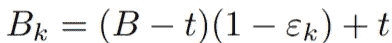***

***来源:[4]中的等式(10)***

*****想象中的经历回放(IER)*****

***TER 对经验重放所做的修改为训练过程赋予了稳定性，因此代理人对变化的环境动态的接受度较低。此外，TER 避免了偏向于最近经验的学习，从而使智能体能够适应非平稳的环境动态。到目前为止，一个重要的假设是，环境动态与其他主体的行为分离，这通常是合理的，因为主体是独立和分散的。然而，我们知道系统动态，因此有可能通过边缘化其他代理的控制来使环境静止。这是想象的经历重演背后的基本概念(IER)。请注意，IER 仅用于模拟在正常环境条件下可能不会发生的体验。前面提到的常规经验元组可以用下面的底层系统动力学 *f* 和奖励函数 gᵢ来代替:***

***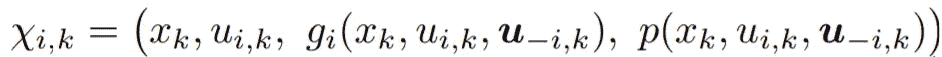***

***来源:文献[4]中的等式(12)***

***其中 u_{-i} = {u₁,…，u_{i-1}，u_{i+1}，…，uₙ}，即除了代理 *i.* 之外的其他代理的控制。最终，**想象体验*可以通过将其他代理的控制 u_{-i}替换为 0 来模拟，如下所示:****

***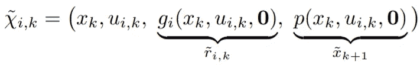***

***来源:文献[4]中的等式(13)***

***想象的体验实际上并不存储在 ERM 中，而是用于采样*探索率相关概率*用于确定除了观察到的体验之外，是否还计算了想象的体验。最初，在训练过程中，代理大多执行随机控制的探索。因此，不可能从初始阶段的抽样观察中推断出其他代理的策略，因此应用 IER 来稳定训练过程是最有用的；因为在 IER，体验是以这样一种方式模拟的，即只有智能体 *i* 与环境互动，没有来自其他智能体的探索噪音。因此，与当前时间步长 k 处的想象体验的模拟相关联的概率与εₖ(当前探索速率)成比例，因此，p(k)∞εₖ.***

***随后，在培训过程的后期阶段，代理的策略开始趋同。与后期探索相比，更重视主体之间的协调和对合作伙伴政策的适应。因此，在训练的后期阶段，通过产生模拟代理之间合作的经验，IER 可以用于诱导代理之间的协调。相应的采样概率被建议为 p _ { coord }(k)∞(1 εₖ).为了诱导协调，想象的体验需要通过 IER 产生，这样最终的算法需要混合的*合作-竞争*任务类型。为实现上述目标，提出了以下三种方案。***

***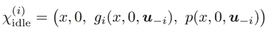***

***第一种情况:代理人 *i 的控制被放弃，因此*代理人 I 可以观察其他代理人自己如何行为，以及由此产生的环境转换是否有益。来源:文献[4]中的方程(14)***

***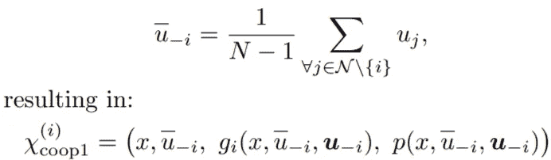***

***第二种情况:代理 I 的控制被设置为等于所有其他代理的联合控制的平均值。来源:文献[4]中的等式(15)***

***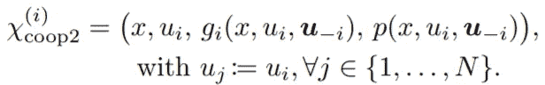***

***第三种情况:所有其他代理的控制被设置为等于代理 I 的控制。来源:在[4]中的等式(16)***

***通过从上述三种情景中产生想象的经验，协调的可能性被耗尽了。第一个场景导致代理评估空闲是否可接受，而第二个和第三个场景计算代理 *i* 是否复制其他代理的平均控制或者所有其他代理是否应该坚持代理 *i* 的控制。***

*****影响 Q-Learning (IQL)*****

***以前对 ER 的修改通过稳定环境来解决不稳定的环境问题。此外，在多主体强化学习中经常使用的一种机制是可变学习率。*用于合作控制的深度分散强化学习*提出了一种使用可变学习率的多智能体信用分配任务的新方法，该方法试图将可变学习率与智能体对回顾性观察到的状态转换的个体贡献相关联。同样，引入了一个称为*影响因子*的量，它表示代理对联合控制的贡献，从而表示观察到的状态转换。***

***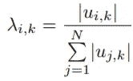***

***时间步长 k 时代理 I 的影响因子。来源:[4]中的等式(17)***

***假设在 IQL 中，代理共享相同的控制空间 U₁ =。。。= U_{N}并且所有代理的控制同等地操纵系统，我们可以如下描述更新规则:***

***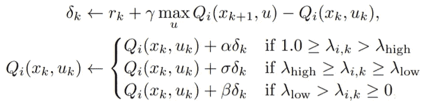***

***IQL 更新规则。来源:文献[4]中的方程(18)***

***其中 0 ≪ β ≪ σ ≪ α ≪ 1。使用上述 IQL 更新规则，我们可以同意，当一个适当的积极的经验被观察到，Q 值估计大幅增加，只有当代理人可以被认为是事件的发生。另一方面，当负面体验发生时，如果代理人至少有部分责任，代理人大多不鼓励转换到相应的状态-动作对。此外，代理需要这种*责任驱动的*类型的*学习行为*来克服多代理设置中的信用分配挑战。***

*****算法*****

***在了解了模块化节 ter、IER 和 IQL 之后，我们现在准备详细说明最终算法如下:***

***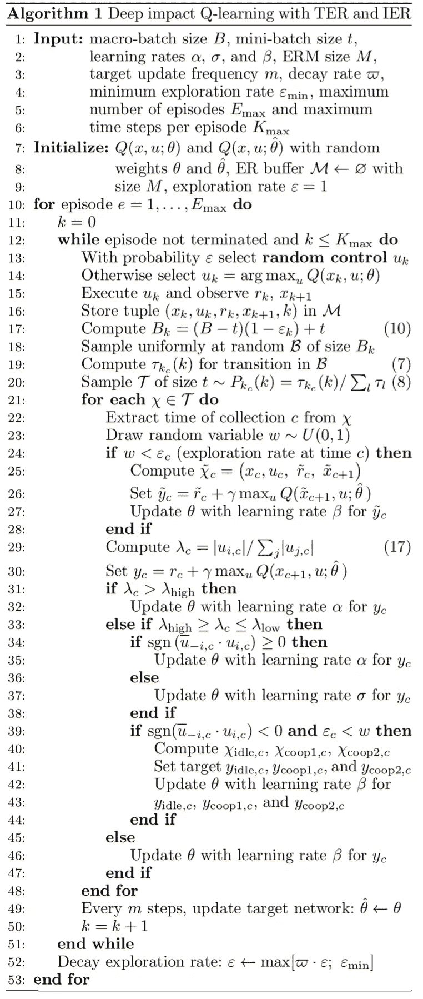***

***协同控制的深度分散 RL 算法。来源:[4]***

***在前面的章节中唯一增加并且没有解释的是*配合系数* ψ_{i，k} =sgn()。如果ψ_{i，k}的值为 1，那么代理人 *i* 和其他人被称为正协调，因此没有必要模拟 IER 提到的协调经验χ_{idle}、χ_{coop1}和χ_{coop2}。而且，主要用于λ_{high} ≥ λ_{i，k} ≥ λ_{low}的学习率σ被更大的学习率α所代替。因此，代理被说服在培训过程中强调合作经验。在智能体负协调的情况下，ψ_{i，k}等于-1。这里，除了采样的体验χₖ，还模拟了人工想象的体验χ_{idle}、χ_{coop1}和χ_{coop2}，因此，代理对所有这些体验进行训练。这里使用了最低的学习率β，因为代理接受培训的经验并没有实际发生，而只是为了协调而想象出来的。因此，模拟若干协调体验的繁重计算任务可以在很大程度上减少，并且主要集中在与最高预期训练进度相关的事件上。***

***为了了解更多关于使用上述算法进行的实验和模拟，我强烈建议您参考第 4 节，标题为[4]中的结果。***

***在这一点上，我们已经涵盖了两种有前途的方法，旨在实现分散强化学习，一种是在非合作环境中(“*分散强化学习:通过本地经济交易进行全球决策”*)，另一种是在合作环境中(“*用于合作控制的深度分散强化学习”*)。***

# ***参考***

1.  ***分散强化学习:通过本地经济交易的全球决策。arXiv 预印本 arXiv:2007.02382 (2020)。***
2.  ***威廉.维克瑞。"反投机、拍卖和竞争性密封投标."*《金融杂志*》，第 16 卷第 1 期，1961 年，第 8–37 页。 *JSTOR* ，[www.jstor.org/stable/2977633.](http://www.jstor.org/stable/2977633.)***
3.  ***Baum，E. B.《走向一个由白痴组成的自由放任经济的心智模型》。在 ICML，第 28-36 页，1996 年。***
4.  ***《合作控制的深度分散强化学习》 *arXiv 预印本 arXiv:1910.13196* (2019)。***