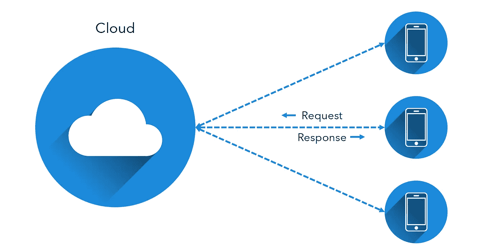
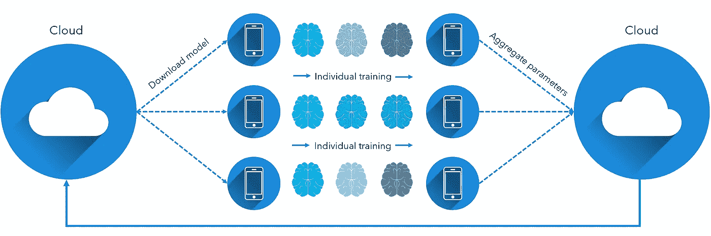

# 去中心化人工智能&捍卫隐私:联邦学习的天才

> 原文：<https://towardsdatascience.com/decentralizing-ai-championing-privacy-the-genius-of-federated-learning-3760a613ac70?source=collection_archive---------48----------------------->

来源: [Unsplash](https://unsplash.com/photos/yjygDnvRuaI)

## 伦理和非侵入式机器学习

很有可能，你的手机现在就在你五英尺之内。

事实上，2013 年的一项研究发现，72%的人大部分时间都在手机的范围内。2015 年的一项研究发现，63%的参与者每天离开手机不到*一小时*。另有四分之一的人根本不记得离开过他们的手机*。*

*很明显，我们的设备，尤其是我们的手机，不断地产生数据。它们充满了传感器——既有跟踪你的触摸动作和浏览历史的数字传感器，也有跟踪你的物理位置和运动的物理传感器。你的手机是你的数据化身，而且它非常容易获取，这可能会令人不安。*

*从机器学习的角度来看，这非常有帮助。随着数据的增多，这是一个创造更智能的模型，产生更吸引人和个性化结果的绝佳机会。无论是根据你的位置来管理定制的搜索结果，还是监控你的浏览和社交媒体活动，以推荐合适的产品来购买，更多数据的应用数不胜数。*

*然而，从伦理上来说，你的活动、网络、对话、运动并不真正属于你的前景应该是令人不安的，如果不是可怕的话。在数字时代处理用户数据的组织需要非常谨慎，以免被恶意利用和操纵。如今，许多数字用户理所当然地对他们的数据被如何使用持严格态度。*

*现在，必须提出一个重要问题:如何在支持(而不仅仅是承认)用户数据隐私的同时，实现大数据带来的更个性化和更具吸引力的体验？*

*Google 想出了一个解决这个难题的方法:联合学习。在 2016 年[的一篇论文](https://arxiv.org/pdf/1610.05492.pdf)中介绍了联合学习，它不是一种特定的算法，而是一种以道德隐私保护方式从用户数据中挖掘洞察力的结构化策略。*

*然而，为了理解这一点，我们首先必须理解部署人工智能模型的其他传统方法是如何工作的。假设我们正在使用 YouTube 的 app，其中一个核心功能就是它的视频[推荐算法](https://medium.com/faun/the-algorithm-worth-billions-how-youtubes-addictive-video-recommender-works-d75646dac6a3)。*

*通常，这些类型的重模型存储在云中，这是有意义的——它们有数十亿个参数，并查看无数个潜在的视频。将模型存储在云中，并让用户通过请求连接到它会更有效率。*

**

*由作者创建*

*用户发送的请求以数据的形式出现，并随响应一起返回。例如，当你正在浏览 YouTube 时，你的手机已经发送了你的数据——你的浏览历史，你感兴趣的话题等等。—到云端，云端返回你可能喜欢的视频(回应)。*

*基于新连接的数据和你是否实际点击了推荐的视频，YouTube 的推荐算法不断接收新的输入和反馈，以了解它做得如何。它采用新的训练数据，因此可以生成预测，这些预测会随着新的趋势、想法和运动而变化。*

*显然，这里有许多隐私问题。所有的数据都集中在一个地方——云——每当需要机器学习模型时，你的数据就会被发送到那里，这是很常见的。许多数据泄露是致命的，因为数据过于集中在一个位置。创造比特币背后的驱动力是对银行的同样担忧——集中的资金储备。*

*另一方面，*离线推理*消除了对云的严重依赖。当手机处于舒适的状态时，例如接通电源、高电量电池、连接到安全的 wi-fi，它会下载原始型号的缩小版、移动优化版。使用离线推理有几个好处:*

*   *隐私。显然，对云的持续请求是不需要的。您的数据在您的手机上本地化，手机直接接收来自下载模型的响应。*
*   *降低有害数据泄露的风险。当每个用户的数据被本地化后，即使黑客能够访问云，这些信息——模型的版本，用户手机上下载的模型的性能——也没有多大用处。这从一开始就降低了实施数据泄露的动机。*
*   *运行该模型需要更少的带宽和电池。不断维护与云的请求-响应对话，特别是当成千上万的用户在同一时刻做同一件事时，计算成本非常高。离线推理已经得到了很好的发展，使用了模型压缩等方法来产生强大的预测，同时占用很小的存储空间。*
*   *更低的延迟。因为模型是本地化的，因此只为一个客户服务，所以预测的响应时间要快得多。在数字界面的世界里，一秒钟的每一分钟都价值不菲。*
*   *即使没有互联网连接，该模型也可以运行。这对于任何产品来说都是一个有价值的特性。例如，考虑一下谷歌翻译:如果你不能把它弹出来，在任何地方翻译文字和视觉形式的语言，它还会受欢迎吗？*

*因此，在分布式系统中部署模型时，在线和离线推理是标准。显然，从数据管理的角度来看，离线推理更加安全和隐私，但是您不能同时训练模型。另一方面，在线推理不太安全，但模型可以更新。*

*任何公司都知道，如果他们保持静态，他们将很快失去对需求动态本质的青睐。由于离线推断的局限性，这对于捍卫隐私和安全数据来说并不是一个大胜利。*

*随着知识的增加，可以提出一个更具体的问题:如何训练深度模型——用新数据更新——同时保护用户数据的隐私？*

*在最初的概念中，Google 为这个问题规定了一个解决方案框架:*

1.  *选择设备样本来参与训练。这些通常是目前处于“舒适”和活跃状态的手机。*
2.  *当前模型参数被下载到每个设备上。*
3.  *设备在预设的时间段(例如 20 分钟)内训练它们的离线模型，使用本地训练数据来更新模型参数。*
4.  *在预设的一段时间后，手机会将它们的模型参数上传到云端。*
5.  *一种算法获取每个模型的参数——这些参数根据用户与它的交互方式(提供的训练数据)而有所不同——并将它们聚合起来，形成一个更新的全局模型。*
6.  *启动另一轮模型更新。*

**

*由作者创建*

*联合学习如此聪明是因为它解决了离线和在线推理的问题。它允许公司保护用户的隐私，同时随着市场流动动态地更新他们的模型。*

*联合学习的关键在于聚合算法。联合学习是一种分布式学习，在利用大数据的力量不断优化模型的同时保护隐私。提出的初始算法“联邦平均算法”工作得足够好，其本质上对接收的参数执行加权平均。*

*让我们举一个联合学习的例子。假设一个短信服务正在测试他们的语言模型，它会根据用户已经输入的内容推荐他们下一步要输入的单词。*

*选择 100 个用户进行训练，并将当前的模型参数发送到他们的手机上。然后，在接下来的 48 小时内，模特们将会收到基于她们表现的表现更新和培训。例如，假设一个模型在用户已经输入“你好”之后推荐“你”。*

*如果用户确实输入或选择了“你”，那么该模型就接收到了当前正确决策过程的强化。如果用户没有键入“你”，这是模型要学习的新训练数据。联合学习只能在这些能够纯粹从本地数据收集标签的模型上操作。*

*我们打字的方式都不一样——一个青少年的短信里充满了缩写(“how r u”、“brb”、“lol/lmao”等)。)与一位杰出的作家风格不同。一家想要成功的公司应该有一个能够应对所有这些受众的模型，然而通过短信，我们交流了一些最隐私的信息——秘密、密码、故事。通过联合学习，每个消费者细分的独特见解可以以保密和安全的方式进行汇总。*

*联邦学习的天真模型的一个问题是，模型，尤其是非常深的模型，本质上可以记住更新的信息，其参数仍然发送到中央服务器。已经提出了另一种聚合算法，差分私有联邦平均，以进一步保护包含在各个模型参数中的信息。*

*随着大数据持续快速增长，隐私日益成为首要问题。继续研究联邦学习并将其确立为人工智能的标准是关键。*

# *要点*

*   *在数字时代，我们的手机和其他设备越来越依赖于你。您的活动、网络、行动和信息需要是安全和隐私的。*
*   *在线学习集中了人工智能。用户将他们的数据发送到云中的模型，模型返回预测并被更新。离线学习分散了 AI，代价是无法用新的见解持续训练一个全球模型。*
*   *联合学习结合了在线和离线学习的优点，通过在本地数据上训练模型，然后聚集参数以形成更新的全局模型。通过一个去中心化的系统，可以在不接触个人数据的情况下训练一个全局 AI。*

*感谢阅读！*