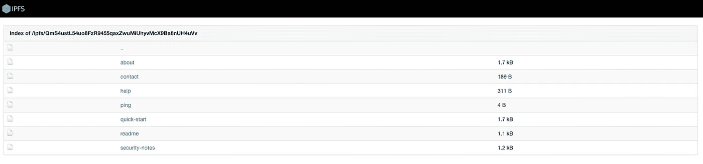
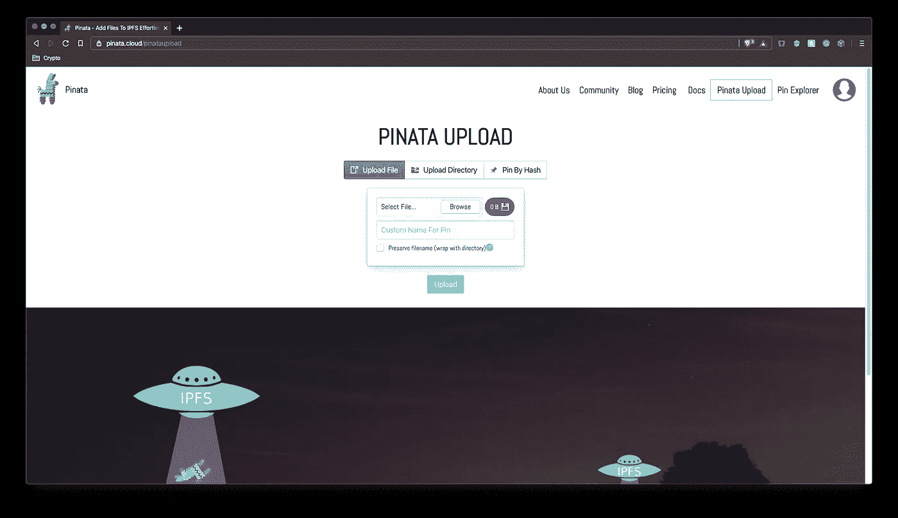
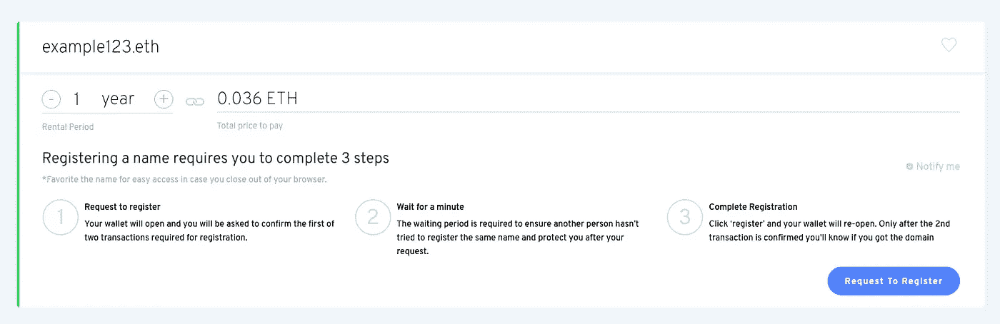
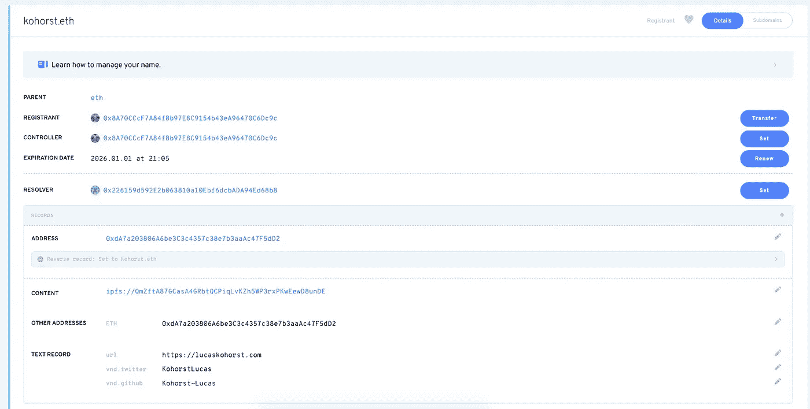
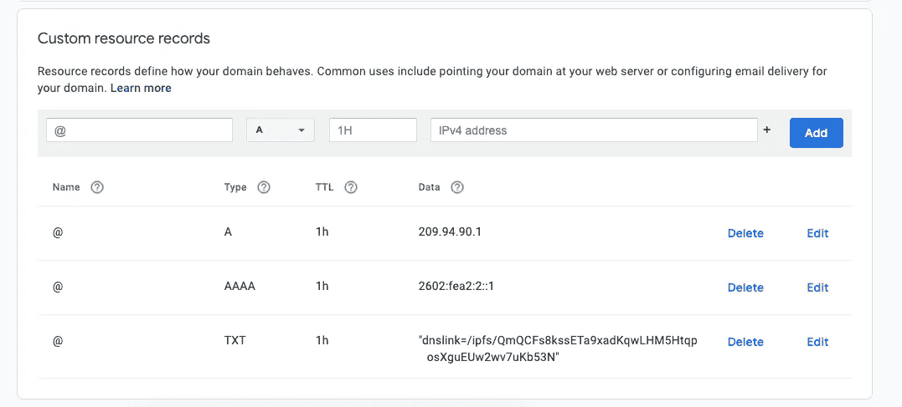

# 分散你的网站

> 原文：<https://towardsdatascience.com/decentralizing-your-website-f5bca765f9ed?source=collection_archive---------2----------------------->

## IPFS + ENS


[unsplash.com/photos/Q1p7bh3SHj8](https://unsplash.com/photos/Q1p7bh3SHj8)

当主持一个网站时，你通常会使用一个专门的[副总裁](https://en.wikipedia.org/wiki/Virtual_private_server)，比如[数字海洋、](https://www.digitalocean.com/) [Linode](https://www.linode.com/) 、[谷歌](https://cloud.google.com/appengine/)，或者[亚马逊](https://aws.amazon.com/)。设置好你的服务器后，你可以在 [Google Domains](http://domains.google.com) 或 [NameCheap](https://www.namecheap.com/) 注册一个域名。最后一步是编辑您的 DNS 记录，将您的域指向您的服务器。现在，您可以通过导航到您的域名来访问您的网站。但是，这有一个问题。你的 VPS 控制着你网站的托管，域名服务维护着你域名的控制权。如果你的 VPS 宕机或者你正在使用的公司突然被列入你所在国家的黑名单会怎么样？如果 [ICANN](https://www.icann.org/) 把你的域名抢走了怎么办？或者你的域名服务关闭了？

虽然这些不太可能，但它们很重要，让你思考如果你不能再托管你的网站或者你的域名被拿走了，你会怎么做。

使用 [IPFS(星际文件系统)](http://ipfs.io)和 [ENS(以太坊名称服务)](https://ens.domains/)你可以以完全分散的方式托管和服务你的网站。

IPFS 被描述为

> 一个对等超媒体协议
> 旨在使网络更快、更安全、更开放

你可以把 IPFS 想象成 HTTP 或者 CDN(内容交付网络)。这是一种查询资源的方式，只不过不是由谷歌、亚马逊等控制的几个大型数据中心托管的资源。这些文件是分散的，由世界各地的任何人在不同的节点上运行。

HTTP 基于 URL 查找资源，但是 IPFS 使用散列来查找其网络上的资源。

IPFS 哈希的一个例子是 QMS 4 ustl 54 uo 8 fzr 9455 qaxzwumihyvmcx 9 ba 8 nu H4 uvv，可以通过类似 [Cloudfare](https://developers.cloudflare.com/distributed-web/ipfs-gateway/) 的网关访问，例如[cloud flare-ipfs . com/ipfs/QMS 4 ustl 54 uo 8 fzr 9455 qaxzwumihvmcx 9 ba 8 nu H4 uvv](https://cloudflare-ipfs.com/ipfs/QmS4ustL54uo8FzR9455qaxZwuMiUhyvMcX9Ba8nUH4uVv)。

这个散列指向用于托管您自己的 IPFS 节点的起始文件，正如您所看到的，它只显示了到其他文件的链接。



QMS 4 ustl 54 uo 8 fzr 9455 qaxzwumiuhyvmcx 9 ba 8 nuh 4 uvv

但是一个 IPFS 哈希也可以指向一个网站，比如最近刚刚部署到 IPFS 的 [tornado.cash](http://tornado.cash) (一个加密混合器)。

可以通过 [ipfs.io](http://ipfs.io) 网关[ipfs . io/ipfs/qmrvfzwyojemdccdsik 15m 7 VN 2n 1 bfnz 14 nwvxrhizzzx 5/](https://ipfs.io/ipfs/QmRvFZwyoJeMDCcdSiK15m7Vn2n1BFnz14WNwVxrhizzX5/)访问。

总之，IPFS 提供了几个主要的好处

✅分散内容网络

✅不可改变

抵制✅审查

# 部署到 IPFS

您可以通过启动自己的节点将网站部署到 IPFS。首先下载 [IPFS 围棋实现](https://dist.ipfs.io/#go-ipfs)然后打开终端并运行

```
ipfs daemon 
```

然后，您应该会看到以下输出

```
Initializing daemon...
go-ipfs version: 0.4.22-
Repo version: 7
System version: amd64/darwin
Golang version: go1.12.7
Swarm listening on /ip4/127.0.0.1/tcp/4001
Swarm listening on /ip4/192.168.1.7/tcp/4001
Swarm listening on /ip6/::1/tcp/4001
Swarm listening on /p2p-circuit
Swarm announcing /ip4/127.0.0.1/tcp/4001
Swarm announcing /ip4/192.168.1.7/tcp/4001
Swarm announcing /ip6/::1/tcp/4001
API server listening on /ip4/127.0.0.1/tcp/5001
WebUI: [http://127.0.0.1:5001/webui](http://127.0.0.1:5001/webui)
Gateway (readonly) server listening on /ip4/127.0.0.1/tcp/8080
Daemon is ready
```

现在你已经准备好固定你的站点了

```
ipfs add index.htmladded QmY9cxiHqTFoWamkQVkpmmqzBrY3hCBEL2XNu3NtX74Fuu index.html
6 B / 6 B [=========================================================] 100.00%
```

为了确保您的站点留在网络上，您可以将它固定到您的本地节点

```
ipfs pin add QmY9cxiHqTFoWamkQVkpmmqzBrY3hCBEL2XNu3NtX74Fuupinned QmY9cxiHqTFoWamkQVkpmmqzBrY3hCBEL2XNu3NtX74Fuu recursively
```

你现在可以通过你的网关导航到输出的散列，并看到你的站点[ipfs.io/ipfs/QmY9cxiHqTFoWamkQVkpmmqzBrY3hCBEL2XNu3NtX74Fuu](https://ipfs.io/ipfs/QmY9cxiHqTFoWamkQVkpmmqzBrY3hCBEL2XNu3NtX74Fuu)

固定到您自己的节点是很好的，但是，如果您的节点关闭或您托管的文件被删除，并且您的文件尚未通过网络传播，会发生什么呢？

一个很好的经验是将你的站点添加并固定到三个 IPFS 节点。你可以通过创建你自己的 [IPFS 集群](https://cluster.ipfs.io/)或者使用一个流行的已经设置好节点的固定服务来实现。如[平特拉](https://pinata.cloud/)或[太阳穴](https://temporal.cloud/)。

对于这个例子，我们将使用 Pintra。首先，导航到 [pintra.cloud](https://pinata.cloud/) ，注册并导航到上传选项卡



[pinata.cloud/pinataupload](https://pinata.cloud/pinataupload)

上传单个文件或多个文件的目录。当您将文件添加并固定到本地节点时，您还可以固定来自的散列，以确保它在整个网络中传播。

如果你正在用 React 或 Gatsby 这样的框架创建一个 web 应用，你可以把你的`build`或`public`文件夹上传到 Pintra。或者你可以查看[IPFS-部署](https://github.com/ipfs-shipyard/ipfs-deploy)来部署你的站点到 IPFS。

现在我们的网站托管在分散的抵制审查的 IPFS 网络上，但是导航到 ipfs.io/ipfs/QmY9cxiHqTFoWamkQVkpmmqzBrY3hCBEL2XNu3NtX74Fuu 很难记住，我们需要一个域名。

# 注册一个 ENS 域名

[以太网名称服务](http://ens.domains)提供

> 一种安全且分散的方式，使用简单、易读的名称来寻址区块链内外的资源。

ENS 不是在像 [Google Domains](http://domains.google.com) 这样的网站上注册域名，而是一个非营利组织，提供不可变的`.eth`域名，并在以太坊区块链上注册。

`.eth`域名的主要目标是使加密货币地址可读。然而，ENS 增加了将你的域名链接到 IPFS 散列的支持，因此当一个`.eth`域名进入你的浏览器时，它将解析到你在 IPFS 的网站。

例如，我的`.eth`域名是 [kohorst.eth](http://kohorst.eth.link) 如果你将该域名输入你的加密钱包(如果有 ENS 解析器的话),它将解析为我的 eth 地址。更重要的是，如果你在浏览器中输入`kohorst.eth/`(如果它有类似[勇敢](http://brave.com)的 ENS 解析器，如果没有你可以输入`kohorst.eth.link`它会解析)我的个人网站(托管在 IPFS)会解析！

第一步是购买你的 ENS 域名。导航至`[app.ens.domains](http://app.ens.domains)`并搜索您的域名。



**注意:**要购买 ENS 域名，您需要以太网和兼容 Web3 的浏览器/扩展。我个人用 [Metamask](http://metamask.io) 推荐[这个](https://medium.com/openberry/getting-started-with-metamask-b9ac23a10c83)入门教程。

选择您希望购买域名的年数，然后按照购买步骤进行操作。

在您签名并验证您的交易后，您必须等待交易在以太网区块链上得到验证。交易完成后，您可以点击您的域名进行管理。

它看起来会像这样



[app.ens.domains/name/kohorst.eth](https://app.ens.domains/name/kohorst.eth)

有很多东西你可以添加到你的 ENS 域名你的 ETH 地址以及其他加密货币，如 BTC 或 LTC，你的电子邮件，Github 甚至 Twitter 用户名。最重要的是，你可以添加你的 IPFS 哈希。

点击添加按钮，在`Content`下添加你网站的 IPFS 散列


您必须为要写入区块链的内容支付[汽油](https://ethgasstation.info/blog/what-is-gas/)费用，在交易被验证后，您应该能够导航到`yourdomain.eth.link`并查看您的 IPFS 网站！

# IPFS 和常规域名服务

没有以太或者不想让你的域名在`.eth`结束？您可以将您的传统 DNS 指向您的 IPFS 哈希，这样您就可以保留您的`.com`域名。你可以在这里了解更多信息[。](https://docs.ipfs.io/guides/concepts/dnslink/)

在[谷歌域名](http://domains.google.com)中，你需要注册一个指向 IPFS 网关 IP 地址的 A 和 AAAA 记录。你可以使用`nslookup`来查找 IPFS 网关的 IPv4 和 IPv6 记录(一个功能良好的网关列表在[这里](https://ipfs.github.io/public-gateway-checker/)可以找到)。

我使用的`ipfs.io`网关其记录是

```
A    209.94.90.1
AAAA 2602:fea2:2::1
```

在您的 DNS 上注册这些，然后创建一个带有 [dns link](http://dnslink.io/) 值的 TXT 记录，如下所示

```
"dnslink=/ipfs/<HASH>"
```



[lucakohorst.com](http://lucaskohorst.com)的 DNS 记录

就是这样！现在你的域名将指向你的 IPFS 网站。

 [## 卢卡斯·科霍斯特

科霍斯特. eth](http://kohorst.eth.link/) [](http://ipfs.io/) [## IPFS 为分布式网络提供动力

### IPFS 的目标是超越 HTTP，为我们所有人建立一个更好的网络。今天的网络是低效和昂贵的

ipfs.io](http://ipfs.io/) [](https://ens.domains/) [## 以太坊名称服务

### ENS 提供了一种安全、分散的方式来解决区块链内外的资源问题

ens .域](https://ens.domains/)  [## 轻松添加文件到 IPFS

### Pinata 通过我们简单的 IPFS API 和工具包简化了分散存储。我们的 IPFS 大头针服务提高了您的…

pinata.cloud](https://pinata.cloud/)