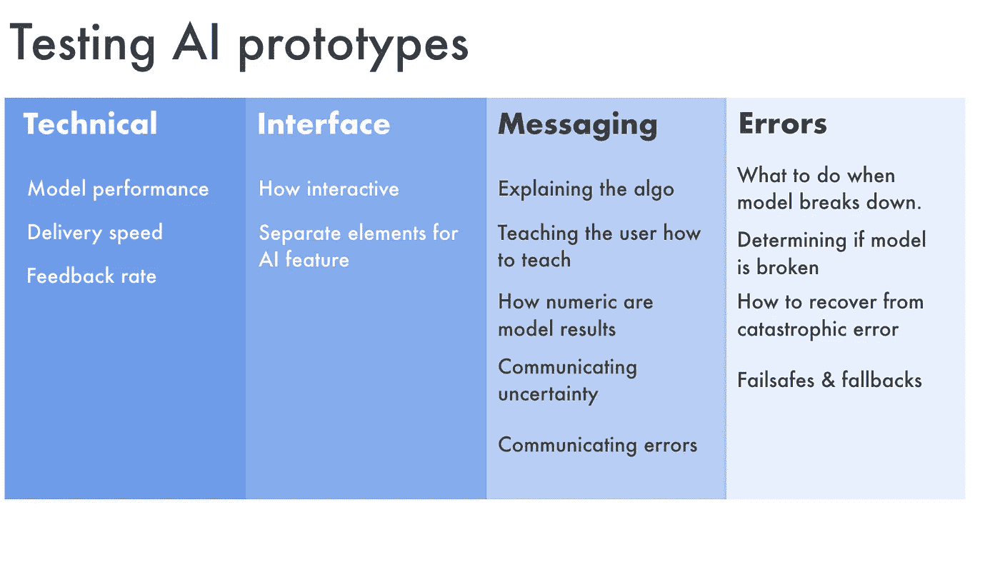

# 决定在人工智能原型中测试什么

> 原文：<https://towardsdatascience.com/deciding-what-to-test-in-ai-prototypes-f3988acad62c?source=collection_archive---------43----------------------->

paweczerwiński 在 unsplash 拍摄的照片

决定测试什么是定义人工智能原型的第一步，也是最重要的一步。这个决定影响了原型设计中的所有其他决定。

**定义测试中的假设很重要，因为原型是杂乱的。杂乱的实验给出混乱的结果；把相关的隐藏在偶然事件中。**

原型是最终产品的粗略近似。从原型中获得的知识可能会改变游戏规则，引人入胜，而且完全令人惊讶。但是要自信地从原型中学习，效果或洞察力需要很大。

从原型中得到一个发现并加以概括是非常容易的，但后来发现这种学习与原型本身的一些缺陷直接相关。原型和最终产品之间的微小差异会影响学习。一些细节，比如元素加载的速度，或者被限制在几个用户行程之内，会对用户的反应产生非常真实的影响。

**有了原型，我们寻找*大的*效果。一旦我们的注意力被吸引，事情就会变得显而易见。不是优化。对于优化，在设计过程的后期进行，并考虑对大型用户组进行 A/B 或多变量测试。**

由于测试中有许多元素，反馈会有噪声。很难理清用户告诉我们和展示给我们的东西的因果关系。

我们可能想要测试的内容类型包括:

**技术细节**

*   模型的性能。
*   交付模型结果的速度。
*   来自模型的反馈率以及用户是否可以直观地“教授”系统。

**界面**

*   人工智能功能的交互性如何。
*   人工智能特性有独立的元素吗？如何将这些与系统的其他部分区分开来。

**消息传递**

*   解释人工智能算法；它做什么以及如何学习。
*   教用户如何让产品学习。
*   模型结果的数值；期望用户有多擅长算术。
*   我们是否以及如何传达错误信息。

**误差校正**

*   如何在出错时安装故障保险？
*   如何确定模型是否已经崩溃？
*   当模型崩溃时我们该怎么办。
*   如何从灾难性错误中恢复？

测试来自 simonoregan.com[的人工智能原型](http://www.simonoregan.com)

将这些测试分开很重要。为了测试技术细节对用户的影响，最好已经完成了界面、消息和错误通信的最终设计。

消息传递与接口和错误处理紧密相关，通常不会单独测试。相反，接口和消息传递或者错误处理和消息传递将成对测试。

要记住的重要一点是，我们不希望快速交换这些排列，希望我们能观察到用户反应的细微差异，以帮助我们确定最佳组合。对于小用户群，结果在统计上肯定不显著，通常也不具有普遍性和相关性。

相反，选择一个具有明确定义的预先假设的配置，并观察用户的行为是否如预期的那样，如果不是，为什么不是。

# 感谢您的阅读🙏🏻

这篇文章最初发表于[simonoregan.com](https://www.simonoregan.com/essays/after-the-outbreak)。

如果你喜欢这个，你可能会喜欢**【部署时代】——每周更新的工具和思考，揭示了 2020 年代的新兴技术和趋势。**