# 网飞近年来的内容战略

> 原文：<https://towardsdatascience.com/deciphering-netflixs-content-strategy-through-nlp-b59cd2e84873?source=collection_archive---------9----------------------->

[自由股票](https://unsplash.com/@freestocks?utm_source=medium&utm_medium=referral)在 [Unsplash](https://unsplash.com?utm_source=medium&utm_medium=referral) 上的照片

## **利用文本挖掘进行内容分析(自然语言处理)**

OVID -19 为我们的日常生活带来了新的标准。社交距离和隔离的做法让我们花更多的时间呆在家里，否则我们会在工作日通勤上班或周末逛商场。

作为一个喜欢看电影的人，我决定每天晚上在网飞看 1-2 部电影。当我啜饮咖啡，翻阅网飞的电影名时，我意识到我花了太多时间来决定我想看哪部电影。我通常按流派搜索 15-20 个标题，并在划分电影区域之前阅读它们的描述。鉴于网飞有太多的选择，我们不都花了很多时间来决定看哪部电影吗？当我继续搜索电影，仍然不确定选择哪部电影时，我想知道网飞的整个内容团队是否每天都在解决同一个问题: ***我应该为我的订户选择哪些内容？***

对于网飞这样的流媒体平台来说，内容将是增加其付费用户基础的最重要的战略杠杆之一。快速浏览一下网飞 2019 年第四季度的财务报表就会发现，其付费用户数量高达 1.67 亿。(见下图 1)

如果网飞所有的付费用户组成一个国家，比如网飞共和国，它将是世界上第九大人口大国，比第八名落后一百万。

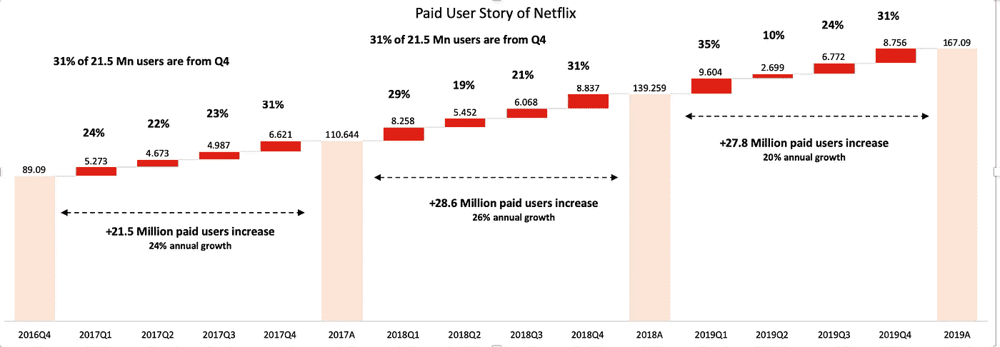

图 1:每季度付费用户净增数；资料来源:Srinivas Vadrevu 基于 [2019Q4 财务报表](https://www.netflixinvestor.com/financials/quarterly-earnings/default.aspx)数据对 2017Q1 至 2019Q4 各季度付费用户净增数的分析

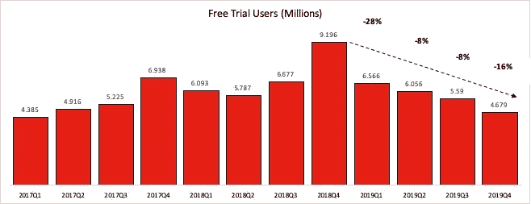

图二:每个季度免费试用用户；资料来源:Srinivas Vadrevu 根据 [2019Q4 财务报表](https://www.netflixinvestor.com/financials/quarterly-earnings/default.aspx)数据对 2017Q1 至 2019Q4 各季度试用用户的分析

此外，有趣的是，2018 年第四季度试用用户激增至 920 万，随后 2019 年第一季度付费用户数量增加了 960 万。2019 年第一季度，大部分试用用户成为付费用户并创造了付费用户高峰吗？

虽然 2019 年每个季度试用用户都在减少，但从 2019 年第二季度到 2019 年第四季度，付费净新增用户在增加。是用户直接创建付费账户没有试用期！？没有用户层面的数据，很难回答这些问题。

**与每个用户的收入相比，每个用户的内容支出在这几个季度中有什么变化？**

收入和营销支出在 2019 年第四季度财务报表的历史分部部分有所提及。由于网飞提供的内容类型不同，内容支出的计算也有所不同。

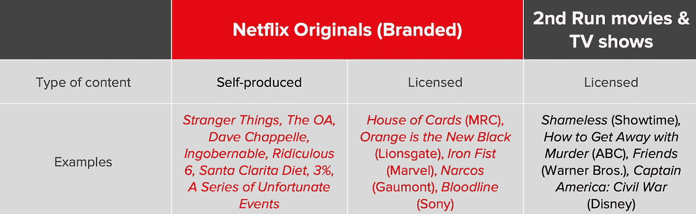

图 3:网飞内容的类型；来源:[网飞投资者关系-2018 年 1 月](https://s22.q4cdn.com/959853165/files/doc_downloads/IR-Content-Accounting-Slides-Jan-2018.pdf)

截至 2018 年 1 月的会计处理文件提到，内容支出将被计算为流媒体内容资产的*加+流媒体内容负债的变化。*

下表提供了过去 12 个季度中每个季度的付费用户增加、收入、内容支出和营销支出等财务数据的快照。

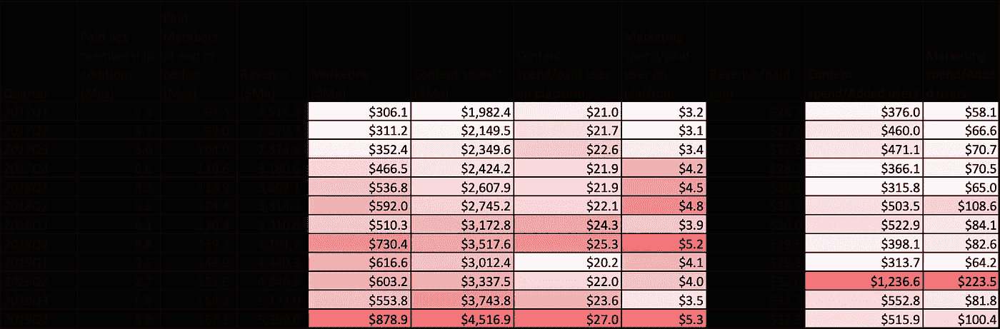

图 4:收入、营销和内容支出分析；来源:Srinivas Vadrevu 基于[网飞财务报表 2019Q4](https://www.netflixinvestor.com/financials/quarterly-earnings/default.aspx) 的数据进行的分析

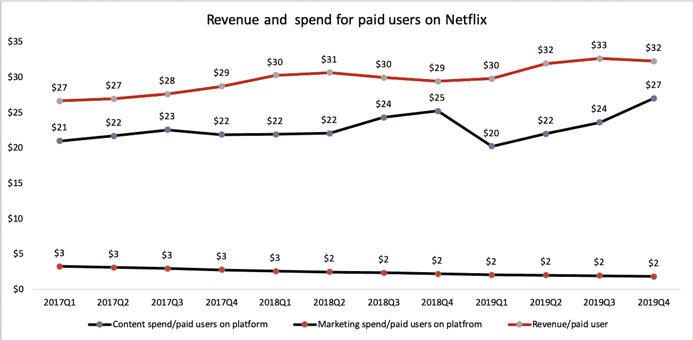

图 5:每个付费用户的平均收入和支出；资料来源:Srinivas Vadrevu 基于[网飞财务报表 2019Q4](https://www.netflixinvestor.com/financials/quarterly-earnings/default.aspx) 的数据进行的分析

*   每付费用户的平均收入在过去 4 个季度中不断增长，从 2018 年第 4 季度的 29 美元增长到 2019 年第 4 季度的 32 美元
*   从 2017 年第一季度到 2018 年第四季度，每个付费用户在平台上的内容支出逐渐增加。它在 2019 年第一季度大幅下降 20%至 20 美元，并在过去四个季度中一直增长，直到 2019 年第四季度达到 27 美元。
*   在过去的 12 个季度中，平台上每个付费用户的营销支出几乎保持不变——2-3 美元

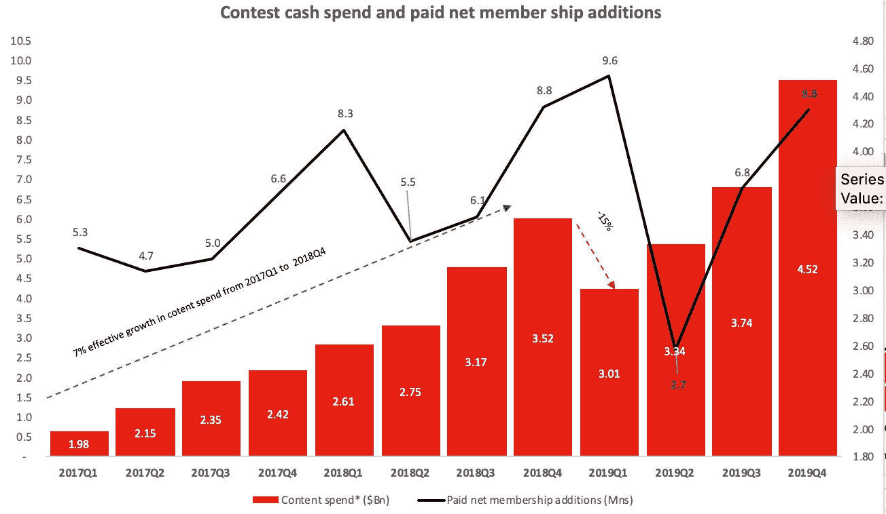

图 6:每个季度内容现金支出和付费净会员增加；来源:Srinivas Vadrevu 基于[网飞财务报表 2019Q4](https://www.netflixinvestor.com/financials/quarterly-earnings/default.aspx) 的数据进行的分析

为了解释前面提到的 2019 年第一季度每用户内容支出的下降，让我们来看看每个季度总内容支出和净付费用户增加之间的关系。*2019 年第一季度，内容支出首次下降，付费新增用户创下近 12 个季度以来的新高。*这解释了为什么在过去的 12 个季度中，每个用户的内容支出处于历史最低点。

但是，到 2018 年第四季度，每个季度的内容支出都以大约 7%的速度持续增长。在 2019 年第一季度，他们减少了 15%到 5 亿美元的内容支出。在下一个季度，即 2019 年第二季度，付费净用户的数量从 960 万急剧下降到 270 万。看起来上个季度的内容支出可能会对下个季度(2019 年第二季度)的净付费用户增加产生影响。

我计算了上述指标，只是为了检查内容支出是否有任何重大变化，我们认为 2019 年第二季度出现了这种变化。我敢肯定，大多数跟踪网飞的股票分析师现在正忙于对其财务报表进行内容分析，为即将于 2020 年 4 月 21 日发布的收益公告做准备。然而，我更感兴趣的是探索网飞多年来做出的内容选择，而不是内容支出/财务指标。由于它所做的内容选择不仅让其截至 2016Q4 的 8900 万用户欣喜不已，还在未来三年内带来了 7800 万付费用户的增长(包括我！).

> **“当我们取悦我们的会员时，他们看得越多，我们就成长得越多”——网飞 2019Q1 致股东的信**

那么，网飞增加了哪些内容来取悦用户呢？

我越是纠结于上述问题，就越想找到一种方法来回答这个问题。碰巧的是，我在网飞理工大学的博客上看到了一篇优秀的文章，阐述了网飞如何依靠预测数据模型来评估其跨语言的内容消费。我认为这是一个对电影和分析都有热情的人的好博客。鉴于对数据驱动的决策的如此强调，以找出内容及其创作生命周期，我推测这些决策应该作为模式出现在它添加到其平台的标题中。我决定在新冠肺炎封锁期间利用这段额外的时间学习一点 NLP(自然语言处理),并检查我是否可以应用任何基本的 NLP 技术来理解网飞对其内容所做的选择。由于网飞依靠消费者层面的数据来得出这些选择，我们或许可以在这个过程中发现一些客户偏好。

**数据来源**

为了探索这一点，我查看了两个数据源来对其内容策略进行三角分析—

(1):季度致股东信中的内容部分——每个季度，网飞都会发布一封致股东信，其中有一个内容部分。在这一部分中，网飞介绍了其内容选择、原因以及该季度的表现。

数据来源:网飞在其网站上给股东的信[https://www . Netflix investor . com/financials/quarterly-earnings/default . aspx](https://www.netflixinvestor.com/financials/quarterly-earnings/default.aspx)

(2)网飞在其平台上的实际标题列表。就网飞传达其内容战略而言，上述数据来源是自上而下的方法。使用网飞上的标题和它们的描述，实际的内容策略可以被破译。

数据来源:我使用了来自 kaggle.com[的数据集，主要基于从 flixable.com](https://www.kaggle.com/shivamb/netflix-shows)[网站](https://flixable.com/)收集的数据。Flixable 包含美国网飞上当前可用的所有电视节目和电影。

上述数据集没有将内容分类为网飞分类的三种类型的内容。在本文中，我们不会按自制标题、品牌和授权标题以及仅授权标题对内容选择进行分类。

在合并金融数据集和 Kaggle 数据集后，我发现 2018 年第二季度获得一个标题的内容花费最高—***$ 860 万美元，而 2019 年第一季度获得一个标题的内容花费最低，为$ 560 万美元。***

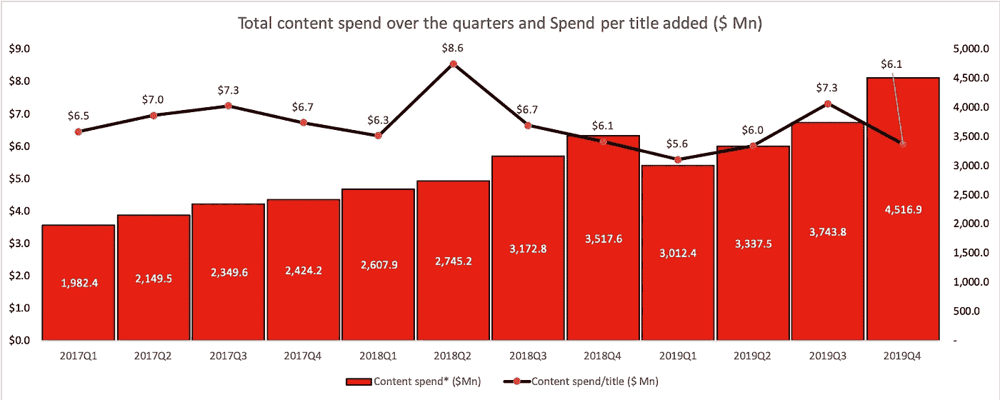

图 7:每个季度的总内容花费和每个标题的花费；来源:Srinivas Vadrevu 基于[网飞财务报表 2019Q4](https://www.netflixinvestor.com/financials/quarterly-earnings/default.aspx) 的数据进行的分析

在此之前，我开始处理来自两个数据集的文本，这是朱莉娅·西尔格和大卫·罗宾逊的“用 R 进行文本挖掘”的一大亮点。我发现这上面的内容对学习文本挖掘和绘制下面的图表非常有帮助。

# **网飞传达了哪些关于它的内容？**

Miguel Henriques 在 [Unsplash](https://unsplash.com?utm_source=medium&utm_medium=referral) 上的照片

**分析致股东信的内容部分(自上而下)**

为了理解网飞在内容部分使用的关键主题，我从网飞发布给投资者的致股东信中收集了内容部分。我整理了最近 30 个季度(2012Q3 到 2019Q4)的数据。从这个数据集中，我从文本中提取了二元模型标记，在去除了停用词之后，从语料库中创建了二元模型的网络可视化。下图创建了一个二元模型的网络结构(两个单词的组合)。比如说，“la”+“casa”=“la casa”是一个二元模型，“case de”是另一个二元模型。两个二元模型在节点“casa”处连接，形成网络结构“la casa de”。

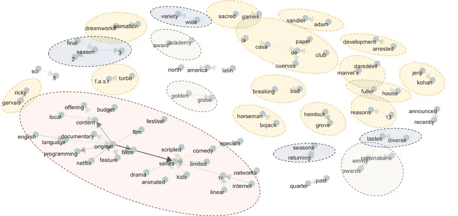

图 8:2012 年第三季度至 2019 年第四季度(30 个季度)致股东信中内容部分的常见二元模型；(二元模型计数> 4)；资料来源:Srinivas Vadrevu 基于从网飞[致股东的信](https://www.netflixinvestor.com/financials/quarterly-earnings/default.aspx)中收集的数据进行的分析

我已经把上面的二元模型分成了几个大的主题类别。让我们来看看网飞传达给股东的关键主题:

1.  ***原创内容(字:“原创”，红泡泡左边)* -** 在最近的三十个季度里，网飞几乎都在突出自己的原创内容。*原创+电影、原创+故事片、原创+内容、原创+纪录片、原创+节目和原创+系列*等等。
2.  **热门/热播系列(《黄色泡泡》)**——*绝命毒师、Bojack 骑士、漫威的超胆侠、Le Casa de Papel* (金钱大劫案——英文版) *Turbo F.a.s.t .、发展受阻、神圣游戏和铁杉树林*
3.  **大众喜剧个人————【黄泡】——**演员:*里奇·格威斯、*编剧*:杰姬·科恩*
4.  **电视节目中的主要类型(节点词:“系列”，红色泡泡的右边部分)**——*电视剧、喜剧、儿童、动画、脚本系列、限量系列和电视系列*。*科幻*流派
5.  **连续性-** 网飞在推出后续剧集时都会提到这些剧集的名字——*第二季、第三季和回归季*
6.  **品种-** 迎合*品种繁多*和*口味多样*；
7.  **地点聚焦-**-*拉丁美洲和北美*
8.  **优质-** *奖项&节庆* **(绿色泡泡)——**传递优质内容。奥斯卡金像奖、金球奖、艾美奖提名、艾美奖奖和电影节等奖项经常被提及。

**2014–2016 年至 2017–2019 年关键二元模型的变化**

图 9:致股东信内容部分在三年时间窗内的常见二元模型——2017 Q1 至 2019Q4 和 2014Q1 至 2016Q4(计数> 4)；资料来源:Srinivas Vadrevu 基于从网飞[致股东的信](https://www.netflixinvestor.com/financials/quarterly-earnings/default.aspx)中收集的数据进行的分析

当我在 2017 年至 2019 年和 2014 年至 2016 年的三年窗口中绘制常见二元模型时，除了上面提到的关键趋势外，内容重点还有一些变化。

*   与 2014 年至 2016 年相比，喜剧系列在 2017 年至 2019 年期间不再被频繁提及。
*   剧集和限量系列在 2017–2019 年被提及的频率更高
*   ***2014-2016 年第二季已经让位给 2017-2019 年回归的第三季。***
*   当然，热门节目从 2014-2016 年到 2017-2019 年发生了变化
*   电视网络和互联网电视在 2017-2019 年没有被频繁提及
*   在过去的六年里，对原创内容的重视保持不变

*那么，与之前的三年窗口(2014、2015、2016)相比，过去三年(2017、2018、2019)发生了什么变化？*

***近几年更强调剧情，限定剧集，延长季节，当然还有原创内容。较少强调喜剧系列、电视网络和网络电视***

查尔斯·德鲁维奥在 [Unsplash](https://unsplash.com?utm_source=medium&utm_medium=referral) 上拍摄的照片

# B.从《网飞》的实际内容解读内容策略

将他们所说的和他们所做的结合起来。

**分析网飞上的所有标题及其描述(自下而上的方法)**

[Kaggle 数据集](https://www.kaggle.com/shivamb/netflix-shows)(上述数据描述中的第二个数据集)包含过去 12 年(从 2008 年到 2020 年 1 月 18 日)收集的标题信息。数据集中的字段如下:标题的名称、类型(电视节目或电影)、导演、演员、参与制作的国家、在网飞上添加的日期、原始发行年份、分级(美国电影协会或电视家长指南)、标题的持续时间、在类别中列出以及标题的简要描述。我使用标题的描述来提取它的关键内容选择，并列出 _in 类别来提取流派。

**B.1 流派**

根据添加的日期，我将季度添加到数据集，以研究每个季度添加了什么类型(电影/电视节目)、流派和主题。截至 2020 年 1 月，数据集显示网飞总共有大约 6234 本书。其中 68%(4265 个)是电影，其余的 1969 个标题被分类为电视节目

让我们快速浏览一下从 2016 年第一季度到 2020 年第一季度*(到 2020 年 1 月 18 日)每个季度添加的图书分类。虽然网飞每个季度都会增加越来越多的片名，但%的电影似乎遵循着一种循环模式。(参见下面的图 10)

*   *平台上有电影的标题比例从 2017 年第一季度的 76%下降到 2017 年第三季度的 65%*。
*   随后在 2018 年第一季度逐渐上升至 77%。然后，与 2018 年第一季度相比，2018 年 Q2 在该季度出版的图书总数下降了 48%(约 156 本)。电视节目的数量增加了 3 个标题，而电影标题减少了 159 个。这将百分比降至 70%
*   ***从 2018 年第三季度到 2019 年第四季度的下一季度，添加的电影片名的百分比持续下降，从 74%下降到 58%(最近 12 个季度最低)。***
*   从 2019 年第四季度到 2020 年 1 月 18 日，电影片头%逐渐增加到 2019 年第四季度的 70%，2020 年第一季度截至 2020 年 1 月 18 日增加的片头的 80%。

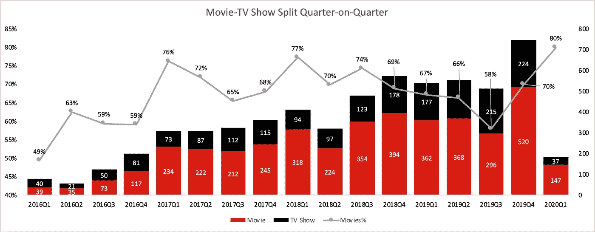

图 10:根据电影和电视节目添加到网飞的季度，将标题分成电影和电视节目；资料来源:Srinivas Vadrevu 根据 [Kaggle](https://www.kaggle.com/shivamb/netflix-shows) 的数据进行的分析

**好了，这是关于标题的数量，让我们从数据中看一下热门类型**

我们大多数人都偏爱几种类型。而有些人可能喜欢冒险、动作、犯罪、恐怖片等。其他人可能更喜欢爱情片、喜剧片或家庭电影。当我们浏览标题时，我们大多数人可能会根据流派来定位搜索。所以，我选择了流派作为一个重要的变量，来弄清楚网飞是如何添加电影和电视节目的。每本书通常分为 2-3 种类型。因此，我从数据集中的 listed_in 列中提取单词作为单词，去除停用词，以了解每年添加的标题下面列出了哪些热门流派。

## **2019 年新增的热门游戏类型**

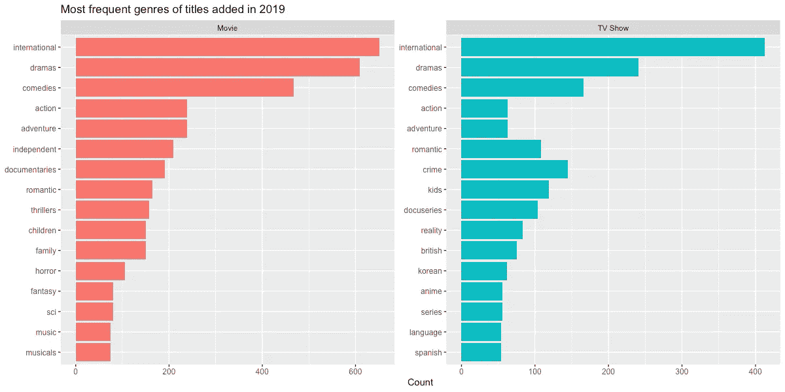

图 11:2019 年使用标题的 Listed_In 类别中的标记词提取的流派计数；资料来源:Srinivas Vadrevu 根据 [Kaggle](https://www.kaggle.com/shivamb/netflix-shows) 提供的数据进行的分析

上图(图 6)描述了 2019 年按流派和类型(电影或电视节目)增加的标题数。电影和电视节目的五大流派完全相同

*   2019 年 Top 5 流派电影如下:**国际、剧情、喜剧、动作、冒险**。
*   2019 年电视节目的前 5 大类型如下:**国际，戏剧，喜剧，犯罪，浪漫和儿童。**
*   除了前三种类型，爱情片、纪录片和儿童片在电视和电影中也很常见。
*   与电视节目相比，电影中的顶级类型更加多样化。一些类型出现在电影的顶级类型中，但没有出现在电视节目的顶级类型列表中。**惊悚、家庭、恐怖、奇幻、科幻、音乐剧和独立**类型出现在电影的顶级类型列表中，但不包括电视节目。
*   **犯罪、现实和动漫**类型出现在电视节目的顶级类型列表中，但不在电影中。顶级电影类型列表中也没有基于语言的类型- **英国**(英语)**西班牙语**和**韩语**。与电影相比，电视节目似乎更能迎合不同的口味和观众。
*   **恐怖和奇幻**成为 2019 年的热门主题，这些主题在 2018 年并不存在(见下图 7)

## 2018 年和 2017 年添加的热门类别

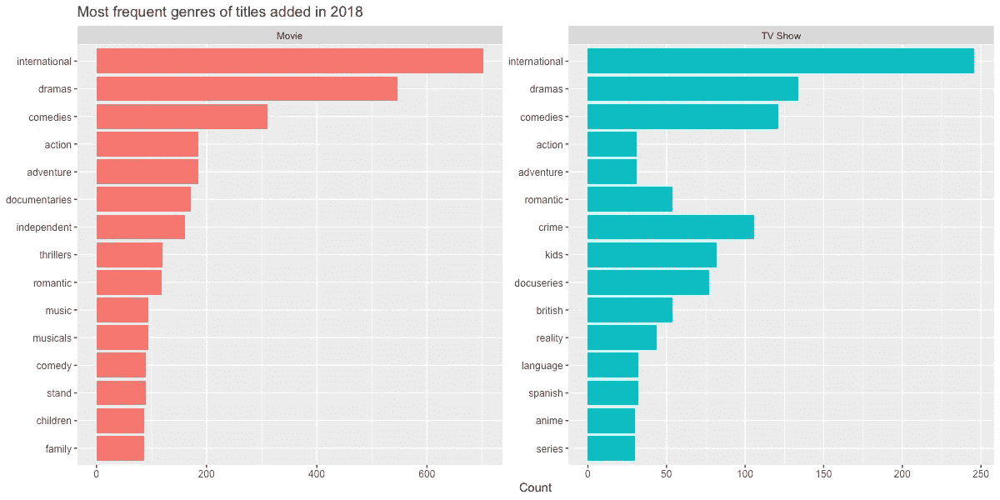

图 12:2018 年使用标题的 Listed_In 类别中的标记词提取的体裁统计；资料来源:Srinivas Vadrevu 根据 [Kaggle](https://www.kaggle.com/shivamb/netflix-shows) 提供的数据进行的分析

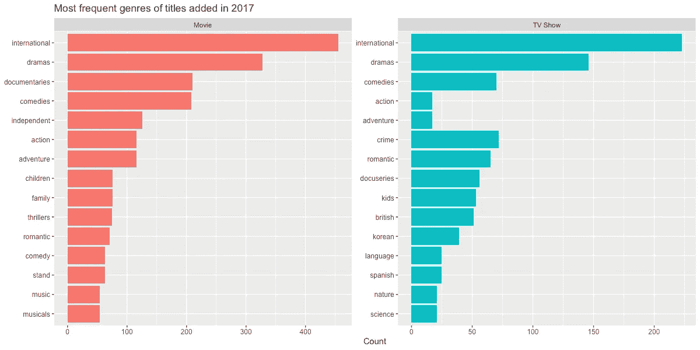

图 13:2017 年使用标题的 Listed_In 类别中的标记词提取的流派计数；资料来源:Srinivas Vadrevu 根据 [Kaggle](https://www.kaggle.com/shivamb/netflix-shows) 提供的数据进行的分析

2018 年和 2017 年展示了几乎相同的风格模式，除了一些变化-

*   **电影:**纪录片和独立电影在 2017 年位居电影体裁前 5，但在 2018 年和 2019 年让位于动作和冒险。
*   **电视变化**:自然和科学是 2017 年的热门题材，但它们在 2018 年被真人秀、脱口秀、动漫和脱口秀取代

网飞电影的总体类型分布是怎样的？

图 14:使用数据集中所有标题的 Listed_In 类别中的标记词提取的流派的计数；资料来源:Srinivas Vadrevu 根据 [Kaggle](https://www.kaggle.com/shivamb/netflix-shows) 提供的数据进行的分析

我能使用上面的数据(图 14)更好地从网飞的 6234 个书目中搜索吗？虽然网飞根据你的搜索选择在“流行精选”和“趋势精选”中为你筛选内容，你仍然可以使用上述数据更好地搜索流派组合。

这里有一个浏览流派组合的提示——一个关于网飞的标题通常分为 2-3 个流派。所以，下次当你在网飞上按流派组合浏览标题时，你可以从上面的列表中选择不太常用的流派，滚动到更常用的流派标签，从而缩小搜索范围。例如，如果您想观看恐怖惊悚电影，并且不想使用遥控器键入 15-16 个字符，请浏览恐怖行(您首先会在这些行中看到一组更窄的恐怖标题)，然后在该行的标题标签中查找恐怖片..

# B.2 分析故事主题

这里有类型，然后是吸引观众的故事。主题或情节主线是吸引观众参与内容的重要因素。与我分析给股东的信的方法类似，我从数据集中的描述列中提取了去除停用词后作为二元模型的令牌。这些二元模型代表了每年增加的标题的主题。让我从数据集中挑选一些电影和节目来说明这些描述在[数据](https://www.kaggle.com/shivamb/netflix-shows)集中是如何表达的。

照片由[乔尔·穆尼斯](https://unsplash.com/@jmuniz?utm_source=medium&utm_medium=referral)在 [Unsplash](https://unsplash.com?utm_source=medium&utm_medium=referral) 上拍摄

查尔斯·德鲁维奥在 [Unsplash](https://unsplash.com?utm_source=medium&utm_medium=referral) 上拍摄的照片

***洛奇*** *:西尔维斯特·史泰龙因扮演洛奇·巴尔博亚而一举成名，洛奇是一名不知名的拳手，他曾作为宣传噱头向世界拳王阿波罗·奎迪开了一枪。*

**:这部引人入胜的续集以激动人心的高潮为特色，拳击手洛奇·巴尔博亚重返拳击台，与卫冕冠军阿波罗·奎迪进行复赛。**

*当一个小男孩失踪后，一个小镇揭开了一个神秘的故事，其中涉及秘密实验、可怕的超自然力量和一个奇怪的小女孩。*

## *2020 年 1 月 18 日，网飞最热门的故事主题是什么？*

*使用上面的标题描述，我将所有的二元模型串在一起，并删除了停用词，以创建一个分别用于所有电影和电视节目标题的二元模型网络图。从网络图(图 15 和图 16)中，我大致确定了以下主题类别-*

*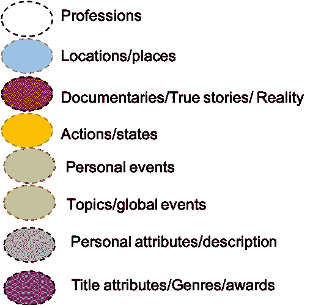*

*图 15 和图 16 的图例*

*将二元模型归入这些主题是我的判断。没有主题的名人是著名的明星或节目。我总共把二元模型分成了 8 类。请参见左侧的图例。*

*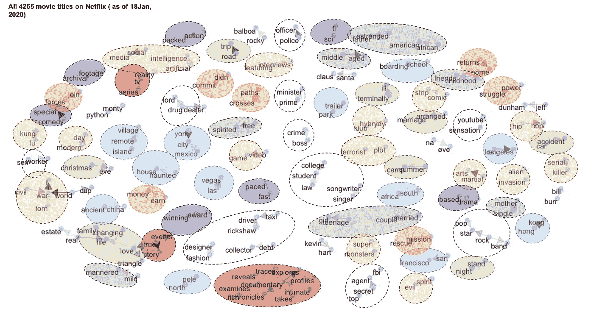*

*图 15:来自 4265 个电影标题的描述列的二元模型网络；资料来源:Srinivas Vadrevu 根据 [Kaggle](https://www.kaggle.com/shivamb/netflix-shows) 的数据进行的分析*

*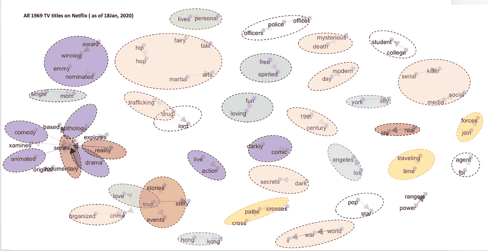*

*图 16:来自 1969 电视标题的描述栏的二元模型网络；资料来源:Srinivas Vadrevu 根据 [Kaggle](https://www.kaggle.com/shivamb/netflix-shows) 的数据进行的分析*

***在上述主题类别中，有哪些顶级的双元模型？***

***纪录片/真实故事—***

*   *电影- *真实故事、纪录片、采访特辑、根据真人秀电视连续剧改编的电影**
*   *电视剧- *真实故事、真实故事、真实事件、真人秀系列、纪录片系列**
*   *影视剧通用— ***真实故事****

***城市/地点—***

*   *电影- *纽约、洛杉矶、拉斯维加斯、旧金山、香港、墨西哥城、南非、北极和古代中国。偏远的岛屿，偏远的村庄，鬼屋，拖车公园，夏令营和寄宿学校。**
*   *电视节目- *纽约、洛杉矶和香港*。没有提到具体的地点，如鬼屋等。*
*   *电影和电视节目的共同点- ***纽约、洛杉矶和香港****

***职业—***

*   *电影- *警官、联邦调查局特工、绝密特工、首相、时装设计师、出租车司机、人力车司机、歌手兼作曲家、youtube 红人、法律学生、大学生、流行歌星、摇滚歌星、性工作者、毒枭、毒贩、讨债人和犯罪头目**
*   *电视节目- *警察、警官、联邦调查局特工、流行歌星、大学生和毒枭**
*   *电影和电视剧里常见的- ***警察、毒枭、大学生和 FBI 特工****

***动作** —*

*   *电影- *权力斗争*，*路径交叉*，*力犯*，*返乡*，*联手，改变人生，家庭生活，挣钱，任务营救**
*   *电视节目- *交叉路径，交叉路径，合力和时间旅行**
*   *电影和电视剧的共同点- ***交集和合力****

***个人事件—***

*   *电影- *三角恋，真爱平安夜，改变人生，一夜情，公路旅行，家庭生活，绝症，车祸，夏令营，包办婚姻。**
*   *电视剧- *私生活，真爱**
*   *影视剧常见的 *-* ***真爱****

***主题/重大事件—***

*   *电影- *二战、外星人入侵、内战、恐怖阴谋、连环杀手、武术、功夫、摩登时代、恶灵、漫画、电子游戏、访谈、嘻哈、社交媒体、房地产、人工智能。**
*   *电视节目- *二战、嘻哈、黑暗秘密、童话、贩毒、武术、有组织犯罪、连环杀手、社交媒体、神秘死亡和现代**
*   *电影和电视剧都常见- ***二战、嘻哈、社交媒体、武术、连环杀手****

***个人属性** -*

*   *电影- *十几岁的女孩，温文尔雅，无拘无束，非裔美国人，中年人，已婚夫妇，童年好友，疏远的父亲，单身母亲**
*   *电视节目- *单身妈妈，无拘无束，爱玩。**

*电影和电视剧中常见的- ***单身母亲，自由奔放的****

***标题属性** —*

*   *电影- *获奖、快节奏、真人秀、喜剧特辑、动作片、特色访谈、档案镜头、剧情片、科幻片**
*   *电视剧- *艾美奖、艾美奖提名、获奖、喜剧类、动画类、真人版、黑色喜剧类、剧情类、剧集类**
*   *普通- **获奖、喜剧、剧情***

***流行名称—***

*   *电影- *洛奇·巴尔博亚，巨蟒剧团，凯文·哈特，比尔·伯尔，杰夫·敦哈姆**
*   *电视节目- *电动游侠**

*图 12 中的柱状图展示了所有上述按移动/电视节目分类并按频率降序排序的二元模型。主要主题如下:*

****真实故事、纪录片、二战、武术、纽约、洛杉机、警官、真爱是网飞电影和电视节目的常见主题****

**

*图 17 在网飞所有标题的描述中使用“ngrams”提取的二元模型的计数；资料来源:Srinivas Vadrevu 根据 [Kaggle](https://www.kaggle.com/shivamb/netflix-shows) 提供的数据进行的分析*

*在附录中，您可以找到过去四年(2016 年至 2019 年)二元模型的同比频率图。上述主题或多或少地出现了，只是时间顺序略有不同。*

*所以，如果我要写一个以网飞为结尾的故事，我会用下面的提示和标题描述。我用电影和电视节目中常见的关键主题想到了下面的提示*

## *这位获奖的电影制作人导演了一个真实的故事，讲述了纽约市一名警察是一名自由奔放的大学生的单身母亲的故事。她与一个毒枭不期而遇，并找到了真爱，导致了三人之间的错误喜剧*

*该提示包含了网飞标题描述中经常出现的所有关键主题。如果网飞上的内容很好地反映了用户的偏好，那么上述主题可能会吸引观众。然而，可以肯定的是，哪些主题推动了票房表现或用户参与度，这值得进一步探索。*

# ***结论***

***关于它的内容，网飞告诉了它的股东什么？***

*在过去的三十个季度中，网飞一直强调创造原创内容，并强调其热门系列(原创和授权，绝命毒师等)。)和顶级喜剧明星。他们提到了第二季、第三季和回归季等后续季的发布，这通常是观众接受和参与的标志。他们非常强调内容的多样性和迎合观众的不同口味。他们将拉丁美洲和北美的内容带到平台上，并传达给股东。当然，他们总是提到奖项(奥斯卡金像奖、金球奖、艾美奖),作为向订户和股东展示内容质量的信号。*

***过去三年，网飞在内容方面给了用户什么？***

*与电影相比，2019 年电视节目受到了更多关注。虽然每个季度添加的标题都在增加，但平台上包含电影的标题的百分比从 2017 年第一季度的 76%下降到 2017 年第三季度的 65%。*

**过去三年关注的类型*:*

*   *在过去的三年里，网飞一直专注于国际(更广泛的观众群)，戏剧，喜剧，浪漫，纪录片，武术，动作和冒险电影和电视节目。这与他们所说的基本一致。*
*   *与电视节目相比，电影似乎有更广泛的类型。一些在电影中更常见的类型，如惊悚片、家庭片、恐怖片、奇幻片、科幻片、音乐剧和独立片，在电视中并不常见。*
*   *有趣的是，犯罪、现实和动漫是电视剧中的热门类型，但在电影中却不是。顶级电影类型列表中也没有基于语言的类型——英国(英语)、西班牙语和韩语。*
*   *与电影相比，电视节目似乎更适合于吸引不同的口味和观众，因为它侧重于语言类型和国际内容(日本动漫)。*
*   *恐怖和幻想类型在 2019 年开始出现在顶级类型中。*

**网飞近三年新增内容主题:**

***(1)纪录片/真实故事**——不少真实故事*

***(2)城市/地点—** 电影和电视的常见地点—***纽约、洛杉机和香港****

***(3)职业—** 电视电影中常见的职业—***警察、毒枭、大学生、FBI 特工****

***(4)动作-** 电视剧和电影里的人物做的共同的事- ***交集，合力。****

***(5)个人事件—** 电视和电影中常见的个人生活事件**—*真爱****

***(6)话题/重大事件—** 电视节目和电影常见 ***二战、嘻哈、社交媒体、武术****

***(7)个人属性**-**-*单亲妈妈，洒脱*-***

***(8)片名属性**——**获奖，喜剧***

***(9)流行/热门名字***

*   *电影- *洛奇·巴尔博亚，巨蟒剧团，凯文·哈特，比尔·伯尔，杰夫·敦哈姆**
*   *电视节目- *权力流浪者**

*根据图 12，电视节目和电影的常见主题是: ***真实故事、纪录片、二战、武术、纽约市、洛杉机、警官、真爱是网飞电影和电视节目的常见主题/二元模型。****

*那么，这是否意味着“灯光，摄像机和行动”的任何提示与上述二元模型？在读者中的任何制片人准备资助这个项目之前，他们可能会问上面的提示是否会在票房上取得成功，或者是否有望获得巨大的订户参与？我会在另一篇文章中通过将票房收入与主题和类型联系起来来尝试回答这个问题。在这个时候，我们所知道的是网飞在体裁和故事主题方面的内容选择。*

*快乐阅读！如果你想进一步了解《致股东的信》或《头条新闻》主题中的年度重要内容，我在下面添加了一些图表。*

# *附录:*

*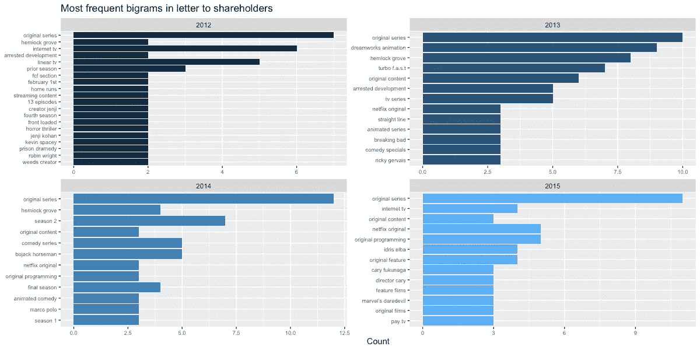*

*图 18:2012 年第三季度至 2015 年第四季度致股东信内容部分使用“ngrams”提取的二元模型计数；Srinivas Vadrevu 的分析；数据:Kaggle 上的网飞电影和电视节目数据集。[https://www.kaggle.com/shivamb/netflix-shows](https://www.kaggle.com/shivamb/netflix-shows)*

*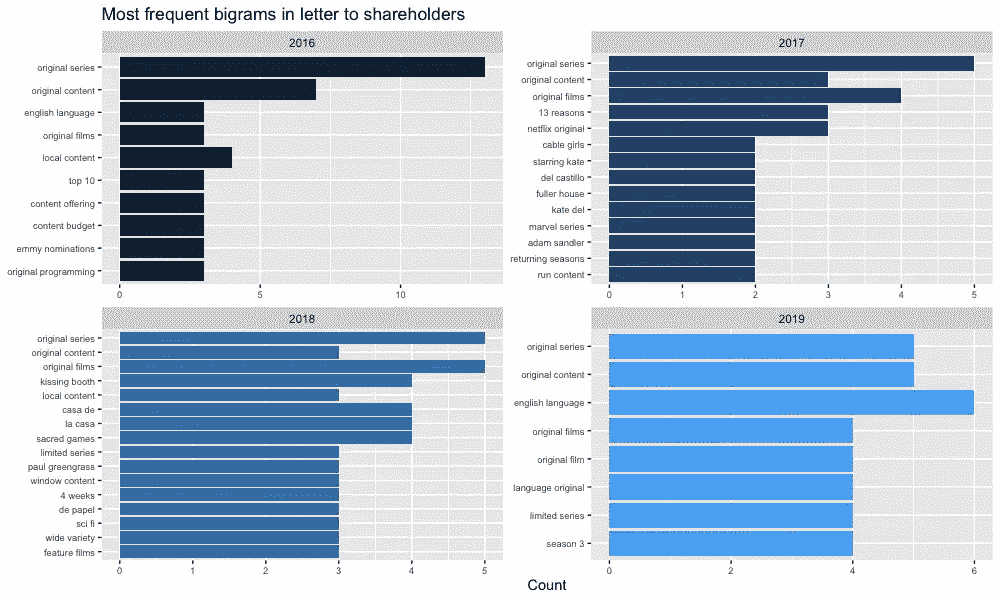*

*图 19:2016 年第一季度至 2019 年第四季度致股东信内容部分使用“ngrams”提取的二元模型计数；资料来源:Srinivas Vadrevu 的分析；数据基于[https://www.kaggle.com/shivamb/netflix-shows](https://www.kaggle.com/shivamb/netflix-shows)*

*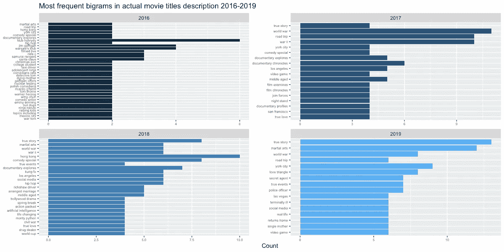*

*图 20:在网飞电影标题的描述中使用“ngrams”提取的二元模型的计数；资料来源:Srinivas Vadrevu 根据 https://www.kaggle.com/shivamb/netflix-shows[的数据分析](https://www.kaggle.com/shivamb/netflix-shows)*

*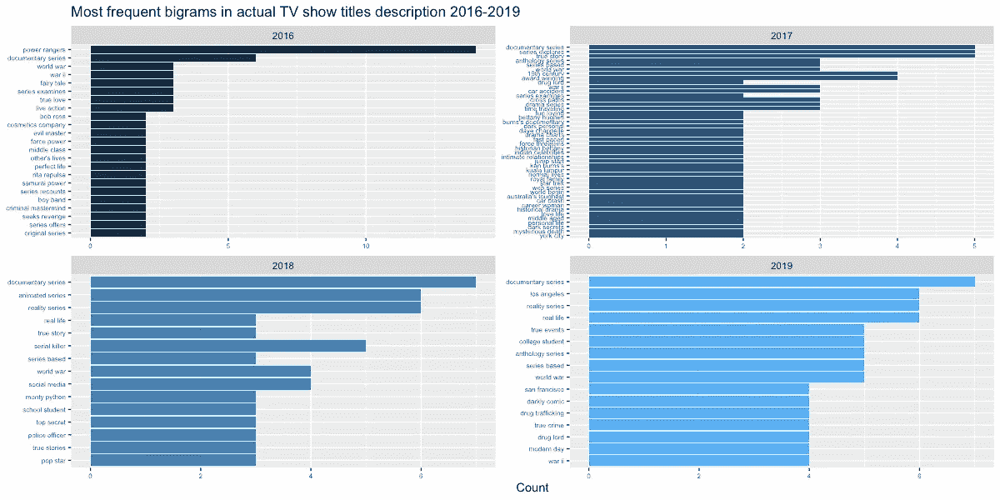*

*图 21:在网飞的电视节目标题描述中使用“ngrams”提取的二元模型的计数；资料来源:Srinivas Vadrevu 根据 https://www.kaggle.com/shivamb/netflix-shows[的数据分析](https://www.kaggle.com/shivamb/netflix-shows)*

***免责声明** : *本文中表达的所有观点均为 Srinivas Vadrevu(以下简称“作者”)的观点，并不代表作者曾经、现在或将来隶属的任何实体的观点。以上所有观点都不是统计推断，而是作者基于模式的观点。本文作者对本文内容中的任何错误或遗漏不承担任何责任或义务。你不应该依靠这篇文章来作出任何商业、法律、投资或任何其他决定。虽然作者试图保持文章中的信息准确，但作者不对本文中包含的图形、图表和数据的完整性、准确性、可靠性、适用性或可用性做出任何形式的明示或暗示的陈述或保证。**