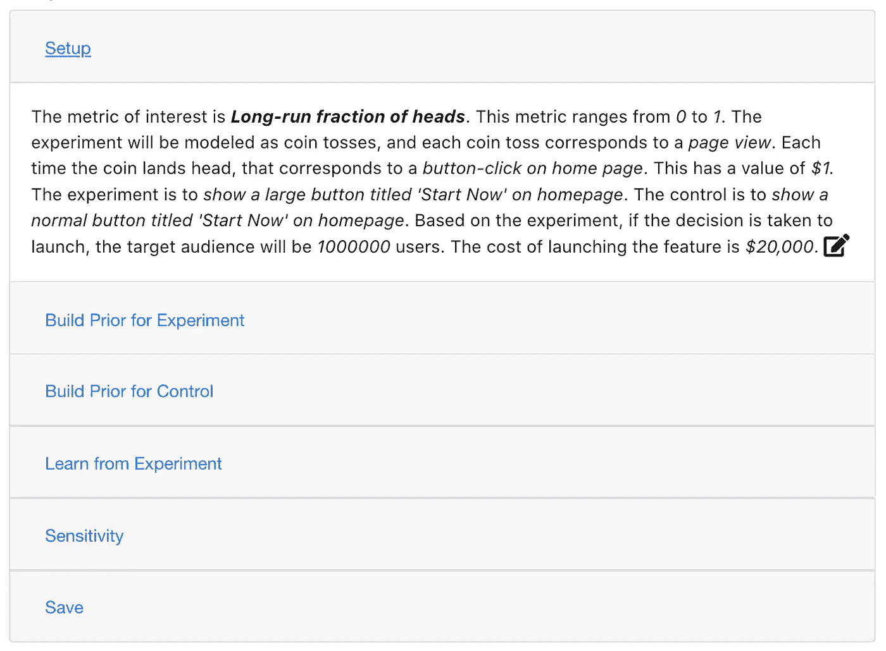
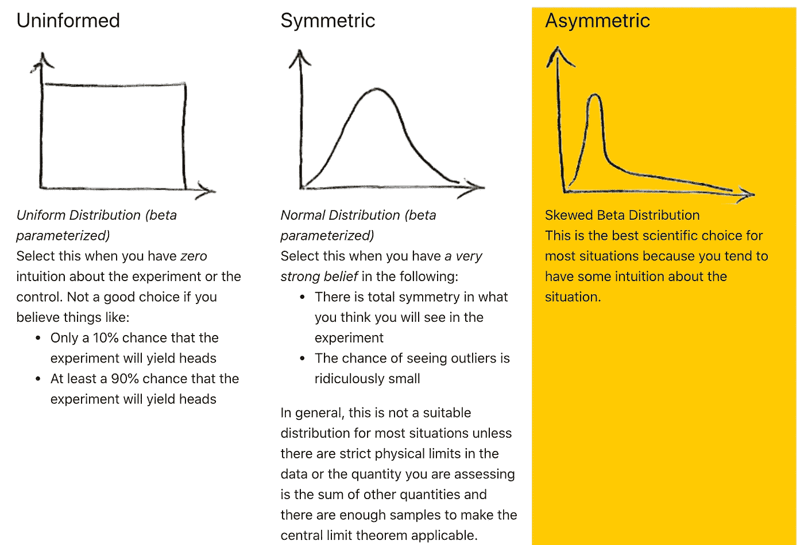
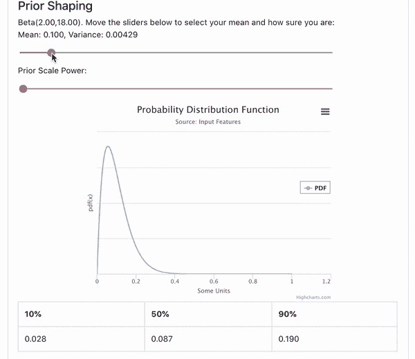
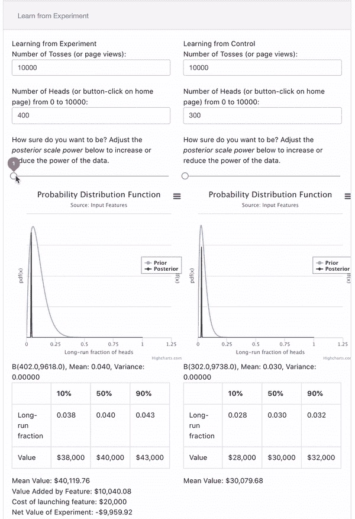
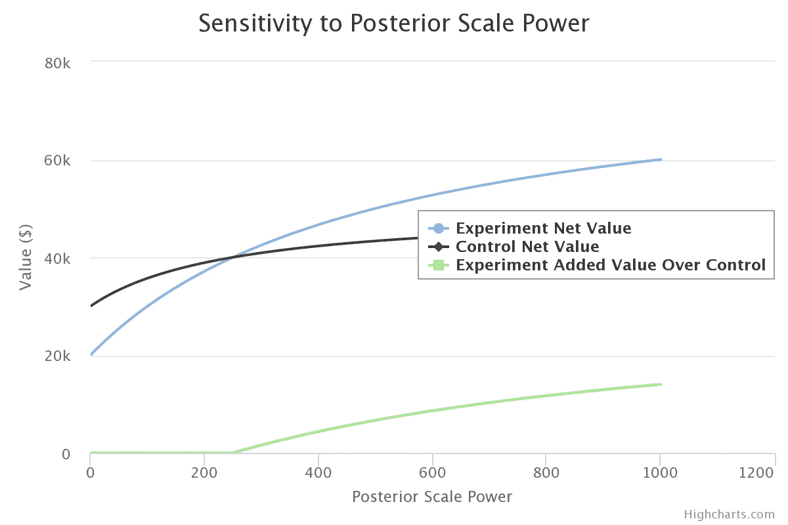
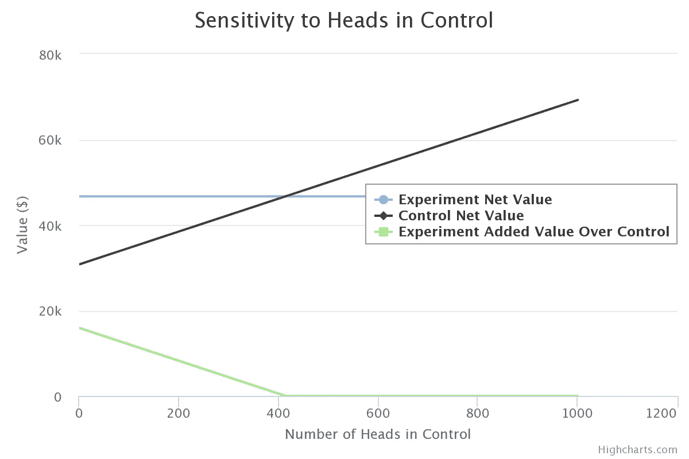
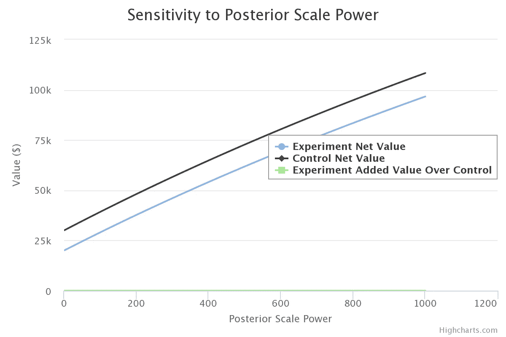
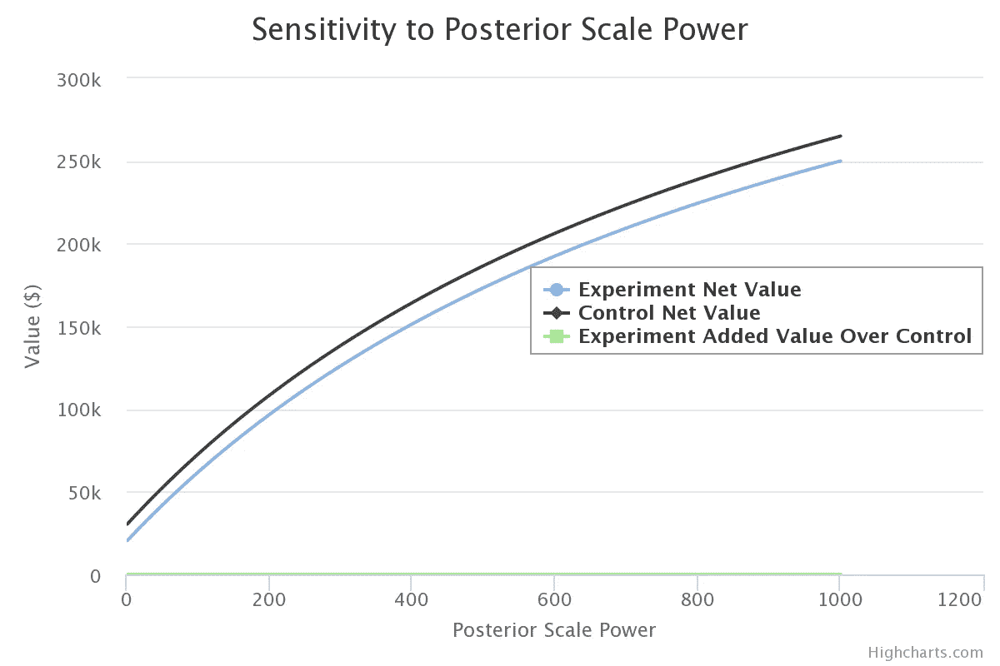

# 面向产品领导者的决策分析 A/B 测试

> 原文：<https://towardsdatascience.com/decision-analytic-a-b-testing-for-product-leaders-417b3a33178f?source=collection_archive---------62----------------------->

## 将直觉编入数学中，进行强有力的决策对话

图片来源:[延斯·勒列](https://unsplash.com/@leliejens)

**TL；DR** 现有的 A/B 测试方法采用频率主义方法进行统计假设测试。这些将产品负责人的直觉排除在流程之外，甚至将其视为非法。贝叶斯基础上的决策分析方法翻转过来，给产品领导一个直观的定量语言。由此产生的 A/B 测试方法比以前有更多的批判性思维和假设透明度的空间。我为此开发的一个开源工具( [Excel](http://pmda.io/ABDA.xlsx) ， [HTML](http://pmda.io/abtest.html) )帮助产品领导者建立数学直觉。

A/B 测试已经成为产品团队对小的变更进行迭代测试的一个规程，测试对象是一个小的但是有代表性的用户群。有很好的课程教你 A/B 测试的细微差别。然而，这些课程中的大部分是面向数据科学方向的人的。作为产品负责人，您正在寻找推动决策对话的方法。你已经对你的用户和你管理的产品有了大量的直觉，但是支持你的数据科学团队是“数据驱动的”，不会为你的直觉留出空间。反过来，你会发现自己变得不耐烦。这不是一个学术博士练习。您有时想知道您的数据科学团队是否理解您需要快速做出决策。当你获得数据并开始下结论时，你的数据科学团队会不断提醒你，你做得有些过头了。如果这些挫折听起来很熟悉，并且你一直在为缺乏统计知识而自责，那么我可能有一些好消息要告诉你。

如果让你失望的不是统计知识，而是统计本身的当前味道，那会怎样？如果有一种更好的味道，实际上更容易理解，旨在支持决策，并为您的直觉提供明确的空间，会怎么样？如果这种更好的风格已经被您的数据科学团队理解和欣赏，或者需要一点点高度可实现的提升，会怎么样？事实证明，传统的 A/B 测试是在“频率统计”的帮助下完成的统计学的这一分支在与决策的兼容性方面非常有限，并且与将你的直觉带入数学的概念完全不相容。通过在正式实验中取缔产品领导者的直觉，这个统计学分支实际上是问题的一部分。

> 如果让你失望的不是统计知识，而是统计本身的当前味道，那会怎样？

有更好的方法，贝叶斯 A/B 测试的变革之风已经吹向那个方向(见[这里](https://medium.com/convoy-tech/the-power-of-bayesian-a-b-testing-f859d2219d5)、[这里](https://blog.exploratory.io/an-introduction-to-bayesian-a-b-testing-in-exploratory-cb5a7ad80963)、[这里](/exploring-bayesian-a-b-testing-with-simulations-7500b4fc55bc)和[这里](https://machinelearning.apple.com/research/interpretable-adaptive-optimization))。在本文中，我将更进一步，讨论在贝叶斯基础上进行 A/B 测试的决策分析方法。原因很简单。产品领导者必须最终做出决策，而不是获得数据科学的博士学位。我将利用我的产品定位来设计对话，让您的直觉直接参与进来。如果你像我一样是一名工程师，只有当你能修补一些东西时，直觉才会产生。所以，我会让你接触一个我为此设计的教学工具:将你的产品直觉带入 A/B 测试的数学中，并推动高质量的决策对话。

在我们开始之前，让我们花一点时间在 frequentist A/B 测试的核心问题上。

**频率主义者 A/B 测试的问题** 没有决策的区分，频率主义者的统计就被迫创造出各种不必要的区分(比如统计力)。借助决策分析透镜，我们可以使用直接工具来测试我们决策的稳健性。这一点都不新鲜。事实上，贝叶斯决策分析透镜实验在 1970 年就已经解决了。今年是那篇论文发表 50 周年(2020！)，这也是我写这篇文章和附带工具的动机之一。

对于那些从来没有听说过贝叶斯统计学派的产品领导，你可能想知道这有什么大惊小怪的。在本文中我不会深入探讨这个问题(因为我在[这篇文章](https://www.ncbi.nlm.nih.gov/pmc/articles/PMC3193681/)中已经这样做了)，但是让我们快速浏览一下。虽然关于这一点可以说很多，但我将把重点放在最有力的论点上。统计学实验的目的是从一个我们可以接触到的很小的、有希望有代表性的子集里了解一些关于人口的情况。

换句话说，假设我们的数据是真实的，我们想知道我们的人口模型是否真实。frequentist A/B 测试的数学回答了完全相反的问题:假设人口模型是真实的，那么数据也是真实的吗？我们必须从假设总体呈正态分布开始，并在假设正态分布成立的情况下，尝试对偶然看到效果的可能性做出陈述(有一天，有人会向我解释偶然看到某个东西的可能性意味着什么)。这是一个正在解决的错误问题，我甚至不会谈论它是如何被草率解决的。我将引用美国统计协会 2016 年的历史性声明中的第 5 条，该声明敦促统计学家走向后 p 值世界:

> ***一个 p 值，或统计显著性，并不能衡量一个效果的大小或一个结果的重要性。***

然后，还有那些聪明的统计学家的所有复出之母，他们已经学会了频率主义和贝叶斯方法，“哦，如果有足够的数据，你采取哪种方法真的无关紧要。”这是一个危险的论点，因为尽管从技术上来说是正确的，但它让我们绕过了深入思考我们正在学习什么以及我们如何学习的问题。我们将在本文稍后正式进行这种批判。现在，我将注意到批判性思维是产品领导者的重要职责，我们必须努力找到将数据科学和产品管理的最佳天赋结合在一起的方法。

凭直觉学习我将为一篇关于贝叶斯统计的文章做些奇怪的事情。*我不会向你扔任何数学方程式*。相反，我将使用我认为容易理解的简单区别，并让您使用这个为此目的而构建的开源教学工具( [Excel](https://pm.valuefound.org/ABDA.xlsx) ， [HTML](https://pm.valuefound.org/abtest.html) )来发展自己的直觉。顺便说一下，HTML 工具使用 [FISH 架构](https://github.com/behappyrightnow/DA-Tools/blob/master/README.md)，这意味着它是一个单独的 HTML 文件，你可以安全地下载到你的计算机中，它不会向任何地方传输任何数据。使用这个工具，你可以理解我的观点，这很容易理解。

# **设置**

对于我们的 A/B 测试，让我们从一些设置开始。我们想知道在主页上增加行动号召按钮的大小是否会增加点击量。让我们假设我们的实验转移单元是“用户”，这意味着一个用户将只在实验组或控制组中，而不是两者都在。我们将我们的实验建模为独立的硬币投掷，其中每次硬币投掷代表特定用户的页面视图。页面视图是一个页面，有一个按钮，我们希望用户点击。如果用户点击按钮，这与我们的模型所说的掷硬币“正面落地”相对应

该模型假设抛硬币是相互“独立”的。在您的实验中，您需要确保您没有对同一用户的同一页面的多次浏览量进行计数。关于设计好的 A/B 测试，一般都有很好的建议，你会想去留意的，我就不多说了。我们感兴趣的关键指标是头部的长期比例，我们可以将其解释为按钮点击的长期比例。

请注意，这是经过仔细定义的，因此**不是**是一个概率。这很重要，因为很快，我们将会表达我们对这种区别的不确定性。你只能对没有内在不确定性的事物表达不确定性。为了理解这一点，考虑一下下雨的的*概率。如果对“雨”的含义有任何不确定性，那么在一个不清楚的区别上再增加一个可能性是没有意义的。为了使下雨的可能性有意义，你和我必须就下雨的精确定义达成一致，这个定义不能有任何不确定性。*

> 你只能对定义中没有内在不确定性的事物表达不确定性。

决策分析有一个很好的概念，可以帮助我们围绕这个问题进行思考。这被称为*透明度测试*。如果一个*千里眼*能够告诉我们这种区别在未来将如何解决，那么这种区别就通过了*清晰度测试*。透视者被定义为只能陈述关于未来的事实，但不能做出任何判断的人(虚构的)。例如，一个透视者不能告诉你你的模型是否正确，因为模型存在于你的头脑中，而不是存在于事实的世界中。只有当一个区别通过了清晰测试，我们才能给它一个概率。我们不能把概率放在正面概率上。但是我们可以对人头的长期比例设定一个概率，因为千里眼可以精确地告诉我们在长期中有多少人头出现(当然，我们必须同意多久是长期)，因此，给我们长期比例。我将留给读者一个练习，让他们弄清楚像“假设正确的概率”这样的陈述是否通过了清晰性测试。我们在这里不需要这样的声明。

> 千里眼无法告诉你你的模型是否正确，因为模型存在于你的头脑中，而不是存在于事实的世界中。

工具中 A/B 测试的设置

您将从上面的截图中注意到，这里也有决策分析元素。具体来说，我们正在评估每次点击的价值。产品负责人往往会有这种感觉，所以我在这里就不深究了。对于我们的例子，我们将假设它是 1 美元。我们还在评估最终的发布受众规模(这里设定为 100 万)，前提是我们决定推出该功能，以及这样一次发布的成本(设定为 2 万美元)。我们稍后将使用这些信息来指导我们的决策分析。

# **为实验和控制建立先验**

好吧，那么这个词“优先”是什么意思？贝叶斯区分的好处在于，它们与该术语的英文含义一致。*先验*是指你在实验前的知识状态。我们人类基于我们所知道的来学习。如果我们什么都不知道，我们从数据中学到很多。如果我们对某件事了解得非常透彻，在我们改变主意之前，我们需要看到大量不确定的证据。这些明智的逻辑学习方法与统计假设检验不相容。相反，它们是贝叶斯方法的起点。我们必须利用我们所知道的兴趣的区别。

参与我们所知道的不仅仅是一个反思的练习。我们还在这里做一个建模决策，并以一种特定的形式表达我们的不确定性，这种形式代表了我们对的感受*。还记得关于能够在数学中捕捉你的直觉的承诺吗？这就是我们在这里讨论的问题。如果现在你的闹钟响了，这是有原因的。我们都被灌输了为了科学而客观的饮食，但是再深入一点，最伟大的认识论者会告诉你一个坏消息，“科学是主观的。”问题不在于主观性，而在于我们对待主观性的方式缺乏严谨性和透明度。我更希望我们使用停止假装客观的语言，并乐于暴露我们的假设。这样，我们可以建立一种学习文化，而不是被我们不知道的假设所阻碍。*

前科有三种选择。在工具中，单击要使用的工具。

当您在工具中展开“构建先验”部分时，您将看到三个选项。第一个是不知情的先验，它对应着这样一种信念:“我对兴趣的区别一无所知。”乍一看，有些人会声称这是正确的科学立场。乍一看，当你***知道*** 好的按钮点击率很少达到 10%时，这是没有意义的。如果超过 20%，产品领导就不会想，“太棒了！”相反，他们在想，“实验出了问题，让我们找出原因。”现在，我们先不讨论这个论点，如果你有大量的数据，先验知识就不重要了。

第二个选项是对称先验，对应于:“我有一种感觉，用户点击率将达到平均 50%，并且它同样可能以对称的方式高于或低于该值。”这是一个非常具体和强烈的信念，看起来非常奇怪，鉴于我们对上述统一先验的批判。

最后，剩下不对称先验的第三种选择。你可能已经注意到了，我正在鼓励你用这个选项来表达自己。如果科学是关于以最严格的方式找到你的真理，如果这个分布允许你严格地表达那个真理，那么我将声称这是最好的科学选择。只要宣布出来，其他人就可以挑战你，如果他们愿意的话，用他们自己的前科。从数学上讲，所有这些选择都映射到 Beta 分布的特定形状参数上。Beta 版是一个灵活的发行版，它还有一个重要的特性。当我们通过增加形状参数将它与伯努利试验(掷硬币试验)结合起来时，很容易更新。在本文的其余部分，我们将不再深入研究贝塔分布的数学。

当你向下滚动你的选择，你会看到一些形状选项，像这样:

请注意，当我们增加缩放倍率时，方差如何下降。需要注意的关键是，概率是概率分布函数(PDF)曲线下面积的度量。总面积总是正好等于 1。

上面的例子可以让你表达你的信念，平均来说，你认为你会达到令人印象深刻的 10%的点击率。分布的粗细代表了你对此的确信程度。虽然设置这一点的技术方法是使用方差，但我引入了一个称为“先验标度能力”的区别，以使这一点更加直观。*先验标度功效*是一个乘以分布形状参数的数字，影响方差，但**T5 而非** 平均值。您可以看到，当您向右拖动缩放比例时，方差是如何下降的，而平均值保持不变。

让我们直观地想到这一点。你的先验是一种将你的直觉等同于数据的方式。如果你像我们这里一样以 1/10 的概率开始，你是说你的直觉相当于看到 1/10 的投掷。然后，如果你把标度力量设置为 10，你现在说你的直觉相当于 100 次投掷中的 10 个头。虽然这将平均值保持在 0.1，但方差减少了，因为投掷次数增加了，你应该理所当然地减少一点不确定性。随着你越来越确定，通过增加先前的能力，你正在减少你的不确定区域。实际上，看看显示分布百分位数的表格是如何变化的(这是我们的贝叶斯 80%置信区间)。当缩放比例为 1 时，它们开始于(0.012-0.074-0.226)，当缩放比例为 100 时，它们结束于(0.088-0.1-0.112)。基本上，随着方差的下降，范围越来越窄。

假设我们可以接受先验均值为 0.1，标度为 2，这相当于 20 次投掷中有 2 次。这让我们在表达知识的同时，也为不确定性留下了足够的空间。我们现在可以继续为控件构建我们的先验。以类似的方式，让我们说，我们相信它产生按钮点击的可能性是一半，我们可以选择 0.05 作为先前的平均值，标度幂为 2。这个先验相当于 20 次投掷中有 1 次。我们现在准备进入下一阶段，从我们的实验中学习。

# 从实验中学习

建立先验知识后，您将希望充分利用现有的所有知识来设计好的实验，这些知识可以来自您所学的课程，也可以来自您的数据科学团队的指导。你在实验和控制中收集了你的数据。你现在可以开始学习了。打开工具中的“从实验中学习”部分，输入实验和控制中的投掷次数(页面浏览量)和点击次数。在我们假设的例子中，假设实验组的 10，000 次页面浏览中有 400 次点击，而对照组的 10，000 次页面浏览中有 300 次点击。最初，这使得后验分布看起来相当窄。

向实验组和对照组学习

我将在这里介绍另一个区别，“后验标度能力”，它类似于“前验标度能力”。我们将数据(投掷次数和头数)除以这个幂。这个操作可以让我们表达自己希望被数据影响到什么程度。如果我们将此值设为 1，那么我们将按面值获取全部数据。如果我们增加它，我们开始降低我们看到的数据的能力。直观地说，后验标度 100 意味着 100 次点击(和 100 次浏览量)会被计为 1。您正在设置从数据中学习的尺度。有了这个区别，你就能提高真正确定的标准。这就是我们如何应对这样的批评，即如果我们有“足够”的数据，先验并不重要。有了足够高的后验标度能力，这就很重要了。

虽然有一个很强的诱惑去问，“我们应该在哪里为后验规模力量设置障碍”，但是一个更好的问题是:我们的决策将如何基于后验规模力量而改变？注意上图中桌子下面的线条。他们报告有助于我们做出决策的价值指标。这个模型有一个简单的价值模型——我们将长期点击分数的平均值(也是下一个人点击的概率)乘以将获得已推出功能的用户数量和每次点击的价值。即使如此简单，我们也可以看到，最初，当数据被充分利用时，我们不应该启动，因为成本超过了收益。然而，如果我们缩小一点数据，保留更多的不确定性(通过增加后验标度能力)，这种不确定性允许更高的点击率，因此，价值上升。在后验标度为 251 的情况下，我们的决策有一个交叉，如下面的灵敏度图所示(在工具的灵敏度部分)。

对后验标度能力的敏感性

这种敏感性分析告诉我们的是，我们推出的决定对我们对数据的怀疑是非常坚定的，但如果我们从表面上看数据，就会改变。为什么会这样呢？这与我们先前的信念有关。记住，我们一开始就相信实验会比控制组好一倍。为了在行动中看到这种信念，让我们一起将实验归零(在“从实验中学习”一节中为所有四个输入输入 0)。这将立即揭示，如果你根本不做实验，你应该只是发射。

也可以做相反的灵敏度分析。让我们对这些数据持怀疑态度，选择一个 400 的后验幂标度。这意味着你将每 400 次点击(和浏览量)视为 1 次点击(和浏览量)。让我们找出需要在控件中看到多少个头才能改变我们的想法。下面的分析清楚地表明，如果我们看到 414 次点击或更多，我们应该改变主意，重新考虑推出。

当后验标度功效= 400 时，对控制中头部的灵敏度

请注意，这个决策分析层比“统计能力”的概念有用得多，因为它让我们非常直接地进入决策对话。

最后，让我们看看改变我们的先验对分析有什么影响。让我们回过头来为实验组和对照组选择不知情的先验。我们会发现我们根本不应该发射任何规模的能量。下面的敏感性分析显示了这一点。

先验一致时的灵敏度

对称先验也讲述了一个类似的故事。实验组中没有足够的点击量来证明一次发布是合理的。

先验对称时的灵敏度

因此，我们可以看到，决策分析 A/B 测试允许我们整合先前的直觉，并做出与协同工作的*决策，而不是违背我们的直觉。这种方法的美妙之处在于，夸张是绝对没有价值的。如果我们对自己的过去过于乐观，或者过于悲观，我们的决定就会因此而有所偏差。这种数学方法让我们能够说出直觉的全部真相，并据此进行学习。作为一名产品负责人，我希望您能理解这为您与数据科学团队的合作开辟了新的前景。数学允许他们从你的直觉中学习，让你的思维变得透明。你的主观性没有被取缔；相反，这个过程允许你和你的感受进行严格的交流，这样你和其他人可以互相学习，做出更好的决定。*

我怀疑现有的 A/B 测试软件系统会发现很难从哲学上支持这种转变，而且这需要一些时间。这不仅仅是实现新的方程式。它是关于促进透明和强有力的对话。希望本文中提到的开源工具可以让您至少尝试一下本文中讨论的推理和决策，直到您的系统赶上这种思维。

*感谢斯坦福大学的 Ronald A. Howard 教授在 1970 年如此果断地解决了这个问题***，感谢加州大学洛杉矶分校的 Thomas Ferguson 教授开源了他的* [*不完整的 beta 函数和 log gamma 实现*](https://www.math.ucla.edu/~tom/distributions/beta.html) *(这是我的工具用来产生置信区间的工具)，他将塞西尔·黑斯廷斯的* [*归功于他 1955 年的著作*](https://books.google.com/books?hl=en&lr=&id=IRTWCgAAQBAJ&oi=fnd&pg=PP1&ots=UJXeclGJ5E&sig=25vXXDBrIuxJH5bvJ5DWw6YaArA#v=onepage&q&f=false) *where 如果这篇文章中使用的决策分析(清晰度试验、千里眼相赠)引起你的兴趣，这里是***的出处。这里是工具* *的* [*Github 页面。本文附带的*](https://github.com/behappyrightnow/DA-Tools/blob/master/ABTest/README.md) [*Excel 模型*](http://pmda.io/ABDA.xlsx) *在*[*CC0*](https://creativecommons.org/publicdomain/zero/1.0/)*下获得许可，可用于任何目的，无需署名。***