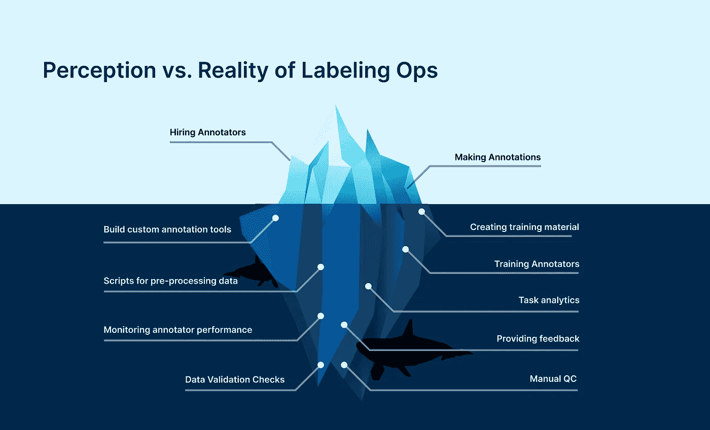
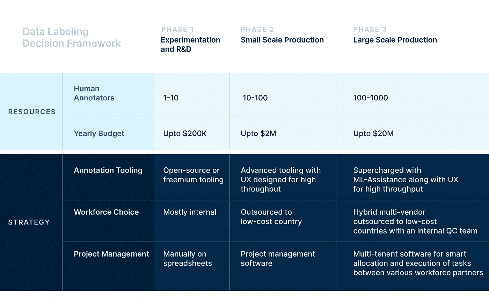

# 数据标注策略的决策框架

> 原文：<https://towardsdatascience.com/decision-framework-for-data-labeling-strategy-1385587b44b8?source=collection_archive---------35----------------------->

## 现实世界中的数据科学

## 打破关于数据标注工作流程和预算的常见误解，提供一个现实的决策框架，将您的数据标注策略从有缺陷变为完美。

[版权所有 Playment 公司]

去年，在 2019 年 CVPR 上，我与特斯拉人工智能高级总监 Andrej Karpathy 进行了一次短暂的会面。在我们的谈话中，我问了他一个相当天真的问题，“Andrej，你如何估计在特定场景下训练和验证自动驾驶汽车所需的标记数据量？”他停顿了一会儿，然后笑着说，“嗯，378 小时的数据。明天再问我吧，我的数字可能会更大方。”接下来的两分钟，我们一直在笑。

今天，众所周知，我们需要大量高质量的标记数据来训练和验证 ML 模型。但在见过数百名人工智能团队领导和多个处于人工智能发展旅程不同阶段的人工智能初创公司 CXO 后，我观察到市场对标记数据的获取有不平衡的理解。

大多数处于人工智能成熟度曲线高端的 ML 团队认为标签数据获取是他们的主要优先事项之一，并理解过程中涉及的不同层次的复杂性。然而，大多数玩家在远端为他们短暂的项目找到了一些变通方法。此外，我还观察到，几乎所有的 ML 公司都经历了一个自我实现的周期，即忽略数据管道的这一方面，最终构建大规模的软件和运营力量来处理他们标记的数据需求。

因此，可以肯定地说，当前人工智能生态系统中的一个大问题是，*“如何经济高效地访问大量多样化和高质量的标记数据？”* ‍

# 数据标注过程固有的过度简化

数据标记操作:感知与现实

首先，将流程过度简化为一个简单的“租用-注释-支付”模型只会为实现自动化目标设置更多的障碍。任何功能性 ML 模型最重要的先决条件是高质量的标记数据。成本妥协只会让你陷入更深的困境。数据标签操作:感知与现实

标签预算通常被认为是每个人工注释者 7 美元的固定成本和所需的注释工时数的乘积。这种方法是完全不正确的，因为他们没有考虑 ML 工程师在设置注释过程中产生的各种隐藏成本。‍

# 数据标注过程中忽略的因素

让我们通过一步一步的过程来理解实际预算是如何超过简单的数学公式的。

**步骤 1:**ML 工程师首先创建指南，清晰地定义注释的类别和每个类别的期望设定点，以训练人类注释者。这一步重复几次，因为现实中，没有人第一次就做对了；指南需要多次迭代。

**第二步:**接下来，他/她需要发现或创建支持其数据格式的注释工具，生成高度精确的像素级注释，并提供可伸缩性以适应其大型数据集。这个评估/开发过程可能需要几天或几周时间。

**步骤 3:** 然后，工程师从第三方那里找到合适数量的有技能的人类注释者，或者雇佣兼职注释者。寻找合适的劳动力需要一个设计良好的试点计划和对多种劳动力的评估，然后是合适劳动力的谈判、签约(与财务和法律团队合作)。

**步骤 4:** 接下来，他/她建立工具基础设施，培训注释者使用工具，并提供注释需求作为任务。他们还创建和管理注释任务的截止日期。此外，他们还定期跟踪注释器的进度。

**第五步:**工程师然后设置工作流、逻辑或脚本来测试输出的准确性，向违约者提供反馈，并重新分配错误的标签以便返工。对每批注释重复此步骤。

**步骤 6:** 间歇地，他们重复上一步，直到标记的数据达到他们期望的精度水平。整个过程耗时耗力。

通常，数据标签预算并不包括每一个步骤的额外成本因素。真正的预算包括 ML 工程师的时间和精力成本，100 美元/小时或以上，加上注释者的成本——两者都比 7 美元/小时高 10 倍。

随着要注释的数据的特殊性、多样性和数量的增加，工具基础设施、劳动力和项目管理的复杂性也在增加。有效管理这些复杂的流程对于实现高质量的产出变得极其重要。

说实话，ML 工程师最好做他们最擅长的事情，而不是纠结于这些操作流程。‍

# 数据标注策略的现实决策框架

数据标记策略的决策框架[Copyright Playment Inc.]

对于这个框架的广泛应用，我使用了人工智能开发周期的三个阶段，以及三个主要的数据标记功能作为决策的基础。除了解释开发周期每个阶段中功能的复杂程度，我还额外提供了大概的预算，以简化决策者的类别评估。

我已经确定了设置过程的复杂性和数据标签所涉及的预算的真实性。现在让我们深入研究这些函数。在[游戏](http://www.playment.io/)中，我们将之前提到的六步流程分为三个重要功能(见上图):

*   注释工具
*   劳动力
*   项目管理

这些功能的复杂程度取决于为注释收集的数据量，以及所需的人工注释者的数量。例如，根据数据量，注释工具可以是 100%手动的，也可以是非常复杂的，带有各种自动验证检查或人工智能辅助，以最大限度地减少错误并确保更快的数据吞吐量。

工作人员可以 100%来自内部或外包，这取决于注释的数据量。当注释器需求超过 1000 个注释器时，您也可以选择多供应商模型。

10 个和 1000 个人类注释者的有效项目管理是非常不同的问题。前者几乎不需要任何东西，但后者需要复杂的软件和分析来训练标注者、分配标注任务、跟踪质量、速度等性能。这与监控装配线非常相似。

基于这个现实的框架，Playment 建立了一套复杂的技术和劳动力解决方案，以帮助小型、中型和大型公司无缝地为他们的数据管道提供燃料，以更快地激活人工智能应用程序。

# 结束语

这个决策框架符合大多数 ML 团队的要求。然而，数据安全性和自动化是在很大程度上影响架构决策的其他重要参数。它给这个原本简单的框架增加了一层额外的复杂性。欢迎在推特[@ Playmentq](https://twitter.com/PlaymentHQ)上给 play ment 发 DM，或者发邮件给我们 [hello@playment.io](http://hello@playment.io/) 讨论同样的问题。

我希望这个框架将有助于行业避免由于普遍的误解而导致的不正确的数据标签架构决策带来的陷阱；帮助 ML 社区以前所未有的速度构建高度精确的 AI 模型。

加速人工智能时代！

*最初发表于 Playment 博客(*[*【https://bit.ly/2Q6iqjm*](https://bit.ly/2Q6iqjm)*)和 LinkedIn(*[*【https://bit.ly/2TM76vj*](https://bit.ly/2TM76vj)*)。*