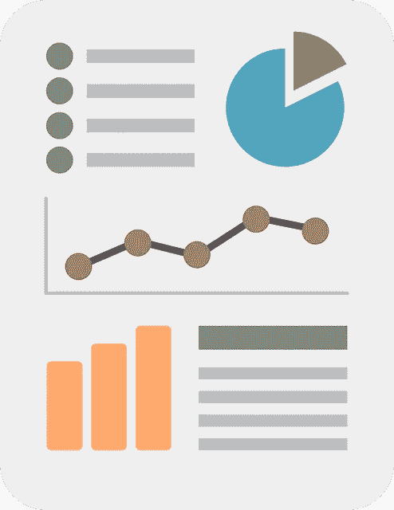

# 挖掘决策智能

> 原文：<https://towardsdatascience.com/decision-intelligence-a-preliminary-summary-2098a9b79b46?source=collection_archive---------58----------------------->

## 数据科学

## 数据科学或如何决定如何决定

图片由 Unbox Science Pixabay 提供

谷歌的 Cassie Kozyrkov 一直在推广决策智能的理念。决策智能(Decision intelligence)这个术语是由 Kozyrkov 创造的，旨在将已知的决策方法、洞察力和最佳实践重新组合到一个公共的保护伞下。这些已知方法和见解的例子有:

*   分析学
*   统计学，频率主义者和贝叶斯
*   机器学习
*   决策科学
*   行为经济学
*   决策的心理学和神经学

上面的列表中有意省略了数据科学。数据科学是一个流行的术语，但没有很好的定义:所有的科学不都是数据科学吗？也许这篇文章是一个实验，看看术语决策智能是否更好地界定了一个连贯的兴趣领域。首先，决策智能的一个核心原则是，目前被称为数据科学的领域有很多都与决策有关；或大或小。一个人如何决定如何决定？这就是这篇文章的范围。

这种新划分的部分结果是，我们所知道的数据科学项目可以通过更精确地了解不同任务和所需角色的结构来更好地执行。

> 有没有决策架构或基础设施这样的东西，它看起来是什么样的？

这篇文章的目的是希望总结一下谷歌的 Kozyrkov 在不同博客和媒体上发布的大部分决策情报内容。总之，这是初步的，因为尽管它基于大量的博客文章，但它并不打算包含所有的内容。也不清楚是否所有信息都在网上公布。在这篇文章中，我将有目的地推动术语“决策智能”，作为一个实验，但也可以随意阅读“数据科学”。

# 这篇文章的概述

为了您的方便，这里列出了这篇文章中包含的部分和主题:

*   决策:从零到少到多
*   分析学
*   基于频率统计的假设检验
*   贝叶斯统计的一个例子
*   比较:分析、频率主义者和贝叶斯统计
*   机器学习
*   论可解释性、检验和偏见
*   做应用是可以的
*   决策智能过程
*   决策智能团队和决策者
*   一些附加的想法
*   最后的想法

# 决策:从零到少到多

游戏的名字是做出更明智的决定。在本节中，将介绍决策制定的初始分类，这将在下面的部分中详细阐述。

决策智能的一个中心思想是人们可以面对以下场景:

*   人们希望做出大规模的决策，大量的决策
*   人们希望做出一些具体的决定
*   一个人还没有准备好做决定，因为他缺乏洞察力

让我们从大规模决策开始。

机器学习符合这个法案。想估价几百万的房子？想把几十亿条推推荐给几百万人？想要给数十亿张照片添加标题吗？当前的信息革命在很大程度上是关于数据和决策的扩展，超出了以前的想象。在这场规模革命之前，决策的制定，更多的是在少数人的规模上，是统计学的领域，无论是频率主义者还是贝叶斯主义者。

统计有助于管理而不是消除基于人口样本数据而非全部人口信息做出决策所带来的不确定性。使用统计数据做出数百万个决策不符合该框架，需要使用例如 Bonferroni 校正来校正重复测试。但这有其局限性。更具体地说，对于频率主义者的方法，人们应该提出一个由零假设表示的默认行为过程。有规则要遵守，稍后会有更多。

最后，但同样重要的是，有时一个人只是还没有准备好如何思考手头的决定:需要的是灵感。在这种情况下，分析可以也应该有所帮助。

为了使这种分类更具实质性，我们将在接下来的章节中详细阐述这三个感兴趣的领域。

# 分析学

分析就是分析手头的数据，或多或少地忘记数据集之外的世界。一个优秀的分析师可以快速剖析数据集，并从数据中选择感兴趣的模式。分析是关于产生想法或产生更好的问题。统计学家可以在当前数据集之外使用另一个数据集提取其中一些问题进行归纳。在某些特定情况下，分析也足以推动决策，下一个例子将对此进行说明。

让我们假设一个人可以以相同的价格购买一批蓝色 t 恤或一批红色 t 恤在当地的集市上出售，但不能两批都买。没有既定的偏好，或默认的行动，一个随机询问周围的颜色偏好，以确定哪一批是更好的选择。如果在颜色上有任何多数票，那么在没有应用统计数据的情况下，采用多数票是可以的。为什么？因为你没有偏好，没有数学或统计学会让多数人的结果偏向少数人的结果。票数的差异可能毫无意义，但多数票仍然是最安全的赌注。

请注意，本例中没有任何政治信息，只是需要注意样品的采集地点与 t 恤的销售地点之间的关系。数学不会改变少数人投票的决定，但样本偏差的概念可以:但这不是一个数学问题。

使用假设检验来做决定。

# 基于频率统计的假设检验

在前面的示例中，没有默认操作。在很多情况下，有一个默认动作；这种默认操作通常是保持现状。无论是信任明智、相信明智还是投资明智，这种默认行为都有一定分量。(还有更多技术上的原因，后面会详细介绍。例如，一个人可能想知道一种特定的治疗是否值得。简而言之，在这种情况下，假设检验有助于在对人口样本进行处理后，形成关于人口参数的信念，即某种条件的存在与否。让我们更详细地阐述一下。

如果评估治疗，因果关系是很重要的。通常人们会使用随机试验，将人群样本分为治疗组和对照组。如果做得正确，这个实验包括一个要被证伪的零假设和另一个假设。在将治疗应用于对照组之后，基于两组的结果以及在它们之间发现的可能差异，可以计算出臭名昭著的 p 值或概率值。p 值是如果零假设为真，即如果没有影响，计算出的差异发生的概率。如果这个概率非常小，那么零假设被拒绝，取而代之的是另一个假设。

这个例子的目的不是深入假设检验的哲学细节，而是为了说明假设检验过程是为一个非常具体的目的而设计的。重复测试程序可能会产生类似的结果；强调客观事实和可重复性。该框架旨在用于必须做出少量明确决策的情况。增加决策的数量会遇到一些问题，这些问题只能在一定程度上得到解决。

如果决策不太明确，或者更复杂，贝叶斯统计可以提供一个很好的选择。虽然我在决策智能的上下文中没有看到很多关于贝叶斯统计的内容，但是由 Douglas Hubbard 定义的应用信息经济学(AIE)的框架可以提供一个很好的例子，作为与频繁主义统计的对比。

# 贝叶斯统计的一个例子

复杂的决策可能需要大量信息。这些信息有些可能就在手边，但有些可能没有。更一般地说，仅使用频率假设检验来制定复杂的决策可能被证明是不可克服的。不可能总是以严格的方式测试所有的东西。有时，预先的信念或专业知识是决策过程的一部分。贝叶斯统计允许你这样做。虽然先验信念的概念听起来可能模糊，但贝叶斯统计可能非常强大，因为人们可以使用观察来更新信念。希望下面的例子能让我们感受一下它的工作方式。请注意，这个贝叶斯统计的例子是有目的地偏向于一个应用的业务设置，并且非常平凡。

假设有人对建立一个系统感兴趣，任何系统。建立这个系统需要完成 1500 个单独的任务。先前的看法是，完成一项随机任务的小时数的 90%置信区间在 15 分钟到 7 小时之间。此外，先前的看法是，一小时工作的市场价格在 19.50 美元和 47.50 美元之间。使用这些信念，并假设两个信念的正态分布，可以通过运行蒙特卡罗模拟来计算系统人工成本超过 10.000 美元的概率。怎么会？人们可以从任务分布中抽取 1500 个样本，然后将每个样本乘以从小时率分布中抽取的样本，从而得到一个“实现”。通过多次重复这些步骤，可以创建人工成本的模拟概率分布；这种分布有助于推断可能的结果。

这种模拟之所以成为可能，是因为接受先验信念作为起点，这是贝叶斯统计的核心原则。尽管这个例子非常简单，但是这个框架允许复杂性扩展。为了表明我们没有践踏现实、观察和统计，我将进一步阐述 AIE 框架。在 AIE 框架内，提出了以下有科学证据支持的概念:

*   在一些训练之后，大多数人可以被训练来提供精确的/校准的概率或置信区间估计。
*   估计，虽然是一个很好的起点，但很容易受情绪和环境的影响。
*   估计中的任何不确定性都可以通过用样本观测值更新先验信念来减少。先验分布被转换成后验分布，其中证据被考虑在内。
*   减少分布不确定性所需的样本量小于预期；通常 5 到 100 个样本就能创造奇迹。
*   在不确定性最高的地方，观察的影响最大。
*   给定一些模型结果，就有可能评估添加额外信息的价值——表明哪些成本是合理的。
*   复杂决策的模块化使决策更可靠、更准确。
*   目标不一定是尽善尽美，而是击败当前的决策方法(通常只是专家建议)。

AIE 框架允许以显著的方式模块化和管理复杂的决策及其相关信息；这一切都有统计数据支持，尽管这个过程开始时可能只是一个思想实验。

是时候回顾和比较一下了。

# 比较:分析、频率主义者和贝叶斯统计

在前面的三个部分中，说明了三种不同决策框架的优点和缺点。在本节中，将讨论一些比较和对立，以增加更多的深度。

分析和频率统计通常共享共同的术语和计算，如均值、方差和 p 值。尽管如此，框架的目标是不同的，这可能会导致混乱。分析师可能会观察到一些统计数据中的差异，并获得 p 值。这个 p 值是什么意思？根据统计学家的说法，什么都没有。p 值属于假设检验的范畴，假设检验需要遵循一个明确定义的过程。统计学家可能就在这里。任何科学家获得一个数据集，把这个数据集翻个底朝天，获得一些统计数据的 p 值，然后声称已经验证了一个假设，都有可能丢掉工作。

人们不使用数据集作为灵感，然后使用相同的数据集进行假设检验。虽然拆分数据通常是可取的，但也只能起到这么大的作用。证明因果关系的受控实验设置如何？还是因果不相关？还是混淆了相关性？假设检验是否设置了显著性水平，该水平是如何设置的？是否针对测试的功效进行了调整？在用一组数据来检验一个假设之前，有许多问题需要回答。分析更多的是在过程的“商业”方面，可以提供有价值的见解，可以作为灵感；但是不要把它弄得乱七八糟。

另一方面，频繁假设检验的所有严格性都有其局限性。如果面对涉及大量信息的复杂决策，频率主义者的统计可能会有所欠缺。纯粹的数学严谨性并不是对所有情况都适用的。贝叶斯统计允许通过使用和验证关于当前问题的先验信念来调整决策。它允许分析哪些地方需要更多的信息或最有影响力，以及何时获取的成本与收益相称。任何数据计数都是有用的，在这种情况下，重要性不是关键问题。

在这个例子中，频率主义者和贝叶斯统计都专注于以严格的方式做出少量的决策。那么大规模决策怎么样，也就是机器学习？或者通俗点说就是 AI。

# 机器学习

人工智能这个术语是在上个世纪 50 年代引入的。从那以后，这个术语涵盖了许多方法。目前，它通常指的是机器学习，但肯定有更多的方法可以满足这一要求，并且在过去已经得到了应用。

科兹尔科夫把机器学习贴上标签，就是给事物贴标签。标签可以是各种各样的:猫、狗、数字、操纵杆运动。后一个例子表明，强化学习在机器学习下是错误的。如前所述，机器学习是大规模标注的首选工具。出于这个原因，机器学习可以更加软件密集型。这可能是对机器学习在计算机科学的羽翼下发展壮大这一事实的解释。

机器学习的主要考虑因素是偏差和方差。通过训练、验证和测试数据的概念来控制这些类型的错误。(或使用其变体。)从用户的角度来看，统计分布不太受关注。尽管在模型的优化和训练、验证和测试数据共享一个公共分布的假设中，这些仍然是相关的。

在机器学习中，非常强调模型性能。对于像预测性维护这样的纯技术应用，这并不奇怪，也没有理由担心。当涉及到对人类或其他动物做出决定时，道德问题很快就会出现。

# 论可解释性、检验和偏见

准确的说，算法永远不会有偏差，但数据可以。因此，使用这些算法和数据的模型的结果也可能有偏差。这是一个真正的问题。机器学习使得衡量决策变得非常容易。这也使得人们很容易犯大规模的错误。如果这些错误系统性地让大量人群处于不利地位，因为这个系统反映了最终创造者有时无意识的价值观，那么道德就岌岌可危，伦理讨论需要加入争论。但是让我们先来看一个关于偏见的小例子。

想象一下，一个系统可以识别技术人才的机器学习职位，为了做到这一点，系统会扫描简历并给简历打分。众所周知，区号可以作为许多隐藏变量的代理。随着学校教育变得越来越隔离，不难想象学校名称也会以同样的方式运作。让一个高级的 NLP 系统基本充当斯坦福、伯克利或者麻省理工的扫描仪有用吗？向一个已经缺乏多样性的行业添加更多相似的简介？在过程中的某一点上，模型的目标将必须被转换或形式化为一个函数，即可以被优化的目标函数。这种形式化和选择的数据一起引入了假设和无意识的偏见。最后一点，简历扫描仪不就是为了显示偏见而设计的吗？你必须知道你在做什么。

在欧洲，根据 GDPR，人们有权知道自动决策是如何计算出来的。至少可以说，在这个意义上，不是所有的模型都是透明的。而且很多根本不透明。如果条件不够完美，即使是简单的线性回归模型也会带来挑战。正是在这种背景下，SHAP 或石灰等方法被创造出来。这些方法旨在深入了解哪些特性对决策影响最大。这很有帮助。问题是这些方法提供了对底层算法的局部近似。这种解释可能是粗略的，或者不是普遍适用的。这引出了一个有趣的问题。

机器学习的全部意义在于，模型的工作太复杂，用手工编程太难。编程包括数据和规则输入和输出。机器学习由数据和答案组成，包括输入和排除。试图使规则透明化或多或少会违背初衷。如果这是可能的，那么人们应该对系统的规则进行编程。这并不意味着情况没有希望。另一种方法是严格测试模型的偏差。尽管测试一个模型可能无法捕捉到每一种形式的偏差，但它至少可以使它与一个可比较的过程一样公平。

如果到目前为止，所有的信息都让您有些眼花缭乱，那么没关系。整合所有不同的关注点并应用正确的方法是非常重要的，这是下一节的主题。

# 做应用是可以的

不同决策框架的实际应用，及其所有的含义，是相当复杂的。当它涉及机器学习时，还有繁重的工作、正常运行时间、监控、概念漂移，以及你在玩什么。突出所有的细节可能会很容易地填满课程中的一些学期，或者可能需要多个角色才能成功完成。这才是重点。

不一定要成为决策智能相关领域的科研人员。几乎相反，有足够的知识和考虑使应用决策智能成为一个专业。如何收集一些商业智慧？或者确切地了解决策智能在流程中的哪一点最有效？很容易融入更多的管理科学、行为经济学或心理学。

与此同时，科学目前在没有决策智能的情况下也做得很好。整个科学界已经想出了回答问题的方法。每个研究领域都有自己的一套公认的方法，旨在推动各自领域的决策。精算师、后勤学、心理测量学、生物学、流行病学，名单还在继续。这些领域中的许多方法是重叠的，但是每个领域中也有不同的方法。这些方法是为了应对这些领域中的特定挑战而开发的，并且在某种程度上与这些科学领域的背景相关联。决策智能是如何界定的，或者如何划定界限，这一点并不十分清楚。

# 决策智能过程

‘设计时要考虑到目的’，这个规则也适用于数据产品的设计；不是一切都变了。准确地指出数据产品的结果应该是什么，以及它如何准确地适应当前的过程，可以避免许多痛苦。弄清楚这一点后，我们可以看看可用的数据、算法，最后是要部署的合适模型。但是还有更多。

为产品设定性能标准怎么样？没有任何表演会。也许应用一些假设检验来确保这些标准得到满足？费用怎么样？知道了数据产品在过程中的位置和方式，人们应该能够估计其应用的好处。但是既然盈利是游戏，那么应该应用什么倍数来比较成本和收益呢？

目的是“让数据变得有用”。让我们把它分成三个不同的部分:

*   make——决策智能过程旨在创造事物及其编码。虽然编码的最终结果很重要，但代码和/或框架(如 Tensorflow、sklearn 或 pandas)并不重要。
*   数据—如果处理数据，需要考虑分析和统计领域的一些方法方面。
*   有用—缩小一点，使数据有用需要设计适合业务的正确产品。这包括首先为什么这个模型如此伟大，产品背后的假设和价值是什么？

决定，决定，决定。这一切的决策者是谁？这就出现了一个问题，是选择独角兽数据科学家，还是创建数据产品的混合团队。让我们重温一下角色的话题。

# 决策智能团队和决策者

一个普遍的观点是，管理数据产品比管理大多数常规 IT 项目更难。数据科学工具和端到端平台的市场正在增长。在机器学习的情况下，很容易涉及相同数量的软件。除此之外，还有数据来源、模型验证和监控、模型偏差、数据标签等等。尽管如此，无所不能的数据科学家仍然很受欢迎。会不会是新兴的端到端平台能够将所有的复杂性缩减为独角戏？

端到端平台无疑提供了便利。不太引人注目的是，即使考虑到这些平台，仍然需要多样化的技能组合。在本节中，将列出一个可能角色的折衷列表。很少有人会雇佣所有这些角色，但是知道哪些角色被遗漏了是很好的:

*   领域专家
*   产品经理或产品所有者
*   DevOps 和现场可靠性工程师
*   数据科学家
*   数据工程师
*   隐私专家/律师
*   伦理学家，律师
*   统计员
*   机器学习工程师

这是可能的角色的简短列表。这个列表有点重软件，这个团队可能涉及机器学习。这通常是大规模的。规模越大，责任越大。因此，虽然机器学习项目可以在小范围内执行，但扩大规模意味着增加责任。是的，数据科学家可以将模型部署到 SageMaker，但这通常不是目标，对吗？随着规模的变化，项目的性质也逐渐发生变化。这就是为什么其中一个角色被遗漏了，即决策者(决策科学术语)或数据科学领导者的角色。

在这篇文章中，数据智能项目中的问题越来越多。有人可能会说所有这些思考和细微差别都不是敏捷的。但是把敏捷和无知混为一谈只是明显的傲慢。GDPR 不是开玩笑的。拥有一个了解数据智能项目的机会和陷阱的应用专家迟早会变得非常方便。

是时候结束这一切了。

# 最后的想法

决策智能是关于重组当前的决策环境。虽然强调应用，但如果不理解理论和决策方法的深层机制，就不可能正确执行。这个问题既有实践的一面，也有理论的一面。如果更多的人对这些方法有一个更好的、更全面的和更深刻的理解，这将肯定有助于执行决策类型的项目。

属于决策智能的方法来自不同的研究领域，并且经常重叠。一些重复数据删除和清理肯定是有价值的。认识到决策制定中的共同模式，也许可以更好地将决策形式化，并通过这样做提高所有人的标准。

但是决策智能有明显的元特征。大多数决策方法都是达到目的的手段。方法经常被开发出来，因为特别需要一种新的看待事物的方式。这种需求是由经济学、生物学、物理学或工程学等领域驱动的。离开发明这些方法的背景，并不是所有的方法都有意义。决策方法本身并不是发明出来的:什么将推动决策智能领域的创新？决策智能提供了很好的起点，但是它是如何有界的呢？

话虽如此。我非常喜欢 Kozyrkov 的许多博客帖子以及这些帖子提供的宝贵见解。希望这篇文章能激发你的决策能力。