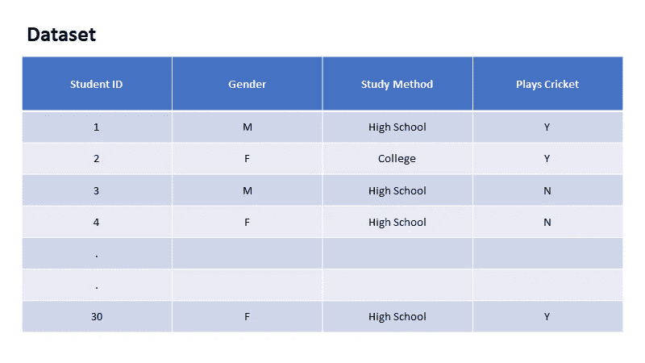
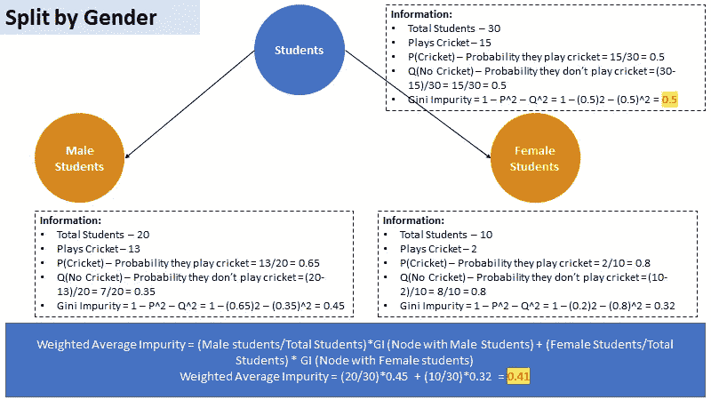
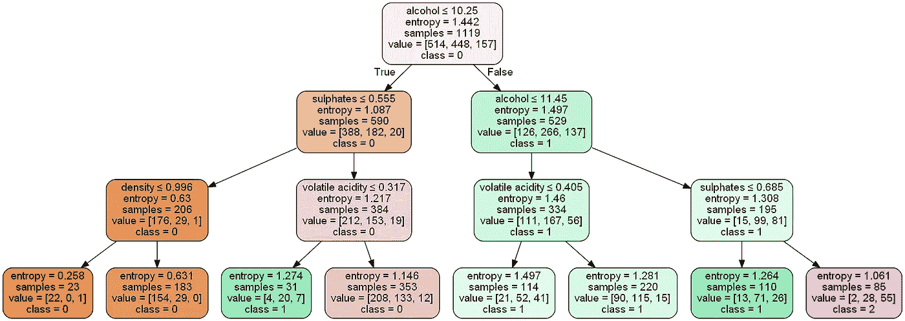
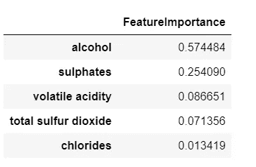
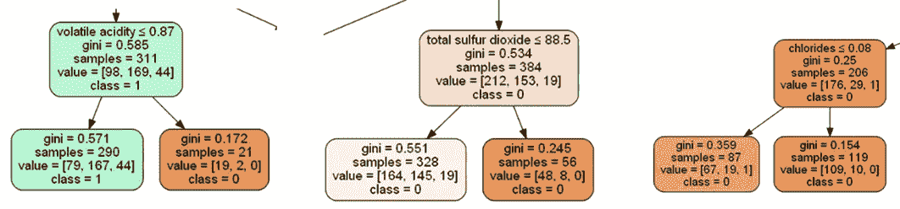
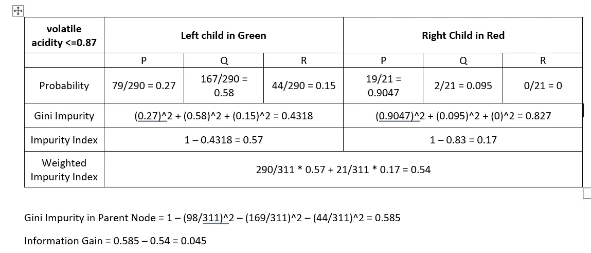
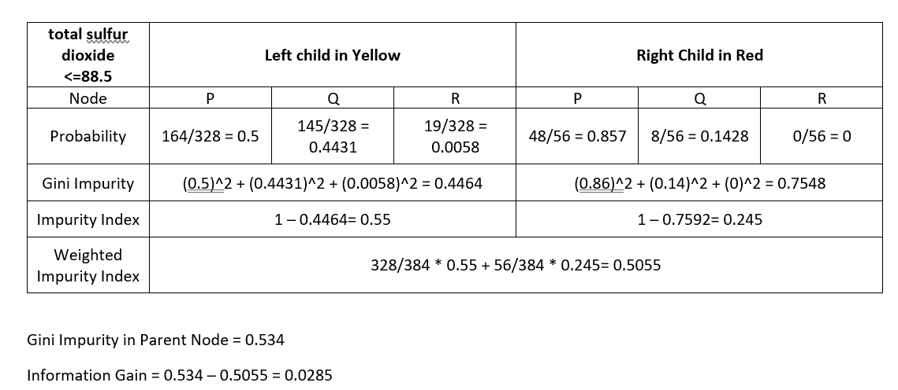

# 用 Python 实现多类问题的决策树算法

> 原文：<https://towardsdatascience.com/decision-tree-algorithm-for-multiclass-problems-using-python-6b0ec1183bf5?source=collection_archive---------2----------------------->

## 理解基尼指数、熵、信息增益、特征重要性和 CCP 阈值的数学


[法托斯 Bytyqi](https://unsplash.com/@fatosi?utm_source=medium&utm_medium=referral) 在 [Unsplash](https://unsplash.com?utm_source=medium&utm_medium=referral) 上的照片

# 介绍

决策树分类器是监督学习模型，在我们关心可解释性时非常有用。想象一下，通过在每一层基于多个问题做出决策来分解数据。决策树面临的最大挑战是理解后端算法，利用该算法，一棵树可以扩展为分支和子分支。在本文中，我们将更广泛地研究如何使用不同的杂质指标来确定每个节点的决策变量，如何确定重要的特征，更重要的是如何修剪树以防止模型过度拟合。要更好地理解决策树的工作原理，您可以参考下面的链接。

[](/decision-tree-classifier-and-cost-computation-pruning-using-python-b93a0985ea77) [## 使用 Python 实现决策树分类器和成本计算剪枝

### 使用成本计算修剪构建、可视化和微调决策树的完整实践指南…

towardsdatascience.com](/decision-tree-classifier-and-cost-computation-pruning-using-python-b93a0985ea77) 

# 概观

决策树由节点和分支组成。节点可以进一步分为根节点(树的起始节点)、决策节点(根据条件拆分的子节点)和叶节点(不会进一步分支的节点)。由于决策树遵循 if-else 结构，每个节点使用一个且仅一个自变量来分成两个或多个分支。自变量可以是分类的，也可以是连续的。对于分类变量，类别用于决定节点的分裂，对于连续变量，算法得出多个阈值作为决策者(Raschka，Julian and Hearty，2016 年，第 83、88、89 页)。

假设我们正试图为下面的数据集开发一个决策树。该数据集由学生 id、他们的性别信息、他们的学习方法和一个标识他们是否打板球的属性组成。我们可以区分预测变量和因变量与自变量或属性。因变量是“Plays Cricket”列，除了“Student ID”之外的其他属性将形成自变量集。

假设我们正试图为下面图 1 所示的数据集开发一个决策树。该数据集由学生 id、他们的性别信息、他们的学习方法和一个标识他们是否打板球的属性组成。我们可以区分预测变量和因变量与自变量或属性。因变量是“Plays Cricket”列，除了“Student ID”之外的其他属性将形成自变量集。



图一。包含学生信息和必要属性的表的快速概述。参考—由作者使用 PowerPoint 开发

# 决定分裂

作为这个问题的第一步，我们需要确定哪个独立变量可以用来分割根节点。我们用基尼杂质来决定学生在板球运动员和非板球运动员中的分支。我们将使用“性别”和“研究方法”来计算基尼系数，并考虑杂质分数最低的那个。请注意，决策树算法试图使每个节点尽可能同质。这与我们试图达到的结果是一致的，正确地预测学生是板球运动员还是非板球运动员。同质性是一种情况，在这种情况下，特定节点中的所有学生都属于其中一个类别，即他们要么是板球运动员(玩板球= Y)，要么是非板球运动员(玩板球= N)。



图二。使用基尼指数和“性别”作为独立变量计算的加权平均杂质。参考—由作者使用 PowerPoint 开发


图 3。使用基尼指数和“研究方法”作为独立变量计算的加权平均杂质。参考—由作者使用 PowerPoint 开发

由于杂质是衡量节点同质性的指标，算法选择加权平均杂质分数最低的独立变量作为根节点的决策变量，在这种情况下，“性别”将用于创建决策树的第一次拆分。另外，请注意用黄色突出显示的数字，它们用于计算分割的信息增益。信息增益可以定义为杂质从父节点到各自子节点的变化，在这种情况下，我们需要检查根节点中的杂质是否高于分裂的加权杂质。如果信息增益大于 0，算法将继续使用决策变量分割节点。

# 我们如何修剪上面的树？

决策树通常会继续形成分支，直到每个节点变得同质。因此，该树可以很好地处理训练数据，但无法为测试数据生成高质量的输出。因此，这棵树应该修剪，以防止过度拟合。从上面的例子中，我们可以使用下面列出的因素来微调决策树。

1.  标准 Python 使用基尼系数和熵。其他算法使用 CHAID(卡方自动交互检测器)、遗漏分类错误等。
2.  从根节点/父节点到子节点，信息增益或最小杂质减少
3.  每个节点中的样本数(最小或最大)
4.  树的深度(算法应该形成多少个分支)
5.  最大叶片数

# 使用 Python 的现实问题

## 了解基尼指数

问题陈述旨在开发一个分类模型来预测红酒的质量。关于问题陈述的细节可以在[这里](https://www.kaggle.com/uciml/red-wine-quality-cortez-et-al-2009)找到。这是一个多类分类问题的经典例子。我们不会研究代码，而是尝试使用 Python 中 sklearn.tree 的 DecisionTreeClassifier()来解释输出。

以下代码片段参考:Das，A. (2020)。*使用 Python 的决策树分类器和代价计算剪枝*。【在线】中等。可在:[https://towards data science . com/decision-tree-classifier-and-cost-computing-pruning-using-python-b93a 0985 ea 77](/decision-tree-classifier-and-cost-computation-pruning-using-python-b93a0985ea77)获得

```
#Reading the data
wine_df = pd.read_csv('winequality-red.csv',sep=';')# splitting data into training and test set for independent attributesfrom sklearn.model_selection import train_test_splitX_train, X_test, y_train, y_test =train_test_split(wine_df.drop('quality',axis=1), wine_df['quality'], test_size=.3,
                                                   random_state=22)
X_train.shape,X_test.shape#developing a model
clf_pruned = DecisionTreeClassifier(criterion = "gini", random_state = 100,
                               max_depth=3, min_samples_leaf=5)
clf_pruned.fit(X_train, y_train)#visualizing the tree
import iofrom io import StringIOfrom sklearn.tree import export_graphviz
# from sklearn.externals.six import StringIO  
from IPython.display import Image  
import pydotplus
import graphvizxvar = wine_df.drop('quality', axis=1)
feature_cols = xvar.columnsdot_data = StringIO()
export_graphviz(clf_pruned, out_file=dot_data,  
                filled=True, rounded=True,
                special_characters=True,feature_names = feature_cols,class_names=['0','1','2'])from pydot import graph_from_dot_data
(graph, ) = graph_from_dot_data(dot_data.getvalue())
Image(graph.create_png())
```


图 4。使用基尼指数的决策树，深度=3，max_samples_leaves=5。请注意，为了处理等级不平衡，我们将葡萄酒分为品质 5、6 和 7。在上图中，5 对应于 class=0，6 对应于 class=1，7 对应于 class=2。

当我们看到一个多类算法时，我们不要对如何计算基尼指数感到困惑。在之前的例子中，我们用 P 和 Q 来代表打板球的学生和不打板球的学生。其中 P 是打板球的概率，Q 是不打板球的概率。在多类决策树的情况下，对于节点酒精< =0.25，我们将执行以下计算。

*   p 代表葡萄酒质量为 5 的概率，即(514/1119) = 0.46
*   q 代表葡萄酒质量为 6 的概率，即(448/1119) = 0.40
*   r 代表葡萄酒质量为 7 的概率，即(157/1119) = 0.14
*   基尼指数= P+Q+R =(0.46)+(0.40)+(0.14)= 0.39
*   基尼系数= 1–0.39 = 0.61(见匹配)

上面的树被修剪了，这样我们可以更好地可视化模型。使用深度 3 或最大样本叶作为 5 没有统计学意义。

不使用 criterion = "gini ",我们总是可以使用 criterion= "entropy "来获得上面的树形图。熵的计算方法是-P*log(P)-Q*log(Q)。



图 5。使用熵的决策树，深度=3，max_samples_leaves=5。请注意，为了处理等级不平衡，我们将葡萄酒分为品质 5、6 和 7。在上图中，5 对应于 class=0，6 对应于 class=1，7 对应于 class=2。

## 了解功能重要性

特征重要性指的是为预测模型的输入特征分配分数的一类技术，该技术指示在进行预测时每个特征的相对重要性(Das，2020)。

```
## Calculating feature importancefeat_importance = clf_pruned.tree_.compute_feature_importances(normalize=False)feat_imp_dict = dict(zip(feature_cols, clf_pruned.feature_importances_))
feat_imp = pd.DataFrame.from_dict(feat_imp_dict, orient='index')
feat_imp.rename(columns = {0:'FeatureImportance'}, inplace = True)
feat_imp.sort_values(by=['FeatureImportance'], ascending=False).head()
```



图 6。自变量的特征重要性。

让我们试着理解下面的内容，以便更好地了解特性的重要性是如何决定的。

1.  第一次分裂是基于酒精<=10.25; This variable with this threshold ensures minimum impurity of all other variables hence in the above table (Figure 5) you see that the feature importance is high
2.  The next split is based on sulphates
3.  When we look at the third level of the split, we see that there are three contenders, chlorides <=0.08, total sulfur dioxide <=88.5, volatile acidity <=0.87.

To decide which independent variable is important we need to understand the information gain by splitting these parent nodes into their respective child nodes.



Figure 7\. Variables used to decide the split when depth =3.



Figure 8\. Information Gain using volatile acidity≤0.87 as the threshold.



Figure 9\. Information Gain using total sulfur dioxide≤88.5 as the threshold.

So, we see that the information gain by splitting Node “volatile acidity <=0.87” is higher than by splitting “total sulfur dioxide <=88.5” hence in the importance table “volatile acidity <=0.87” is placed above “total sulfur dioxide <=88.5”.

## Understanding cost complexity

The cost complexity refers to the complexity parameter that is used to define the cost complexity measure Ra(T) of a given tree T. Ra(T) is written as:

Ra(T) = R(T) + a|T|

where |T| is the number of terminal nodes, R(T) is the total misclassification rate of the terminal node, and a is the CCP parameter. To summarise, the subtree with the highest cost complexity that is smaller than 【 will be retained. It is always good to select a CCP parameter that produces the highest test accuracy (Scikit Learn, n.d.).


Figure 10\. Variation in train and test accuracy for different levels of alpha/a/CCP value.

# Reference

1.  Raschka, S., Julian, D. and Hearty, J. (2016). *Python:对机器学习的更深入的见解:利用使用 Python 的机器学习技术的好处:三个模块的课程*。英国伯明翰:Packt 出版公司，第 83、88、89 页。
2.  ‌[sci kit-learn:python 中的机器学习](http://jmlr.csail.mit.edu/papers/v12/pedregosa11a.html)，Pedregosa *等人*，JMLR 12，第 2825–2830 页，2011 年。
3.  Scikit Learn (2019)。*sk learn . tree . decision tree classifier—sci kit-learn 0 . 22 . 1 文档*。[在线]Scikit-learn.org。可从以下网址获得:[https://sci kit-learn . org/stable/modules/generated/sk learn . tree . decision tree classifier . html](https://scikit-learn.org/stable/modules/generated/sklearn.tree.DecisionTreeClassifier.html.)
4.  Scikit Learn(未注明)。*后剪枝决策树与代价复杂度剪枝*。【在线】可在:[https://sci kit-learn . org/stable/auto _ examples/tree/plot _ cost _ complexity _ pruning . html # sphx-glr-auto-examples-tree-plot-cost-complexity-pruning-py。](https://scikit-learn.org/stable/auto_examples/tree/plot_cost_complexity_pruning.html#sphx-glr-auto-examples-tree-plot-cost-complexity-pruning-py.)
5.  Das，A. (2020)。*使用 Python 的决策树分类器和成本计算修剪*。【在线】中等。可从以下网址获得:[https://towards data science . com/decision-tree-classifier-and-cost-computing-pruning-using-python-b93a 0985 ea 77](/decision-tree-classifier-and-cost-computation-pruning-using-python-b93a0985ea77)【2020 年 7 月 18 日获取】。

*关于作者:高级分析专家和管理顾问，帮助公司通过对组织数据的业务、技术和数学的组合找到各种问题的解决方案。一个数据科学爱好者，在这里分享、学习、贡献；你可以和我在* [*上联系*](https://www.linkedin.com/in/angel-das-9532bb12a/) *和* [*上推特*](https://twitter.com/dasangel07_andy)*；*