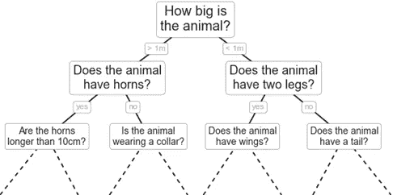
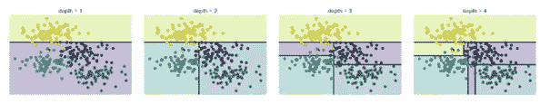
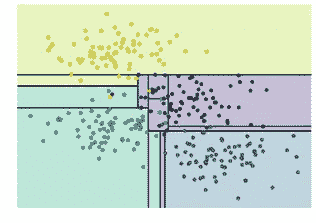
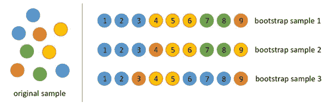
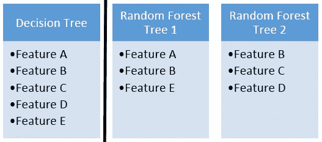
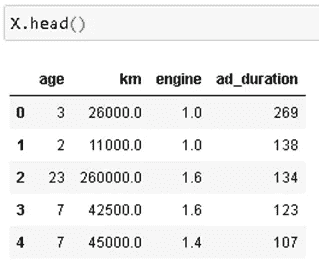
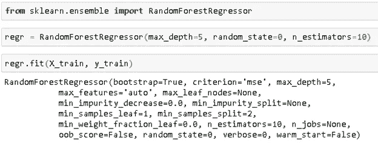
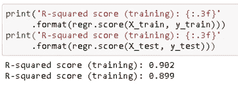
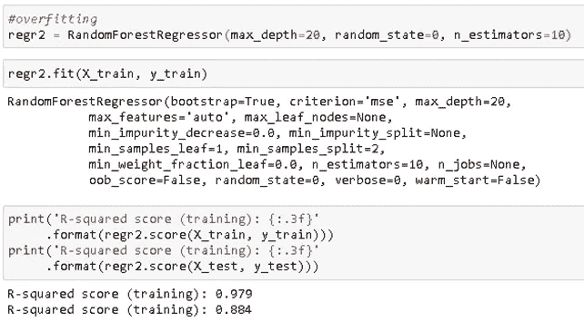

# 决策树和随机森林—解释

> 原文：<https://towardsdatascience.com/decision-tree-and-random-forest-explained-8d20ddabc9dd?source=collection_archive---------2----------------------->

## 详细的理论解释和代码示例

决策树和随机森林是用于分类和回归问题的监督学习算法。这两种算法最好放在一起解释，因为随机森林是一堆决策树的组合。当然，在创建和组合决策树时，需要考虑某些动态和参数。在这篇文章中，我将解释决策树和随机森林是如何工作的，以及使用这些模型时需要考虑的关键点。

决策树建立在反复询问问题以划分数据的基础上。用决策树的可视化表示来概念化分区数据更容易:

[图源](https://jakevdp.github.io/PythonDataScienceHandbook/05.08-random-forests.html)

这是给动物分类的决策树。第一次分割是基于动物的大小。虽然问题看起来是“动物有多大？”，以“动物大于 1m 吗？”因为我们想在每一步把数据点分成两组。随着树越来越深，问题也越来越具体。

你在每一步问什么是最关键的部分，并极大地影响决策树的性能。例如，假设数据集的“要素 A”范围为 0 到 100，但大多数值都在 90 以上。在这种情况下，首先要问的问题是“特征 A 大于 90 吗？”。问“特性 A 大于 50 吗？”是没有意义的因为它不会给我们太多关于数据集的信息。

我们的目标是在每次分区时尽可能增加模型的预测性，以便模型不断获得关于数据集的信息。随机分割要素通常不会给我们提供关于数据集的有价值的信息。增加节点纯度的分割更能提供信息。节点的纯度与该节点中不同类的分布成反比。要问的问题是以增加纯度或减少杂质的方式选择的。

有两种方法来衡量一个分裂的质量:**基尼系数**和**熵。**它们主要测量杂质，并给出相似的结果。Scikit-learn 默认使用基尼指数，但您可以使用**标准**参数将其更改为熵。

**基尼杂质**

正如在[维基百科](https://en.wikipedia.org/wiki/Decision_tree_learning)上所述，“基尼杂质是一种衡量从集合中随机选择的元素被错误标记的频率，如果它是根据标签在子集中的分布随机标记的话”。基本上就是杂质随着随机性增加。例如，假设我们有一个盒子，里面有十个球。如果所有的球都是同样的颜色，我们就没有随机性，杂质为零。然而，如果我们有 5 个蓝色球和 5 个红色球，杂质是 1。

**熵和信息增益**

**熵**是不确定性或随机性的度量。一个变量的随机性越大，熵就越大。均匀分布的变量具有最高的熵。例如，掷一个公平的骰子有 6 个概率相等的可能结果，所以它有均匀的分布和高熵。

熵 vs 随机性

选择导致更纯节点的分裂。所有这些都表明“信息增益”，这基本上是分裂前后熵的差异。

当选择一个特征进行分割时，决策树算法试图实现

*   更多的预测
*   杂质少
*   低熵

现在我们已经了解了问题(或拆分)是如何选择的。下一个话题是题数。我们要问多少问题？我们什么时候停止？什么时候我们的树足以解决我们的分类问题？所有这些问题的答案将我们引向机器学习最重要的概念之一:**过拟合**。模型可以一直提问，直到所有节点都是纯的。纯节点只包括来自一个类的数据点。

模型可以一直提问(或者拆分数据)，直到所有的叶子节点都是纯的。然而，这将是一个过于具体的模型，不能很好地概括。它在训练集上实现了高精度，但在新的、以前看不到的数据点上表现不佳。

正如你在下面的可视化中看到的，在深度 5，模型明显过度拟合。类之间的狭窄区域可能是由异常值或噪声造成的。

深度= 5 ( [图源](https://jakevdp.github.io/PythonDataScienceHandbook/05.08-random-forests.html))

控制或限制树的深度以防止过度拟合是非常重要的。Scikit-learn 提供超参数来控制决策树的结构:

**max_depth:** 一棵树的最大深度。树的深度从 0 开始(即根节点上的深度为零)。如果未指定，模型会一直分割，直到所有叶子都是纯的，或者直到所有叶子包含的样本数少于 min_samples_split。

**min_samples_split:** 拆分内部节点所需的最小样本数。只要一个节点的样本(数据点)多于 min_samples_split 参数指定的数量，该算法就会一直拆分节点。

**最小杂质减少:**进行拆分的目的是减少杂质(或不确定性)，但并不是所有的拆分都能同样达到这个目的。此参数设置进行分割的阈值。如果这种分裂导致杂质的减少大于或等于阈值，则节点将被分裂。

这里可以看到 DecisionTreeClassifier() [的所有超参数列表。](https://scikit-learn.org/stable/modules/generated/sklearn.tree.DecisionTreeClassifier.html)

# **随机森林**

随机森林是许多决策树的集合。随机森林是使用一种叫做 **bagging** 的方法构建的，其中每个决策树都被用作并行估计器。如果用于分类问题，结果基于从每个决策树接收的结果的多数投票。对于回归，叶节点的预测是该叶中目标值的平均值。随机森林回归取决策树结果的平均值。

随机森林降低了过度拟合的风险，并且准确性比单个决策树高得多。此外，随机森林中的决策树并行运行，因此时间不会成为瓶颈。

随机森林的成功高度依赖于使用不相关的决策树。如果我们使用相同或非常相似的树，总体结果将不会比单个决策树的结果有太大的不同。随机森林通过**自举**和**特征随机性**实现不相关的决策树。

*   Bootsrapping 是从带有替换的训练数据中随机选择样本。它们被称为 bootstrap 样本。下图清楚地解释了这一过程:

[图源](https://www.researchgate.net/figure/An-example-of-bootstrap-sampling-Since-objects-are-subsampled-with-replacement-some_fig2_322179244)

*   通过为随机森林中的每个决策树随机选择特征来实现特征随机性。随机森林中每棵树使用的特征数量可通过 **max_features** 参数控制。

特征随机性

自助样本和特征随机性为随机森林模型提供了不相关的树。

随机森林引入了一个额外的参数:

**n_estimators:** 代表一片森林中的树木数量。在一定程度上，随着森林中树木数量的增加，结果会变得更好。然而，在某个点之后，添加额外的树不会改进模型。请记住，添加额外的树总是意味着更多的计算时间。

# **利弊**

**决策树**

优点:

*   通常不需要归一化或缩放要素
*   适合处理混合的特征数据类型(连续、分类、二进制)
*   容易理解

缺点:

*   倾向于过度拟合，并且需要集合以便很好地概括

**随机森林**

优点:

*   针对许多不同问题的强大、高度精确的模型
*   像决策树一样，不需要标准化或缩放
*   像决策树一样，可以一起处理不同的特征类型
*   并行运行树，因此性能不会受到影响

缺点:

*   与快速线性模型(即朴素贝叶斯)相比，对于高维数据集(即文本分类)不是一个好的选择

# **使用 Scikit-Learn 的示例**

决策树和随机森林也可以用于回归问题。我之前做过一个关于预测二手车价格的项目。我将跳过所有的预处理，数据清理和 EDA 部分，并显示模型部分。对于回归任务，我使用了线性回归和随机森林回归。毫不奇怪，随机森林回归器有更好的性能。

我从一个人们用来卖二手车的网站上搜集数据。经过探索性的数据分析，我决定用网站上 ad 上的车龄、公里数、发动机大小和时长。目标变量当然是汽车的价格。数据集包含 6708 个数据点。

我使用了一个 RandomForestRegressor()，max_depth 设置为 5。由于它不是一个非常大和复杂的数据集，我只使用了 10 个估计器(决策树):

一个简单的随机森林回归模型在训练和测试数据集上都达到了大约 90%的准确率:

如果不使用适当的超参数，随机森林也可能过度拟合。例如，如果我在 max_depth 设置为 20 的情况下运行同一个模型，该模型会过度拟合。它在训练数据集上取得了更好的准确性，但在测试数据集上表现不佳:

max_depth = 20 会导致过度拟合

感谢您的阅读。如果您有任何反馈，请告诉我。

# **我的其他帖子**

*   [支持向量机—解释](/support-vector-machine-explained-8d75fe8738fd)
*   [用机器学习预测二手车价格](/predicting-used-car-prices-with-machine-learning-fea53811b1ab)
*   [数据清理和分析，附带奖励故事](/data-cleaning-and-analysis-with-a-bonus-story-36b3ae39564c)

# **参考文献**

*   [https://jakevdp . github . io/python datascience handbook/05.08-random-forests . html](https://jakevdp.github.io/PythonDataScienceHandbook/05.08-random-forests.html)
*   [https://sci kit-learn . org/stable/modules/generated/sk learn . tree . decision tree classifier . html](https://scikit-learn.org/stable/modules/generated/sklearn.tree.DecisionTreeClassifier.html)
*   [https://en . Wikipedia . org/wiki/Bootstrapping _(statistics)](https://en.wikipedia.org/wiki/Bootstrapping_(statistics))
*   [https://www . researchgate . net/figure/An-example-of-bootstrap-sampling-Since-objects-is-sub-sampled-with-replacement-some _ fig 2 _ 322179244](https://www.researchgate.net/figure/An-example-of-bootstrap-sampling-Since-objects-are-subsampled-with-replacement-some_fig2_322179244)