# 决策图表

> 原文：<https://towardsdatascience.com/decision-tree-ba64f977f7c3?source=collection_archive---------30----------------------->

在我们的日常生活中，我们与各种机器学习应用程序进行交互，并在不知不觉中使用它。最好的例子是从任何一个在线购物门户购买东西，在那里我们可以根据我们购买的东西得到几个推荐。

一种类型的机器学习算法是决策树，它是监督分类下的一种分类算法。

决策树是我们可能有意或无意使用过的东西。考虑一下买车的情况。我们会在考虑预算、安全性、颜色和价格等各种因素后选择汽车。我们首先检查了低于 X 的价格，然后是颜色，最后是安全性，然后得出了一个结论。

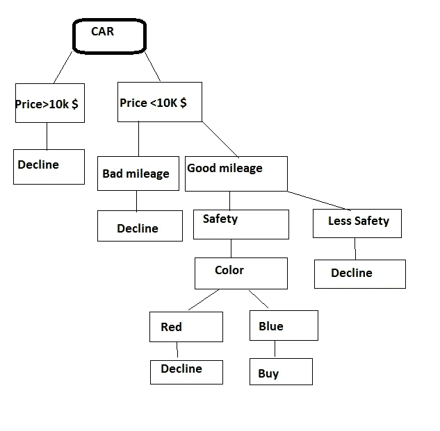

作者图片

查看上图，我们可以定义 ***决策树*** 是一个树形图的图形表示，用于确定行动过程。树的每个分支代表一个决定。

***决策树能解决的问题？***

它可以解决两类问题。

1.  分类:根据 if-then 条件进行分类。如果一种花的颜色是红色，那么它就是玫瑰色，如果是白色，那么它就是百合色。
2.  回归:有连续数据时使用回归树。

***决策树的优势***

1.  简单易懂。
2.  在数据准备方面很少努力。
3.  非线性参数不影响性能。

***缺点:***

1.  过拟合:在数据中有噪声的情况下。
2.  不稳定性:由于数据的变化，模型可能变得不稳定。

***决策树中使用的重要术语。***

1.  熵:它是对数据集中不可预测性的度量。例如，我们有一桶水果。这里所有的东西都是混合的，因此它的熵非常高。
2.  信息增益:熵值降低了。例如，如果我们有一桶 5 种不同的水果。如果所有信息都保存在一个地方，那么获得的信息是最少的。但是如果我们将所有 5 种水果分开，我们会看到熵最小，因为它没有混合，而获得的信息最大。
3.  叶节点:它是承载信息的决策树的末端。在上图中，我们可以说“购买”是叶节点。
4.  决策节点:它是决策树的中间节点，在这里出现两个或更多新的分裂。在上图中，颜色是一个决策节点，因为它进一步分裂为红色和蓝色。
5.  根节点:它是图中最顶层的节点，所有的信息都存储在这里，或者具有最高的熵。在图中，“汽车”是根节点。

如前所述，决策树可用于两种情况。让我们检查一下回归环境中的使用情况。

***决策树:回归***

```
import pandas as pd
import numpy as np
import matplotlib.pyplot as plt
%matplotlib inline
df = pd.read_csv("../input/automobileEDA.csv")
df.head()
```

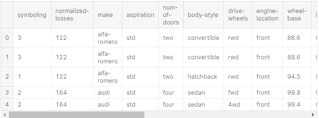

作者图片

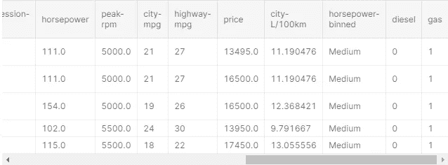

作者图片

df.head()将给出每一列的前 5 行的详细信息。我们可以使用 df.tail()获得最后 5 行，类似地，使用 df.head(10)获得前 10 行。

数据是关于汽车的，我们需要使用上面的数据来预测汽车的价格

我们将使用决策树来预测汽车的价格。

```
df.dtypes
```

出局:

```
symboling              int64
normalized-losses      int64
make                  object
aspiration            object
num-of-doors          object
body-style            object
drive-wheels          object
engine-location       object
wheel-base           float64
length               float64
width                float64
height               float64
curb-weight            int64
engine-type           object
num-of-cylinders      object
engine-size            int64
fuel-system           object
bore                 float64
stroke               float64
compression-ratio    float64
horsepower           float64
peak-rpm             float64
city-mpg               int64
highway-mpg            int64
price                float64
city-L/100km         float64
horsepower-binned     object
diesel                 int64
gas                    int64
dtype: object
```

dtypes 给出列的数据类型。

```
df.describe()
```

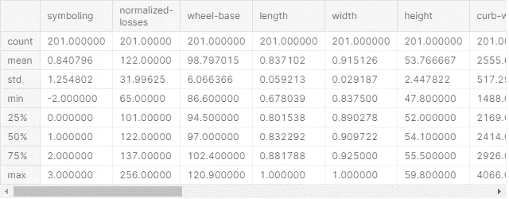

作者图片

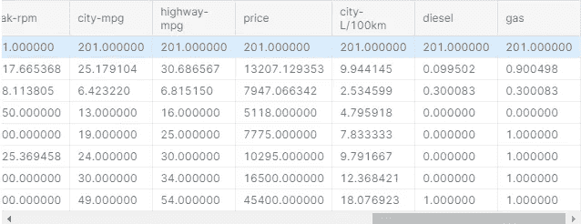

作者图片

在上面的数据框中，列数据类型是 object、float 和 int64 的混合。因此，我们将只考虑那些数值为数字的列，并使所有的数字都浮动。

```
df.dtypes
for x **in** df:
    if df[x].dtypes == "int64":
        df[x] = df[x].astype(float)
        print (df[x].dtypes)float64
float64
float64
float64
float64
float64
float64
float64
```

**准备数据。**

与分类任务一样，在本节中，我们将把数据划分为属性和标签，从而划分为训练集和测试集。我们将创建 2 个数据集，一个用于价格，另一个用于(df-price)。由于我们的数据框包含大量对象格式的数据，因此在本次分析中，我们将移除所有对象类型的列，对于所有 NaN 值，我们将移除该行。

```
df = df.select_dtypes(exclude=['object'])
df=df.fillna(df.mean())
X = df.drop('price',axis=1)
y = df['price']
```

这里，X 变量包含数据集中的所有列，除了标签“价格”列。y 变量包含“价格”列中的值，这意味着 X 变量包含属性集，y 变量包含相应的标签。

```
from sklearn.model_selection import train_test_split
X_train, X_test, y_train, y_test = train_test_split(X, y, test_size=0.3, random_state=0)
```

为了训练该算法，我们将使用 DecisionTreeRegressor 类和 fit 方法。

```
from sklearn.tree import DecisionTreeRegressor
regressor = DecisionTreeRegressor()
regressor.fit(X_train, y_train)
```

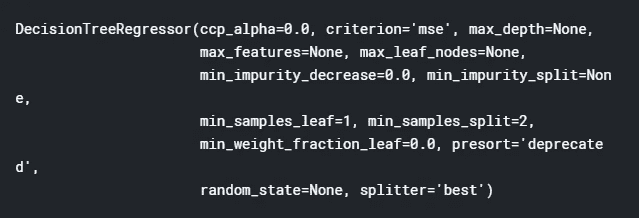

我们来预测一下价格。

```
y_pred = regressor.predict(X_test)
```

让我们检查实际值和预测值之间的差异。

```
df=pd.DataFrame({'Actual':y_test, 'Predicted':y_pred})
df
```

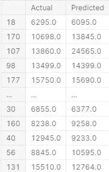

实际值和预测值

```
from sklearn import metrics
print('Mean Absolute Error:', metrics.mean_absolute_error(y_test, y_pred))
print('Mean Squared Error:', metrics.mean_squared_error(y_test, y_pred))
print('Root Mean Squared Error:', np.sqrt(metrics.mean_squared_error(y_test, y_pred)))
```

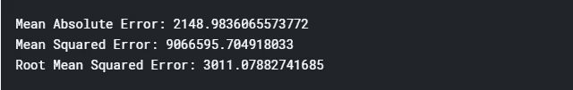

作者图片

```
import seaborn as sns
plt.figure(figsize=(5, 7)) ax = sns.distplot(y, hist=False, color="r", label="Actual Value")
sns.distplot(y_pred, hist=False, color="b", label="Fitted Values" , ax=ax) plt.title('Actual vs Fitted Values for Price')
plt.xlabel('Price (in dollars)')
plt.ylabel('Proportion of Cars')plt.show()
plt.close()
```

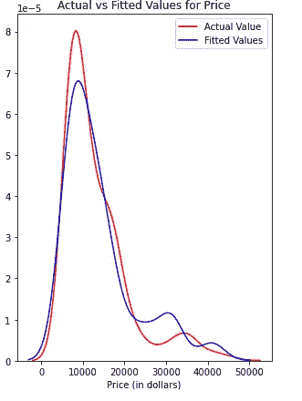

实际与预测

以上是实际值和预测值之间的曲线图。

***决策树:分类***

我们将使用决策树分类来预测模型的结果。

让我们导入所需的库。

```
import numpy as np 
import pandas as pd
from sklearn.tree import DecisionTreeClassifier
```

关于数据:

这些数据是关于一系列疾病的患者名单。通过该模型，我们将预测应该向患者提供哪种药物。

```
df = pd.read_csv("../input/drug200.csv")
df.head()
```

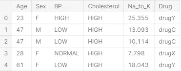

作者图片

计算数据的大小。

```
np.size(df)
```

出局:

```
1200
```

准备数据

我们将选取一些分析所需的列。

```
X = df[['Age', 'Sex', 'BP', 'Cholesterol', 'Na_to_K']].values
X[0:5]
```

出局:

```
array([[23, 'F', 'HIGH', 'HIGH', 25.355],
       [47, 'M', 'LOW', 'HIGH', 13.093],
       [47, 'M', 'LOW', 'HIGH', 10.113999999999999],
       [28, 'F', 'NORMAL', 'HIGH', 7.797999999999999],
       [61, 'F', 'LOW', 'HIGH', 18.043]], dtype=object)
```

在上面的数组中，数据集中的一些值不是数值，例如性别或 BP。不幸的是，Sklean 决策树不能处理这些变量。因此，我们需要将其转换成数字。pandas.get_dummies()将非数字变量转换为虚拟/指示变量。

```
from sklearn import preprocessing
le_sex = preprocessing.LabelEncoder()
le_sex.fit(['F','M'])
X[:,1] = le_sex.transform(X[:,1]) le_BP = preprocessing.LabelEncoder()
le_BP.fit([ 'LOW', 'NORMAL', 'HIGH'])
X[:,2] = le_BP.transform(X[:,2]) le_Chol = preprocessing.LabelEncoder()
le_Chol.fit([ 'NORMAL', 'HIGH'])
X[:,3] = le_Chol.transform(X[:,3]) X[0:5]
```

出局:

```
array([[23, 0, 0, 0, 25.355],
       [47, 1, 1, 0, 13.093],
       [47, 1, 1, 0, 10.113999999999999],
       [28, 0, 2, 0, 7.797999999999999],
       [61, 0, 1, 0, 18.043]], dtype=object)
```

上面我们已经把数值改成了 0，1，2。

```
*#target value*
y = df["Drug"]
y
```

出局:

```
0      drugY
1      drugC
2      drugC
3      drugX
4      drugY
       ...  
195    drugC
196    drugC
197    drugX
198    drugX
199    drugX
Name: Drug, Length: 200, dtype: object
```

我们将在我们的决策树中使用训练/测试分割。让我们从 sklearn.cross_validation 导入 train_test_split。

```
from sklearn.model_selection import train_test_splitX_train, X_test, y_train, y_test = train_test_split(X, y, test_size=0.3, random_state=3)
```

我们将创建一个测试和训练数据

我们将首先创建一个名为 Tree 的决策树分类器实例。

```
Tree = DecisionTreeClassifier(criterion="entropy", max_depth = 4)
Tree *# it shows the default parameters*
```

出局:

```
DecisionTreeClassifier(ccp_alpha=0.0, class_weight=None, criterion='entropy',
                       max_depth=4, max_features=None, max_leaf_nodes=None,
                       min_impurity_decrease=0.0, min_impurity_split=None,
                       min_samples_leaf=1, min_samples_split=2,
                       min_weight_fraction_leaf=0.0, presort='deprecated',
                       random_state=None, splitter='best')
```

让我们预测一下我们的价值观。

```
pred =Tree.predict(X_test)
pred
```

在外

```
array(['drugY', 'drugX', 'drugX', 'drugX', 'drugX', 'drugC', 'drugY',
       'drugA', 'drugB', 'drugA', 'drugY', 'drugA', 'drugY', 'drugY',
       'drugX', 'drugY', 'drugX', 'drugX', 'drugB', 'drugX', 'drugX',
       'drugY', 'drugY', 'drugY', 'drugX', 'drugB', 'drugY', 'drugY',
       'drugA', 'drugX', 'drugB', 'drugC', 'drugC', 'drugX', 'drugX',
       'drugC', 'drugY', 'drugX', 'drugX', 'drugX', 'drugA', 'drugY',
       'drugC', 'drugY', 'drugA', 'drugY', 'drugY', 'drugY', 'drugY',
       'drugY', 'drugB', 'drugX', 'drugY', 'drugX', 'drugY', 'drugY',
       'drugA', 'drugX', 'drugY', 'drugX'], dtype=object)
```

让我们检查测试并预测值。

```
print (pred [0:5])
print (y_test [0:5])
```

出局:

```
['drugY' 'drugX' 'drugX' 'drugX' 'drugX']
40     drugY
51     drugX
139    drugX
197    drugX
170    drugX
Name: Drug, dtype: object
```

让我们检查模型的准确性。

```
from sklearn import metrics
import matplotlib.pyplot as plt
print("DecisionTrees's Accuracy: ", metrics.accuracy_score(y_test,pred))
```

出局:

```
DecisionTrees's Accuracy:  0.9833333333333333
```

创建一个决策树并将其可视化。

```
from sklearn import tree
plt.figure(figsize=(25,10))
tree.plot_tree(Tree,filled=True, 
              rounded=True, 
              fontsize=14);
```

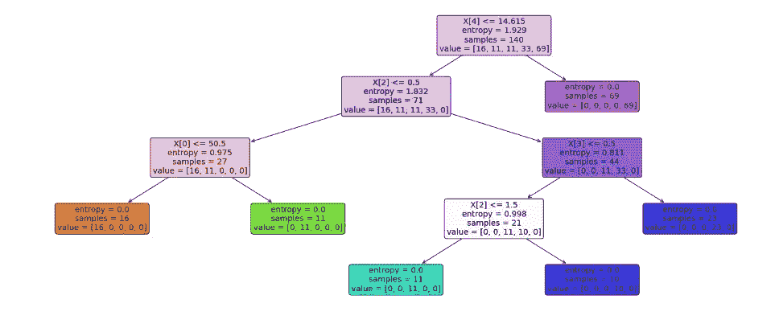

作者图片

实际代码可在以下位置查看:

[https://www . ka ggle . com/adityakumar 529/决策树分类](https://www.kaggle.com/adityakumar529/decision-tree-classification)