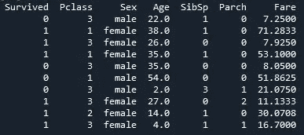
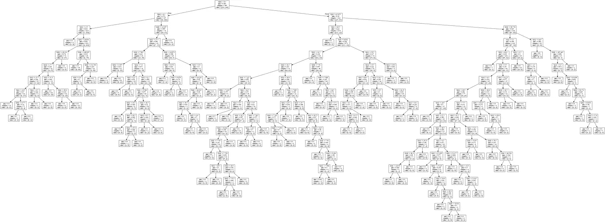
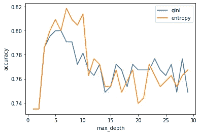
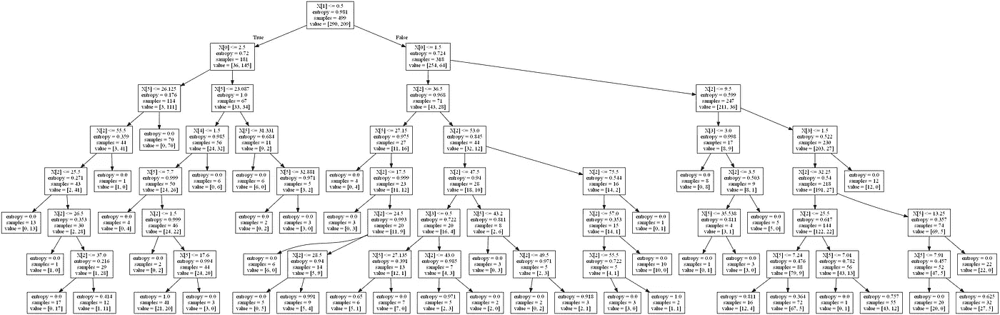

# 决策树:使用 Python 构建、修剪和可视化决策树

> 原文：<https://towardsdatascience.com/decision-tree-build-prune-and-visualize-it-using-python-12ceee9af752?source=collection_archive---------2----------------------->

## 构建和调整机器学习模型，一步一步地解释


布兰登·格林的照片

B 二叉树是计算世界中最常见和最强大的数据结构之一。机器学习工程师如此喜欢决策树的主要原因是，它的处理成本很低，而且真的很容易理解(它是透明的，与神经网络的“黑箱”相反)。它使用分支方法来检查每个特性及其不同的结果，以找到目标值的模式。关于决策树和不同分支方法的更详细的解释，请看托马斯·普拉平格的[这篇文章。](/what-is-a-decision-tree-22975f00f3e1)

我们开始吧！

# 决策树模型

我们将使用来自卡格尔的泰坦尼克号数据集来预测幸存者。我们将导入数据并选择一些要使用的要素。“幸存”是我们的目标价值。

```
data = pd.read_csv(‘path_or_link/train.csv’)
data = data.loc[:,(‘Survived’,’Pclass’,’Sex’,’Age’,’SibSp’,’Parch’,’Fare’)]
```



数据样本

**缺失值** 我们有一些“年龄”的缺失值。为了解决这个问题，我们可以运行一些预测分析并填充这些点，但这不是本文的目标，所以我们将在以后的文章中讨论。现在，让我们只删除那些缺少值的行。

**编码分类特征** 为了将所有特征保持为数字格式，我们将对“性别”进行编码，这意味着将值从“女性”和“男性”转换为 0 和 1。

```
data.dropna(inplace=True)
#'inplace=True' applies the code to the 'data' object.from sklearn.preprocessing import LabelEncoder
le = LabelEncoder()
data.Sex = le.fit_transform(data.Sex)
```

**将数据集分为训练集和测试集**

```
x = data.iloc[:,1:]   # Second column until the last column
y = data.iloc[:,0]    # First column (Survived) is our targetfrom sklearn.model_selection import train_test_split
#this function randomly split the data into train and test setsx_train, x_test, y_train, y_test = train_test_split(x, y, test_size=.3)
#test_size=.3 means that our test set will be 30% of the train set.
```

**构建决策树分类器** 来自 sklearn 的 decision tree classifier()是一个很好的现成的机器学习模型，可供我们使用。它有 fit()和 predict()方法。
**fit()**方法是建模过程的“训练”部分。它找到算法的系数。然后， **predict()** 方法将使用训练好的模型对一组新数据(测试集)进行预测。

```
dtree = DecisionTreeClassifier()
dtree.fit(x_train, y_train)  #train parameters: features and target
pred = dtree.predict(x_test)  #parameter: new data to predict
```

**准确性** 为了确定我们的模型有多好，我们使用 sklearn 的另一个包来给它一个度量:

```
from sklearn.metrics import accuracy_score
accuracy_score(y_test, pred)#parameters: targets to be predicted and predictions from new data used before
```

准确度:0.75
这意味着我们的预测有 75%的准确度。

# 可视化树

我们可以绘制树来查看它的根、分支和节点。我们将使用一组新的库来完成这项工作。

```
from sklearn.tree import export_graphviz
from sklearn.externals.six import StringIO
from IPython.display import Image  
import pydotplusdot_data = StringIO()
export_graphviz(dtree, out_file=dot_data)
graph = pydotplus.graph_from_dot_data(dot_data.getvalue())
graph.write_png('/tree.png')
Image(graph.create_png())
```

**StringIO()** :创建一个对象(本例中为空)来接收一个点(图形描述语言)格式的字符串缓冲区(树将首先创建为字符串，然后创建为图像)。
**export_graphviz()** :该函数以点格式导出树，生成决策树的表示，并写入‘out _ file’。
**graph _ from _ dot _ data()**:将使用 DOT 对象创建图形。
**【Image()**:使用原始数据返回图像(png、jpeg、gif)。



决策图表

这棵树似乎很长。让我们改变几个参数，看看对精度是否有任何影响，并使树更短。

*   **标准**:定义将使用什么函数来测量分割的质量。选项有“基尼”和“熵”。
*   **Max_depth** :定义树的最大深度。如果它是“无”，树将尽可能长，这时所有的叶子都是纯的(过度拟合模型的风险)。

```
dtree = DecisionTreeClassifier(criterion='gini')
dtree.fit(x_train, y_train)
pred = dtree.predict(x_test)
print('Criterion=gini', accuracy_score(y_test, pred))dtree = DecisionTreeClassifier(criterion='entropy')
dtree.fit(x_train, y_train)
pred = dtree.predict(x_test)
print('Criterion=entropy', accuracy_score(y_test, pred))
```

准确度结果:
标准=基尼:0.735
标准=熵:0.716

基尼系数法比熵值法略有改进。现在，让我们检查使用 max_depth 修剪树是否能给我们带来更好的结果。在下面的代码块中，我创建了一个简单的函数，使用不同的 max_depth 值(从 1 到 30)来运行我们的模型，并可视化其结果，以查看每个值的精确度有何不同。

```
max_depth = []
acc_gini = []
acc_entropy = []
for i in range(1,30):
 dtree = DecisionTreeClassifier(criterion=’gini’, max_depth=i)
 dtree.fit(x_train, y_train)
 pred = dtree.predict(x_test)
 acc_gini.append(accuracy_score(y_test, pred))
 ####
 dtree = DecisionTreeClassifier(criterion=’entropy’, max_depth=i)
 dtree.fit(x_train, y_train)
 pred = dtree.predict(x_test)
 acc_entropy.append(accuracy_score(y_test, pred))
 ####
 max_depth.append(i)d = pd.DataFrame({‘acc_gini’:pd.Series(acc_gini), 
 ‘acc_entropy’:pd.Series(acc_entropy),
 ‘max_depth’:pd.Series(max_depth)})# visualizing changes in parameters
plt.plot(‘max_depth’,’acc_gini’, data=d, label=’gini’)
plt.plot(‘max_depth’,’acc_entropy’, data=d, label=’entropy’)
plt.xlabel(‘max_depth’)
plt.ylabel(‘accuracy’)
plt.legend()
```



在这种情况下，gini 似乎对较长的树效果最好(正如我们在前面的精确度中看到的)，但熵对较短的树效果更好，而且更精确(接近 0.82)。所以我们来画 max_depth=7，criterion=entropy 的树，看看是什么样子。

```
dtree = DecisionTreeClassifier(criterion=’entropy’, max_depth=7)
dtree.fit(x_train, y_train)pred = dtree.predict(x_test)
accuracy_score(y_test, pred)#Accuracy: 0.814
```



标准= '熵'，最大深度=7

我们通过改变函数来创建分支并限制树以避免过度拟合，从而从 0.75 的准确度提高到 0.81。每个案例都是不同的，测试不同的参数以找到最适合您的场景是一个很好的实践。当你学习新的函数和机器学习模型时，不要犹豫阅读文档。它将为您提供更广泛的选项来根据您的需求定制模型。

现在，去吧，使用你的新技能，通过种一棵树来拯救地球。