# 使用 Python 实现决策树分类器和成本计算剪枝

> 原文：<https://towardsdatascience.com/decision-tree-classifier-and-cost-computation-pruning-using-python-b93a0985ea77?source=collection_archive---------9----------------------->

## 使用 Python 中的成本计算修剪构建、可视化和微调决策树的完整实践指南


照片由 [Unsplash](https://unsplash.com?utm_source=medium&utm_medium=referral) 上的[延斯·勒列](https://unsplash.com/@leliejens?utm_source=medium&utm_medium=referral)拍摄

# 介绍

决策树分类器是监督学习模型，在我们关心可解释性时非常有用。想象一下，通过在每一层基于多个问题做出决策来分解数据。这是广泛使用的处理分类问题的算法之一。为了更好地理解它，让我们看看下面的例子。

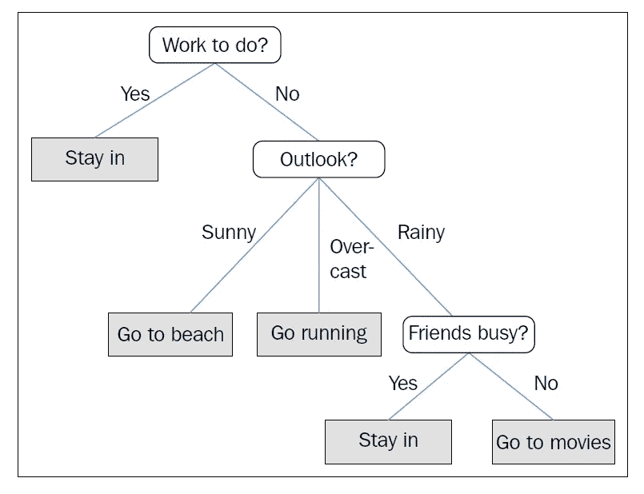

用于决定特定一天的活动的示例决策树。改编自《Python 对机器学习的更深刻见解》(Raschka，Julian and Hearty，2016，第 83、88、89 页)

决策树通常包括:

*   **根节点** —代表被进一步分成同类组的样本或总体
*   **拆分**——将节点分成两个子节点的过程
*   **决策节点** —当一个子节点根据某种条件分裂成更多的子节点时，称为决策节点
*   **叶节点或终端节点** —不再进一步分裂的子节点
*   **信息增益** —为了使用条件(比如最具信息性的特征)来分割节点，我们需要定义一个可以优化的目标函数。在决策树算法中，我们倾向于最大化每次分裂的信息增益。在测量信息增益时，通常使用三种杂质测量。它们是**基尼**杂质、**熵、**分类和误差

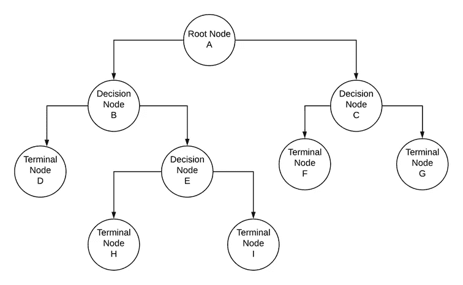

带有树叶和树枝的决策树示例。参考—由作者使用 Lucid Chart 开发

[](/are-your-coding-skills-good-enough-for-a-data-science-job-49af101457aa) [## 对于数据科学的工作，你的编码技能够好吗？

### 5 编码嗅探如果你在数据科学行业工作，你必须知道

towardsdatascience.com](/are-your-coding-skills-good-enough-for-a-data-science-job-49af101457aa) 

# 理解数学

为了理解决策树是如何开发的，我们需要更深入地理解如何在每一步使用一个杂质度量在每一步最大化信息增益。让我们举一个例子，我们有训练数据，包括学生信息，如性别、年级、因变量或分类变量，用于识别学生是否是美食家。我们有以下概述的信息。

1.  学生总数— 20 人
2.  被归类为美食家的学生总数— 10
3.  不属于美食家的学生总数— 10 人
4.  p(吃货)，一个学生成为吃货的概率= (10/20) = 0.5
5.  q(不是美食家，或 1-P)，学生不是美食家的概率= (10/20) = 0.5

让我们将基于性别的学生分为两个节点，重新计算上述指标。

**男同学(节点 A)**

1.  学生总数— 10 人
2.  被归类为美食家的学生总数— 8
3.  不属于美食家的学生总数— 2
4.  p(吃货)，一个学生成为吃货的概率= (8/10) = 0.8
5.  q(不是美食家，或 1-P)，学生不是美食家的概率= (2/10) = 0.2

**女学生(节点 B)**

1.  学生总数— 10 人
2.  被归类为美食家的学生总数— 4
3.  不属于美食家的学生总数— 6
4.  p(吃货)，一个学生成为吃货的概率= (4/10) = 0.4
5.  q(非美食家，或 1-P)，学生非美食家的概率= (6/10) = 0.6

**基尼指数(GIn)** 对于节点 A 或男生= P + Q，其中 P 和 Q 分别是一个学生成为美食家和非美食家的概率。GIn(节点 A) = 0.8 + 0.2 = 0.68

**基尼系数(GIp)** 对于节点 A = 1-基尼系数= 1–0.68 = 0.32

**Gini Index (GIn)** 对于 Node B 或女学生= P + Q，其中 P 和 Q 分别是学生成为美食家和非美食家的概率。GIn(节点 B) = 0.4 + 0.6 = 0.52

**基尼系数(GIp)** 对于节点 B = 1-基尼系数= 1–0.52 = 0.48

我们在上面观察到的是，当我们根据学生的性别(男性和女性)将他们分别分成节点 A 和 B 时，我们分别有两个节点的基尼不纯度分数。现在，为了决定性别是否是将学生分为美食家和非美食家的正确变量，我们需要一个加权基尼杂质分数，该分数是使用下面列出的公式计算的。

**加权基尼杂质=(节点 A 总样本数/数据集中总样本数)*基尼杂质(节点 A) +(节点 B 总样本数/数据集中总样本数)*基尼杂质(节点 B)**

使用此公式计算上述示例的加权基尼系数，根据性别划分学生时的加权基尼系数= (10/20)*0.32 + (10/20)*0.48 = 0.4

分类问题涉及多个独立变量。变量可以是分类的，也可以是连续的。决策树非常适合处理不同数据类型的变量。决策树算法在决定每个节点的分裂时考虑了所有可能的变量。使用 ***的变量可以获得最大的加权杂质增益，被用作特定节点*** 的决策变量。

在上面的例子中，使用“性别”作为决策变量的加权杂质增益是 0.4，然而，假设使用“等级”作为决策变量，我们设法实现 0.56 的加权杂质增益，算法将使用“等级”作为决策变量来创建第一个分离。所有后续步骤都遵循类似的方法，直到每个节点都是同类的。

# 关于决策树算法的快速事实

1.  随着算法继续将节点分割成子节点，直到每个节点变得同质，决策树易于过度拟合
2.  与测试集相比，训练数据的准确性要高得多，因此应该修剪决策树以防止模型过度拟合。修剪可以通过控制树的深度、每个节点中样本的最大/最小数量、要分裂的节点的最小杂质增益以及最大叶子节点来实现
3.  Python 允许用户使用基尼杂质或熵作为信息增益标准来开发决策树
4.  可以使用网格搜索或随机搜索 CV 对决策树进行微调。CV 代表交叉验证

# 三种不同杂质标准的目视比较

下面概述的代码片段提供了不同杂质标准的直观比较，以及它们如何随着不同的概率值而变化。注意下面的代码改编自 2016 年 S.Raschka，D.Julian 和 J . heartful 的《Python:对机器学习的更深刻见解》。

```
import matplotlib.pyplot as pltimport numpy as np#-----Calculating Gini Index
def gini(p):
    return (p)*(1 - (p)) + (1 - p)*(1 - (1-p))#-----Calculating Entropy
def entropy(p):
    return - p*np.log2(p) - (1 - p)*np.log2((1 - p))#-----Calculating Classification Error
def classification_error(p):
    return 1 - np.max([p, 1 - p])#----Creating a Numpy Array of probability values from 0 to 1, with an increment of 0.01
x = np.arange(0.0, 1.0, 0.01)#---Obtaining Entropy for different values of p
ent = [entropy(p) if p != 0 else None for p in x]#---Obtaining scaled entropy
sc_ent = [e*0.5 if e else None for e in ent]#--Classification Error
err = [classification_error(i) for i in x]#--Plottingfig = plt.figure();
plt.figure(figsize=(10,8));
ax = plt.subplot(111);for i, lab, ls, c, in zip([ent, sc_ent, gini(x), err], ['Entropy', 'Entropy (scaled)','Gini Impurity',
                                                        'Misclassification Error'],['-', '-', '--', '-.'],
                          ['black', 'darkgray','blue', 'brown', 'cyan']):
    line = ax.plot(x, i, label=lab,
    linestyle=ls, lw=2, color=c)

ax.legend(loc='upper center', bbox_to_anchor=(0.5, 1.15), ncol=3, fancybox=True, shadow=False)
ax.axhline(y=0.5, linewidth=1, color='k', linestyle='--')
ax.axhline(y=1.0, linewidth=1, color='k', linestyle='--')
plt.ylim([0, 1.1])
plt.xlabel('p(i=1)')
plt.ylabel('Impurity Index')
plt.show()
```

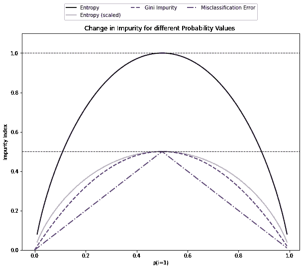

不同概率值的杂质变化。参考—上述代码片段的输出

# 动手练习

问题陈述旨在开发一个分类模型来预测红酒的质量。关于问题陈述的细节可以在[这里](https://www.kaggle.com/uciml/red-wine-quality-cortez-et-al-2009)找到。这是一个多类分类问题的经典例子。请注意，所有机器学习模型对异常值都很敏感，因此在构建树之前，应该处理由异常值组成的特征/独立变量。

不同特征/独立变量的一个重要方面是它们如何相互作用。皮尔逊相关可用于确定数据集中两个特征之间的关联程度。然而，对于像决策树这样基于决策的算法，我们不会丢弃高度相关的变量。

```
#---------------------------------------------Importing Required Libraries-----------------------------------
%matplotlib inlineimport numpy as np
import pandas as pdfrom sklearn.tree import DecisionTreeClassifierimport numpy as np
import pandas as pd
import seaborn as snssns.set(color_codes=True)from matplotlib import pyplot as plt
from sklearn.model_selection import train_test_split #--------------splitting data into test and train
from sklearn.tree import DecisionTreeClassifier #-----------Building decision tree modelfrom sklearn import metrics
from sklearn.metrics import accuracy_score,f1_score,recall_score,precision_score, confusion_matrix #-----model validation scores
%matplotlib inlinefrom IPython.display import display #---------------------for displaying multiple data frames in one outputfrom sklearn.feature_extraction.text import CountVectorizer  #DT does not take strings as input for the model fit stepimport missingno as msno_plot #--------------plotting missing valueswine_df = pd.read_csv('winequality-red.csv',sep=';')
```

数据的快速描述性统计

```
wine_df.describe().transpose().round(2)
```

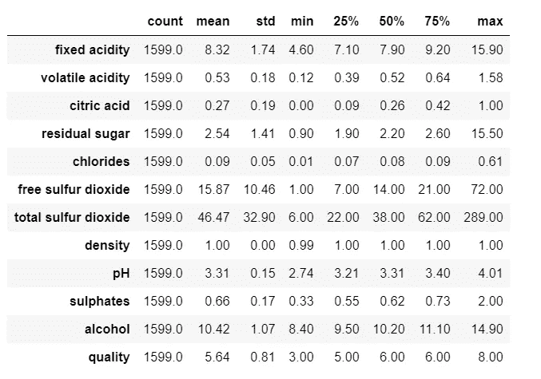

的输出。describe()函数

检查缺失值

```
#-------------------------------------------Barplot of non-missing values--------------------------------
plt.title('#Non-missing Values by Columns')
msno_plot.bar(wine_df);
```

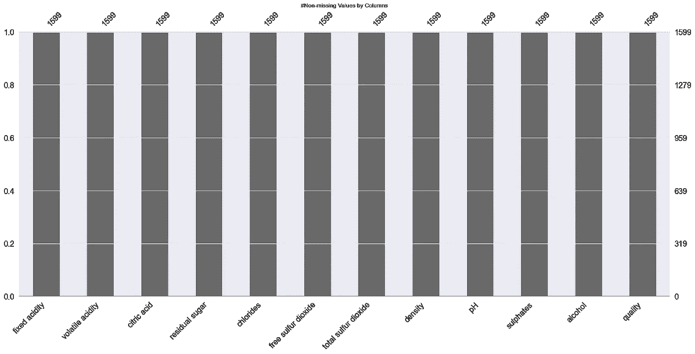

说明数据集中非缺失值计数的图

异常值检查和处理

```
#--Checking Outliers
plt.figure(figsize=(15,15))
pos = 1
for i in wine_df.columns:
    plt.subplot(3, 4, pos)
    sns.boxplot(wine_df[i])
    pos += 1
```

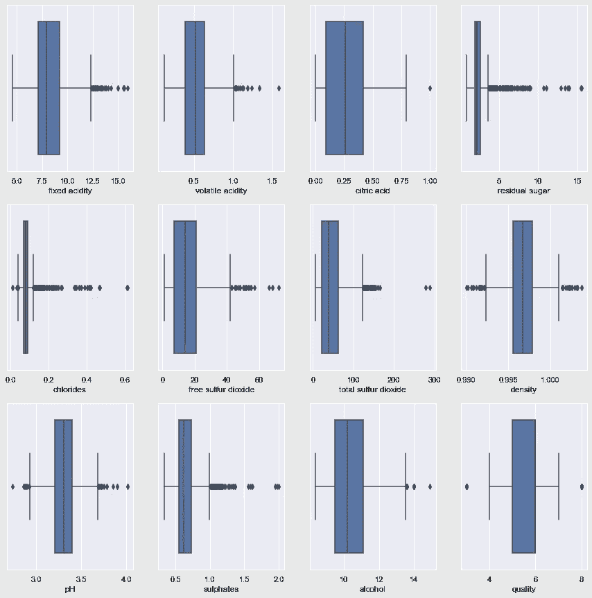

说明数据中存在异常值的箱线图

```
col_names=['fixed acidity', 'volatile acidity', 'citric acid', 'residual sugar',
       'chlorides', 'free sulfur dioxide', 'total sulfur dioxide', 'density',
       'pH', 'sulphates', 'alcohol']display(col_names)for i in col_names:
    q1, q2, q3 = wine_df[i].quantile([0.25,0.5,0.75])
    IQR = q3 - q1
    lower_cap=q1-1.5*IQR
    upper_cap=q3+1.5*IQR
    wine_df[i]=wine_df[i].apply(lambda x: upper_cap if x>(upper_cap) else (lower_cap if x<(lower_cap) else x))
```

上面的异常值使用 Q1-1.5 * IQR 和 Q3+1.5*IQR 值进行了 winsorized 化。Q1、Q3 和 IQR 分别代表四分位数 1、四分位数 3 和四分位数间范围。

```
sns.pairplot(wine_df);
```

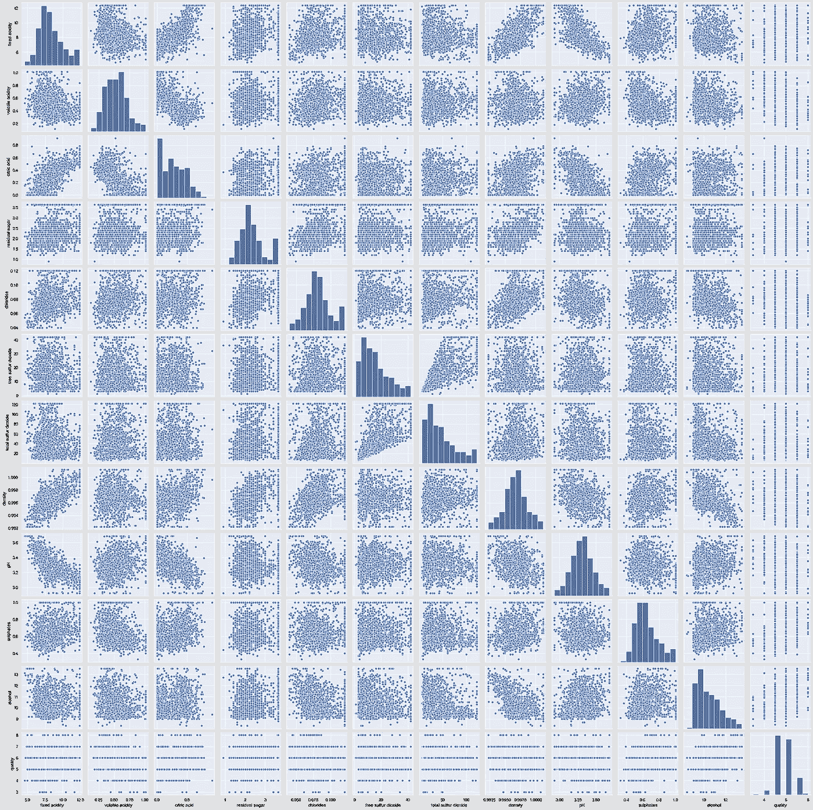

说明不同变量相互作用的配对图

理解不同变量之间的关系。注意—在决策树中，我们不需要删除高度相关的变量，因为仅使用一个独立变量将节点划分为子节点，因此即使两个或更多变量高度相关，产生最高信息增益的变量也将用于分析。

```
plt.figure(figsize=(10,8))
sns.heatmap(wine_df.corr(),
            annot=True,
            linewidths=.5,
            center=0,
            cbar=False,
            cmap="YlGnBu")
plt.show()
```

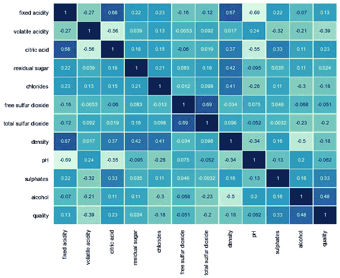

说明不同属性相关性的热图

分类问题对阶级不平衡很敏感。类别不平衡是指相关属性中 1 的比例高于 0 的比例，反之亦然。在多类问题中，当其中一个类值的比例非常高时，就会出现类不平衡。类别平衡是通过组合属性“质量”的值来诱导的，该属性是本问题陈述中的因变量。

```
plt.figure(figsize=(10,8))
sns.countplot(wine_df['quality']);
```

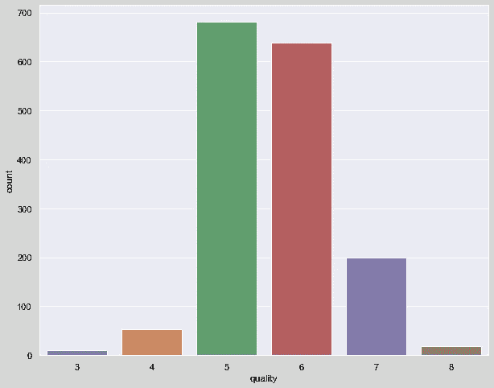

该图显示了不同葡萄酒质量的记录计数

```
wine_df['quality'] = wine_df['quality'].replace(8,7)
wine_df['quality'] = wine_df['quality'].replace(3,5)
wine_df['quality'] = wine_df['quality'].replace(4,5)
wine_df['quality'].value_counts(normalize=True)
```

数据被分为训练集和测试集，以检查模型的准确性，并寻找过度拟合或欠拟合(如果有的话)。

```
# splitting data into training and test set for independent attributesfrom sklearn.model_selection import train_test_splitX_train, X_test, y_train, y_test =train_test_split(wine_df.drop('quality',axis=1), wine_df['quality'], test_size=.3,
                                                   random_state=22)
X_train.shape,X_test.shape
```

决策树模型是使用基尼标准开发的。注意，为了简单起见，我们将树修剪到最大深度为 3。这将有助于我们将树形象化，并将它与我们在最初部分中涉及的概念联系起来。

```
clf_pruned = DecisionTreeClassifier(criterion = "gini", random_state = 100,
                               max_depth=3, min_samples_leaf=5)
clf_pruned.fit(X_train, y_train)
```

请注意，可以调整以下参数来改善模型输出(Scikit Learn，2019)。

1.  **标准** —基尼系数用于决定变量，基于该变量，根节点和随后的决策节点应该被分割
2.  **class_weight** —无；所有类别都被赋予权重 1
3.  **最大深度**—3；修剪完成。当“无”时，表示节点将被扩展，直到所有叶子都是同类的
4.  **max_features** —无；在决定一个节点的分裂时，考虑所有的特征或独立变量
5.  **max_leaf_nodes** —无；
6.  **最小杂质减少量**—0.0；仅当分裂确保杂质减少大于或等于零时，才分裂节点
7.  **最小 _ 杂质 _ 分裂** —无；
8.  **min _ samples _ leaf**—1；叶子存在所需的最小样本数
9.  **min _ samples _ split**—2；如果 min_samples_leaf =1，则表示右节点和左节点应该各有 1 个样本，即父节点或根节点应该至少有两个样本
10.  **分割器**——‘最佳’；用于在每个节点选择分割的策略。最好确保在决定分割时考虑所有特征

```
from sklearn.tree import export_graphviz
from sklearn.externals.six import StringIO  
from IPython.display import Image  
import pydotplus
import graphvizxvar = wine_df.drop('quality', axis=1)
feature_cols = xvar.columnsdot_data = StringIO()
export_graphviz(clf_pruned, out_file=dot_data,  
                filled=True, rounded=True,
                special_characters=True,feature_names = feature_cols,class_names=['0','1','2'])from pydot import graph_from_dot_data
(graph, ) = graph_from_dot_data(dot_data.getvalue())
Image(graph.create_png())
```

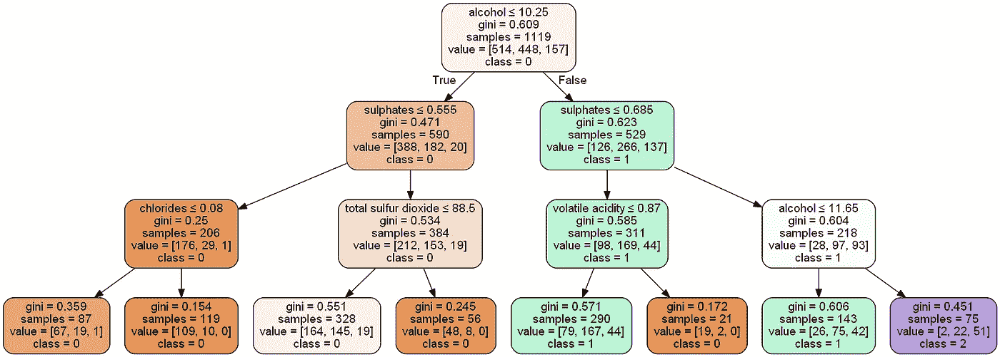

图示为深度=3 时的决策树模型

```
preds_pruned = clf_pruned.predict(X_test)
preds_pruned_train = clf_pruned.predict(X_train)print(accuracy_score(y_test,preds_pruned))
print(accuracy_score(y_train,preds_pruned_train))
```

该模型对训练和测试数据的准确率分别为 0.60 和 0.62。

特征重要性指的是为预测模型的输入特征分配分数的一类技术，这些分数指示了在进行预测时每个特征的相对重要性。

```
## Calculating feature importancefeat_importance = clf_pruned.tree_.compute_feature_importances(normalize=False)feat_imp_dict = dict(zip(feature_cols, clf_pruned.feature_importances_))
feat_imp = pd.DataFrame.from_dict(feat_imp_dict, orient='index')
feat_imp.rename(columns = {0:'FeatureImportance'}, inplace = True)
feat_imp.sort_values(by=['FeatureImportance'], ascending=False).head()
```

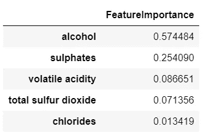

影响决策树拆分的五大特征

DecisionTreeClassifier()提供诸如 min_samples_leaf 和 max_depth 之类的参数来防止树过度拟合。可以把它想象成一个场景，我们明确定义了树的深度和最大叶子数。然而，最大的挑战是确定一棵树应该包含的最佳深度和叶子。在上面的例子中，我们使用 max_depth=3，min_samples_leaf=5。这些数字只是一个例子，用来观察树的行为。但是，如果在现实中我们被要求处理这个模型并得出模型参数的最佳值，这是具有挑战性的，但不是不可能的(决策树模型可以使用 GridSearchCV 算法进行微调)。

另一种方法是使用成本复杂性修剪(CCP)。

成本复杂性修剪提供了另一种选择来控制树的大小。在决策树分类器中，这种修剪技术由成本复杂性参数 cost 来参数化。CCPα值越大，修剪的节点数越多。

简单来说，成本复杂性是一个阈值。只有当模型的整体杂质被提高了大于该阈值的值时，模型才进一步将节点分裂成子节点，否则它停止。

CCP 越低，杂质越少。怎么会？

当 CCP 值较低时，即使杂质没有减少很多，模型也会将一个节点分割成子节点。随着树的深度增加，这一点很明显，也就是说，当我们沿着决策树往下走时，我们会发现分裂对模型的整体杂质的变化没有多大贡献。然而，较高的分割确保了类别被正确分类，即准确性更高。

当 CCP 值较低时，会创建更多的节点。节点越高，树的深度也越高。

下面的代码(Scikit Learn，n.d .)说明了如何调整 alpha 以获得具有改进的准确度分数的模型。

```
path = model_gini.cost_complexity_pruning_path(X_train, y_train)
ccp_alphas, impurities = path.ccp_alphas, path.impuritiesfig, ax = plt.subplots(figsize=(16,8));
ax.plot(ccp_alphas[:-1], impurities[:-1], marker='o', drawstyle="steps-post");
ax.set_xlabel("effective alpha");
ax.set_ylabel("total impurity of leaves");
ax.set_title("Total Impurity vs effective alpha for training set");
```

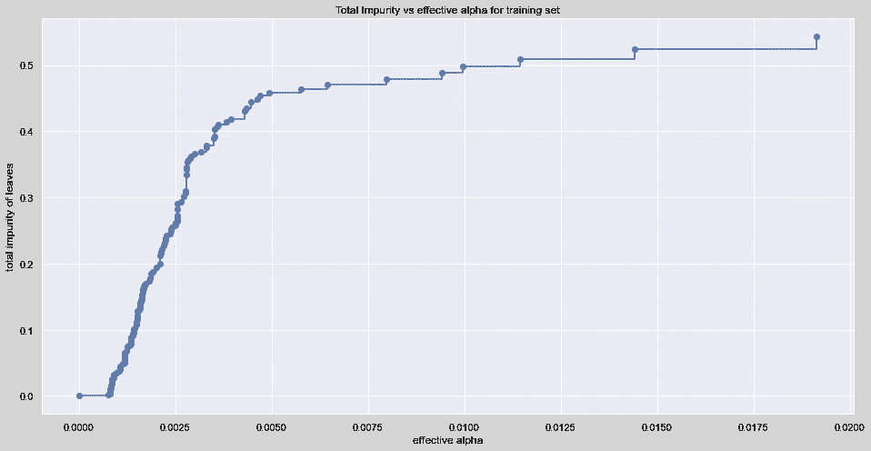

显示杂质随α值变化的图像

让我们来理解深度和节点数随 alpha 的变化。

```
clfs = clfs[:-1]ccp_alphas = ccp_alphas[:-1]node_counts = [clf.tree_.node_count for clf in clfs]depth = [clf.tree_.max_depth for clf in clfs]fig, ax = plt.subplots(2, 1,figsize=(16,8))ax[0].plot(ccp_alphas, node_counts, marker='o', drawstyle="steps-post")
ax[0].set_xlabel("alpha")
ax[0].set_ylabel("number of nodes")
ax[0].set_title("Number of nodes vs alpha")
ax[1].plot(ccp_alphas, depth, marker='o', drawstyle="steps-post")
ax[1].set_xlabel("alpha")
ax[1].set_ylabel("depth of tree")
ax[1].set_title("Depth vs alpha")
fig.tight_layout() 
```

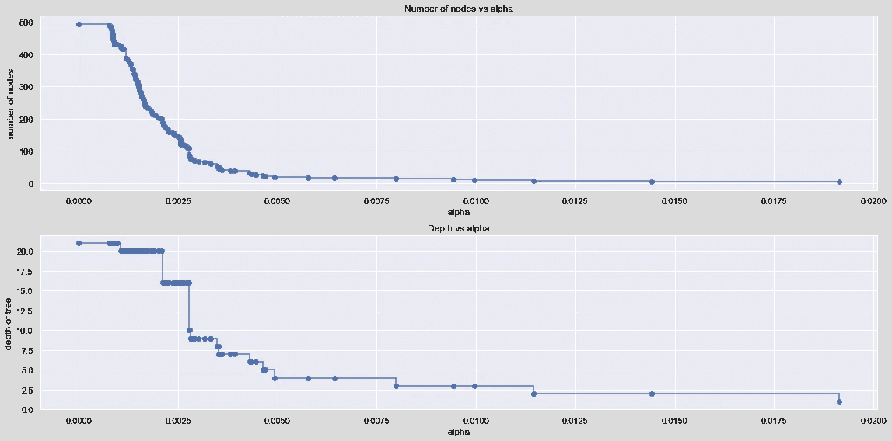

该图显示了深度和节点数随 alpha 值的变化

理解当α增加时精度的变化。

```
fig, ax = plt.subplots(figsize=(16,8)); #-----------------Setting size of the canvas
train_scores = [clf.score(X_train, y_train) for clf in clfs]
test_scores = [clf.score(X_test, y_test) for clf in clfs]ax.set_xlabel("alpha")
ax.set_ylabel("accuracy")
ax.set_title("Accuracy vs alpha for training and testing sets")
ax.plot(ccp_alphas, train_scores, marker='o', label="train",
        drawstyle="steps-post")
ax.plot(ccp_alphas, test_scores, marker='o', label="test",
        drawstyle="steps-post")
ax.legend()
plt.show()
```

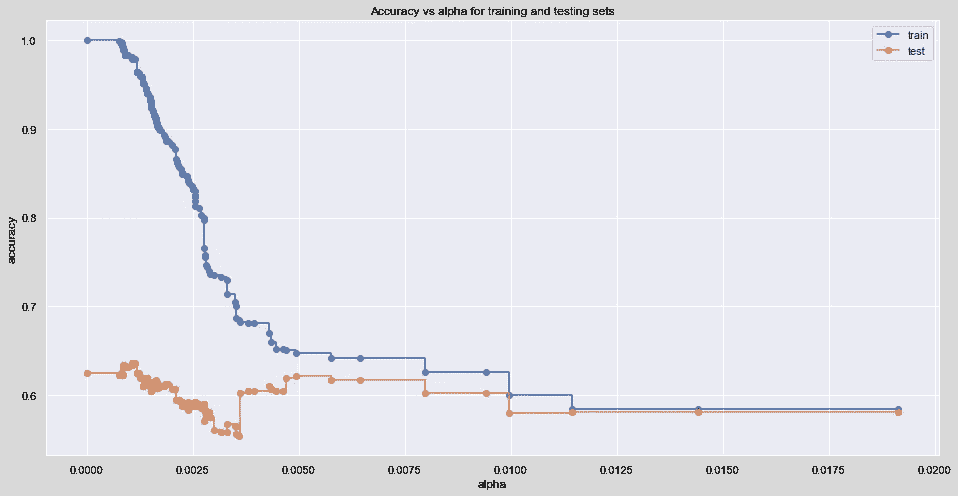

该图显示了当 alpha 值增加时准确度分数的变化

```
i = np.arange(len(ccp_alphas))
ccp = pd.DataFrame({'Depth': pd.Series(depth,index=i),'Node' : pd.Series(node_counts, index=i),\
                    'ccp' : pd.Series(ccp_alphas, index = i),'train_scores' : pd.Series(train_scores, index = i),
                   'test_scores' : pd.Series(test_scores, index = i)})ccp.tail()ccp[ccp['test_scores']==ccp['test_scores'].max()]
```

上面的代码提供了在测试数据中产生最高精确度的成本计算修剪值。

# 参考

1.  s .拉什卡、d .朱利安和 j .哈特(2016 年)。 *Python:深入了解机器学习:利用 Python 的机器学习技术优势:三个模块的课程*。英国伯明翰:Packt 出版公司，第 83、88、89 页。
2.  ‌[sci kit-learn:python 中的机器学习](http://jmlr.csail.mit.edu/papers/v12/pedregosa11a.html)，Pedregosa *等人*，JMLR 12，第 2825–2830 页，2011 年。
3.  Scikit Learn (2019)。*sk learn . tree . decision tree classifier—sci kit-learn 0 . 22 . 1 文档*。[在线]Scikit-learn.org。可从以下网址获取:[https://sci kit-learn . org/stable/modules/generated/sk learn . tree . decision tree classifier . html](https://scikit-learn.org/stable/modules/generated/sklearn.tree.DecisionTreeClassifier.html.)
4.  Scikit Learn(未注明)。*后剪枝决策树与成本复杂度剪枝*。【在线】可在:[https://sci kit-learn . org/stable/auto _ examples/tree/plot _ cost _ complexity _ pruning . html # sphx-glr-auto-examples-tree-plot-cost-complexity-pruning-py。](https://scikit-learn.org/stable/auto_examples/tree/plot_cost_complexity_pruning.html#sphx-glr-auto-examples-tree-plot-cost-complexity-pruning-py.)

*关于作者:高级分析专家和管理顾问，帮助公司通过对组织数据的商业、技术和数学的组合找到各种问题的解决方案。一个数据科学爱好者，在这里分享、学习、贡献；你可以和我在* [*上联系*](https://www.linkedin.com/in/angel-das-9532bb12a/) *和* [*上推特*](https://twitter.com/dasangel07_andy)*；*