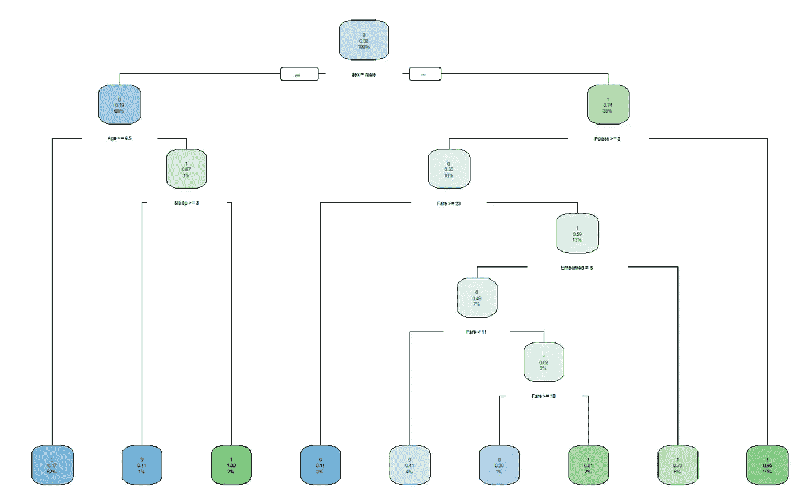

# 每位数据科学家必备的决策树

> 原文：<https://towardsdatascience.com/decision-tree-essentials-for-every-data-scientist-9d2cbb1f3ae9?source=collection_archive---------41----------------------->


图片来自[我的图片是 CC0。作曲时:](https://pixabay.com/users/jplenio-7645255/?utm_source=link-attribution&utm_medium=referral&utm_campaign=image&utm_content=3097419) [Pixabay](https://pixabay.com/?utm_source=link-attribution&utm_medium=referral&utm_campaign=image&utm_content=3097419) 的

# 决策树介绍

决策树是一种非常有用的分类方法，非常适合用最少的代码启动和运行。

我使用了某种形式的决策树来预测客户流失的可能性、客户转换、新产品采用、新功能采用，以及许多其他有用的应用。

这个简短的介绍将让你了解使用决策树作为分类工具的主要好处和局限性。

我还将带您完成构建您自己的决策树的步骤，同样重要的是，测试它的性能。

# 何时以及为何使用决策树

说到分类，使用决策树分类器是最容易使用的方法之一。

## 为什么要使用决策树

*   非常容易理解
*   它可以很好地处理丢失的数据和异常值，因此需要更少的前期清理
*   您可以放弃分类变量编码，因为决策树可以很好地处理分类！
*   无需深入递归划分的细节，决策树就能够模拟非线性关系。

## 为什么不使用决策树呢

尽管有这么多好处，但它们并不总是完美的选择。

*   同样，它们可能很简单，也可能过于复杂，几乎无法概念化或解释。
*   更进一步说，如果一个树过于偏向或复杂，它可能会太好地迎合其训练数据，结果是过度拟合。

# 模特培训

说到这里，让我们开始吧。我不会谈论交叉验证或训练，测试分裂，但会张贴下面的代码。如果你想得到更多的解释，一定要发表评论。

首先，我们将数据分成训练集和测试集。

还要注意，我们将使用经典的泰坦尼克号数据集，它包含在 base R 中。

```
n <- nrow(Titanic)n_train <- round(0.8 * n)set.seed(123)
train_indices <- sample(1:n, n_train)
train <- Titanic[train_indices, ]  
test <- Titanic[-train_indices, ]
```

现在我们将使用`rpart`包中的`rpart`函数来训练模型。这里需要注意的关键是，我们想要预测的变量是存活的，所以我们想要根据一些数据了解任何给定个体存活的可能性。~可以由解释为*；换句话说，让我们理解一些变量的存在。如果在~后面有一个。这意味着我们想用数据集中的其他变量来预测存活。或者，如下所示，我们可以明确地调用我们想要使用的变量。*

另外要注意的是，`method`是`class`。这是因为我们希望创建一个预测分类结果的分类树，而不是用于数字结果的回归树。最后，我们用来训练模型的数据是`train`。

```
model <- rpart(formula = Survived ~ Pclass + Sex + Age + SibSp + Parch + Fare + Embarked,
            data = titanic_train, 
            method = "class")
```

# 可解释性

如前所述，决策树如此容易使用的原因之一是它非常容易解释。你可以沿着树的不同分支走向不同的结果。

```
rpart.plot(model)
```



在那里阅读有点困难，但是如果你放大一点，你会看到如果有人可能在泰坦尼克号上生活或死亡的第一个标准是你是否是男性。如果你是男性，你移到左边的分支，向下两个节点，不管你是成年人还是你的兄弟姐妹/配偶。因此，如果你是一个单身男人，你的生存几率非常小。

# 性能赋值

在我们分解指标之前，让我们预测一下测试集的值。与训练调用类似，您选择数据和预测类型。核心区别在于型号规格。

```
test$pred <- predict(object = model,  
                            newdata = test,   
                            type = "class")
```

在理解决策树的功效时，有各种各样的性能评估指标会非常方便。

## 准确(性)

这个指标很简单，你的预测有多少是正确的。`caret`的混淆矩阵函数就包含了这个。

## 混淆矩阵

`caret`包中的`confusionMatrix`功能非常有用。用于评估分类模型性能。加载这个包，把你的预测和实际数据传给它。

```
library(caret)
confusionMatrix(data = test$pred,       
                reference = test$Survived)
```


这个函数向你展示的第一件事就是所谓的混淆矩阵。这将向您显示一个预测值和实际值如何匹配的表格。所以预测值和参考值相同的对角线单元格代表我们得到的正确值。将这些记录加起来 149 (106 + 43)并除以记录总数，178；我们达到了 83.4%的准确率。

True positive:象限中引用和预测都为 1 的单元格。这表明你预测了存活，而他们确实存活了下来。

假阳性:这里你预测为阳性，但你错了。

真阴性:当你预测为阴性，并且你是正确的。

假阴性:当你预测为阴性，而你是不正确的。

需要记住的几个关键指标是灵敏度和特异性。敏感度是您正确预测的真实记录的百分比。

另一方面，特异性是衡量实际错误记录中你正确预测的部分。

在不平衡数据集上进行预测时，要记住特异性。一个非常常见的例子就是对垃圾邮件进行分类。99%的情况下它不是垃圾邮件，所以如果你预测没有垃圾邮件，你有 99%的准确率，但你的特异性是 0，导致所有的垃圾邮件都被接受。

# 结论

总结我们对决策树的讨论，我们知道它们非常有用，因为它们非常容易解释，只需要最少的预处理，它们可以模拟非线性关系，并且它们具有可以轻松修复不平衡分类问题的功能。不平衡数据集

另一方面，当对更复杂的关系建模时，决策树可能非常难以理解，并且很容易过度拟合。

当您开始利用这种建模技术时，请记住这一点。

我希望你喜欢这堂关于决策树的快速课。让我知道你是否想要更多的信息，或者你是否想要我在另一篇文章中报道一些事情。

祝数据科学快乐！如果你喜欢这个，来看看 datasciencelessons.com 的其他帖子吧！