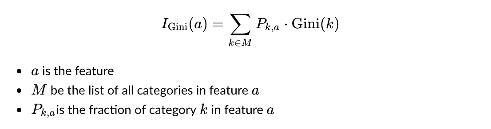
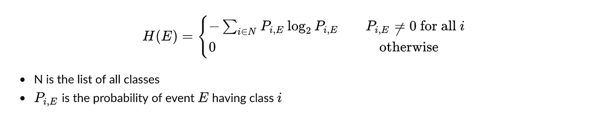

# 决策树基础

> 原文：<https://towardsdatascience.com/decision-tree-fundamentals-388f57a60d2a?source=collection_archive---------5----------------------->

## 学习基尼系数、熵以及如何构建决策树


在 [Unsplash](https://unsplash.com/s/photos/tree?utm_source=unsplash&utm_medium=referral&utm_content=creditCopyText) 上 [veeterzy](https://unsplash.com/@veeterzy?utm_source=unsplash&utm_medium=referral&utm_content=creditCopyText) 拍摄的照片

当谈到决策树的时候，我总是想象当我的女朋友不知道她晚饭想吃什么的时候，我会问她一系列的问题:你想吃点面条吗？你想花多少？亚洲人还是西方人？健康还是垃圾食品？

制作一个问题列表来缩小选择范围，本质上是决策树背后的思想。更正式地说，决策树是一种算法，它根据观察值的特征将它们划分为相似的数据点。

决策树是一种监督学习模型，具有树状结构，即包含**根**、**父/子**节点、**叶**。决策树可用于**分类**或**回归**问题。下图是我用来判断她要不要快餐的二叉分类树的简短版本。


快餐还是非快餐决策树

# I)如何构造决策树？

有两种流行的树构建算法:**分类和回归树(CART)** 和 **ID3** 。这两个模型之间的主要区别是它们使用的成本函数。**成本函数**决定问哪个问题以及如何分割每个节点。构建决策树的伪代码是:

1.  选择一个具有**最佳索引的特征。使用我将在下一节介绍的成本函数来计算指数**
2.  基于所选要素分割数据集
3.  重复这个过程，直到它到达叶子(或满足停止标准)

在这篇文章中，我们将讨论两个成本函数:基尼系数**和熵值**

# (二)基尼系数和基尼系数

## 1)基尼不纯

**基尼系数**是在 **CART** 方法中使用的损失函数。基尼系数衡量一个类别有多少噪音**。**首先，每个数据**特征**可能包含许多**类别**。例如，*天气*特征可以有类别:下雨、晴天或下雪；一个数字特征如*等级*可分为两个块:< 70 或≥70。基尼系数可以通过以下公式计算:


基尼杂质公式

注意最大基尼系数是 0.5。这可以用一些微积分知识来检验。我创建了一个玩具数据集，以更好地说明成本函数对决策树的影响。

```
import pandas as pd
classification=['Freshman','Freshman','Sophomore','Junior','Freshman','Sophomore']
hour_of_practice=['>2h','>2h','>2h','<2h','>2h','<2h']
pass_the_quiz=['Yes','Yes','Yes', 'Yes', 'No','No']
df=pd.DataFrame({'Classification':classification, 
                'hour of practice':hour_of_practice, 
                "Pass the quiz":pass_the_quiz })
df
```


**观察:**大一(F)3 人，大二(S)2 人，大三(J)1 人。从数据来看，大一大二学生学习 2h 以上通过测试，学习 2h 以下不及格。学弟骗系统，一直过关。

让我们计算*分类*栏的基尼系数:


基尼值告诉我们数据集中存在的噪声值。在这种情况下，初级*没有噪声，因为我们知道所有初级都将通过测试。另一方面，大二学生*的噪音最大。

## 2)基尼指数

**基尼指数**将类别噪声结合在一起得到**特征噪声**。基尼指数是基尼系数的加权总和，基于该类别在特征中的相应分数。公式是:



基尼指数公式

将基尼指数应用于*分类*我们得到:


特征“分类”的基尼指数

你应该能够手工计算出学习时间的基尼指数。为了多样化，我创建了下面的代码来计算基尼系数和基尼系数:

```
# Input Format(df, feature name, category name ,target name, list of all classes)
# where df is the current node observationdef gini(df,feature,category,target,classes_list):
    df=df[df[feature]==category]
    def P_i_K(i):
        return len(df[df[target]==i])/len(df)

    result=1-sum([(P_i_K(i))**2 for i in classes_list])
    return result# Input Format(df, feature name, target name, list of all classes)def Gini_index(df,feature,target,classes_list):
    def P_k_a(category):
        return len(df[df[feature]==category])/len(df)

    result=0
    for category in df[feature].unique():
        gini_value=gini(df,feature,category,target,classes_list) 
        P_k_a_value=P_k_a(category)
        result+=gini_value*P_k_a_valuereturn resultprint("Gini Index of Classification",
      Gini_index(df,"Classification","Pass the quiz",['Yes','No']))
print("Gini Index of hour of practice", 
      Gini_index(df,"hour of practice","Pass the quiz",['Yes','No']))>>> Gini Index of Classification 0.38888888888888884
>>> Gini Index of hour of practice 0.41666666666666663
```

由于*分类*比*小时练习*噪音小，所以第一次分割针对*分类*特征*。在讨论完熵的概念后，我们将把树形象化。*

# III)熵和信息增益

## 1)熵

在物理学中，熵代表随机变量的不可预测性。公平硬币中出现头*或尾*或*尾*的几率为 50/50，因此其熵值为 1，这是随机性的最高值。另一方面，具有值 0 表示相应的事件是命中注定的。熵与基尼系数相似，都表明了类别的不可预测性。熵的公式是:



熵公式

将此公式应用于大一、大二和大三学生，我们得到:


特征“分类”的熵

如上所述，二次熵的行为就像一枚公平的硬币，所以它有最高的价值。新生的值非常接近 1，因为它的类是不平衡的。

## 信息增益

在获得每个类别的熵之后，我们可以将它们组合起来，以获得特征的**信息增益**值。我们获得的信息越多越好。公式是:


信息增益公式

将此公式应用于我们的“分类”功能会产生:


我还提供了计算熵和信息增益的代码:

```
# Input Format(df,feature name K,category name,target name, list of all classes)
# Pass feature, category None if want to find the entropy of the whole observation
import math
def entropy(df,feature,category,target,classes_list):

    if (feature!=None)|(category!=None):
        df=df[df[feature]==category]

    def P_i_k(class_):
        return len(df[df[target]==class_])/len(df)

    result=0
    for class_ in classes_list:
        P_i_k_value=P_i_k(class_)
        if P_i_k_value!=0:
            result+=P_i_k_value*math.log(P_i_k_value,2)
    return -1*result# Input Format(df,feature name K,category name,target name,list of all classes)
def InfoGain(df,feature,target,classes_list):
    H_T=entropy(df,None,None,target,classes_list)    
    def P_i_a(category,feature):
        return len(df[df[feature]==category])/len(df)

    result=0

    for category in df[feature].unique():
        result+=P_i_a(category, feature)*entropy(df,feature,category,target,classes_list)
    result=H_T-result
    return resultprint("Information Gain of Classification", 
      InfoGain(df,'Classification','Pass the quiz',['Yes','No']))
print("Information Gain of hour of practice", 
      InfoGain(df,'hour of practice','Pass the quiz',['Yes','No']))>>>Information Gain of Classification 0.12581458369391152
>>>Information Gain of hour of practice 0.044110417748401076
```

因此，*分类*有更多的信息，所以这将是我们的第一次分裂。

# IV)可视化树

在这两种方法中，*分类*是首选。第二个分割是剩余的特性，**小时的学习*，我们得到下面的树:*

**

*我们数据集的决策树*

*注意，这个树是极端有偏差的，因为数据集只有 6 个观察值。真实数据上的决策树要大得多，复杂得多。*

# *v)停止分裂树的标准*

*随着数据变得越来越复杂，决策树也在扩展。尽管如此，如果我们保持树的增长，直到所有的训练数据被分类，我们的模型将会过度拟合。因此，学会何时停止是非常重要的。让我们来看看一些常用的标准:*

***节点中的观测值数量:**理想的上限是总训练数据集的 5%。*

***节点的纯度:**基尼指数显示当前数据集的每个特征有多少噪声，然后选择噪声最小的特征来应用递归。我们可以在这里设置基尼系数的最大值作为停止标准，通知分行是时候做决定了。*

***树的深度:**我们可以预先指定深度的限制，这样树在面对复杂数据集时不会过度膨胀。*

***最大特征**:由于树是按特征分割的，减少特征的数量将导致树的大小减小。只有选择具有高信息增益或低基尼系数的特征才是好主意。*

# ***六)结论***

*当我们看到树是如何构造的以及它是如何调整的，我们可以得出一些关于决策树的结论:*

*   ***很容易解释**。决策树类似于人类做决策的方式。因此，决策树是一个简单的模型，可以为企业带来巨大的机器学习透明度。*
*   ***它不需要缩放/标准化数据**，因为没有涉及使用数据值的计算。*
*   ***未必创造出最好的树**。原因是决策树背后的构造只关注每个节点的最优特征。不能保证最终结果是最优解。*
*   ***也许过度拟合**。很难阻止树的子样本停留在某些节点上。拥有一个从特定群体中学习的树会导致过度拟合。*

*你可以访问我的 [GitHub 库](https://github.com/williamhuybui/Blog-Decision-Tree-Fundamental)下载代码。感谢阅读！*