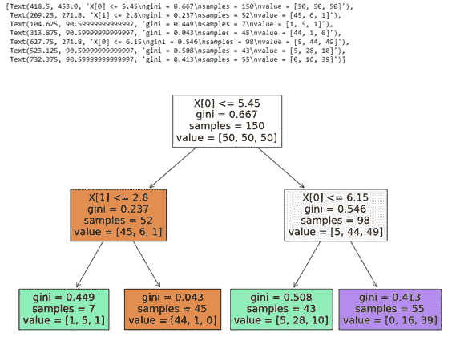
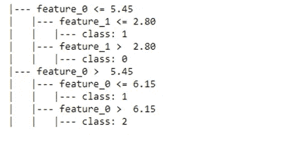
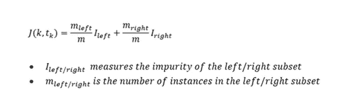
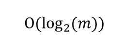
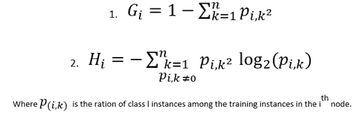
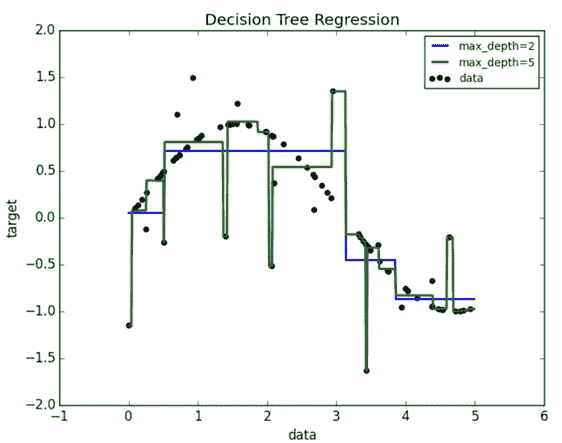
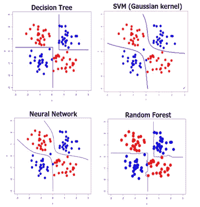

# 决策树:永远记住的 6 件关键事情

> 原文：<https://towardsdatascience.com/decision-trees-6-important-things-to-always-remember-85636858da51?source=collection_archive---------56----------------------->

## 我们不需要深入算法背后的数学知识就能了解决策树。


照片由[延斯·勒列](https://unsplash.com/@leliejens?utm_source=unsplash&utm_medium=referral&utm_content=creditCopyText)在 [Unsplash](https://unsplash.com/s/photos/decision-trees?utm_source=unsplash&utm_medium=referral&utm_content=creditCopyText) 上拍摄

在本帖中，我们将介绍决策树背后的基本原理以及一个实际的实现。

决策树是通用且强大的机器学习算法，可以执行分类和回归任务，甚至多输出任务。决策树也是随机森林的基本组件，是当今最强大的机器学习算法之一。

下面你会发现一个决策树的基本实现(如何训练模型并可视化其分裂),这是使用著名的 IRIS 数据集完成的。

```
**# Importing the necessary libraries**
import pandas as pd
import matplotlib.pyplot as plt
%matplotlib inline
from sklearn.datasets import load_iris
from sklearn import tree
from sklearn.tree import DecisionTreeClassifier**# Load iris**
iris=load_iris()
X= iris.data[:,:2]
y= iris.target**# Creating the decision tree object**
decision_tree= DecisionTreeClassifier(max_depth=2)**# Training the Model**
classifier=decision_tree.fit(X,y)
```

# 可视化决策树和拆分

```
**# Visualizing the decision tree**
plt.figure(figsize=(15,10))
tree.plot_tree(classifier, filled=True)
```



决策树及其分裂的可视化

```
print(tree.export_text(classifier))
```



打印决策树拆分

Scikit-Learn 使用 CART(分类和回归树)来训练决策树，后者只产生二叉树:非叶节点总是有两个子节点。

其思想是决策树使用一个*单一特征* ***k*** 和一个*阈值* ***tk*** (例如 X[0] < 5.45)将训练集分成两个子集。

**如何选择 *k* 和 *tk* ？**

它通过寻找(k，t *k* )的最佳对来产生最纯粹的子集(根据它们的大小加权)。

CART 算法试图最小化的成本函数是:



Cart 训练算法(成本函数)“按作者分类的图像”

然而，其他算法，如 ID3，可以生成具有两个以上子节点的决策树(Quinlan 1986)

> ”还没等龚转发一个小故事来消消气，就已经是相当的焦头烂额了。我从一位教授那里学到了这个著名的算法(ID3 ),这让我着迷，而这位教授正是这个算法的发现者😊"

# **计算复杂度**

即使在处理较大的训练集时，预测也非常快，这是因为决策树需要从根到叶遍历整个树，因为它们通常是平衡的，遍历它们大约需要遍历:



(决策树的计算复杂性)“作者图片”

# **熵还是基尼杂质？**

考虑到决策树及其家族的众多特性之一，它们需要很少的数据准备，它们根本不需要特征缩放。

然而，非常重要的是要注意这种差异。



(基尼系数杂质和熵方程)“作者图片”

大多数情况下，这并没有很大的区别，它们往往导致类似的树。但是，主要区别是:

*   **基尼杂质**计算起来略快(等式 1)。然而，当它们不同时，基尼系数分离出它自己分支中最常见的类别
*   **熵**(等式 2)产生稍微更平衡的树。

在 Scikit-learn 中，默认情况下，模型是用基尼系数杂质设置的。

> **决策树参数**
> 
> (CCP _ 阿尔法=0.0，类 _ 重量=无，**标准= '基尼'**，
> 最大深度=2，最大特征=无，最大叶节点=无，
> 最小杂质 _ 减少=0.0，最小杂质 _ 分离=无，
> 最小样本 _ 叶=1，最小样本 _ 分离=2，
> 最小重量 _ 分数 _ 叶=0.0，预排序= '已弃用'，
> 随机状态=无

# **正则化超参数**

对训练数据做了一些假设:假设数据是非线性的。在大多数情况下，如果决策树不受约束，树结构将非常适合数据集，过度适合数据，不能很好地推广到测试数据。

作为一个非参数模型，它有很多参数。但是因为参数的数目在训练之前没有确定，所以模型可以自由地坚持训练数据。为了避免过度拟合训练数据，我们需要在训练过程中限制决策树的自由度(正则化)。

这可以通过限制决策树的最大深度数来实现，特别是在 Scikit 中，通过设置 ***max_depth 超参数*** (默认设置为 none: Unlimited)来实现学习。减少后者将使模型规范化，并降低过度拟合的风险



来自:数据科学堆栈交换

从上图中我们可以看到，拥有一个 ***max_depth 为 5*** ，会产生一个方差很大的模型，而限制决策树的最大深度对减少模型的过拟合起着关键作用。当然，将它减少到两个对更好地规范模型有巨大的影响。

此外，决策树喜欢制作正交边界(所有分割都垂直于轴),如上图所示，这使它们对训练数据中的小变化非常敏感，并使模型非常不稳定。防止这种情况的一种方法是采用**随机森林，**后者可以通过对许多树进行平均来限制这种不稳定性，这个模型将在未来的帖子中详细分析。



来源:Takashi J. OZAKI via KDnuggets

# 该算法的 6 个关键要点:

*   易于解释(非参数模型)，功能强大，用途广泛。
*   使用少量训练数据进行有效学习，但是对训练数据的微小变化非常敏感。
*   不需要功能缩放。
*   关于训练数据的假设很少(数据是非线性的)。
*   很可能会对训练数据进行过度拟合(没有很好地推广)。
*   喜欢正交决策边界。

希望这个简短的 ML 故事能提供信息！谢谢你