# 决策树:构建 DTs 的逐步方法

> 原文：<https://towardsdatascience.com/decision-trees-a-step-by-step-approach-to-building-dts-58f8a3e82596?source=collection_archive---------4----------------------->


马里乌斯·马萨拉尔在 [Unsplash](https://unsplash.com?utm_source=medium&utm_medium=referral) 上的照片

# 介绍

**决策树(DTs)** 是一种用于分类和回归的非参数监督学习方法。目标是创建一个模型，通过学习从数据特征推断的简单决策规则来预测目标变量的值。决策树通常用于运筹学，特别是决策分析，以帮助确定最有可能达到目标的策略，但也是机器学习中的一种流行工具。

# 语境

在本文中，我们将讨论以下主题

1.  通常什么是决策树
2.  决策树的类型。
3.  用于构建决策树的算法。
4.  构建决策树的逐步过程。

# 什么是决策树？

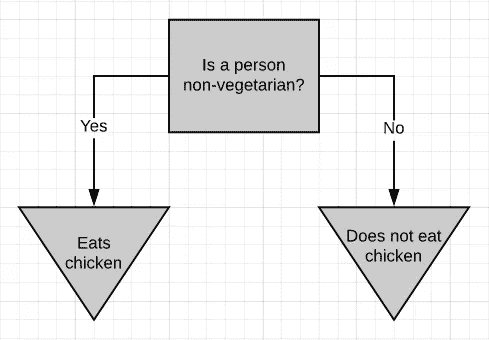

图 1-基于是/否问题的决策树

上图是一个简单的决策树。如果一个人是非素食者，那么他/她吃鸡肉(最有可能)，否则，他/她不吃鸡肉。一般来说，决策树会问一个问题，并根据答案对人进行分类。该决策树基于是/否问题。在数字数据上构建决策树同样简单。

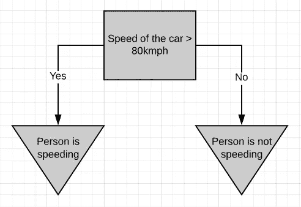

图 2-基于数字数据的决策树

如果一个人开车时速超过 80 英里，我们可以认为这是超速，否则不是。

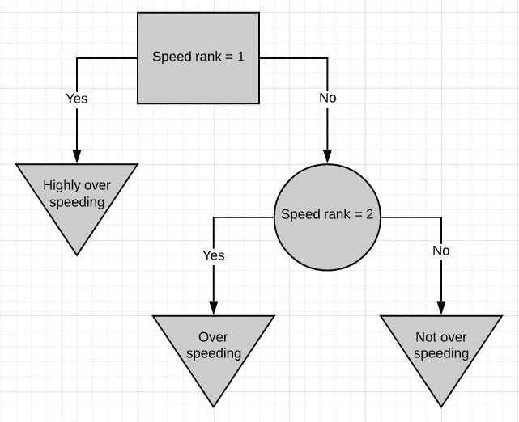

图 3-分级数据的决策树

这里有一个更简单的决策树。该决策树基于分级数据，其中 1 表示速度太高，2 表示速度较低。如果一个人超速超过等级 1，那么他/她就是严重超速。如果这个人在速度等级 2 之上但在速度等级 1 之下，那么他/她超速了，但没超速那么多。如果这个人低于速度等级 2，那么他/她在速度限制内驾驶得很好。

决策树中的分类可以是类别的，也可以是数字的。

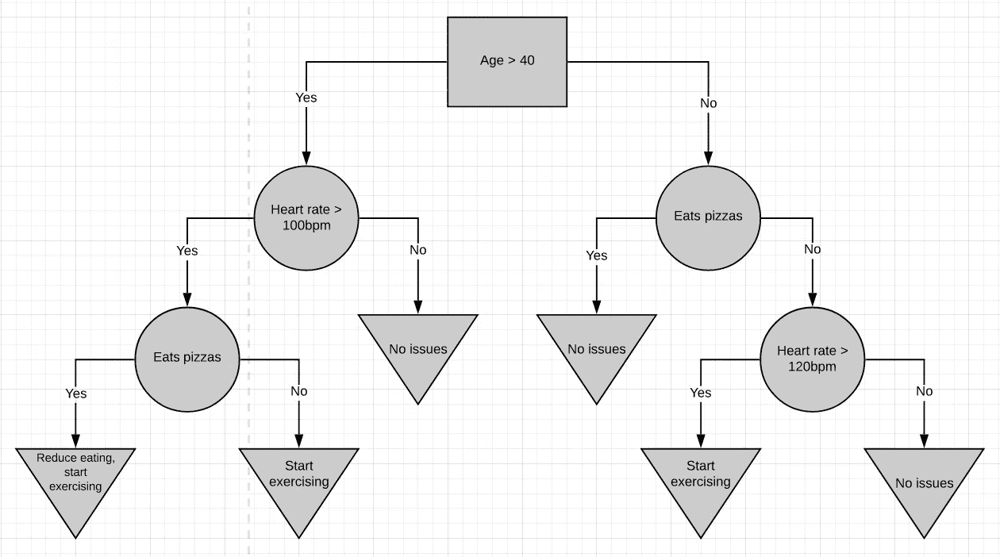

图 4-复杂 DT

这里有一个更复杂的决策树。它结合了数字数据和是/否数据。在很大程度上，决策树很容易使用。你从顶端开始，一路向下，直到你无法再前进。样本就是这样分类的。

树的最顶端被称为 ***根节点*** 或者仅仅是 ***根。*** 中间的节点称为 ***内部节点*** 。内部节点有指向它们的箭头和远离它们的箭头。末端节点被称为 ***叶节点*** 或者仅仅是 ***叶节点*** 。叶节点有指向它们的箭头，但没有远离它们的箭头。

在上面的图中，根节点用矩形表示，内部节点用圆形表示，叶节点用倒三角形表示。

# 构建决策树

构建决策树有几种算法。

1.  CART-分类和回归树
2.  ID3-迭代二分法 3
3.  C4.5
4.  CHAID 卡方自动交互检测

我们将只讨论 CART 和 ID3 算法，因为它们是主要使用的算法。

# 手推车

CART 是一种 DT 算法，根据因变量(或目标变量)是分类变量还是数值变量，分别生成**二进制** *分类*或*回归*树。它以原始形式处理数据(不需要预处理)，并且可以在同一个 DT 的不同部分多次使用相同的变量，这可以揭示变量集之间复杂的相互依赖关系。

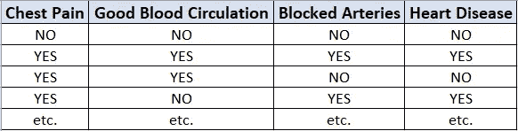

图 5-样本数据集

现在我们将讨论如何从原始数据表中构建决策树。在上面给出的例子中，我们将建立一个决策树，使用胸痛、良好的血液循环和阻塞动脉的状态来预测一个人是否患有心脏病。

我们必须知道的第一件事是哪个特性应该在树的顶部或根节点中。我们先来看看胸痛是如何预测心脏病的。

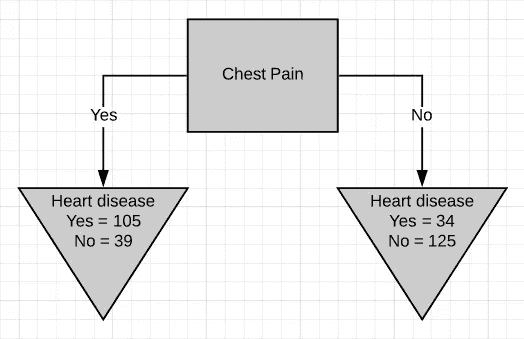

图 6-胸痛作为根节点

有两个叶节点，分别对应胸痛的两种结果。每一个叶子包含有心脏病和没有心脏病的患者的数目，用于对应的胸痛条目。现在我们对良好的血液循环和阻塞的动脉做同样的事情。

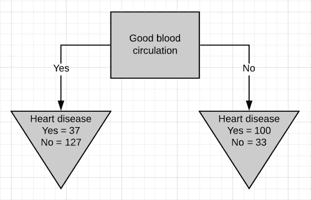

图 7-良好的血液循环作为根节点

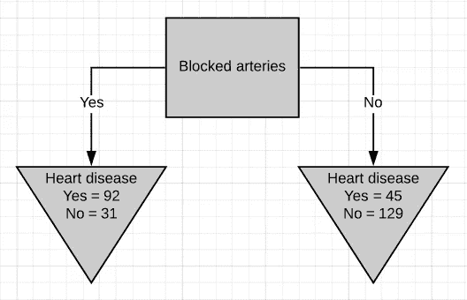

图 8-阻塞的动脉作为根节点

我们可以看到，这三个特征都不能很好地区分心脏病患者和非心脏病患者。值得注意的是，在所有三种情况下，患有心脏病的患者总数是不同的。这样做是为了模拟真实数据集中存在的缺失值。

因为没有一个叶节点不是 100% '有心脏病'就是 100% '没有心脏病'，所以都认为 ***不纯。*** 为了决定哪种分离最好，我们需要一种方法来测量和比较 ***杂质。***

CART 算法中用于测量杂质的指标是 ***基尼杂质分数*** 。计算基尼系数很容易。我们先来计算一下胸痛的基尼杂质。


图 9-胸痛分离

对于左边的叶子，

```
**Gini impurity = 1 - (probability of ‘yes’)² - (probability of ‘no’)²**
              = 1 - (105/105+39)² - (39/105+39)²
Gini impurity = 0.395
```

类似地，计算右叶节点的 Gini 杂质。

```
**Gini impurity = 1 - (probability of ‘yes’)² - (probability of ‘no’)²**
              = 1 - (34/34+125)² - (125/34+125)²
Gini impurity = 0.336
```

现在我们已经测量了两个叶节点的基尼系数，我们可以计算总基尼系数，用胸痛来区分有和没有心脏病的患者。

叶节点不代表相同数量的患者，因为左叶代表 144 名患者，而右叶代表 159 名患者。因此，总 Gini 杂质将是叶节点 Gini 杂质的加权平均值。

```
Gini impurity = (144/144+159)*0.395 + (159/144+159)*0.336
              = 0.364
```

同样,“血液循环良好”和“动脉阻塞”的总基尼系数计算如下

```
Gini impurity for ‘good blood circulation’ = 0.360
Gini impurity for ‘blocked arteries’ = 0.381
```

“良好的血液循环”在树中具有最低的杂质分数，这象征着它最好地分离了患有和未患有心脏病的患者，因此我们将在根节点使用它。

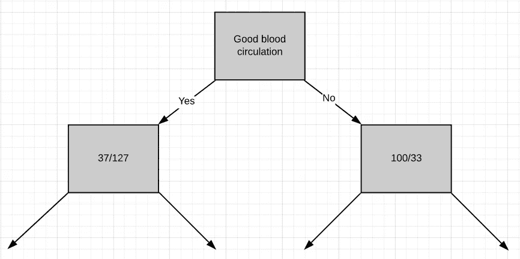

图 10-根节点处良好的血液循环

现在我们需要弄清楚“胸痛”和“动脉阻塞”如何区分左淋巴结的 164 名患者(37 名有心脏病，127 名无心脏病)。

就像我们之前所做的那样，我们将把这些‘胸痛’患者分开，并计算基尼杂质值。

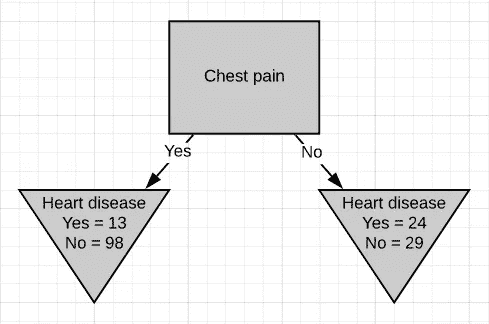

图 11-胸痛分离

基尼系数为 0.3。然后我们对“堵塞的动脉”做同样的事情。

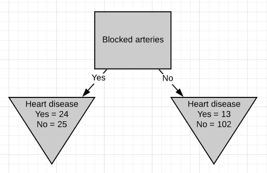

图 12-阻塞动脉分离

基尼系数为 0.29。由于“阻塞的动脉”具有最低的基尼系数，我们将在图 10 的左侧节点使用它来进一步分离患者。

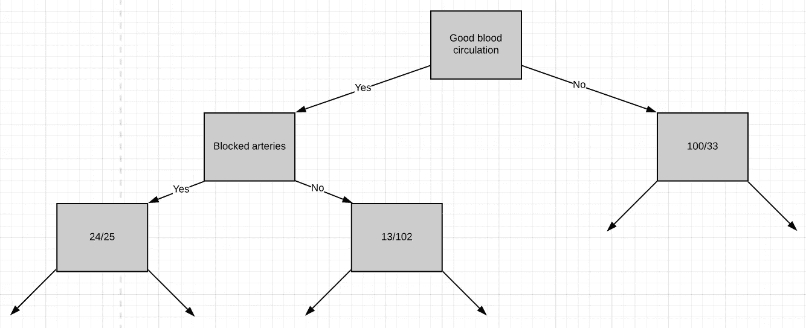

图 13-阻塞动脉分离

我们只剩下“胸痛”，所以我们将看到它如何很好地分离左侧淋巴结中的 49 名患者(24 名有心脏病，25 名无心脏病)。

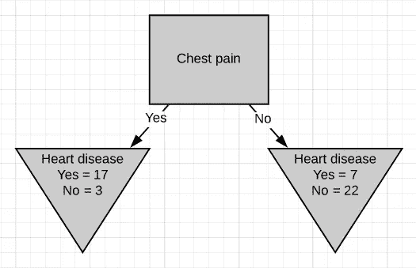

图 14-左侧淋巴结的胸痛分离

我们可以看到胸痛在区分病人方面做得很好。

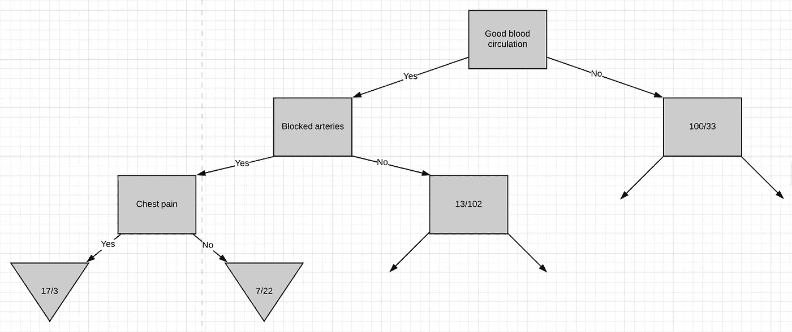

图 15-最终胸痛分离

这些是树的这个分支左边的最后的叶子节点。现在，让我们看看当我们尝试使用“胸痛”来分离具有 13/102 个患者的节点时会发生什么。请注意，这个节点中几乎 90%的人没有心脏病。

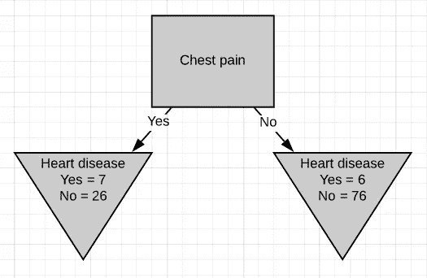

图 16-右侧淋巴结的胸痛分离

这种分离的基尼系数为 0.29。但是在使用胸痛来分离患者之前，母节点的基尼不纯度是

```
Gini impurity = 1 - (probability of yes)² - (probability of no)²
              = 1 - (13/13+102)² - (102/13+102)²
Gini impurity = 0.2
```

如果我们不使用“胸痛”来区分患者，杂质会更低。所以我们将使它成为叶节点。

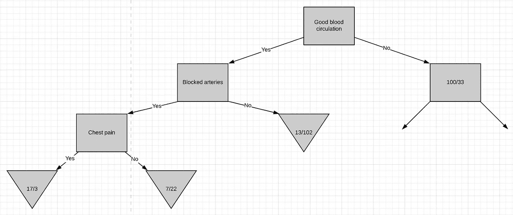

图 17-左侧已完成

此时，我们已经完成了树的整个左侧。按照相同的步骤，计算出树的右侧。

1.  计算基尼系数。
2.  如果节点本身得分最低，那么就没有必要再分离患者，它就变成了一个叶节点。
3.  如果分离数据导致改进，则选择杂质值最低的分离。

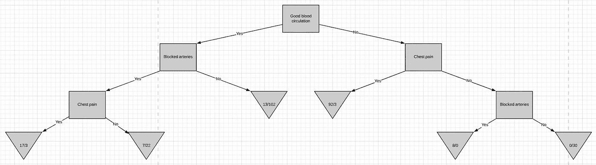

图 18-完整的决策树

# ID3

除了用于测量纯度/杂质的方法之外，使用 ID3 算法构建决策树的过程几乎类似于使用 CART 算法。ID3 算法中用于测量纯度的度量被称为 ***熵*** 。

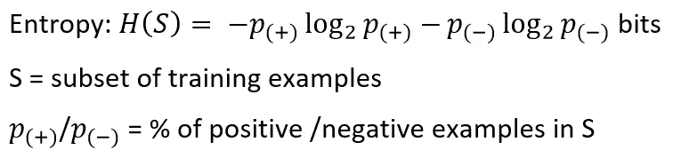

熵是一种度量样本子集中某个类的不确定性的方法。假设项目属于子集 S，具有两个类别正和负。熵被定义为表示 x 是正还是负所需的位数。

熵总是给出一个介于 0 和 1 之间的数。因此，如果使用属性分离后形成的子集是纯的，那么我们将需要 0 位来判断是正还是负。如果所形成的子集具有相等数量的正项和负项，那么所需的位数将是 1。

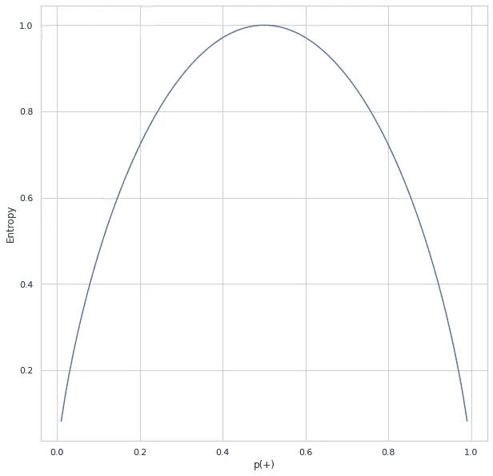

图 19。熵与 p(+)的关系

上图显示了熵和正类概率之间的关系。正如我们所看到的，熵达到 1，这是最大值，这时一个项目有相等的机会成为正的或负的。当 p(+)趋于零(象征 x 为负)或 1(象征 x 为正)时，熵最小。

熵告诉我们每个子集在分裂后有多纯或不纯。我们需要做的是汇总这些分数，检查拆分是否可行。这是通过**信息增益**完成的。

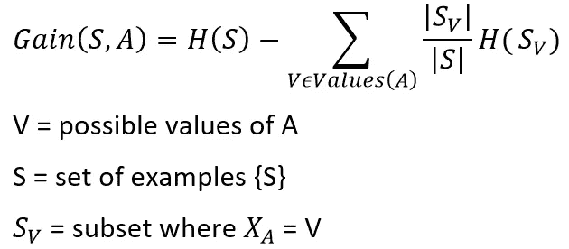

图 20。构建 ID3 树

考虑我们上面讨论的 CART 算法的这部分问题。我们需要从`**chest pain**`和`**blocked arteries**`中决定使用哪个属性来分离包含 164 个患者(37 个患有心脏病，127 个没有心脏病)的左侧节点。我们可以将分裂前的熵计算为

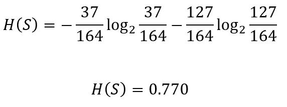

让我们看看`**chest pain**`如何区分病人


图 21-胸痛分离

可以计算左侧节点的熵

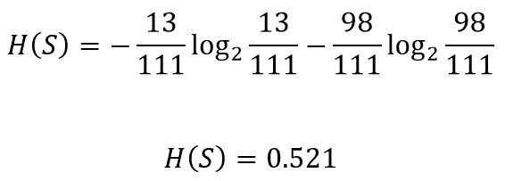

类似地，右边节点的熵

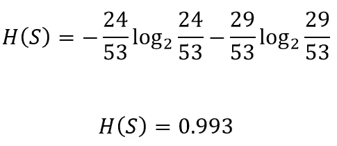

使用`**chest pain**`分裂后熵的总增益

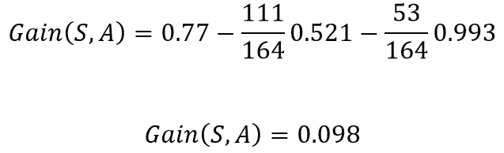

这意味着，如果在当前情况下，如果我们选择`**chest pain**`来分割患者，我们将获得关于患者是否患有心脏病的 0.098 比特的确定性。对`**blocked arteries**`、**、**做同样的事情，得到的增益是 0.117。既然用`**blocked arteries**` 分裂给了我们更多的确定性，那就摘了吧。我们可以对所有节点重复相同的过程，以基于 ID3 算法构建 DT。

注意:可以通过对所需增益值施加最小阈值来决定是将节点分成 2 个还是将其声明为叶节点。如果获得的增益高于阈值，我们可以分裂节点，否则，将其作为叶节点。

# 摘要

以下是这篇文章的要点

1.  决策树背后的一般概念。
2.  决策树的基本类型。
3.  构建决策树的不同算法。
4.  使用 CART 算法构建决策树。
5.  使用 ID3 算法构建决策树。

# 参考

1.  参考 youtube 上的这个播放列表，了解更多关于使用 CART 算法构建决策树的细节。

2.关于使用 ID3 算法构建决策树的更多细节，请参考 youtube 上的这个播放列表。

PS:-我将很快发布另一篇关于回归树和随机森林的文章。 [***敬请期待***](https://medium.com/@skumar.gokul) :)

请在这里查看我关于数据科学和机器学习的其他文章[*。*](https://medium.com/@skumar.gokul)*欢迎在评论和[***LinkedIn***](https://www.linkedin.com/in/gokul-s-kumar)上寻求更深入的讨论。*