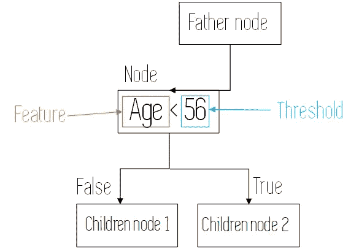
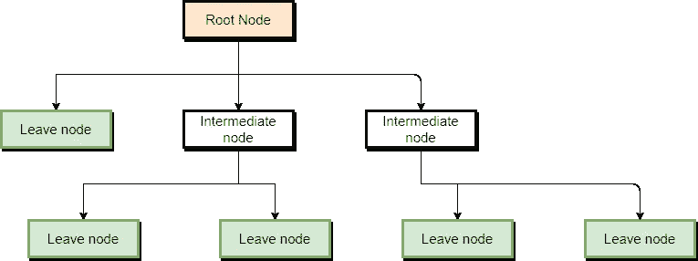
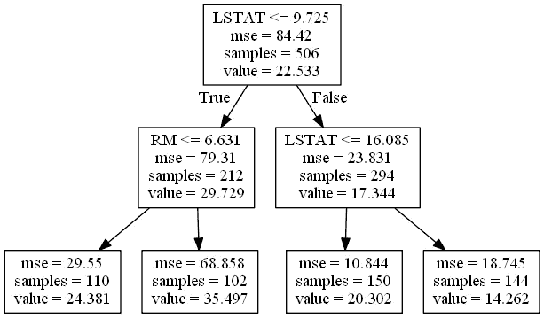
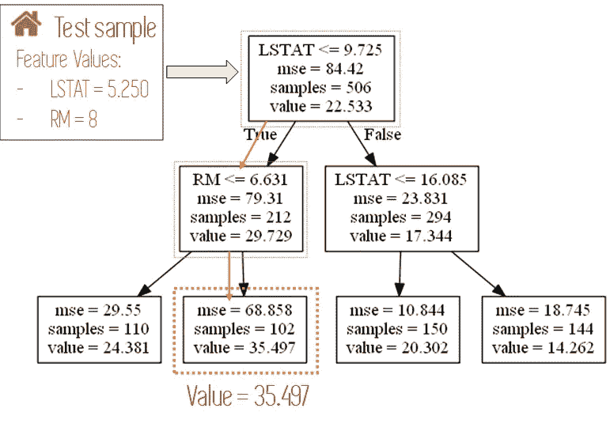

# 决策树解释

> 原文：<https://towardsdatascience.com/decision-trees-explained-3ec41632ceb6?source=collection_archive---------2----------------------->

## 学习机器学习决策树的所有知识


来源: [Unsplash](https://unsplash.com/photos/tGTVxeOr_Rs)

*在这篇文章中，我将简单地解释决策树。它可以被认为是一个傻瓜帖子的决策树，然而，我从来没有真正喜欢过这个表达。*

*在我们开始之前，这里有一些额外的资源，可以让你的机器学习生涯一飞冲天*

```
*Awesome Machine Learning Resources:**- For* ***learning resources*** *go to* [***How to Learn Machine Learning***](https://howtolearnmachinelearning.com/books/machine-learning-books/)*! 
- For more awesome Data Science news, tools, educative articles and platforms* [***subscribe to my newsletter***](https://z-ai.medium.com/subscribe)!
```

[](https://z-ai.medium.com/subscribe) [## 订阅我的专属列表！

### 订阅我的专属列表！获取你喜欢的所有新鲜文章<3! By signing up, you will create a Medium…

z-ai.medium.com](https://z-ai.medium.com/subscribe) 

# Introduction and Intuition

In the Machine Learning world, **决策树**是一种**非参数模型，**可用于分类和回归。

这意味着决策树是灵活的模型，不会随着我们添加更多的特征而增加它们的参数数量(如果我们正确地构建了它们)，并且它们可以输出**分类**预测(*像植物是否属于某种类型*)或者**数字**预测(*像房子的价格*)。

它们由两种元素构成:**节点和**分支。在每个节点上，我们会评估数据的一个特征，以便在训练过程中拆分观察值，或者在进行预测时使特定的数据点遵循特定的路径。



在每个节点，对一个变量进行求值，以决定走哪条路径。

构建决策树时，通过 ***递归*** 评估不同的特征，并在每个节点使用最能拆分数据的特征来构建决策树。这个后面会详细解释。

也许开始解释的最好方法是看看决策树是什么样子的，以建立如何使用它们的快速直觉。下图显示了这些树的一般结构。



决策树的图形。[来源](https://www.diagrams.net/)。

在该图中，我们可以观察到三种节点:

*   **根节点:**是开始图的节点。在普通的决策树中，它评估最能分割数据的变量。
*   **中间节点:**这些是评估变量的节点，但不是进行预测的最终节点。
*   **叶节点:**这些是树的最终节点，在这里进行类别或数值的预测。

好了，现在我们对什么是决策树有了一个大致的概念，让我们看看它们是如何构建的。

# 决策树的训练过程

正如我们之前提到的，决策树是通过递归分割训练样本来构建的，使用的是最适合特定任务的数据特征。这是通过评估某些指标来完成的，如分类决策树的 ***基尼指数*** 或 ***熵*** ，或回归树的 ***残差或均方差*** 。

如果我们在节点处评估的特征是离散的或连续的，则过程也是不同的。**对于** **离散特征**对其所有可能值进行评估，从而为每个变量计算出 N 个度量，N 为每个分类值的可能值的数量。对于连续特征，训练数据的每两个连续值(从最低到最高排序)的平均值被用作可能的阈值。

对于某个节点，该过程的结果是变量列表，每个变量具有不同的阈值，以及每个变量/阈值串联的计算度量(Gini 或 MSE)。然后，我们选择变量/阈值组合，该组合为我们提供用于结果子节点的特定度量的**最高/最低值**(度量中的**最高减少或增加)。**

我们不会深入研究这些指标是如何计算的，因为这与这篇介绍性文章的主题无关，但是如果你感兴趣，我会在最后留下一些资源供你深入研究。目前，只要把这些度量(分类树的基尼系数和回归树的均方误差)想象成某种我们想要减少的误差。

让我们看一个两个决策树的例子，一个分类决策树和一个回归决策树，以更清楚地了解这个过程。下图显示了为著名的鸢尾数据集构建的**分类树，其中我们试图使用花瓣宽度、长度、萼片长度等特征来预测三种不同花朵的类别**


为 Iris 数据集构建决策树

我们可以看到，根节点从三个类别中的每一个的 50 个样本开始，并且基尼指数(因为它是分类树，所以基尼指数越低越好)为 0.667。

在该节点中，最好地分割不同类别的数据的特征是以 cm 为单位的 ***花瓣宽度*** ，使用值 0，8 作为阈值。这产生了两个节点，一个具有 Gini 0(只有一种花的完美纯节点),另一个具有 Gini 0.5，在那里两种其他种类的花被分组。

在这个中间节点(来自根节点的错误路径)中，使用阈值 1，75 来评估相同的特征(是的，这可能发生，并且如果该特征很重要，它实际上经常发生)。现在这导致了另外两个子节点，它们不是纯粹的，但是基尼系数很低。

在所有这些节点中，对数据的所有其他特征(*萼片长度、萼片宽度和花瓣长度*)进行评估，并计算其结果基尼指数，然而，给我们最好结果(最低基尼指数)的特征是花瓣宽度。

树没有继续增长的原因是因为决策树总是配置一个停止增长的条件，否则它们会一直增长，直到每个训练样本都被分成它自己的叶节点。这些停止条件是树的最大深度、叶节点中的最小样本或误差度量的最小缩减。

现在让我们检查一下**回归树**，为此，我们将使用 ***波士顿房价*** 数据集，结果如下图:



为波士顿住房数据集构建的决策树

从上图可以看出，现在我们没有基尼指数，而是有了 **MSE** (均方差)。与前面的基尼系数示例一样，我们的树是使用最大程度地减少这种误差的特征/阈值组合来构建的。

根节点使用阈值为 9.725 的变量***LSTAT***(*%区域*中人口的下层状态)对样本进行初始划分。我们可以看到，在根节点我们有 506，我们分为 212(左子节点)和 294(右子节点)。

左边的子节点使用阈值为 6.631 的变量 ***RM*** ( *每个住所的房间数*)，右边的节点使用阈值为 16.085 的相同的 *LSTAT* 变量，产生了四个漂亮的叶节点。像以前一样，在每个节点上评估所有其他变量，但这两个变量是最好的数据分割变量。

厉害！现在我们知道决策树是如何构建的。让我们来学习它们是如何被用来做预测的。

# 用决策树做预测

使用决策树预测新样本的类别或数值目标值非常容易。这是这类算法的主要优点之一。我们所要做的就是从根节点开始，查看它所评估的特性的值，并根据该值转到左边或右边的子节点。

重复这个过程，直到我们到达一个叶节点。当这种情况发生时，根据我们面对的是分类问题还是回归问题，可能会发生两种情况:

a) **如果我们面临一个分类问题**，预测的类别将是该叶节点上的类别的模式。还记得在分类树中，我们在中间的叶节点上有 value = [0，49，5]吗？这意味着到达该节点的测试样本最有可能属于在该节点上具有 49 个训练样本的类，因此我们将其分类。

b) **对于一棵回归树**，我们在最后做出的预测是目标变量在这个叶节点上的值的平均值。在我们的住房示例中，如果叶节点有 4 个价格为 20、18、22 和 24 的样本，则该节点的预测值将是 21，这是在此结束的 4 个训练示例的平均值。

在下图中，我们可以看到如何为先前的回归树预测一个新的测试样本(一栋房子)。

***注:*** *仅显示树中使用的房屋特征。*



特定样本遵循的路径和给定预测的值。来自[平面图标](https://www.flaticon.com/)的图标。

好吧！现在我们知道如何使用决策树进行预测。让我们通过学习他们的优点和缺点来结束。

# 决策树的利与弊

## 优势:

*   决策树的主要优势是**如何容易**解释**。当其他机器学习模型接近黑盒时，决策树提供了一种图形和直观的方式来理解我们的算法做什么。**
*   与其他机器学习算法相比，决策树需要**更少的数据**来训练。
*   它们可用于**分类**和**回归**。
*   他们是**简单的**。
*   他们容忍**缺失值** s。

## 不足之处

*   他们很容易使**过度拟合**训练数据，并且对异常值敏感。
*   **他们是弱学习者**:单个决策树通常不会做出很好的预测，因此多棵树经常被组合起来形成“*森林*”以产生更强的集成模型。这将在以后的文章中讨论。

[](https://z-ai.medium.com/subscribe) [## 订阅我的专属列表！

### 订阅我的专属列表！获取您喜欢的所有新鲜文章<3! By signing up, you will create a Medium…

z-ai.medium.com](https://z-ai.medium.com/subscribe) 

# Conclusion and additional resources

*决策树是简单而直观的算法，正因为如此，在试图解释机器学习模型的结果时，它们被大量使用。尽管很弱，但它们可以结合起来产生非常强大的 bagging 或 boosting 模型。在接下来的文章中，我们将探索其中的一些模型。*

*如果你想知道构建一棵树的完整过程，可以看看下面的视频:*

*就这些，我希望你喜欢这个帖子。随时* [*在 Twitter 上关注我*](https://twitter.com/Jaimezorno) *在****@ jaimezorno****。还有，你可以看看我在数据科学和机器学习上的帖子**[***这里***](https://medium.com/@jaimezornoza) *。好好读！**

**关于机器学习和数据科学的更多资源，请查看以下资源库:* [*如何学习机器学习*](https://howtolearnmachinelearning.com/books/machine-learning-books/) *！有关职业资源(工作、事件、技能测试)，请访问*[*AIgents.co——数据科学家的职业社区&机器学习工程师*](https://aigents.co/) *。**

**还有，更多类似这样的帖子**[***关注我上媒***](https://medium.com/@jaimezornoza) *，敬请关注！***

***还有，你可以订阅我的邮箱列表在这里获取最新更新和独家内容:* [*订阅邮箱列表*](https://z-ai.medium.com/subscribe) *。***

***最后，为了更深入地了解决策树和机器学习，看看下面文章中描述的书:***

**[](/the-book-to-really-start-you-on-machine-learning-47632059fd0e) [## 让你真正开始机器学习的书

### 让你的机器学习知识更上一层楼

towardsdatascience.com](/the-book-to-really-start-you-on-machine-learning-47632059fd0e) 

非常感谢您的阅读，祝您有美好的一天！**