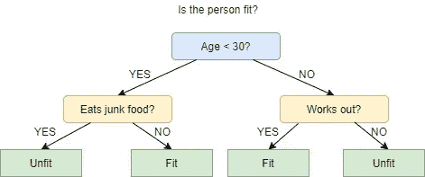
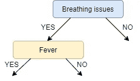
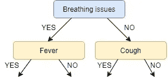
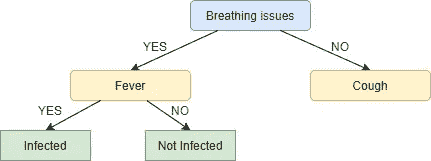
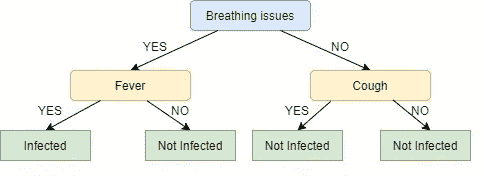

# 决策树:ID3 算法讲解

> 原文：<https://towardsdatascience.com/decision-trees-for-classification-id3-algorithm-explained-89df76e72df1?source=collection_archive---------1----------------------->

本文旨在详细地解释 ID3 算法(用于构建决策树的众多算法之一)。我们用一个**假的**样本新冠肺炎数据集来解释这个算法。


图片提供:【http://keeperofthesouls.com/uncategorized/hello-world/ 

# 什么是决策树？

简而言之，决策树是一种包含节点(矩形框)和边(箭头)的结构，它是从数据集(由代表特征/属性的列和对应于记录的行组成的表)构建的。每个节点要么用来**(*称为决策节点)或 ***表示一个结果*** (称为叶节点)。*

# *决策树示例*

**

*上图描绘了一个决策树，用于对一个人是**适合还是**不适合进行分类。**
这里的决策节点是' '*'这个人是不是不到 30 岁？'这样的问题这个人吃垃圾食品吗？*等。**树叶是两种可能的结果之一，即。**适合**和**不适合**。查看决策树，我们可以说做出以下决定:
如果一个人不到 30 岁，不吃垃圾食品，那么他是健康的，如果一个人不到 30 岁，吃垃圾食品，那么他是不健康的，等等。*****

***初始节点称为**根节点** *(蓝色)*最终节点称为**叶节点** *(绿色)*，其余节点称为**中间节点**或**内部节点**。
根节点和中间节点代表决策，而叶节点代表结果。***

# **ID3 简介**

**ID3 代表迭代二分法 3，之所以这样命名是因为该算法在每一步都迭代地(重复地)将要素二分法(划分)为两个或更多个组。**

**由[罗斯·昆兰](https://en.wikipedia.org/wiki/Ross_Quinlan)发明的 ID3 使用**自上而下的贪婪**方法来构建决策树。简单地说，**自顶向下**方法意味着我们从顶部开始构建树，而**贪婪**方法意味着在每次迭代中，我们选择当前时刻的最佳特征来创建节点。**

**最常见的是，ID3 仅用于具有[名义](https://corporatefinanceinstitute.com/resources/knowledge/other/nominal-data/)特征的分类问题。**

# **数据集描述**

**在本文中，我们将使用新冠肺炎感染的样本数据集。整个数据集的预览如下所示。**

```
****+----+-------+-------+------------------+----------+
| ID | Fever | Cough | Breathing issues | Infected |
+----+-------+-------+------------------+----------+
| 1  | NO    | NO    | NO               | NO       |
+----+-------+-------+------------------+----------+
| 2  | YES   | YES   | YES              | YES      |
+----+-------+-------+------------------+----------+
| 3  | YES   | YES   | NO               | NO       |
+----+-------+-------+------------------+----------+
| 4  | YES   | NO    | YES              | YES      |
+----+-------+-------+------------------+----------+
| 5  | YES   | YES   | YES              | YES      |
+----+-------+-------+------------------+----------+
| 6  | NO    | YES   | NO               | NO       |
+----+-------+-------+------------------+----------+
| 7  | YES   | NO    | YES              | YES      |
+----+-------+-------+------------------+----------+
| 8  | YES   | NO    | YES              | YES      |
+----+-------+-------+------------------+----------+
| 9  | NO    | YES   | YES              | YES      |
+----+-------+-------+------------------+----------+
| 10 | YES   | YES   | NO               | YES      |
+----+-------+-------+------------------+----------+
| 11 | NO    | YES   | NO               | NO       |
+----+-------+-------+------------------+----------+
| 12 | NO    | YES   | YES              | YES      |
+----+-------+-------+------------------+----------+
| 13 | NO    | YES   | YES              | NO       |
+----+-------+-------+------------------+----------+
| 14 | YES   | YES   | NO               | NO       |
+----+-------+-------+------------------+----------+****
```

**这些列不言自明。y 和 N 分别代表是和否。受感染列 Y 和 N 中的值或**类别**分别表示受感染和未受感染。**

**用于生成决策节点的列，即。“呼吸问题”、“咳嗽”和“发烧”被称为特征列或仅称为特征，用于叶节点的列，即“受感染”被称为目标列。**

# **ID3 中的指标**

**如前所述，ID3 算法在构建决策树的每一步都会选择最佳特征。
在你提问之前，这个问题的答案是:“ID3 如何选择最佳功能？”ID3 使用**信息增益**或仅使用**增益**来寻找最佳特征。**

**信息增益计算熵的减少，并测量给定特征分离或分类目标类的程度。具有**最高信息增益**的特征被选为**最佳**特征。**

**简单来说，**熵**是无序度的度量，数据集的熵是数据集目标特征中无序度的度量。
在二进制分类的情况下(其中目标列只有两种类型的类)，如果目标列中的所有值都是同质的(相似的),则熵为 **0** ,如果目标列中两个类的数值相等，则熵为 **1** 。**

**我们将数据集表示为 **S，**熵计算如下:**

```
****Entropy(S) = - ∑ pᵢ * log**₂**(pᵢ) ; i = 1 to n****
```

**其中，
**n** 是目标列中的类的总数(在我们的例子中，n = 2，即“是”和“否”)
**是类“I”的概率**或“目标列中具有类 I 的行数”与数据集中的“总行数”*之比。*******

*******特征栏 **A** 的信息增益计算如下:*******

```
*********IG(S, A) = Entropy(S) - ∑((|Sᵥ| / |S|) * Entropy(Sᵥ))*********
```

*******其中 **Sᵥ** 是 **S** 中特征列 **A** 具有值 **v** 的行集合，| **Sᵥ** |是 **Sᵥ** 中的行数，同样 **|S|** 是 **S.** 中的行数*******

# *******ID3 步骤*******

1.  *******计算每个特征的信息增益。*******
2.  *******考虑到所有的行不属于同一个类，使用信息增益最大的特征将数据集 **S** 分割成子集。*******
3.  *******使用具有最大信息增益的特征制作决策树节点。*******
4.  *******如果所有行都属于同一个类，则将当前节点作为一个叶节点，并将该类作为其标签。*******
5.  *******对剩余的特征重复，直到我们用完所有的特征，或者决策树具有所有的叶节点。*******

# *******在我们的数据集上实现*******

*******如前所述，第一步是找到最佳特征，即具有最大信息增益 **(IG)** 的特征。我们现在将计算每个特征的 IG，但是为此，我们首先需要计算 **S** 的熵*******

*******在我们的数据集 **S** 总共 14 行中，有 **8** 行具有目标值 **YES** 和 **6** 行具有目标值 **NO** 。 **S** 的熵计算如下:*******

```
*********Entropy(S) = — (8/14) * log₂(8/14) — (6/14) * log₂(6/14) = 0.99*********
```

> *******注意:如果我们的目标列中的所有值都相同，熵将为零(这意味着它没有或没有随机性)。*******

*******我们现在计算每个特征的信息增益:*******

*********发热 IG 计算:**
在此(发热)特性中，有值为**是**的 **8** 行和值为**号** 的 **6** 行如下所示，在 **8** 行中，有**是**发热的 **6** 行有目标值**是**和*******

```
*********+-------+-------+------------------+----------+
| Fever | Cough | Breathing issues | Infected |
+-------+-------+------------------+----------+
| YES   | YES   | YES              | YES      |
+-------+-------+------------------+----------+
| YES   | YES   | NO               | NO       |
+-------+-------+------------------+----------+
| YES   | NO    | YES              | YES      |
+-------+-------+------------------+----------+
| YES   | YES   | YES              | YES      |
+-------+-------+------------------+----------+
| YES   | NO    | YES              | YES      |
+-------+-------+------------------+----------+
| YES   | NO    | YES              | YES      |
+-------+-------+------------------+----------+
| YES   | YES   | NO               | YES      |
+-------+-------+------------------+----------+
| YES   | YES   | NO               | NO       |
+-------+-------+------------------+----------+*********
```

*******如下图所示，在 **6 个**行中**号**有 **2 个**行有目标值**是**和 **4 个**行有目标值**号*********

```
*********+-------+-------+------------------+----------+
| Fever | Cough | Breathing issues | Infected |
+-------+-------+------------------+----------+
| NO    | NO    | NO               | NO       |
+-------+-------+------------------+----------+
| NO    | YES   | NO               | NO       |
+-------+-------+------------------+----------+
| NO    | YES   | YES              | YES      |
+-------+-------+------------------+----------+
| NO    | YES   | NO               | NO       |
+-------+-------+------------------+----------+
| NO    | YES   | YES              | YES      |
+-------+-------+------------------+----------+
| NO    | YES   | YES              | NO       |
+-------+-------+------------------+----------+*********
```

*******下面的模块演示了**发热的信息增益的计算。*********

```
*******# total rows **|S| = 14****For v = YES, |Sᵥ| = 8
Entropy(Sᵥ) = - (6/8) * log₂(6/8) - (2/8) * log₂(2/8) = 0.81****For v = NO, |Sᵥ| = 6
Entropy(Sᵥ) = - (2/6) * log₂(2/6) - (4/6) * log₂(4/6) = 0.91**# Expanding the summation in the IG formula: **IG(S, Fever) = Entropy(S) - (|S**ʏᴇꜱ**| / |S|) * Entropy(S**ʏᴇꜱ**) - 
(|S**ɴᴏ**| / |S|) * Entropy(S**ɴᴏ**)****∴** **IG(S, Fever) = 0.99 - (8/14) * 0.81 - (6/14) * 0.91 = 0.13*********
```

*******接下来，我们计算特征**【咳嗽】****【呼吸问题】的 **IG** 。** 你可以使用[这个免费的在线工具](https://planetcalc.com/8421/?license=1)来计算信息增益。*******

```
*******IG(S, Cough) = 0.04
IG(S, BreathingIssues) = 0.40*******
```

*****由于特征**呼吸问题**具有最高的信息增益，它被用于创建根节点。因此，在这个初始步骤之后，我们的树看起来像这样:*****

**********

*****接下来，从剩下的两个未使用的特征，即**发烧**和**咳嗽**，我们决定哪一个最适合**呼吸问题**的左支。
由于**呼吸问题**的左分支表示**是，**我们将使用原始数据的子集，即呼吸问题列中值为**是**的行集。这 **8 行**如下图所示:*****

```
*******+-------+-------+------------------+----------+
| Fever | Cough | Breathing issues | Infected |
+-------+-------+------------------+----------+
| YES   | YES   | YES              | YES      |
+-------+-------+------------------+----------+
| YES   | NO    | YES              | YES      |
+-------+-------+------------------+----------+
| YES   | YES   | YES              | YES      |
+-------+-------+------------------+----------+
| YES   | NO    | YES              | YES      |
+-------+-------+------------------+----------+
| YES   | NO    | YES              | YES      |
+-------+-------+------------------+----------+
| NO    | YES   | YES              | YES      |
+-------+-------+------------------+----------+
| NO    | YES   | YES              | YES      |
+-------+-------+------------------+----------+
| NO    | YES   | YES              | NO       |
+-------+-------+------------------+----------+*******
```

*****接下来，我们使用上面显示的子集 **S** ʙʏ ( **S** et **呼吸**问题 **Y** es)来计算发烧和咳嗽特征的 IG:*****

> *****注意:对于 **IG** 计算，熵将从子集 **S** ʙʏ而不是原始数据集**s**计算*****

```
*******IG(Sʙʏ, Fever) = 0.20
IG(Sʙʏ, Cough) = 0.09*******
```

*****发烧的 IG 大于咳嗽，所以我们选择**发烧**作为呼吸问题的左分支:
我们的树现在看起来是这样的:*****

**********

*****接下来，我们为**呼吸问题**的右分支找到具有最大 IG 的特征。但是，由于只剩下一个未使用的特性，我们别无选择，只能将其作为根节点的右分支。我们的树现在看起来像这样:*****

**********

*****没有更多未使用的特性，所以我们在这里停下来，跳到创建叶节点的最后一步。
对于发烧的左叶节点，我们看到原始数据集中具有**呼吸问题**和**发烧**两个值的行子集为**是**。*****

```
*******+-------+-------+------------------+----------+
| Fever | Cough | Breathing issues | Infected |
+-------+-------+------------------+----------+
| YES   | YES   | YES              | YES      |
+-------+-------+------------------+----------+
| YES   | NO    | YES              | YES      |
+-------+-------+------------------+----------+
| YES   | YES   | YES              | YES      |
+-------+-------+------------------+----------+
| YES   | NO    | YES              | YES      |
+-------+-------+------------------+----------+
| YES   | NO    | YES              | YES      |
+-------+-------+------------------+----------+*******
```

*****由于目标列中的所有值都是 **YES，**我们将左叶节点标记为 **YES** ，但是为了使其更符合逻辑，我们将其标记为 **Infected。*******

*****类似地，对于发烧的右节点，我们看到原始数据集中具有**呼吸问题**值的行的子集为**是**，而**发烧**为**否**。*****

```
*******+-------+-------+------------------+----------+
| Fever | Cough | Breathing issues | Infected |
+-------+-------+------------------+----------+
| NO    | YES   | YES              | YES      |
+-------+-------+------------------+----------+
| NO    | YES   | YES              | NO       |
+-------+-------+------------------+----------+
| NO    | YES   | YES              | NO       |
+-------+-------+------------------+----------+*******
```

*****此处**值**中除**外大部分**都是**否，**因此**否**或**未感染**成为我们的**右叶节点。** 我们的树，现在看起来是这样的:*****

**********

*****我们对节点**咳嗽**重复相同的过程，但是这里左右叶结果是相同的，即**无**或**未感染**，如下所示:*****

**********

*****看起来很奇怪，不是吗？我知道！呼吸问题的正确节点与类为“未感染”的叶节点一样好。这是 ID3 的缺点之一，它不做修剪。*****

*****修剪是一种通过删除不必要的节点来减少决策树的大小和复杂性的机制。更多关于修剪的信息可以在这里找到[。](https://en.wikipedia.org/wiki/Decision_tree_pruning)*****

*****ID3 的另一个缺点是过度拟合或高方差，即它学习它使用的数据集如此之好，以至于它无法对新数据进行归纳。*****

# *****摘要*****

*****我们详细介绍了 ID3 算法的过程，并看到了使用该算法创建决策树是多么容易，只需使用两个度量标准，即熵和信息增益。*****

*****希望你们喜欢，伙计们！！！
感谢阅读*****

# *****参考资料:*****

*****[https://www . cise . ufl . edu/~ DDD/cap 6635/秋季-97/Short-papers/2.htm](https://www.cise.ufl.edu/~ddd/cap6635/Fall-97/Short-papers/2.htm)*****