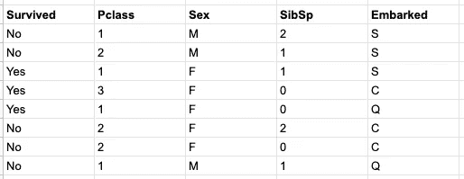
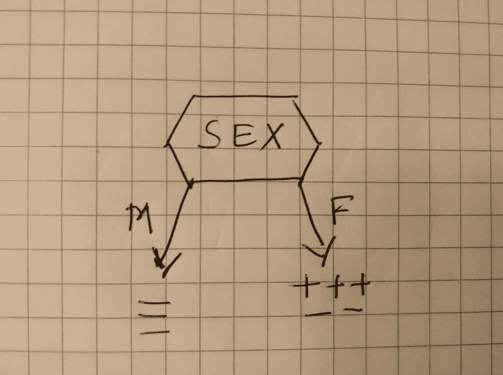
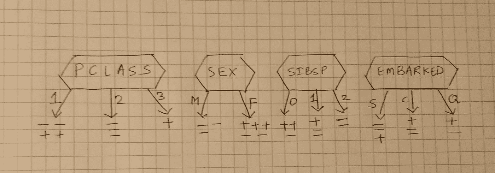
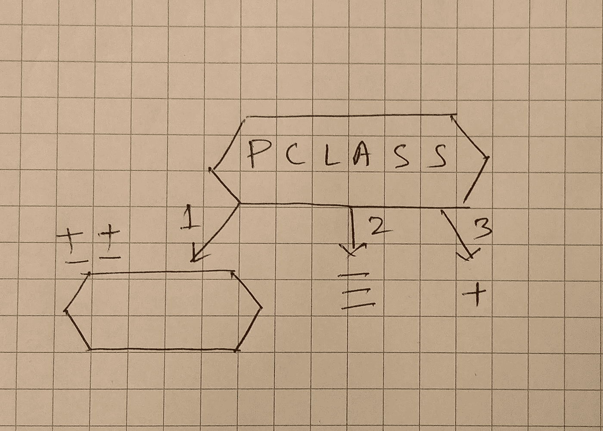
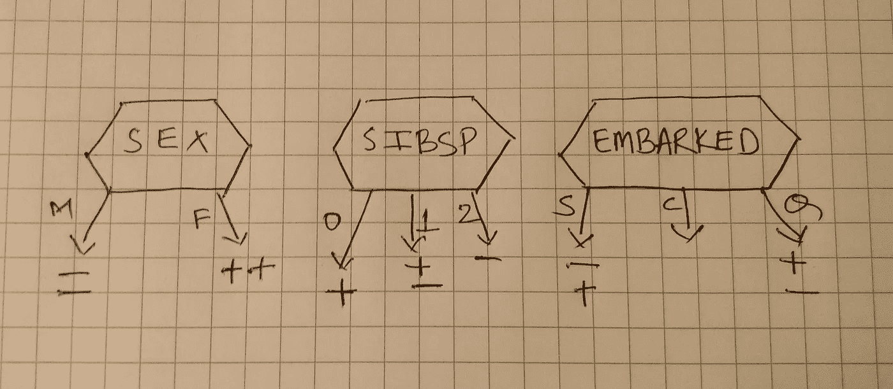
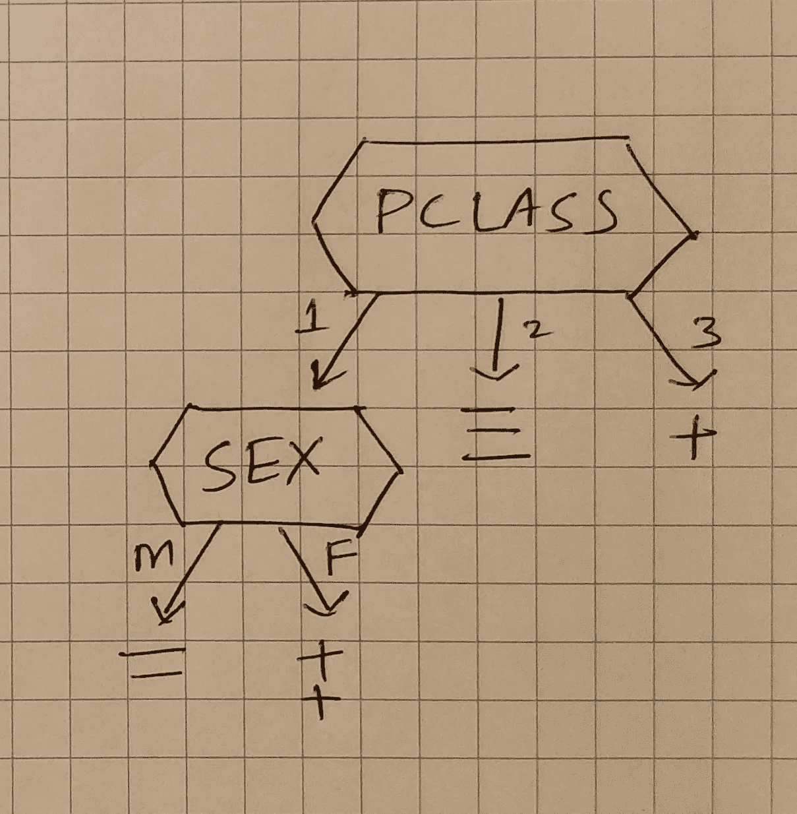

# 傻瓜决策树

> 原文：<https://towardsdatascience.com/decision-trees-for-dummies-37dbee6c7169?source=collection_archive---------9----------------------->

## 直观的方法

在 [Unsplash](https://unsplash.com/s/photos/tree-yellow?utm_source=unsplash&utm_medium=referral&utm_content=creditCopyText) 上由 [Collie Coburn](https://unsplash.com/@colliesr?utm_source=unsplash&utm_medium=referral&utm_content=creditCopyText) 拍摄的照片

让我们看看我最喜欢的泰坦尼克号数据集。完整的数据集可以在[这里](https://www.kaggle.com/c/titanic/data)找到。为了便于说明，我只取了八个数据点。实际数据集包含大约 700 个数据点。

我们的目标是创建一个决策树，可以预测一个人是否会生存。在这种情况下，我在数据集中只使用了四个特征，即 **Pclass、Sex、SibSp、**和**abowed**

*   Pclass —机票等级(1、2 或 3)
*   性别——乘客的性别(男或女)
*   SibSp——兄弟姐妹/配偶的数量(0、1 或 2)
*   上船——乘客在哪里上船(C、S 或 Q)

在我们进入决策树之前，让我们先了解一下数据科学背景下的树的解剖结构(参见下图中的树)。

*   一棵树有**节点**和**分支**。
*   分支连接节点。
*   用分支连接的节点之间存在父子关系。(节点 C 是节点 A 的子节点)
*   **节点的深度**定义为从该节点到根节点的分支数(节点 G 的深度为 2)。
*   没有子节点的节点称为**叶节点**。(节点 E、F、G 和 D 是叶节点)

树木解剖学

我们的目标是构建这样一个树，其中每个树节点代表一个特征测试(例如，乘客的性别是什么？)，每个**分支** (M 或 F)代表测试的结果，每个**叶**节点代表一个类标签(**幸存**与否)。我知道我在一行里说了很多，但是一旦你看到下面的图表，就很容易理解了。该图显示了对特征**性别**的测试，该特征在其分支上有两个可能的结果( **M** 和 **F** )。 **M** 的叶节点包含 3 个非存活者(3 个负)，而 **F** 的叶节点包含 3 个存活者和 2 个非存活者(3 个正 2 个负)。简单。

样本测试

您可能已经听说过，ML 模型应该足够简单，以高精度预测看不见的(测试/实时)数据([记住！偏倚和方差的权衡](https://en.wikipedia.org/wiki/Bias%E2%80%93variance_tradeoff)。如果在树的上下文中思考，深度最小(或者叶节点最少)的树将是最简单的。现在的问题是，我们如何创建这样一个简单的测试树？换句话说，我们应该选择哪些测试，以什么样的顺序，来防止一个树变得复杂？

为了构建这样一棵树，在每一步中，我们都将贪婪地选择一个可以更均匀地分离数据集的测试**(我们将在几分钟内讨论均匀性)。让我们在上面提到的泰坦尼克号数据集的背景下选择一个测试。我们有四个测试可供选择:**

1.  ****Pclass** 测试**
2.  ****性**测试**
3.  ****SibSp** 测试**
4.  ****开始进行**测试**

**我们一个一个来看。**

****+** ' —存活标签
' **-** ' —未存活标签**

****

**可能的测试**

**这里的目的是选择最好的测试。所谓最好的测试，我们指的是更清楚地区分幸存者和非幸存者的测试。仅仅为了举例说明，我将通过计算测试中清晰分离的数据点的数量来判断测试的质量(或者给它们打分)。一旦他们被评分，我们将选择最高分的测试。下面的计算将有助于更清楚地理解同质性的含义。**

**在 **Pclass** 测试中(查看上图进行可视化):**

*   ****二级**明明有**三个**数据点，**全部**都没有存活下来。因此，这个群体显然是同质的。所以，它被授予**三个**点。**
*   ****第三类**有一个数据点，并且完全同质。所以，奖励一分。**
*   ****第一类**不是同质的(两个幸存者和两个非幸存者)。所以，它被授予 **0** 分。**

**因此，Pclass 检验的总同质点是 4 (3 + 1)。同样，如果你计算其他测试的同质性:
性别测试— 3 分
SibSp 测试— 2 分
上船测试— 0 分**

**因此，最明显的赢家是 Pclass 测试。这个测试产生最大的同质性。现在我们已经决定了第一个测试，这是到目前为止树的样子。**

****

**中间决策树**

**下一步会有点棘手。我们必须选择另一个测试，试图将 4 个(剩余的)非同类数据点(属于第一类)分成同类数据点(或叶节点)。**

**同样，我们列出所有的测试，并找到它们的同质性得分。测试结果是这样的。我们没有考虑 **Pclass** 测试，因为该测试将不再能够均匀地划分剩余的 4 个数据点。**

****

**二级测试**

**这一次明显的赢家是**性**测试(4 分)。因此，我们最后的决策树是—**

****

**最终决策树**

**因此，如果我们必须解释这个模型，那么一个人幸存了，如果—**

**a.他们有一张三等票。或者，
b .他们有一张**头等**票，他们是**女**。**

**这种方法的唯一问题是它不适用于大型数据集。原因是，几乎不可能找到一个测试来清晰地划分数据点，从而均匀地划分。有各种方法来衡量同质性。在这里阅读它们—**

1.  **[基尼系数](https://datascience.stackexchange.com/questions/56013/how-does-decision-tree-with-gini-impurity-calculate-root-node)**
2.  **[熵和信息增益](/entropy-how-decision-trees-make-decisions-2946b9c18c8)**

**我希望上面讨论的例子至少能够给你提供一个关于决策树如何工作的直觉。**