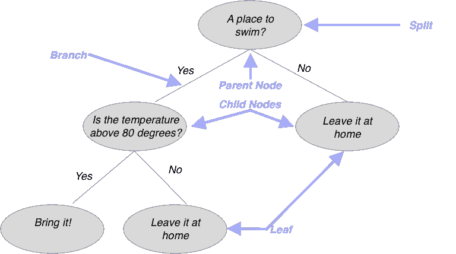
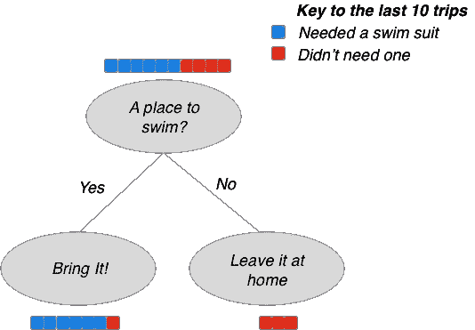
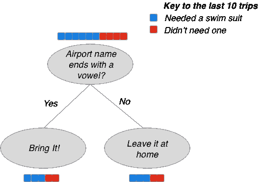
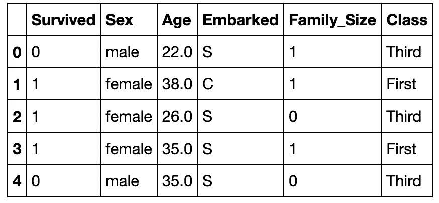
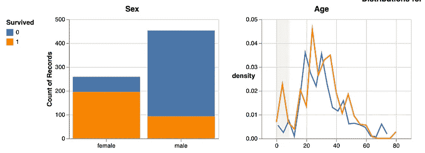
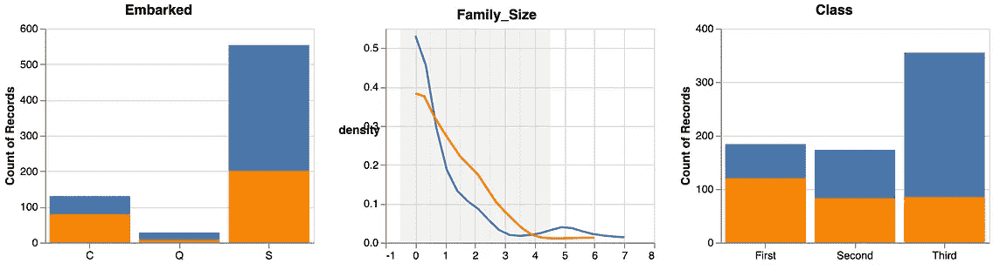
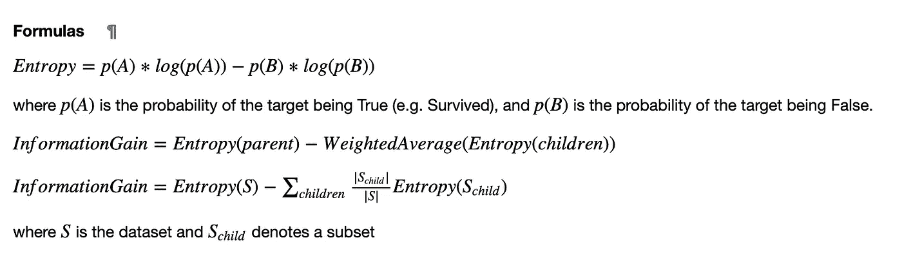
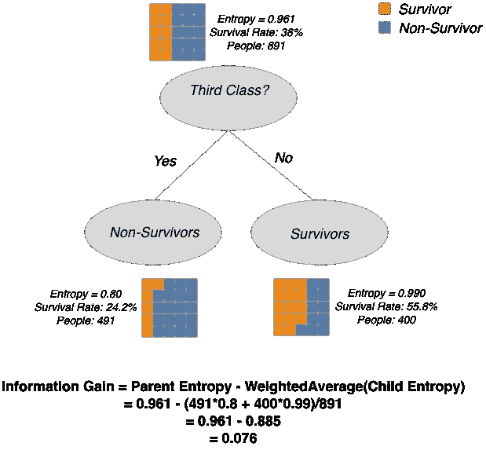
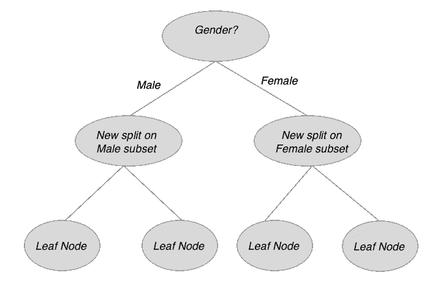
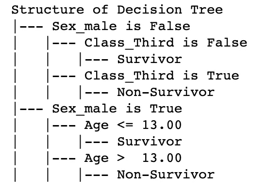

# 从根向上的决策树

> 原文：<https://towardsdatascience.com/decision-trees-from-the-root-up-1f169b6e0460?source=collection_archive---------48----------------------->

## 手动构建一个最优决策树，以理解这个 ML 拥护者令人惊讶的常识性机制。

照片由 [Unsplash](https://www.unsplash.com) 上的[延斯·勒列](https://unsplash.com/@leliejens?utm_source=unsplash&utm_medium=referral&utm_content=creditCopyText)拍摄

决策树是数据科学中的基本模型类型之一。幸运的是，他们提供了一个很好的例子，说明计算机如何自动化简单的人类直觉来构建大型复杂的模型。事实上，决策树优化了一个简单的标准，它反映了我们在日常生活中如何做决定。了解预测模型如何反映我们自己的心理模型，让我们能够批判性地思考它们可能会如何出错，以及一个好的模型是什么样子的。

**本教程概述**

本文的目标是提供一个交互式的决策树理论介绍。学完本教程后，您应该能够:

*   描述决策树的结构和功能。
*   使用熵和信息增益的概念手工构建一个小决策树。
*   关于算法实现如何大规模构建决策树的原因。

**访问本教程的代码**

本文中的代码和可视化都是使用 numpy、pandas 和 Altair(图片由作者提供，除非另有说明)在 Python 中生成的。您可以使用下面的方法跟随图表并与之交互。既然目的是手工构建自己的决策树，那么这个强烈推荐！

*   方法一: [Github](https://github.com/MattJBritton/InteractiveDecisionTrees) 。克隆或派生存储库，并通过 binder/environment.yml 中的 YAML 文件安装环境
*   方法二: [NBViewer](https://nbviewer.jupyter.org/github/MattJBritton/InteractiveDecisionTrees/blob/master/InteractiveDecisionTrees.ipynb) 。访问带有交互式图表的笔记本版本。
*   方法三:[粘合剂](https://mybinder.org/v2/gh/MattJBritton/InteractiveDecisionTrees/master?filepath=InteractiveDecisionTrees.ipynb)。在线访问笔记本的完整实时版本。您可以修改并运行笔记本，甚至可以用另一个数据集进行尝试。
*   方法 4:按照整篇文章中的链接查看 Datapane 上的交互式图表。

# **什么是决策树？**

决策树是一种逻辑模型，可以帮助您根据已知数据做出预测。这种预测包括某事是否会发生，或者某个项目是否属于某个类别。例如，根据患者的病史预测肿瘤是恶性还是良性。

这种预测是通过一系列是或否的问题做出的。病人吸烟吗？”是一个帮助决策树将数据划分为子集的问题，每个子集都有自己的行为。如果这个行为比整个数据集更容易预测，那么这个决策树是有效的。让我们用一个日常的例子来具体说明这一点。

**决策树的日常例子**

毫无疑问，你已经在人生的某个阶段做了一个决策树。让我们以度假打包行李为例。你应该带泳衣吗？您的决策过程可能看起来有点像这样:

灰色表示树的实际结构，而紫色箭头表示关键术语。

决策树总是从单个节点(顶部灰色气泡)开始，代表要问的第一个问题。在这个例子中，我们询问我们的目的地是否有游泳的地方。这个问题被称为分裂。它必须是“是/否”——请注意，我们通过在 80 度处创建一个阈值来处理温度定量标度。

最终，我们到达一个“叶”节点。这是我们做决定的地方。还要注意，每个节点都是两个“子”节点的“父”节点，除非它是叶节点。

# **构建好的决策树**

这个模型对我们来说有直观的意义。但是，请记住，在机器学习中，我们必须评估模型，我们经常会处理复杂的数据集，而我们对这些数据集的直觉有限。那么我们该如何评价上面的模型呢？更广泛地说，区分好模型和坏模型的特征是什么？几个例子会对我们有所帮助。

一个好的决策树产生相对“纯”的子节点，一个坏的决策树通过问一个不相关的问题来延续不确定性。

在左边，我们有一个好的决策树的例子。我们可以评估这种心理模型的有用性的一种方法是问我们自己，在我们最近的 10 次旅行中，它会有怎样的表现，这里用彩色方块表示。红色代表不需要泳衣的旅行，蓝色代表需要泳衣的旅行。

我们可以看到，我们最初有一个 60/40 的分割，但是我们的“否”分支全部是红色的。换句话说，在我们过去的 10 次旅行中，有 3 次我们事先知道没有游泳的地方，在所有这些旅行中，我们都没有后悔没有穿泳衣。所以当我们对这个问题回答“不”的时候，我们可以非常确定我们正在做出正确的决定。

在我们过去的 10 次旅行中，有 7 次我们知道可以游泳的地方，而在这 7 次中的 6 次中，这是正确的选择。最后一个发生了什么？可能是太冷了，也可能是泳池意外关闭。好的一面是，对于我们的两个分支，我们能够做出比不提问时更好的猜测。

**糟糕的决策树**

在右边，我们有一个问题，似乎和泳衣没有任何关系。此外，我们可以看到，我们的问题将我们过去的旅行细分为两个子集，每个子集都具有相同的“把它带回家”或“把它留在家里”分裂。如果两个是/否分支有相同的分布(60/40)，那么问这个问题并没有给我们任何新的信息。那么，我们当初为什么要费神问这个问题呢？

**定义一个“好的”决策树**

我们可以根据这一观察结果，暂时声明我们构建决策树的目标是产生问题尽可能少的“纯”子节点。因此，如果这是树的目标，那么每一次分割都应该旨在尽可能地“净化”其子节点。

坚持这个“纯洁”的概念，因为它很快就会有用。与此同时，让我们转向一个真正的数据科学问题。

## 在泰坦尼克号数据集上手工构建决策树

对于我们真正的问题，我们将使用泰坦尼克号的数据集。每一行都是一名乘客以及人口统计和旅行信息，比如他们的年龄、性别和机票等级。通常的目的是预测乘客是幸存还是死亡。

泰坦尼克号数据集的前 5 行。

我们如何着手建立一个决策树来预测哪些乘客幸存下来？什么是好的第一次分裂？

没有任何统计或可视化工具，我们所能做的就是任何关于这个数据集或领域的现有知识。也许我们看过电影，猜测幸存的女性比男性多。或者我们可以利用对世界和船的设计的了解来猜测头等舱的乘客比三等舱的乘客过得好。

当然，作为数据科学家，我们经常会被要求根据新领域的数据或者我们之前没有多少直觉的数据建立模型。换句话说，**我们需要一种数据驱动的方式来选择好的拆分**。我们可以从每个特性在每个类中的分布开始(存活和死亡)。我们将使用堆积条形图表示分类特征，使用 [KDE](/histograms-and-density-plots-in-python-f6bda88f5ac0) (核密度估计，基本上是一个平滑的直方图)图表示定量特征。

5 个特征中幸存和死亡乘客的分布。

我们如何使用分布来确定候选人分裂？当查看分类变量时，我们希望选择一个分布与其他类别明显不同的类别。例如，我们可以看到男性和女性的存活率不同。对于定量变量，我们寻找一条线比另一条线高得多的区域。年龄似乎符合这个要求，独自旅行的人也是如此(*家庭规模< 1* )。

但是现在我们有几个潜在的分裂，我们如何评估它们是否有好处呢？我们如何比较多个选项？

还记得我们之前讨论的“纯子节点”目标吗？我们可以用这个概念来建立一个分割的“好”的定量测量。

# 熵和信息增益

我们将定义*熵*，一个节点纯度的度量标准，以及*信息增益*，一个从父节点到其子节点的*熵*的度量标准。下面你会找到定义和公式。如果这有点令人困惑，请随意跳到下面的图片，该图片展示了上下文中的指标。

**熵**

*   衡量节点“纯净”程度的指标。
*   基于两个类别的比率，例如幸存者与非幸存者的比率。
*   范围从 0 到 1。0 表示纯节点(所有幸存者或反之亦然)，1 表示 50/50 分割。请注意，熵为 1 对应于“最坏的情况”，我们最不可能做出有根据的猜测。

**信息增益**

*   分割降低熵的程度(降低越大越好，因为目标是 0)。
*   等于父节点的熵减去子节点熵的加权平均值。
*   构建决策树的算法在具有最高信息增益的每个节点上寻找分裂。

熵和信息增益公式

## 可视化父节点和子节点的熵

通过在决策树结构上叠加计算，我们可以更直观地了解如何选择最佳拆分。下图评估了分割*类=第三类*的信息增益。

拆分“类=第三”的信息增益计算。

橙色和蓝色的方块显示了每个节点的存活/死亡情况。对于每个节点，我们也有熵、存活率和人数。总之，这些事实讲述了一个关于数据集的故事，并允许我们评估这种拆分可能有多好:

*   我们的数据集整体由 891 人组成，其中 38%幸存。因为 38/62 的分裂非常接近 50/50，所以我们的熵几乎是 1。
*   491 名乘客(55%)属于三等舱。这些人只有 24%的存活率，比总体水平要差得多。对于这个子集，熵因此下降到 0.8。
*   在右边的分支，我们有头等舱和二等舱的乘客，他们更有可能幸存。这个子集有 56%的存活率。然而，尽管我们已经了解了这个群体的一些重要情况，这里的熵实际上比整个数据集中的要高一点。56%的存活率比人口 40%的存活率更接近 50/50——注意，在确定熵时，方向并不重要。
*   因为我们分裂的一边有明显较低的熵，而另一边基本上保持不变，低熵子集更大，这种分裂确实降低了总熵。这体现在底部的信息增益公式中。
*   这种分离的信息增益是 0.076。请注意，这个数字作为一个绝对量(相对于目标变量的总熵)有意义，但与其他分割相比最有用。

## 手工构建决策树

有了信息增益的概念，我们现在可以计算个体分裂的相对价值。构建决策树的算法可以快速评估许多潜在的分裂，以找到最佳分裂。要手动完成这项工作，我们需要一个工具来帮助我们。

这种交互式可视化让我们尝试了许多潜在的分裂。以前的功能分布图已经增加了选择分割的功能，只需单击条形图中的类别或平移定量功能即可。当选择分裂时，下面的子图表列出了左和右子集的信息增益和熵。

注意，为了可读性，熵和信息增益数字被乘以 100。否则，上面的例子可以完全重现。

用于调查可能分裂的交互式可视化。查看[数据面板](https://datapane.com/mbritton/reports/2494c592-ea45-402a-b1ab-6f6cb34ea2c7/)上的大图。

## 构建决策树的下一层

在信息获取方面有一个明显的赢家:男性/女性是迄今为止最好的划分。然而，假设我们想要一个更复杂的多变量模型，我们可以在左侧和右侧重复这个过程，以确定每个节点的最佳分割。我们现在正在构建一个如下所示的模型:

您可以使用以下女性和男性子集的交互式可视化。这个版本增加了一个折线图，显示所有可能的分割的信息增益。寻找任何有趣的场景，其中多个分割具有相似的信息增益值。

**女**

为女性子集选择最佳分割。

**男**

为男性子集选择最佳分割。

## 将我们的手工制作的圣诞树与 Scikit-Learn 的版本进行比较

现在，我们可以将这个简单的手工制作的模型与实现决策树算法产生的版本进行比较，比如 scikit-learn 中的版本。以下代码执行基本的数据清理和特征工程，然后构建模型并输出其结构。

scikit-learn 决策树的结构。输出来自 export_text()方法。

该模型具有 0.312 的总信息增益(从第一节点到叶子)，以及 0.796 的精确度。你也有同样的发型吗？

## 结论

我们有时认为机器学习模型是一种与我们自己完全不同的智能类型。然而，在这种情况下，至少，建模的过程是植根于我们可能用来解决问题的相同类型的常识性解决方案。决策树是使用简单的迭代贪婪最大化*熵*构建的，熵是一个我们有直觉的量。

此外，熟悉树构造算法有助于我们作为数据科学家理解和欣赏我们可以用几行代码创建的模型中固有的权衡。

在我关于决策树的下一篇文章中，我们将基于这些概念来分析更复杂的决策树的结构，并理解树如何能够*过度适应*一个训练集。理解好的决策树的结构特征，并将不同类型的结构放入分类法中，对于数据科学家来说是非常有用的技能。

## 脚注

分割的替代术语包括*规则*或*测试节点。*我在这里使用 *split* 来引起人们对谓词如何将数据集分割成子集的注意。

数据集由 [Kaggle](https://www.kaggle.com/c/titanic/data) 上“列车”子集中的 891 名乘客组成。年龄列的缺失数据已被估算。详情见[源代码](https://github.com/MattJBritton/InteractiveDecisionTrees)。

你会经常看到*基尼杂质*作为分裂节点的替代标准。例如，scikit-learn 将此作为默认标准，并能够切换到信息增益。虽然这种数学略有不同，但概念上的考虑是相同的，并且在实践中使用哪一种并不重要。