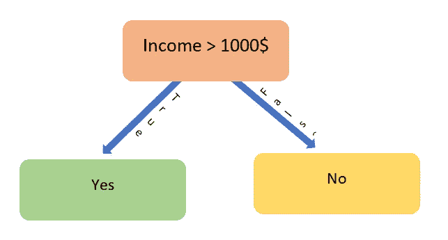
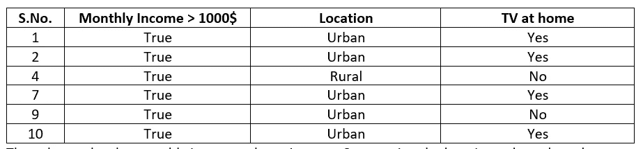

# 决策树——如何在纸上画出它们

> 原文：<https://towardsdatascience.com/decision-trees-how-to-draw-them-on-paper-e2597af497f0?source=collection_archive---------17----------------------->

图片来自 [Pixabay](https://pixabay.com/?utm_source=link-attribution&utm_medium=referral&utm_campaign=image&utm_content=576847)

本文将讨论:

*   决策树——监督机器学习中一种著名的分类算法
*   决策树背后的基础知识以及如何在没有计算机的情况下开发决策树

你应该已经知道的:

*   统计和概率基础

说到机器学习中的分类问题，像逻辑回归、[判别分析](https://wildregressor.blogspot.com/2020/03/linear-discriminant-analysis-basics.html)等算法。是那些浮现在人们脑海中的。还有一种非常直观、易于解释和理解的分类算法，称为决策树算法。基于树的模型可以用于回归和分类，但是我们在这里只讨论分类的情况。下面画了一个典型的决策树，让你熟悉这个概念:

上面的决策树显示了在一个随机的家庭中找到一台电视的机会。显而易见，上面的树表明，如果一个人的月收入超过 1000 美元，他就会在家里拥有一台电视，否则就会失去。上面的树可以看作是根据下面的数据开发的模型的可视化表示。这里的“**月收入“**是预测变量，“**在家看电视”**是反应变量。

让我们用一个简单的方法来处理上面的数据集。总共有 10 个数据点，在月收入栏下，有 6 个**真值**和 4 个**假值**。现在，我们先只分析**真**值。在 6 个**真**值中，有 4 个在国内**电视**栏下对应行有**是**，有 2 个有**否**反对。考虑中的行如下所示:

上述数据被认为是不纯的，因为存在混合响应值(4 **是**2**否**)对同一预测值**为真。**对我们来说，理想的数据集应该是只有**是**对**真值**或**否**对**真值**的数据集。在这种情况下，决策应该是非常容易和直接的。但是由于回答是混合或不纯的，我们不会在这里做出任何结论，让我们分析月收入栏下的其他值:

上面的数据集也是不纯的，对于**假**的同一个预测值，这里有一个混合响应变量值。由于大多数反对**真**的值是**是**，反对**假**的值是**否**，这意味着发现**是**反对**真**的概率更大，反对**假**的**否**的概率也更大，因此决策树如上图所示。单一预测变量模型看起来很简单。当模型中涉及多个变量时，事情就变得复杂了。我们很快就会看到这一点，但是让我们把注意力转移到上面介绍的一个术语上，叫做杂质。

**杂质及其测量**

杂质意味着我们的数据是多么的不均匀。在上面的例子中，正如已经提到的，如果预测器列中的每个**真**值在响应列中都有一个**是**，事情会变得更加简单，反之亦然。在几乎所有的实际情况下，情况并非如此，我们通常会得到混合数据集。我们需要找到一种测量杂质的方法。已经有两种方法来衡量数据的不纯或不均匀程度:

虽然它们都在相同程度上测量杂质，并导致了类似模型的发展，但我们在这里只考虑熵。让我们讨论熵方程中的各种参数。 *Pi* 是目标/响应变量中第 I 类的概率，例如，如果目标变量的类分布为[0，0，1，0，1，1，0，1，1]，P(0) = 4/9，P(1) = 5/9。将这个概念应用于表 1，我们将得到 P(是)= 5/10 和 P(否)= 5/10。转到另一个参数，注意以 2 为底的对数函数的使用。如果你想知道更多关于等式中基数 2 的用法，你应该读读 [**这个**](https://en.wikipedia.org/wiki/Entropy_(information_theory)) 。

现在我们已经有了熵的等式，让我们首先计算所有数据的熵(表 1)。因为**是**值出现了 5 次，并且**否**值也出现了 5 次，所以我们有:

现在让我们计算在**真**分割下的数据的熵(表 2)。这里的目标变量是“**在家看电视”**有两个类“**是**”和“**否**”。**是**值出现 4 次，而**否**出现 2 次。

假设目标变量只有一个类别(完全纯)，那么熵应该是:

这示出了具有完全同质性的数据集的熵= 0，并且很容易示出完全不纯的数据集(以相等的数量存在的每个类别观察)的熵为 1。

同样，在**错误**分割下的数据的熵将是:

引入收入变量后，数据的净熵可以通过对其拆分下的两个熵值进行加权平均来计算

熵的流动需要被清楚地理解。最初，它是 1，**真**分割将它减少到 0.917，**假**分割将它减少到 0.811。收入变量的净减少量为 0.874。这就是我们所期待的，通过变量的引入，熵(异质性的杂质)的减少。总缩减量为 1–0.874 = 0.126。这个数(0.126)被称为**信息增益**，是决策树模型开发中非常重要的参数。

这就是如何通过熵计算来计算杂质的程度。现在让我们在模型开发中应用这个概念。

**模型开发**

现在，除了上述通过月收入猜测电视拥有量的信息之外，假设后来我们注意到，不仅月收入，还有另一个影响结果的变量，该变量是一个人的位置，他是住在城市还是农村。让更新后的数据集如下所示:

无论我们目前知道什么，上面的数据集给我们带来了一个两难的选择。两难的问题是:我们的决策树是从收入预测器开始还是从位置预测器开始。我们将尝试通过对两个预测值进行熵计算来解决这一难题，但让我们将位置变量与目标变量分开，如下所示:

让我们分别计算收入和位置变量下的熵:

如你所见，月收入的熵低于位置变量的熵，我们可以说月收入变量比位置变量更能降低系统的异质性，信息增益为 1–0.874 = 0.126。按照信息增益标准，我们的决策树应该再次从月收入变量开始，如下所示:

虽然我们已经找到了第一个变量，但我们不能就此结束。我们还有另一个变量可以使用，它可以提高我们模型的效率。现在下一个问题是把它放在哪里，沿着树。对于位置变量，我们有两个可能的位置&都将传递不同的数据值给它&因此有不同的信息增益。我们将把它放在信息获取最大的地方。让我们计算一下，找出答案。

**真值**栏如下所示:

月收入一栏下的数值是一样的。根据列值分离 location 列，我们将得到如下所示的表:

上述计算可以如下图所示:

如果我们将位置变量置于错误分割下，计算和数据表将如下所示:

月收入一栏下的数值是一样的。根据列值分离 location 列，我们将得到如下所示的表:

上述计算可以想象为:

因为错误分割下的信息增益小于真实分割，所以决策树看起来像:

找到**城市**预测值的**是**值的概率大于**否**值，因此有上述安排。

上面的树表明，如果收入低于 1000 美元，家庭中将没有电视，如果收入高于 1000 美元，则我们必须检查家庭的位置，如果是城市，则可以找到电视，否则就是其他。

决策树就是这样发展起来的。决策树的结果通常不如其他分类模型(如逻辑回归或线性判别分析)准确，但当理解或解释系统的需要大于预测的需要时，它们是有用的。

现在你已经理解了开发决策树的概念，让我们来理解决策树中使用的各种术语。

**节点**:节点是表示决策树中一个变量的东西，比如收入和位置就是节点。

**根节点**:树开始的节点，如上述决策树中的收入。

**叶节点**:最底层的节点，在这里决定目标变量的值，例如 location 是上述树中的叶节点。

**拆分**:将一个节点拆分成两个或多个子节点的过程称为拆分

到目前为止，我们所做的任何事情的 Python 代码如下所示:

如果你觉得上面的概念很有趣，你可以进一步阅读下面提到的主题:

*   [**随机森林**](https://en.wikipedia.org/wiki/Random_forest)
*   [**装袋**](https://en.wikipedia.org/wiki/Bootstrap_aggregating)
*   [**助推**](https://en.wikipedia.org/wiki/Boosting_(machine_learning))

谢谢，

玩得开心:)

如果你对这篇文章有任何疑问，你可以通过 LinkedIn[联系我](https://in.linkedin.com/in/tanvirhurra)

*原载于 2020 年 4 月 4 日 http://wildregressor.com***。**