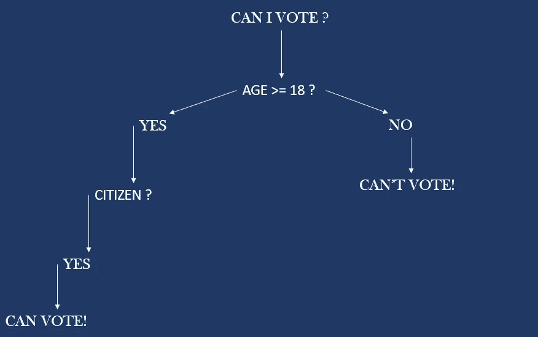
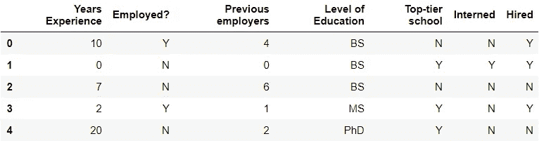
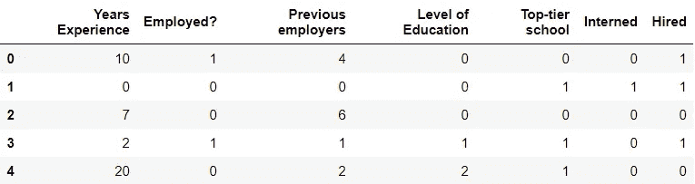
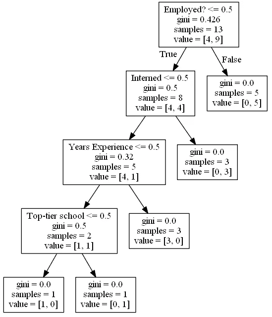

# 机器学习中的决策树

> 原文：<https://towardsdatascience.com/decision-trees-in-machine-learning-d974efc37779?source=collection_archive---------53----------------------->

## 手推车初学者指南

有没有想过人类大脑在做决定时是如何工作的？在走上任何道路之前，要理解无限的可能性，所有关于奖励和惩罚的心理计算都必须考虑，以实现最佳的决策路线。是的，我们的大脑确实是一个杰作，我们将讨论如何教会我们的计算机决策的艺术。

决策树是用于分类和回归任务的监督学习中的预测工具。它们现在被称为 **CART** ，代表“分类和回归树”。决策树方法按照从根到叶遍历树状图形的算法，在每一步基于特定条件分割数据集。在每一个阶段，树的节点代表问题的可能测试用例，沿着节点的任何边前进代表一个可能的解决方案。


由[阿迪·戈尔茨坦](https://unsplash.com/@adigold1?utm_source=medium&utm_medium=referral)在 [Unsplash](https://unsplash.com?utm_source=medium&utm_medium=referral) 上拍摄的照片

# 决策树

让我们看看决策树是什么样子的。



基本决策树

该图说明了一个简单的决策场景，其中一个人必须决定他/她是否有资格投票。因此，决策树从根开始，尝试根据用户的输入做出决策。在这里，这是一个分类问题，一个人只有当他/她是这个国家的公民并且年满 18 岁时才有资格投票。

您现在可能会想，这可以在任何编程语言中使用简单的 if-else 语句来实现。但是，我向你保证，事情要比这复杂得多。

当涉及到庞大而复杂的数据集时，在整个树中进行决策时需要考虑各种参数。因此，决策树帮助我们做出这些决定。

让我们看一个实际的例子，我们将根据一个人的属性来预测他是否能被录用。

# 招聘预测

让我们从导入数据集开始。

```
import numpy as np
import pandas as pd
from sklearn import tree # import decision tree from scikit learn librarydf = pd.read_csv("PastHires.csv" , header = 0) # Read the dataset
```

让我们看看这里有什么。



为了能够使用机器学习，数据集中的每个字母条目都必须转换为数字。

转换“已雇用？”中的“Y”条目、“顶级学校”、“实习”和“聘用”列设置为 1，所有“N”项设置为 0。

```
# Convert the alphabetical entries to numerical entries
d = {'Y': 1, 'N': 0}
df['Employed?'] = df['Employed?'].map(d)
df['Top-tier school'] = df['Top-tier school'].map(d)
df['Interned'] = df['Interned'].map(d)
df['Hired'] = df['Hired'].map(d)
```

让我们也把他们的资格映射成数字。0 分代表理学士，1 分代表理硕士，2 分代表理博士。

```
d = {'BS': 0, 'MS': 1, 'PhD': 2}
df['Level of Education'] = df['Level of Education'].map(d)
```

数据集现在看起来像这样，

```
df.head()
```



“已雇用”列中的目标列是我们需要预测的列，其余列是我们在做出决策时考虑的功能。

因此，将 features 列从目标中分离出来。

```
# List the factors involved in making the decision to hire or not
features = list(df.columns[:6])
features
```

在构建我们的树之前，让我们在 x 中调用我们的特性，在 y 中调用我们的目标。

```
y = df["Hired"]
X = df[features]
```

是时候建造我们的圣诞树了。我们将使用树包中的 **DecisionTreeClassifier()** 方法来制作我们的树。

```
clf = tree.DecisionTreeClassifier() # Decision tree Classifier
clf = clf.fit(X,y)
```

决策树现在已经准备好了。为了可视化树，我们必须安装 pydotplus 和 graphviz 包。

```
pip install pydotplus graphviz
```

现在，想象决策树。

```
from IPython.display import Image  
from sklearn.externals.six import StringIO  
import pydotplusdot_data = StringIO()  
tree.export_graphviz(clf, out_file=dot_data,  
                         feature_names=features)  
graph = pydotplus.graph_from_dot_data(dot_data.getvalue())  
Image(graph.create_png())
```

😲是啊！我们刚刚得到了一个惊人的决策树，可能是这样的。



决策树

## 推理

让我们分析一下我们刚刚得到的决策树，它对于理解这个算法是如何工作的至关重要。在任一点上，从树的右边往下，表示一个人被雇用，从左边往下，表示这个人没有被雇用。可以观察到一个人“就业？”值> 0.5 的列立即被雇用。被雇佣的人。列的值小于 0.5，但在“Interned”列中的值大于 0.5。类似地，可以评估树中的其他节点。该树有某些度量标准，它为自己设置了这些度量标准，以便在遍历该树时逐步做出决策。

# 预言

## 随机森林

随机森林只不过是大量的决策树。它将树的数量作为输入，并生成许多决策树的组合。最后，在分类的情况下，预测基于众数，在回归的情况下，预测基于平均数。

我们将使用 sci-kit 学习库中的 **RandomForestClassifier()** 方法。让我们生成 10 个这样的决策树。

```
from sklearn.ensemble import RandomForestClassifierclf = RandomForestClassifier(n_estimators=10) # Set number of decision trees
clf = clf.fit(X, y)
```

我们将使用这个随机森林来预测一个具有特定属性的人是否会被雇佣。对具有以下特征的人的预测:

*   15 年的经验
*   已经被雇佣了
*   4 名前雇主
*   博士资格
*   顶级学校毕业的，而且
*   已经实习

```
print (clf.predict([[15, 1, 4, 2, 1, 1]]))
[1]
```

现在，让我们预测另一个有特征的人:

*   1 年经验
*   未就业
*   0 以前的雇主
*   学士资格证书
*   不是来自顶级学校
*   没有实习过

```
print (clf.predict([[1, 0, 0, 0, 0, 0]]))
[0]
```

# 结果

我们看到，在第一种情况下，非常适合这份工作的人甚至不需要一直沿着决策树往下走，就立即被归类为被雇用。在第二种情况下，这个人不符合公司雇佣他所需要的特征。

在运行多个测试用例的预测时，我们可以观察到，预测的值有时会发生变化。这是因为随机森林分类器方法每次运行时都会考虑随机生成的树。这是完全正常的，因为我们在虚构的数据集中只使用了 14 个条目。随着数据集大小的增加，需要考虑的不同组合也越来越多，这可以提高决策树的纯度。

耶！🙌我们刚刚建立了一个决策树，可以根据一个人的属性来预测他是否可以被录用。

希望你们都明白决策树在机器学习领域的重要性。如有任何疑问，请随时通过我的 [LinkedIn](https://www.linkedin.com/in/k-g-prajwal-a6b3b517a/) 联系我。完整的代码可以在我的 [GitHub](https://github.com/K-G-PRAJWAL?tab=repositories) 上找到。

## 谢谢大家！