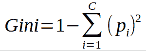
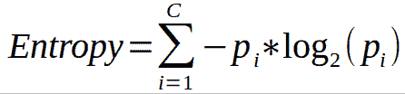
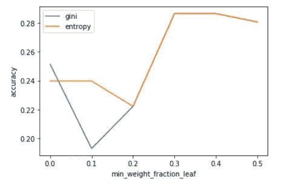
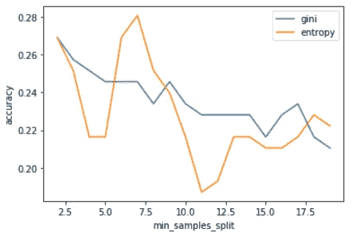
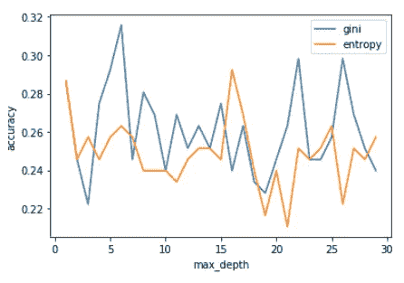

# 决策树:参数优化

> 原文：<https://towardsdatascience.com/decision-trees-parametric-optimization-344354bd3db5?source=collection_archive---------37----------------------->

当我们开始处理数据时，我们(通常总是)观察到数据中几乎没有错误，比如缺失值、异常值、没有适当的格式等等。简而言之，我们称之为不一致性。这种一致性或多或少会扭曲数据，并妨碍机器学习算法进行正确预测。

之前我们观察了异常值如何影响我们的分析。此外，我们观察到，k-NN 分类器在我们去除异常值并优化其参数后提高了准确性，而对我们来说，我们的决策树分类器表现不佳。一种猜测是，我们没有优化分类器的参数，所以在本文中，我们将看看分类器是否不适合这项任务，或者需要更多的考虑。

如果您还没有阅读这篇文章，您可以在这里找到它:

[](https://medium.com/@babandeepsingh411993/effect-of-outliers-in-classification-ed7e8b6d39f8) [## 分类中异常值的影响

### 介绍

medium.com](https://medium.com/@babandeepsingh411993/effect-of-outliers-in-classification-ed7e8b6d39f8) 

让我们看看是否可以使用 DT 分类器的参数来提高我们的准确度。

```
*class* sklearn.tree.**DecisionTreeClassifier**(***, *criterion='gini'*, *splitter='best'*, *max_depth=None*, *min_samples_split=2*, *min_samples_leaf=1*, *min_weight_fraction_leaf=0.0*, *max_features=None*, *random_state=None*, *max_leaf_nodes=None*, *min_impurity_decrease=0.0*, *min_impurity_split=None*, *class_weight=None*, *presort='deprecated'*, *ccp_alpha=0.0*)
```

# *判断标准*

衡量分割质量的函数。有两个最突出的标准是{ '基尼'，'熵' }。

**基尼指数**是通过从 1 中减去每一类概率的平方和来计算的。它倾向于更大的分区。



**熵或信息增益**将类别概率乘以该类别概率的对数(基数=2)。



我们使用这两个标准并检查它们与 *max_depth、minimum_samples_split、minimum_weight_fraction_leaf 的相互作用如何。*

# 最小重量分数叶

要求位于叶节点的权重总和(所有输入样本)的最小加权分数。当未提供 sample_weight 时，样本具有相等的权重。

```
fractions = [0,0.1,0.2,0.3,0.4,0.5]from sklearn.metrics import accuracy_score
min_weight_fraction_leaf = []
acc_gini = []
acc_entropy = []for i in fractions:
 dtree = DecisionTreeClassifier(criterion='gini', min_weight_fraction_leaf=i )
 dtree.fit(X_train, y_train)
 pred = dtree.predict(X_test)
 acc_gini.append(accuracy_score(y_test, pred))
 ####
 dtree = DecisionTreeClassifier(criterion='entropy',min_weight_fraction_leaf=i)
 dtree.fit(X_train, y_train)
 pred = dtree.predict(X_test)
 acc_entropy.append(accuracy_score(y_test, pred))
 ####
 min_weight_fraction_leaf.append(i)
d = pd.DataFrame({'acc_gini':pd.Series(acc_gini), 
 'acc_entropy':pd.Series(acc_entropy),
 'min_weight_fraction_leaf':pd.Series(max_depth)})
# visualizing changes in parameters
plt.plot('min_weight_fraction_leaf','acc_gini', data=d, label='gini')
plt.plot('min_weight_fraction_leaf','acc_entropy', data=d, label='entropy')
plt.xlabel('min_weight_fraction_leaf')
plt.ylabel('accuracy')
plt.legend()
```

从下图中，我们可以观察到，对于这两个标准，精度都较高，为 0.3。

为什么？

在向叶节点、终端节点中的样本提供权重之后，我们得到了相似的准确度、可能相似的信息增益以及两个标准之间共享的杂质。这意味着我们得到的是纯节点。



# 最小 _ 样本 _ 分割

分割内部节点所需的最小样本数:

*   如果是 int，那么就把`min_samples_split`当做最小数。
*   如果是 float，那么`min_samples_split`是一个分数，`ceil(min_samples_split * n_samples)`是每次分割的最小样本数。

```
min_samples_split = []
acc_gini = []
acc_entropy = []
for i in range(2,20,1):
 dtree = DecisionTreeClassifier(criterion='gini', min_samples_split=i )
 dtree.fit(X_train, y_train)
 pred = dtree.predict(X_test)
 acc_gini.append(accuracy_score(y_test, pred))
 ####
 dtree = DecisionTreeClassifier(criterion='entropy',min_samples_split=i)
 dtree.fit(X_train, y_train)
 pred = dtree.predict(X_test)
 acc_entropy.append(accuracy_score(y_test, pred))
 ####
 min_samples_split.append(i)
d = pd.DataFrame({'acc_gini':pd.Series(acc_gini), 
 'acc_entropy':pd.Series(acc_entropy),
 'min_samples_split':pd.Series(max_depth)})
# visualizing changes in parameters
plt.plot('min_samples_split','acc_gini', data=d, label='gini')
plt.plot('min_samples_split','acc_entropy', data=d, label='entropy')
plt.xlabel('min_samples_split')
plt.ylabel('accuracy')
plt.legend()
```



从上面的图表中，我们可以看到熵在 min_samples_split 为 7 时工作得更好。

为什么？

从数学上来说，熵考虑了样本和它们的信息增益来建立一棵树。因此，在样本数量的最佳值下，我们可以获得更多关于进一步分割的信息。另一方面，虽然基尼系数在较大的分区中效果最好。我们拥有的数据包含杂质，这些杂质会导致精度随着 min_samples_split 的增加而降低。

# 最大深度

树的最大深度。如果没有，则扩展节点，直到所有叶子都是纯的，或者直到所有叶子包含少于 min_samples_split 样本。因此，让这两个参数协调工作是一个很好的做法。

```
max_depth = []
acc_gini = []
acc_entropy = []
for i in range(1,30):
 dtree = DecisionTreeClassifier(criterion='gini',max_depth=i )
 dtree.fit(X_train, y_train)
 pred = dtree.predict(X_test)
 acc_gini.append(accuracy_score(y_test, pred))
 ####
 dtree = DecisionTreeClassifier(criterion='entropy', max_depth=i)
 dtree.fit(X_train, y_train)
 pred = dtree.predict(X_test)
 acc_entropy.append(accuracy_score(y_test, pred))
 ####
 max_depth.append(i)
d = pd.DataFrame({'acc_gini':pd.Series(acc_gini), 
 'acc_entropy':pd.Series(acc_entropy),
 'max_depth':pd.Series(max_depth)})
# visualizing changes in parameters
plt.plot('max_depth','acc_gini', data=d, label='gini')
plt.plot('max_depth','acc_entropy', data=d, label='entropy')
plt.xlabel('max_depth')
plt.ylabel('accuracy')
plt.legend()
```



由此，我们可以清楚地看到，基尼指数跑赢了熵值。

为什么？

如我们所知，基尼系数考虑到了等级的概率，因此，基尼系数的程度在 0 和 1 之间变化，其中 0 表示所有元素都属于某个等级，或者如果只存在一个等级，1 表示元素随机分布在各个等级中。基尼指数为 0.5 表示某些阶层的人口分布均等。

在我们的例子中，我们可以得出结论，在 max_depth = 6 时，我们观察到低杂质节点，从而增加了我们的模型的准确性。

# 结论

回顾我们上面的讨论，我们可以得出以下结论:

*   基尼指数为我们提供了最高的精确度，最大深度= 6。
*   熵和基尼指数可以在适当选择最小权重分数叶的情况下表现相似。
*   在 min_samples_split 为 7 的情况下，对于更多样本将提供更多信息增益的基本假设，熵的表现优于基尼系数，并且随着杂质的增加，熵倾向于扭曲基尼系数。

因此，采用基尼和 max_depth = 6 作为标准，我们获得了 32%的精度，这比没有使用参数优化提高了 18%。因此，合理地优化参数，将增加模型精度并提供更好的结果。

# 参考

*   [https://sci kit-learn . org/stable/modules/generated/sk learn . tree . decision tree classifier . html](https://scikit-learn.org/stable/modules/generated/sklearn.tree.DecisionTreeClassifier.html)
*   https://blog.quantinsti.com/gini-index/