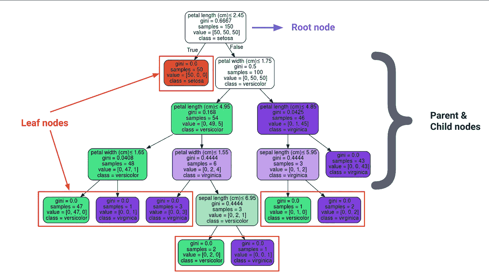
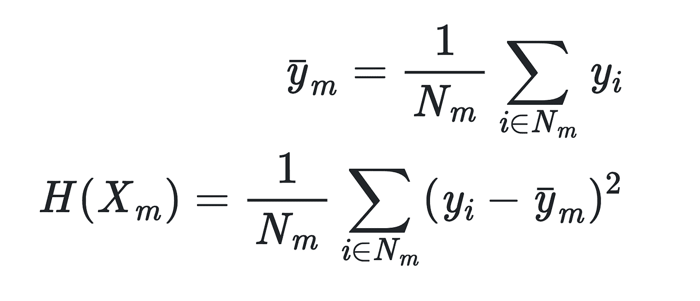
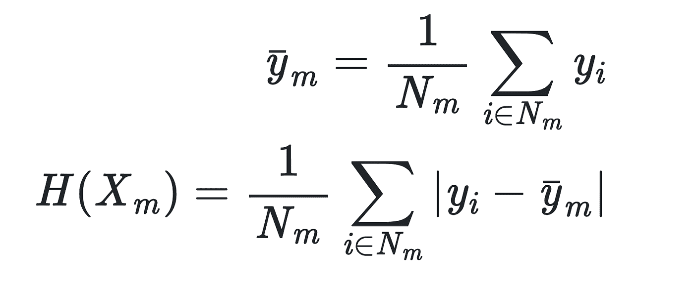

# 决策树:理解集成方法的基础

> 原文：<https://towardsdatascience.com/decision-trees-understanding-the-basis-of-ensemble-methods-e075d5bfa704?source=collection_archive---------14----------------------->

## 一个伟大的机器学习基础模型，但不是一个伟大的最终模型。

[https://imgflip.com/memegenerator/Two-Buttons](https://imgflip.com/memegenerator/Two-Buttons)

集成方法是一种利用决策树优势的极好方法，同时减少了决策树过度拟合的倾向。然而，它们可能变得相当复杂，并可能变成黑盒模型。作为数据科学家和机器学习工程师，我们可以做的最好的事情之一是，当我们调用 sklearn 时，确保我们知道在引擎盖下真正发生了什么。fit()方法。这就是我们今天要用决策树做的事情。

在本文中，我们将回顾:

1.  决策树的优点
2.  决策树的缺点
3.  基于决策树的集成方法
4.  决策树如何工作:决策树算法，分裂(选择)标准

# **决策树有哪些优点？**

决策树之所以伟大，有多种原因。我们来看看吧！

1.  决策树可用于 ***回归或*** 分类，尽管它们更常用于分类问题。一般来说，如果你想对回归模型使用决策树，你应该使用集成方法。
2.  决策树是 ***非参数的*** ，这只是一种奇特的说法，即我们不对我们的数据如何分布做出任何假设，我们的模型结构(参数)将根据用户输入和我们样本中的观察结果来确定，而不是根据数据来确定。当我们有很多数据，但没有太多关于数据的知识时，非参数模型是很好的。
3.  决策树是 ***可解释的*** ，这意味着在我们建立模型之后，我们还可以对我们的数据进行推断，而不仅仅是预测。在 sklearn 中，我们可以使用[来完成这项工作。特征 _ 重要性 _](https://scikit-learn.org/stable/modules/generated/sklearn.tree.DecisionTreeClassifier.html) [属性](https://scikit-learn.org/stable/modules/generated/sklearn.tree.DecisionTreeRegressor.html#sklearn.tree.DecisionTreeRegressor)。
4.  决策树是 ***快速*** 的，因为它们简单且“贪婪”。虽然在构建最终的可部署模型时，我们可能不会优先考虑速度，但如果我们只是试图构建一个模型来初步了解我们的数据，这可能是一个巨大的好处(下面将详细讨论这是如何工作的！).
5.  最后， ***数据预处理更容易*** 使用决策树，因为我们不必扩展我们的数据——在每个节点发生的分裂一次担心一个特征！根据用于确定分裂的算法，分类特征也可以不进行数字编码。然而，使用 scikit-learn 当前的 CART 算法(稍后再介绍更多)，您将希望使用推荐的[sk learn . preprocessing . labelencorder](https://scikit-learn.org/stable/modules/generated/sklearn.preprocessing.LabelEncoder.html)对分类数据进行预处理。

# **决策树有哪些缺点？**

正如我们所看到的，使用决策树有很多好处…取决于具体情况。如果我们的样本量很小，这可能不是最佳选择；对于回归，如果我们认为我们将预测训练样本所包含内容之外的目标值，这可能不是最佳选择。除了环境因素，决策树和所有模型一样，也有一些缺点。

1.  决策树最显著的缺点就是 ***容易过拟合*** 。决策树过拟合，因为您可以为训练数据中的每个目标值找到一个叶节点。事实上，这是 sklearn 中决策树[分类器](https://scikit-learn.org/stable/modules/generated/sklearn.tree.DecisionTreeClassifier.html) / [回归器](https://scikit-learn.org/stable/modules/generated/sklearn.tree.DecisionTreeRegressor.html#sklearn.tree.DecisionTreeRegressor)的默认参数设置。虽然您可以调整一些超参数，如 max_features、min_samples_split、min_samples_leaf 和 max_depth，但正是由于这一缺点，简单的决策树经常被替换为更复杂的表亲:集成方法。
2.  决策树也是 ***局部优化*** 的，或者说是贪婪的，这只是意味着它们在任何给定的节点决定如何分裂时没有提前考虑。相反，进行分割是为了最小化或最大化所选择的分割(选择)标准——基尼或熵用于分类，MSE 或 MAE 用于回归——在该分割处，我们将在后面详细讨论。
3.  由于分裂的贪婪本质， ***不平衡类*** 在处理分类时也对决策树提出了一个主要问题。在每次拆分时，树决定如何最好地将类拆分成接下来的两个节点。因此，当一个类具有非常低的代表性(少数类)时，这些观察值中的许多可能会在多数类节点中丢失，然后对少数类的预测甚至会比它应有的可能性更小，如果有任何节点预测它的话。

# **基于决策树的集成方法**

现在我们已经对简单决策树的优缺点有了很好的了解，我们将讨论是什么使它们成为集成方法的一个很好的基础估计。基于决策树的一些最流行的集成方法是:

*   随机森林(回归器/分类器)
*   极度随机化的树(回归器/分类器)
*   装袋(回归器/分类器)
*   自适应助推器(回归器/分类器)
*   梯度增强(回归器/分类器)
*   回归器/分类器

所有这些集成方法都采用决策树，然后应用 bagging (bootstrap aggregating)或 boosting 作为减少方差和偏差的方法。要快速了解集合方法以及打包和提升技术，请查看我在大会上为数据科学课程制作的幻灯片:

# 决策树如何工作

如果没有例子，很难谈论决策树是如何工作的。这张图片取自 [sklearn 决策树文档](https://scikit-learn.org/stable/auto_examples/tree/plot_iris_dtc.html)，是 [sklearn Iris 数据集](https://scikit-learn.org/stable/auto_examples/datasets/plot_iris_dataset.html)上决策树分类器的绝佳代表。为了更容易理解，我添加了红色、蓝色和灰色的标签。

原图:[https://scikit-learn.org/stable/modules/tree.html](https://scikit-learn.org/stable/modules/tree.html)；我自己的蓝色、红色和灰色标签

我们在这里看到，每个拆分都是二进制的，或者只拆分成两个子节点。虽然这对于决策树来说不是必须的，但是许多实现，包括 sklearn 的，都局限于二进制分割，因为考虑任何更大的东西计算量都太大——树永远不会适合。这也不会有很大的不同，因为二进制分割可以通过简单地嵌套两个二进制分割获得与多路分割相同的结果！然而，由于决策树算法的复杂性，当仅限于二进制分割时，所进行的分割计算可能会导致与允许更多分割的算法略有不同的分割。同样，限制二进制分割不是主要问题，只是需要考虑的事情。所以最后:*树如何决定从哪里分裂？？*

# **决策树算法**

“决策树算法”可能听起来令人生畏，但它只是决定如何构建树的数学(“简单”…我们将进入它！).目前在 sklearn 中实现的算法被称为“CART”(分类和回归树)，它仅适用于数字特征，但适用于数字和分类目标(回归和分类)。在每个节点上，它确定将为模型产生“最大信息增益”的特征和该特征的分割阈值。这个“信息增益”是基于用户指定的分割标准来测量的。

如果你喜欢数学，这里有一个信息增益的公式，取自 [sklearn 文档](https://scikit-learn.org/stable/modules/tree.html)(其中 G =信息增益，n =阈值左侧/右侧的数据点数，Nm =数据点总数，H =选择的分裂标准函数，Q =节点 m 的数据，θ=被评估的特征和阈值):

[https://scikit-learn.org/stable/modules/tree.html](https://scikit-learn.org/stable/modules/tree.html)

但基本上，你需要知道的是“信息增益”衡量给定的分裂如何分裂我们的数据，以使每个子节点中的数据点的目标值最同质(分类)或彼此最接近(回归)。

那么，在每个节点上，特征和分割阈值是如何选择的呢？这是一个好问题，回答有些复杂！一般来说，该算法将扫描每个特征的每个可能的阈值分割，计算每个不同分割的“信息增益”，然后选择产生最高信息增益的分割(如何测量取决于下面描述的分割标准)。现在，当特性是一列 1 和 0，或者一组离散的选项时，这更直观，因此几乎没有可能的拆分需要考虑。然而，当我们有一个连续的数字特征，它变得更加复杂。

sklearn 文档和 Google 搜索“CART algorithm decision trees how to find split threshold for continuous variables sk learn”的时间未能让我发现连续变量的分裂阈值是如何确定的——是不是每个唯一值都被视为分裂点，从而以指数方式增加了计算负载？如果唯一值比设定的箱数多，这些值是否被装入设定数量的箱中？或者也许算法只是在平均值、中间值或正中间分裂！

经过几个小时的搜索，[这篇来自 2014 年的 Stackoverflow 评论](https://stackoverflow.com/questions/25287466/binning-of-continuous-variables-in-sklearn-ensemble-and-trees)终于回答了这个问题:当确定连续变量的分裂阈值时，sklearn 决策树算法(CART)不支持！相反，它会执行计算量很大的任务来检查每个可能的分裂，也就是说，它会对该特征的所有值进行排序，然后查找相邻值之间的每个平均值，并查找该分裂的信息增益得分(除非两个值之间的差距小于 1e-7，这是一个任意的小步骤)。

所以现在我们知道了在确定分割时要评估什么，这就引出了一个问题:我们如何决定在每个节点使用哪个特征和阈值:分割标准！

# **分割(选择)标准**

根据什么特征和该特征的什么值来分割节点取决于用户指定的标准:用于分类的 gini 或熵，用于回归的 MSE 或 MAE。虽然我们可以详细讨论所有这些，但是对于本文来说，最有帮助的是考虑所有这些标准都是衡量一个分割在根据目标值创建最同质的子节点时有多大帮助。

对于分类，gini 和熵使用不同的公式来评估“如果我们使用这种拆分，每个类的多少个观察值将被拆分到每个子节点中？”他们各自的公式来自 [sklearn 文档](https://scikit-learn.org/stable/modules/tree.html)，同样，对于那些有数学倾向的人来说:

## 基尼

https://scikit-learn.org/stable/modules/tree.html

## 熵

【https://scikit-learn.org/stable/modules/tree.html 

另一方面，对于回归问题，MSE(均方误差)和 MAE(平均绝对误差)评估该节点中的每个目标值与每个子节点的平均目标值的接近程度，MSE 将较大的误差加权为比较小的误差更差。这些也是线性回归中损失函数的常用指标。来自 [sklearn 文档](https://scikit-learn.org/stable/modules/tree.html)的公式如下:

## 均方误差

[https://scikit-learn.org/stable/modules/tree.html](https://scikit-learn.org/stable/modules/tree.html)

## 平均绝对误差

[https://scikit-learn.org/stable/modules/tree.html](https://scikit-learn.org/stable/modules/tree.html)

这样你就知道了——决策树是由什么组成的，因此，它也是我们所钟爱的集成方法的基础。如果你已经做到了这一步，感谢你坚持和我在一起，或者跟随你的好奇心，或者为完成你可能正在做的任何项目而奉献。我希望这份关于决策树及其底层工作的概述能对你继续提高思维和数据科学技能有所帮助！数据处理愉快！

## 来源

> [https://towards data science . com/understanding-decision-tree-class ification-with-scikit-learn-2d df 272731 BD](/understanding-decision-tree-classification-with-scikit-learn-2ddf272731bd)
> 
> [https://towards data science . com/understanding-decision-trees-for-class ification-python-9663d 683 c 952](/understanding-decision-trees-for-classification-python-9663d683c952)
> 
> [https://sebastianraschka . com/FAQ/docs/parametric _ vs _ nonparametric . html](https://sebastianraschka.com/faq/docs/parametric_vs_nonparametric.html)
> 
> [https://medium . com/@ dataakkadian/what-are-parametric-vs-nonparametric-models-8 BFA 20726 f4d](https://medium.com/@dataakkadian/what-are-parametric-vs-nonparametric-models-8bfa20726f4d)
> 
> [https://stats . stack exchange . com/questions/294033/why-are-decision-trees-not-computational-expensive](https://stats.stackexchange.com/questions/294033/why-are-decision-trees-not-computationally-expensive)
> 
> [https://sci kit-learn . org/stable/auto _ examples/预处理/plot _ 离散化. html](https://scikit-learn.org/stable/auto_examples/preprocessing/plot_discretization.html)
> 
> [https://stack overflow . com/questions/25287466/sklearn-ensemble-and-trees 中连续变量的宁滨](https://stackoverflow.com/questions/25287466/binning-of-continuous-variables-in-sklearn-ensemble-and-trees)
> 
> [https://scikit-learn.org/stable/modules/tree.html](https://scikit-learn.org/stable/modules/tree.html)
> 
> [https://sci kit-learn . org/stable/modules/generated/sk learn . tree . decision tree classifier . html](https://scikit-learn.org/stable/modules/generated/sklearn.tree.DecisionTreeClassifier.html)
> 
> [https://sci kit-learn . org/stable/modules/generated/sk learn . tree . decision tree regressor . html # sk learn . tree . decision tree regressor](https://scikit-learn.org/stable/modules/generated/sklearn.tree.DecisionTreeRegressor.html#sklearn.tree.DecisionTreeRegressor)