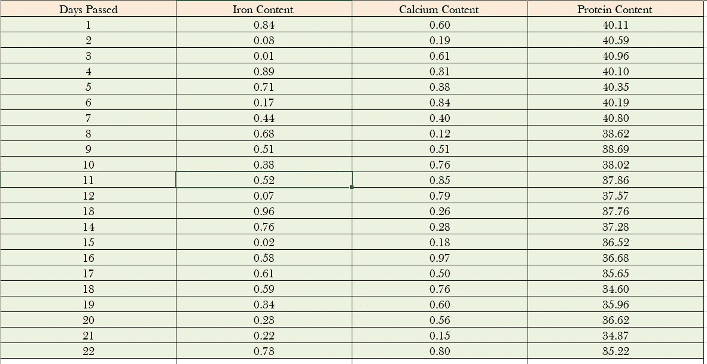
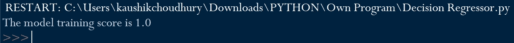
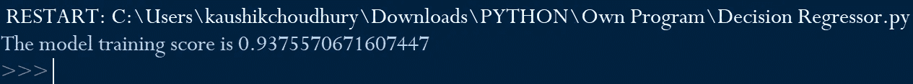
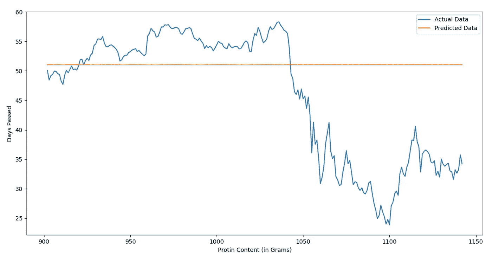

# 决策树回归器—停止用于未来预测！

> 原文：<https://towardsdatascience.com/decisiontreeregressor-stop-using-for-future-projections-e27104537f6a?source=collection_archive---------24----------------------->

## [内部 AI](https://towardsdatascience.com/machine-learning/home)


[潘卡杰·帕特尔](https://unsplash.com/@pankajpatel?utm_source=medium&utm_medium=referral)在 [Unsplash](https://unsplash.com?utm_source=medium&utm_medium=referral) 上的照片

Scikit-learn 是 Python 中最著名的机器学习库之一。它提供了几种分类、回归和聚类算法，在我看来，它的主要优势是与 Numpy、Pandas 和 Scipy 的无缝集成。

Scikit-learn 由开发人员编写得非常好，只需几行代码，我们就可以通过许多不同的算法来检查模型预测。我觉得有时候，Scikit-learn 的这种优势会在不经意间对其不利。机器学习开发者。经验相对较少的人在没有掌握特定算法的显著特征和局限性的情况下实现不适当的预测算法。

在本文中，我将讨论为什么我们不应该使用决策树回归算法来进行涉及外推数据的预测。

***目标***

我们有豌豆从农场采摘到 1142 天的铁、钙和蛋白质含量。让我们假设，与蛋白质含量相比，测定铁和钙的含量更容易、更经济。

我们将使用这些数据来训练决策树回归算法，然后根据与铁含量、钙和天数相关的新数据点来预测蛋白质含量。

***样本数据文件***

我认为数据文件是不言自明的。这些行显示了自收获以来豌豆的铁、钙和蛋白质含量。



***步骤 1***——我们将导入包 pandas、matplotlib 以及 DecisionTreeRegressor 和 NumPy，我们将使用它们进行分析。

```
from sklearn.tree import DecisionTreeRegressor
import pandas as pd
import matplotlib.pyplot as plt
import numpy as np
```

***第二步-*** 将完整的数据样本数据 excel 文件读入名为“数据”的 PandasDataframe 中。

```
data= pd.read_excel("Peas Nutrient.xlsx")
```

我不会关注初步的数据质量检查，如空白值、异常值等。和各自的修正方法，并假设不存在与差异相关的数据序列。

***步骤 3-*** 我们将把完整的数据集分成两部分，即训练和测试设备。顾名思义，我们将使用训练数据集来训练决策树回归算法，并根据测试集中的数据将蛋白质预测与实际含量进行比较。

在下面的代码中，从第 1 天到第 900 天的数据记录被分割为训练数据，从第 901 天到第 1142 天的数据记录被分割为测试数据。

```
Training_data= data[:900]
Test_data=data.loc[901:1142]
```

***第四步-*** “经过天数”、“铁含量”、“钙含量”是用于预测的自变量。预测的“蛋白质含量”是因变量。通常，自变量用“X”表示，因变量用“y”表示。

在下面的代码中，“蛋白质含量”数据列从数据帧中删除，剩余的数据(即独立变量数据点)被声明为 X_train。类似地，除了“蛋白质含量”之外的所有数据列都被删除，并声明为 y_train。

```
X_train=Training_data.drop(["Protein Content "], axis=1)
y_train=Training_data.drop(["Days Passed", "Iron Content " ,"Calcium Content "], axis=1)
```

在下面的代码中对测试数据集重复相同的过程，即从第 901 天到第 1142 天的值，

```
X_test=Test_data.drop(["Protein Content "], axis=1)
y_test=Test_data.drop(["Days Passed", "Iron Content " ,"Calcium Content "], axis=1)
```

***步骤 5-*** 用训练数据集训练决策树回归器模型。此外，检查分数以了解算法在该数据上训练得有多好。

```
tree_reg = DecisionTreeRegressor().fit(X_train, y_train)
print("The model training score is" , tree_reg.score(X_train, y_train))
```

满分 1.0 本身就说明模型的过拟合。



***步骤 5-*** 为了解决在训练模型期间由于树的无约束深度而导致的过度拟合，我们将设置最大深度为 4 的约束。

```
tree_reg = DecisionTreeRegressor(max_depth=6).fit(X_train, y_train)
print("The model training score is" , tree_reg.score(X_train, y_train))
```

这解决了模型对训练数据的过度拟合，并且模型准备好基于测试数据点来预测蛋白质含量。



***步骤 6-*** 在下面的代码中，基于各自的“经过天数”、“铁含量”和“钙含量”数据，预测测试数据集(即从第 901 天到第 1142 天)的“蛋白质含量”。

```
y_pred_tree = tree_reg.predict(X_test)
```

***步骤 7-*** 我们将通过决策树回归模型绘制预测的蛋白质含量，并与第 901 天至第 1142 天的测试数据集中的实际蛋白质含量进行比较。

```
plt.plot(X_test["Days Passed"],y_test, label="Actual Data")
plt.plot(X_test["Days Passed"],np.rint(y_pred_tree), label="Predicted Data")
plt.ylabel("Days Passed")
plt.xlabel('Protin Content (in Grams)')
plt.legend(loc='best')
plt.show()
```



我们可以看到，在具有 0.93 分数的训练数据集中训练得相当好的决策树回归器模型在预测测试数据上的蛋白质含量方面失败得很惨。该模型预测所有天的蛋白质含量都相同，约为 51.34。

我们不应该使用决策树回归模型进行涉及外推数据的预测。这只是一个例子，我们机器学习从业者的主要收获是在开始建模之前考虑数据、预测目标、算法的优势和局限性。

在为机器学习监督算法选择独立变量时，我们可能会犯类似的错误。在文章中，[“如何为机器学习监督算法识别正确的自变量？”](/how-to-identify-the-right-independent-variables-for-machine-learning-supervised-algorithms-439986562d32)我已经讨论了一种结构化的方法来识别适当的独立变量，以做出准确的预测。