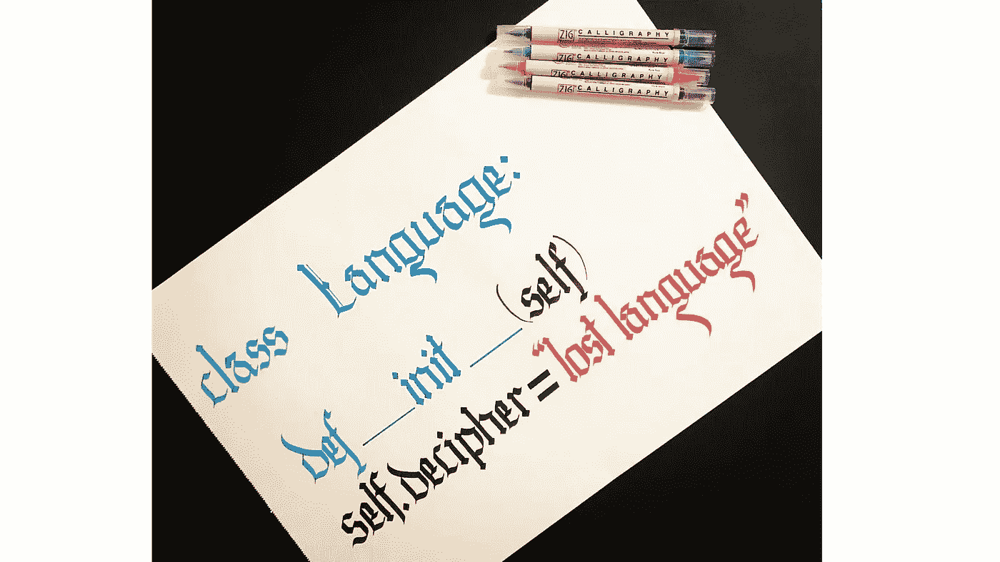

# 用代码破译失传的语言

> 原文：<https://towardsdatascience.com/decode-a-lost-language-by-code-e140e8f6acf6?source=collection_archive---------42----------------------->

来自[皮克斯拜](https://pixabay.com/?utm_source=link-attribution&utm_medium=referral&utm_campaign=image&utm_content=754010)的本·伯顿的图片

## 机器学习正在帮助语言学

语言就像人一样，他们出生，生活，死亡。然而，由于一些占主导地位的语言，一些语言在其自然寿命之前就消亡了。当主导语言在世界上变得更加普遍时，使用人数较少的地方语言就会灭绝。比如你在用现代最通用的语言读这篇文章，虽然不是我的母语！

# 一种语言是如何消亡的？

一种语言灭绝的第一个迹象是孩子们只在家里说他们父母的语言。他们在所有的社会、教育和职业生活中使用主流语言。

一两代人之后，这种语言只有老人说。如果孩子们只和他们的祖父母说一种语言，这种语言就有灭绝的危险。

来自 [Pixabay](https://pixabay.com/?utm_source=link-attribution&utm_medium=referral&utm_campaign=image&utm_content=2391461) 的[瓦伦·库尔卡尼](https://pixabay.com/users/tortugadatacorp-5195555/?utm_source=link-attribution&utm_medium=referral&utm_campaign=image&utm_content=2391461)的图片

## 死亡、灭绝和失传的语言

死语言不是任何社区的母语。拉丁语是一种死语言。有些人懂拉丁语，但没有一个国家或社区的母语是拉丁语。

一种已经灭绝的语言是一种不再有人使用的语言。即使没有人说一种已经灭绝的语言，也有那种语言的书籍、论文和纪念碑，我们知道如何阅读和学习。目前，已知的灭绝语言有 573 种。

*失传的语言*是一种灭绝的语言，我们知道它存在过，但我们不知道如何阅读。绝大多数灭绝的语言都是失传的语言。

# 发现一种语言

语言研究者 David Graddol 估计，到 2050 年，90%的现有语言将会灭绝。当一种语言消失时，整个文化也随之消失。至少有 12 种失传的语言等待被编码，但没有一种语言像古埃及语那样幸运。他们没有[罗塞塔石碑](https://en.wikipedia.org/wiki/Rosetta_Stone)！

大英博物馆中的罗塞塔石碑，图片由来自 [Pixabay](https://pixabay.com/?utm_source=link-attribution&utm_medium=referral&utm_campaign=image&utm_content=4606054) 的[Kris sard](https://pixabay.com/users/kinetoons-3718720/?utm_source=link-attribution&utm_medium=referral&utm_campaign=image&utm_content=4606054)拍摄

因为对一种语言进行编码是一个耗时的过程，人类花费了几十年的努力来发现语言和这些语言背后的文明。大多数古代文字没有空格和/或标点符号。语言学家可能要花一辈子的时间才能从这些古代文字中找出一种语言。自然语言处理(NLP)方法是否有助于提高编码灭绝语言的速度和准确性？

由 [Sumeyye Akin](https://www.instagram.com/p/CG6pwQjlajE/?igshid=rio0sjqk4rjm) 创作的哥特式书法，由作者创作的图片

# 人工智能破译一种失传的语言

来自麻省理工学院计算机科学和人工智能实验室(CSAIL) [的 Enrico Santus，Jiaming Luo，Frederik Hartmann，，Regina Barzilay 开发了一种新算法](http://people.csail.mit.edu/j_luo/assets/publications/DecipherUnsegmented.pdf)来破译文字中丢失的语言。

## 最近的工作

机器学习算法可以通过将丢失的语言与现存的语言联系起来，成功地破译这些语言。通过识别最接近的现存语言，破译过程变得很容易。例如，Ugaritic 语言是在希伯来语的帮助下解决的，因为人们知道它们来自同一语系。这被称为“基于同源词的解读”

## 最近工作的问题

如果失传语言的语系无法识别，科学家怎么办？例如，关于伊比利亚语的相近已知语言就没有共识。它可以是希腊语、拉丁语或巴斯克语。现有的算法在破译伊比利亚语时不能正常工作。

## 新方法

CSAIL 团队开发的模型可以解决这个问题。因为它们的模型提供了丢失语言中的欠切分单词和已知语言中的词汇。手稿中丢失的语言不被认为与任何现代语言相似。相反，该模型试图将丢失文本中的跨度与已知标记进行匹配。

## 方法

该模型被设计成适用于伊比利亚等语言。然而，由于缺乏地面真实，在实验设置中使用了 Gothic 和 Ugaritic。该模型被应用于破译的语言，以便能够检查模型的性能。

## 这个模型的副产品

该模型不假设语言之间有任何相似之处。令人惊讶的是，它找到了一种关系的衡量标准，并识别出与失传语言本身最相似的语言。

## 未来的工作

Regine Barzilay 和她的团队希望将他们的工作扩展到从上下文中寻找单词的含义，即使他们不知道如何阅读它们。

# 结论

该模型提出了一种从非分离文本中提取相关词的解码模型，而不需要假设丢失语言和已知语言之间的相似性。在 Gothic、Ugaritic 和 Iberian 上的结果表明，该模型可以有效地处理欠切分文本，即使丢失的语言与任何已知语言都不相关。

当失落的语言被加密，失落的文明也被发现！