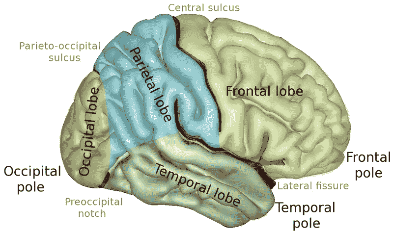
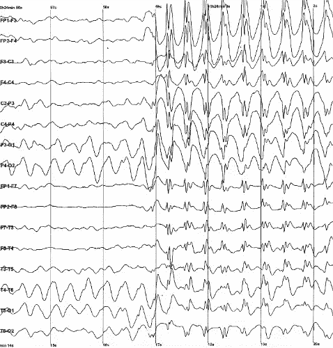
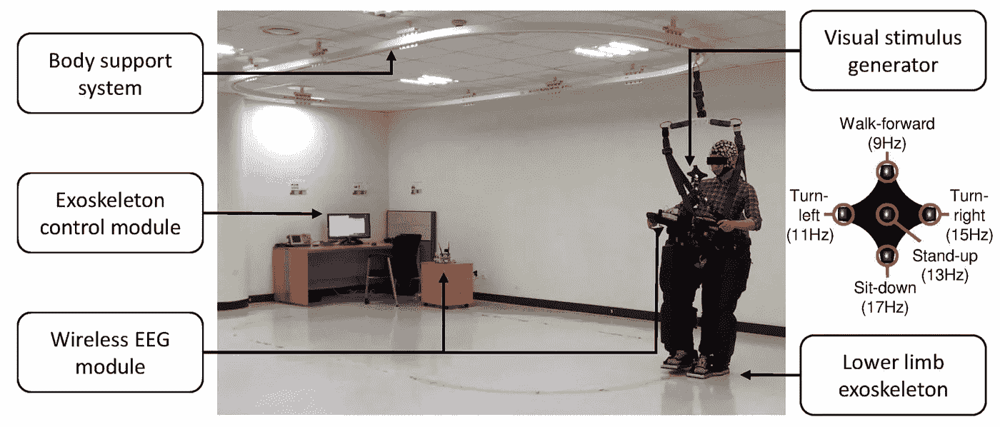
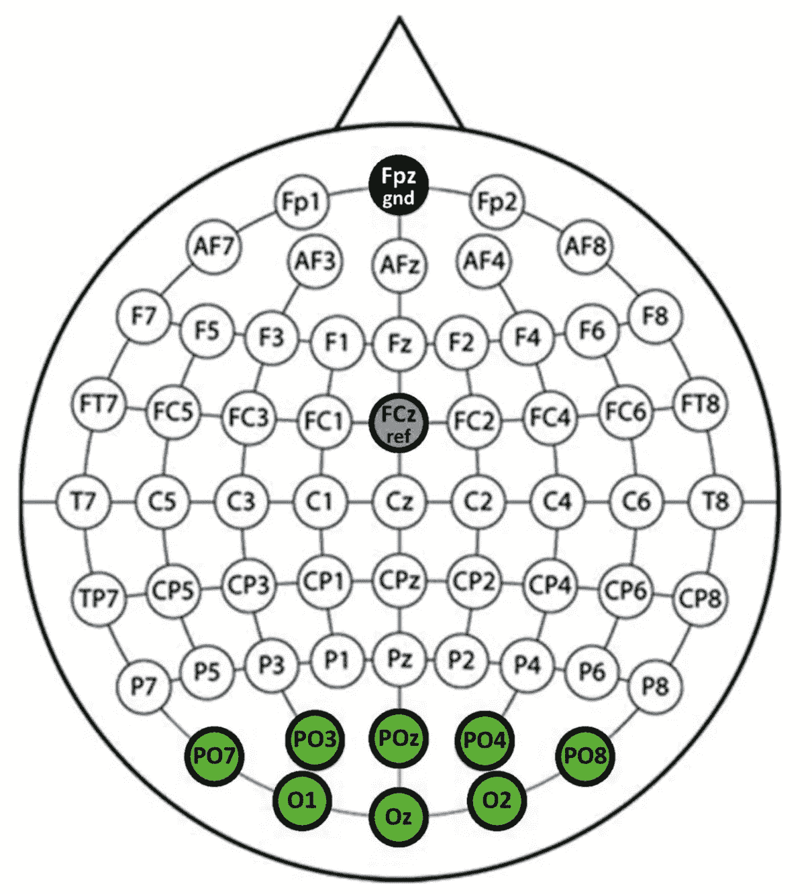
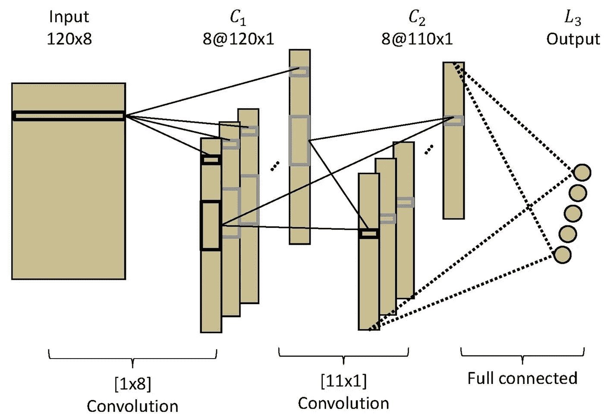
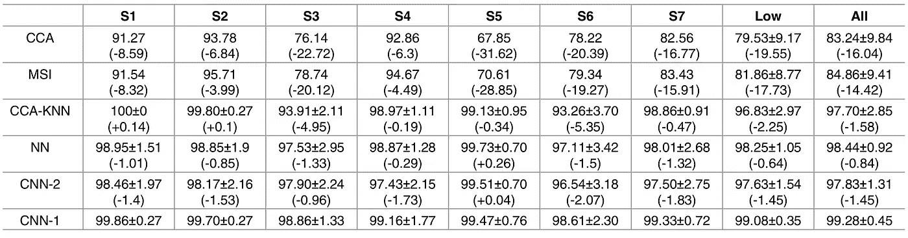
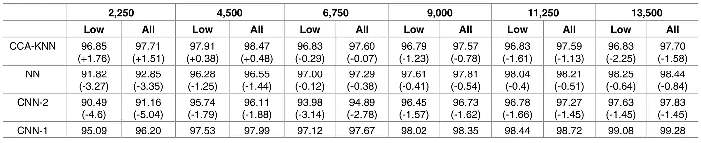

# 用机器学习和神经科学解码大脑信号

> 原文：<https://towardsdatascience.com/decoding-brain-signals-with-machine-learning-and-neuroscience-bee288c1d585?source=collection_archive---------10----------------------->

## 成为 X 教授，解开我们心灵的秘密

乔希·希尔德在 [Unsplash](https://unsplash.com?utm_source=medium&utm_medium=referral) 上的照片

在 x 战警漫画中，查尔斯·泽维尔教授是最强大的变种人之一。他拥有读心术和移动物体的精神力量。

想成为 X 教授？请继续阅读！

我们的大脑是一个强大的器官，它是人类神经系统的指挥中心。它像一台大电脑一样工作，它发送、接收和处理信息。

如果我们能拦截这些信号呢？通过创造一个读取思想的装置，你可以释放心灵感应的力量！

一个[脑机接口](/deep-learning-in-brain-computer-interface-f650d00268d0?source=friends_link&sk=d34b6f7371922cc55304fb70e33b7a45)允许使用我们的大脑信号解码我们的意图。这意味着你甚至不需要移动肌肉！

想象一下，如果我想发一条短信。我开始盯着键盘，在我想输入的字母上。我的手机开始输入我正在思考的单词和句子！

这看起来像科幻小说，你认为人类离实现这样的壮举还有几年的时间吗？几十年来，科学家一直在开发和完善这项技术。

在这篇文章中，让我与你分享令人兴奋的研究，我们可以通过盯着闪烁的灯光来控制外骨骼！

# 枕叶

人脑是一个惊人的三磅重的器官，控制着我们所有的身体功能。它处理我们所有的思想，它是人类智力、创造力、情感和记忆的神经生物学基础。我们的大脑分为几个部分，每个部分都有一个主要功能。

大脑的侧面，显示了 4 个脑叶[ [来源](https://en.wikipedia.org/wiki/Lobes_of_the_brain)

在这个实验中，我们的重点是[枕叶](https://en.wikipedia.org/wiki/Occipital_lobe)。那是我们的视觉处理中心，处理我们视觉的部分。它处理并使我们的大脑能够识别我们正在看的东西。

# 我们可以从大脑中收集的数据类型

[脑机接口](/deep-learning-in-brain-computer-interface-f650d00268d0?source=friends_link&sk=d34b6f7371922cc55304fb70e33b7a45) (BCI)的目的是在大脑和外部设备之间建立直接的通信通道。这使得它的用户能够通过大脑活动与电脑互动。

BCI 不像大脑那样是一个读心术装置。相反，它检测大脑发出的能量的变化。人类大脑包含大约 860 亿个神经元，每个神经元都与其他神经元相互连接。每当我们思考或移动肌肉时，这些神经元都在工作，被能量激活。BCI 能识别大脑中的这些能量模式。

用脑电图监测棘波放电[ [来源](https://en.wikipedia.org/wiki/Electroencephalography)

[脑电图](https://en.wikipedia.org/wiki/Electroencephalography) (EEG)是一种记录大脑信号的流行技术。它是非侵入性的，所以我们不需要切开我们的头骨来收集我们的大脑信号。

脑电图通过放置在头皮上的一系列电极记录大脑产生的能量。这包括一个人戴着脑电图帽，电极放在特定的点上。这些电极检测大脑活动，即从我们的大脑发出的电能。

在这个实验中，我们想要记录与我们眼睛正在看的东西相关的大脑信号。通过将电极放置在枕叶区域，电极将从我们所看到的东西中获取信号。在这种情况下，闪烁的灯光。这种类型的脑电信号称为稳态视觉诱发电位。

# 稳态视觉诱发电位

[稳态视觉诱发电位](https://en.wikipedia.org/wiki/Steady_state_visually_evoked_potential) (SSVEP)是当我们看到闪烁的东西时产生的信号，通常频率在 1 到 100 Hz 之间。在这个实验中，这些闪烁的灯是闪烁的 LED 灯。这些闪烁的灯是“*刺激物*”。

考虑一个脑机接口系统，其目标是解码用户输入的两个可能选项中的一个，即“*左*或“*右*”。有两个刺激，一个用于选择“左”选项，另一个用于选择“右”。

这两种刺激以不同的频率闪烁，11 Hz 代表“*左转*”；而“*右转*为 15 Hz。用户通过关注其中一个刺激来选择选项。例如，通过聚焦“*左*”刺激，来选择“*左*选项。

当用户专注于一种刺激时，该特定刺激的频率可以在枕叶处被拾取。通过从 EEG 信号中提取刺激的频率，我们可以确定用户正在关注哪些灯。这就是 BCI 系统如何将 SSVEP 大脑信号翻译成外部设备的指令。

这个视频展示了一个现场演示，展示了我们的眼睛所关注的东西是如何影响 SSVEP 信号的。

# 实验装置

[韩国大学](https://journals.plos.org/plosone/article?id=10.1371/journal.pone.0172578)设计了一个使用 SSVEP 控制下肢外骨骼的实验环境。用户可以通过将注意力集中到所需的刺激来控制外骨骼。

用户可以选择五种可用操作之一来操作外骨骼。这对应于以不同频率闪烁的五个发光二极管。

*   向前走(9Hz)
*   左转(11Hz)
*   向右转(15Hz)
*   站立(13Hz)
*   坐下(17Hz)

受试者穿着外骨骼，专注于视觉刺激发生器的 LED 摘自[论文](https://journals.plos.org/plosone/article?id=10.1371/journal.pone.0172578)

如果打算向前移动，用户关注以 9 Hz 闪烁的 LED 二极管。同样，通过聚焦以 15 赫兹闪烁的 LED 二极管，它将操作外骨骼向右转。

在实验过程中，有语音指令来指导用户。他们的任务是按照给出的指令，通过聚焦相应的 LED 灯来操作外骨骼。

使用 8 个通道进行 SSVEP 采集的 EEG 通道布局[摘自[论文](https://journals.plos.org/plosone/article?id=10.1371/journal.pone.0172578)

为了构建监督学习分类器，收集的脑电信号是输入数据，分配的任务是标签。对于这个实验，作者在 EEG cap 上选择了八个电极，这对应于输入数据中的八个通道。

他们还执行了快速傅立叶变换，将信号从时域转换到频域。这导致输入数据中有 120 个样本。因此，输入数据是一个 120x8 尺寸的信号。

# 卷积神经网络分类器

[No-Sang Kwak 等人](https://journals.plos.org/plosone/article?id=10.1371/journal.pone.0172578)提出了一种使用卷积神经网络的鲁棒 SSVEP 分类器。在论文中，他们将其命名为 CNN-1。它有两个隐藏层，内核大小分别为 1x8 和 11x1。接下来是具有 5 个单元的输出层，代表外骨骼运动的五种可能动作。学习率为 0.1，权重初始化为正态分布。

CNN-1 架构。由两个卷积层和一个输出层组成[摘自[论文](https://journals.plos.org/plosone/article?id=10.1371/journal.pone.0172578)

作者还实现了另外两个神经网络和三种信号处理方法，以与 CNN-1 进行性能比较:

*   **CNN 架构#2 (CNN-2)** :类似于所描述的 CNN 架构，但是它在输出层之前包括一个附加的 3 单元全连接层
*   **前馈(NN)** :一个简单的 3 层全连接前馈神经网络
*   **典型相关分析(CCA)** : [典型相关分析](https://ieeexplore.ieee.org/abstract/document/4015614/)是寻找目标频率和信号之间相关性的流行方法。CCA 一直是 SSVEP 分类的首选方法
*   **多元同步指数(MSI)** : [多元同步指数](https://www.sciencedirect.com/science/article/pii/S0165027013002677)估计两个信号之间的同步，作为解码刺激频率的指数
*   **CCA + k 近邻(CCA-KNN)** :与 k 近邻的典型相关分析

这些方法用于比较上述 CNN-1 架构的性能。我没有提供每个分类器的细节，因为 CNN-1 具有最好的性能，这是我们的重点。

# 估价

作者用 13500 个训练数据和 1500 个测试数据进行了 10 重交叉验证。下表显示了每个分类器的分类精度。

受试者的 10 倍交叉验证结果，比较不同的分类方法[摘自[论文](https://journals.plos.org/plosone/article?id=10.1371/journal.pone.0172578)

该表显示，CNN-1 的性能优于其他神经网络架构。CNN-1 也比 CCA 表现得更好，CCA 是用于 SSVEP 分类的流行方法。总的来说，神经网络的结果比 CCA 更稳健，因为 CCA 表现出明显较低的性能。

深度神经网络通常在处理大量数据时表现更好。找出超越传统方法所需的数据量。作者验证了不同训练样本大小的性能。

10 倍交叉验证结果，改变训练数据量，比较不同的分类方法【摘自[论文](https://journals.plos.org/plosone/article?id=10.1371/journal.pone.0172578)

CNN-1 在每个数据量上都优于其他神经网络。然而，对于少于 4500 个训练数据样本，CCA-KNN 显示出更好的分类性能。

图欣·乔杜里在 [Unsplash](https://unsplash.com?utm_source=medium&utm_medium=referral) 上拍摄的照片

# 总结

在这项研究中，目标是建立一个具有深度学习分类器的鲁棒 BCI 系统。卷积神经网络在 SSVEP 分类中表现出良好的性能。

BCI 系统有很大的潜力来帮助残疾人控制设备，如外骨骼(如钢铁侠)或轮椅(如 X 教授)。

但是构建一个可靠的 BCI 系统对 T4 来说是一个挑战，要将这些设备从实验室推向大众市场还需要付出巨大的努力。

 [## 数据科学家:21 世纪最肮脏的工作

### 40%的吸尘器，40%的看门人，20%的算命师。

towardsdatascience.com](/data-scientist-the-dirtiest-job-of-the-21st-century-7f0c8215e845)  [## 脑-机接口中的深度学习

### 推动该领域发展的现状和挑战

towardsdatascience.com](/deep-learning-in-brain-computer-interface-f650d00268d0) 

# 参考

Kwak，N.S .，Müller，K.R .和 Lee，S.W .，2017 年。[用于流动环境下稳态视觉诱发电位分类的卷积神经网络](https://journals.plos.org/plosone/article%3Fid%3D10.1371/journal.pone.0172578)。

林，张，吴，魏，高，2006。[基于 SSVEP 的 BCIs 基于典型相关分析的频率识别](https://ieeexplore.ieee.org/abstract/document/4015614/)。

张，杨，徐，程，姚，2014。[基于 SSVEP 的脑机接口频率识别的多元同步指数](https://www.sciencedirect.com/science/article/pii/S0165027013002677)。