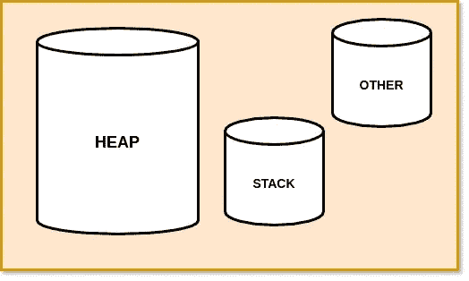

# 无需代码即可解码 Scala

> 原文：<https://towardsdatascience.com/decoding-scala-without-the-code-6db00f37c469?source=collection_archive---------47----------------------->

## 深入 Scala 的内部工作和内存管理


照片由[内森·杜姆劳](https://unsplash.com/@nate_dumlao?utm_source=unsplash&utm_medium=referral&utm_content=creditCopyText)在 [Unsplash](https://unsplash.com/s/photos/coffee?utm_source=unsplash&utm_medium=referral&utm_content=creditCopyText) 上拍摄

我在使用 Spark 时遇到了 Scala，Spark 本身就是用 Scala 编写的。我有着`Python`的背景，对`Java`一无所知，我发现`Scala`在开始时有点令人困惑，但是随着时间的推移，我越来越喜欢它，现在，它是我大多数用例的首选语言。

凭借经验，我已经掌握了一些 scala 及其工作原理。请继续阅读，了解更多关于 scala 的信息，主要是非编码部分，代码是如何执行的。也许你会使用它很长一段时间，但有些东西仍然会让你感到惊讶。

此外，我不会深入讨论如何在`Scala`中编码，因为我相信学习一门语言没有比用它构建一些东西更好的方法，这可以在以后的时间里讨论。

# Scala 的酷在哪里？

我对`Scala`的第一印象是`Java++`(好吧，这是相当蹩脚的)，但我认为`Scala`是一个更好的`Java`，具有几乎相似的结构和更少的*代码。*

Scala( *代表可扩展语言*)是运行在 JVM 上的面向对象& [函数式编程](https://www.geeksforgeeks.org/functional-programming-paradigm/)语言的组合。截至 2020 年 10 月，Scala 的最新版本是 2.13.3

**在 scala 中一切都是对象**，事实上，据说 scala 比 Java 更面向对象。让我们看看如何:

*   像 1，2 这样的整数是`Int`类的对象，而`Int`类的方法可以在整数上调用，例如，你可以像这样在整数上调用一个方法:

```
print(-1.abs) # absolute value of -1
1
```

*   函数是 Scala 中`Function`trait 的对象。([读作](https://gleichmann.wordpress.com/2010/11/08/functional-scala-functions-as-objects-as-functions/#:~:text=Since%20Functions%20are%20Objects%20in,Function2%20as%20the%20underlying%20type.))

**Scala 允许惰性求值，**可用于资源的优化使用。Scala 的惰性求值允许表达式，代码直到第一次使用才被求值。Scala 的这一特性是 Spark 工作的基本原则，即 Spark 是延迟评估的。

**Scala 自动做类型干涉，**我们并不总是需要在声明的时候定义变量的类型。在大多数情况下，编译器可以在编译时检测到变量的类型。([类型推理如何工作](https://en.wikipedia.org/wiki/Type_inference#:~:text=Type%20inference%20is%20the%20ability,type%20annotations%20having%20been%20given.))

**Scala 看起来是解释型的，但实际上它是编译型的，所以速度更快，**尽管乍看起来 Scala 似乎是一种解释型语言，至少对我来说是这样。因为我们有一个可用的 scala shell，我们可以在其中执行测试代码，就像 Python 一样，我还假设 scala 是一种解释型语言。

`scala`命令启动一个交互式 shell，在这里 Scala 表达式被交互式地解释。外壳是 REPL，它在引擎盖下编译代码&运行编译好的代码。

Scala 与 Java 紧密集成，所以如果需要的话，你可以混合 Java 和 Scala 来编写代码。此外，几乎所有的 Java 库都可以导入 Scala。

最后， **Scala 是用 Scala** 写的，就是这么酷！([参考](https://stackoverflow.com/a/19580470))

# Scala 代码是如何工作的？

Scala 代码被编译成 Java 字节码，由 Java 虚拟机(JVM)执行，这实质上就是我们如何混合使用 Java 和 Scala 代码。

JVM 是一种抽象的计算机器，它使计算机能够运行 Java 程序。由于 scala 代码被编译成 Java 字节码，所以它是通过 JVM 执行的。

JVM 基本上就是 Java 神了(*也* *对于我们 scala peeps* )，越早学会越好。它负责所有的事情，从加载代码、验证代码、执行代码、内存管理、从操作系统分配资源，最后是运行时环境。

# Scala 中的内存管理

Scala 运行在 JVM 上，所以它采用类似 Java 的内存管理。所有的执行都依赖于内存&我们可以将内存管理定义为从操作系统分配资源，并释放不必要的内存以避免出现 OOM 错误。(将在后面讨论)

在更高的层次上，JVM 内存由三部分组成:堆、栈和其他。让我们试着一个一个去理解每一个组件。



JVM 内存架构(图片由我在[http://draw.io/](http://draw.io/)上创建)

## 许多

堆存储实际的对象，并在 JVM 启动时创建。只有一个堆空间由所有 JVM 进程共享。另外，请注意垃圾收集器(或 GC)只在堆内存上运行。

堆的大小可以是固定的，也可以是可变的，这取决于 GC 策略。用户可以使用–Xmx 选项设置最大堆大小，默认为 64 MB。

## 堆

堆栈区域是用线程创建的。它存储对堆内存中存储的对象的本地引用。

由于其 LIFO 结构，堆栈非常适合为方法清理空间，因此，我们不需要随机访问数据。

## 其他的

这个部分存储特定于 JVM 的代码和数据。

## 垃圾收集器(*特别提及*):

随着时间的推移，未被引用的对象会导致堆内存增加，清理堆内存是内存管理的一个重要组成部分。但作为用户，我们不必担心自己清理这些未被引用的对象，即所谓的垃圾。GC 或垃圾收集器为我们完成了这项工作。

垃圾收集器是一个守护进程，它清理由未使用或未引用的对象占用的不必要的内存。

虽然用户并不总是需要干预 GC、JVM 内存管理或 scala 的内部工作，因为大部分工作都是它自己完成的，但是了解内部工作可能会帮助我们更好地理解代码，并知道在哪里花费精力。另外，这很有趣！

此外，这是 JVM 内存架构的高级概述，它在更深的层次上变得更加有趣，包括各个组件，如年轻一代、老一代、小型 GC 等。我可能会写一篇同样的后续文章，让我知道你的反馈。

快乐编码，
再见。