# 解码:最先进的对象检测技术

> 原文：<https://towardsdatascience.com/decoding-state-of-the-art-object-detection-99f79d97b75d?source=collection_archive---------12----------------------->

## 在这篇文章中，我正在解码当前艺术对象检测的主要构建模块，并看看它如何与一些商业云视觉 API 进行比较，如谷歌云视觉、微软计算机视觉 API。

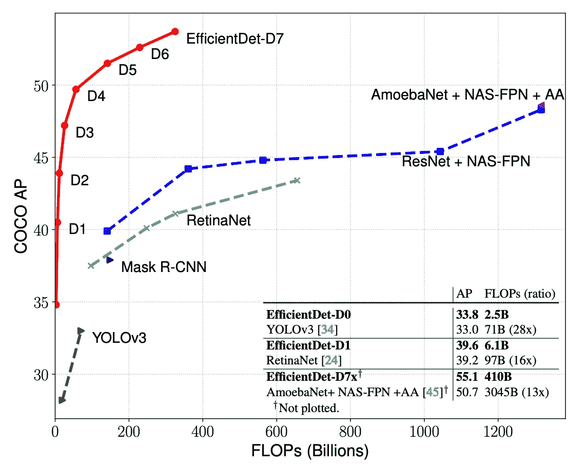

图片来自 [EfficientDet 纸](https://arxiv.org/pdf/1911.09070v7.pdf)

Eefficient det 是一个神经网络架构，它实现了**S**tate-**O**f-T he-**A**rt(**SOTA**)结果( **~55.1 平均精度**)的对象检测([微软 COCO](https://cocodataset.org/#home) 数据集)任务，其复杂度远低于以前的检测器[]EfficientDet 的关键构件是

1.  **复合缩放**
2.  **双向特征金字塔网络**

# 复合缩放

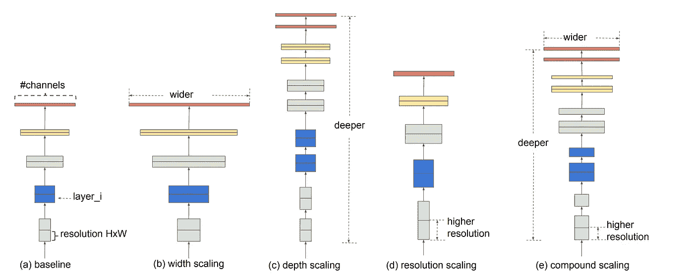

常规缩放变量[宽度(b)、深度、分辨率(d)]、复合(e)。图片来自[高效网论文](https://arxiv.org/pdf/1905.11946.pdf)

S 在宽度(b)、深度(c)或分辨率(d)上放大 ConvNets 被广泛用于实现更好的精度，但是在二维或三维上放大时需要繁琐的手动调整，并且仍然会导致次优的精度和效率。复合缩放(e)使用单个复合系数ϕ，根据以下等式以原则方式缩放网络宽度、深度和分辨率。

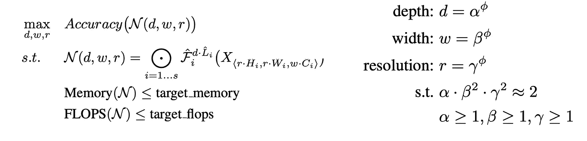

复合缩放公式，图片来自 [EfficientNet](https://arxiv.org/pdf/1905.11946.pdf) 论文。

给定基线网络和目标 flops，复合缩放被公式化为优化问题，如以上等式所示，找出用于缩放基础网络的缩放系数，并且分两步完成:

*“1。固定ϕ = 1，假设多 2 倍的可用资源，根据上述等式对⍺、β、𝛾进行网格搜索。*

*2。固定⍺、β、𝛾为常数，放大基线网络用不同的ϕ"**[***3***](https://arxiv.org/abs/1905.11946)*

**左上等式的参数ℱᵢ(输入层)、Lᵢ(层数)、Hᵢ(高度)、Wᵢ(宽度)、Cᵢ(通道数)是基线网络的预定义参数，如下面的有效网络详情表所示，w、d、r 是用于缩放网络宽度、深度和分辨率的系数。上面右边等式的参数ϕ控制模型缩放的资源，而⍺、β、𝛾分别控制深度、宽度或分辨率缩放。由于复合缩放不会改变基线网络中的图层运算符，因此拥有强大的基线网络也至关重要。"*基线网络是通过利用多目标神经架构搜索来选择的，该多目标神经架构搜索优化了精确度和 FLOPs "*[*3*](https://arxiv.org/abs/1905.11946)*。***

# ***双向特征金字塔网络***

***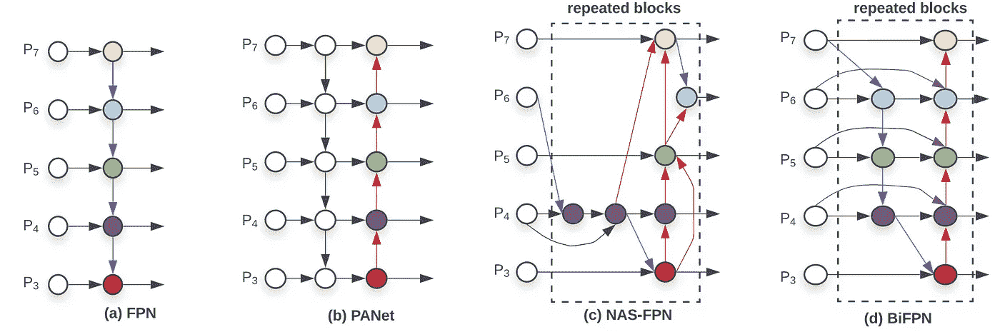***

***融合多尺度特征的特征网络设计，图片来自 [EfficientDet](https://arxiv.org/pdf/1911.09070v7.pdf) 论文***

***多尺度特征融合聚合不同分辨率的特征和广泛使用的实践来学习尺度不变特征。特征金字塔网络[ **FPN** ] (a)融合自上而下从第 3 级到第 7 级的特征并受限于一个方向的信息流，路径聚合网络[ **PANet** ] (b)在 FPN 的顶部添加自下而上的路径，NAS-FPN (c)使用神经架构搜索来查找跨规模的特征网络拓扑，需要 1000 多个小时的搜索。还发现使用 NAS-FPN 的网络不规则且难以解释。[ **2*****

***BiFPN (d)将双向跨尺度连接与加权特征融合相结合。下面的等式和框图描述了级别 6 的融合特征。***

******

***来自 [EfficientDet](https://arxiv.org/pdf/1911.09070v7.pdf) 论文的等式***

***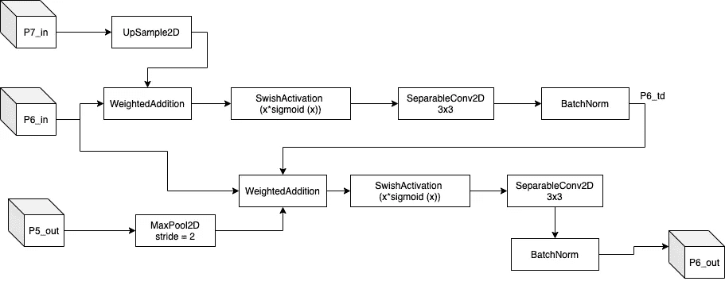***

***六级 BiFPN 特征融合***

***P7_in，P6_in (x，y，w)分别是 6/7 级的输入特征，P5_out 是 5 级的输出特征，P6_out (x，y，w)是 6 级的输出融合特征。使用最近邻插值对 P7_in 特征进行上采样，使用最大池对 P5_out 特征进行下采样，用于第 6 级的特征融合。加权添加层实现**快速归一化融合**，通过对加权添加层中的每个权重应用 **Relu** 来确保正权重。***

# ***高效检测架构***

***EfficientDet 架构使用 4 个主要网络:EfficientNet 主干网、BiFPN、边界框预测和类预测网络。***

***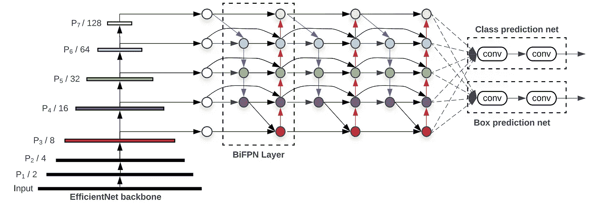***

***完整的 EfficientDet 架构，图片来自 [EfficientDet](https://arxiv.org/pdf/1911.09070.pdf) 论文***

*****输入图像分辨率:**由于 BiFPN 使用 3-7 级的特征，输入分辨率必须能被 pow(2，7) = 128 整除，并且输入图像根据以下等式进行缩放***

******

***输入比例方程***

*****BiFPN 网络:**由于深度需要四舍五入到最小整数，深度线性缩放。对于宽度(通道数)呈指数增长的 BiFPN，执行宽度网格搜索，并选择最佳值 1.35***

******

*****主干网络:** EfficientDet 使用没有任何改变的 EfficientNet 网络，以重新使用预先训练的 imagenet 模型的权重。下表显示了高效网络 B0 和 B7 网络的详细信息。***

***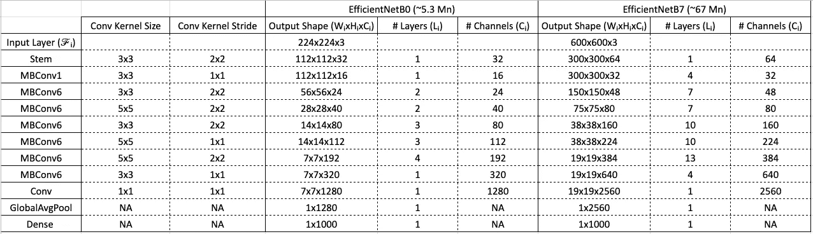***

***高效的网络细节***

******

***MBConv 框图***

***EfficientNet 使用移动反向瓶颈 MBConv 作为构建模块，并依赖于深度方向可分离卷积和残差连接的思想，从而实现更快的训练和更好的准确性。如上图所示，这些 MBConv 模块根据主干网络中的复合缩放系数ϕ ( **num_repeat** )进行缩放。***

*****盒/类预测网络:**盒和类预测网络的宽度根据 BiFPN 网络的宽度进行缩放，深度根据下面的等式进行线性缩放。***

******

***来自 [EfficientDet](https://arxiv.org/pdf/1911.09070v7.pdf) 论文的等式***

***下表显示了根据复合系数ϕ.的 EfficientDet 检测器的比例配置***

***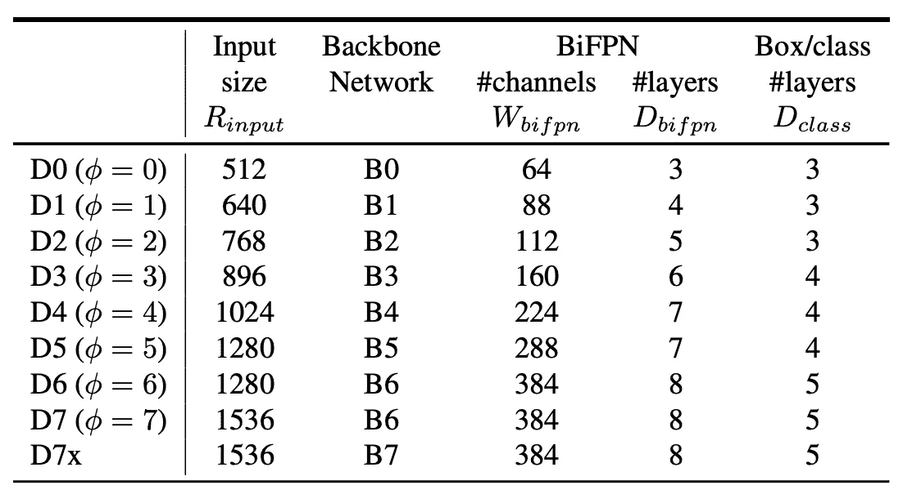***

***[EfficientDet](https://arxiv.org/pdf/1911.09070v7.pdf) 网络的缩放配置，图片来自 [EfficientDet](https://arxiv.org/pdf/1911.09070v7.pdf) 纸张***

# ***使用预先训练的 COCO 模型进行推理:***

```
*****#Make sure python3 pip3 is installed and updated**sudo apt-get update
sudo apt install python3-pip 
sudo -H pip3 install -U pip (to upgrade the pip to latest version)**#Clone EfficientDet git repo** git clone [https://github.com/google/automl.git](https://github.com/google/automl.git)cd ~/automl/efficientdet**#Install all the EfficientDet requirements**
pip3 install -r requirements.txt**#Download the pretrained weights. Bold d0 represent the model version and can be in the range d0-d7.** wget [https://storage.googleapis.com/cloud-tpu-checkpoints/efficientdet/coco/efficientdet-**d0**.tar.gz](https://storage.googleapis.com/cloud-tpu-checkpoints/efficientdet/coco/efficientdet-d7.tar.gz)tar zxf efficientdet-d0.tar.gzmkdir -p ./savedmodels/efficient-d0**# Export saved model.** python3.6 model_inspect.py --runmode=**saved_model** --model_name=efficientdet-d0 --ckpt_path=./efficientdet-d0 --hparams="image_size=1920x1280" --saved_model_dir=./savedmodels/efficientdet-d0**#Make output dir and do inferencing with the saved model** mkdir -p outdir
python3.6 model_inspect.py --runmode=**saved_model_infer** --model_name=efficientdet-d0 --saved_model_dir=./savedmodels/efficientdet-d0 --input_image=**path_to_input_image** --output_image_dir=./output --min_score_thresh=0.6***
```

******

***输入图像(左)，EfficientDet-D0 输出(右)***

***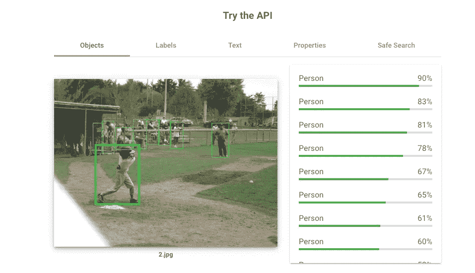***

***谷歌视觉 API 的输出，[https://cloud.google.com/vision](https://cloud.google.com/vision)***

***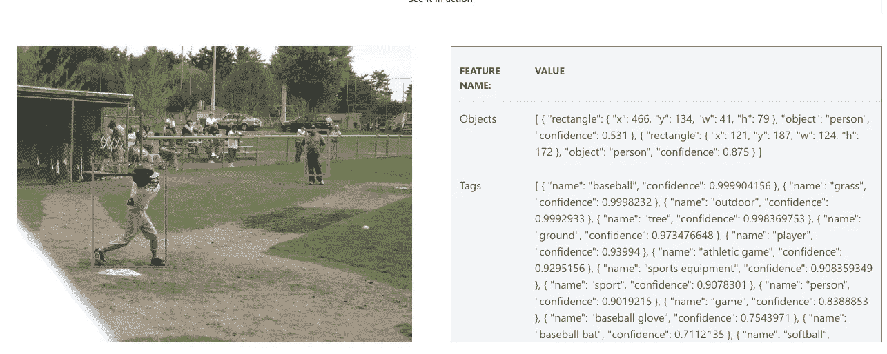***

***Azure Vision API 的输出，[https://Azure . Microsoft . com/en-in/services/cognitive-services/computer-Vision/# features](https://azure.microsoft.com/en-in/services/cognitive-services/computer-vision/#features)***

***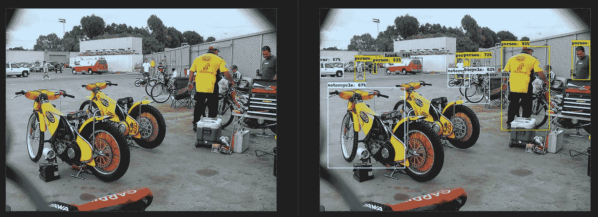***

***输入图像(左)，EfficientDet-D0 输出(右)***

***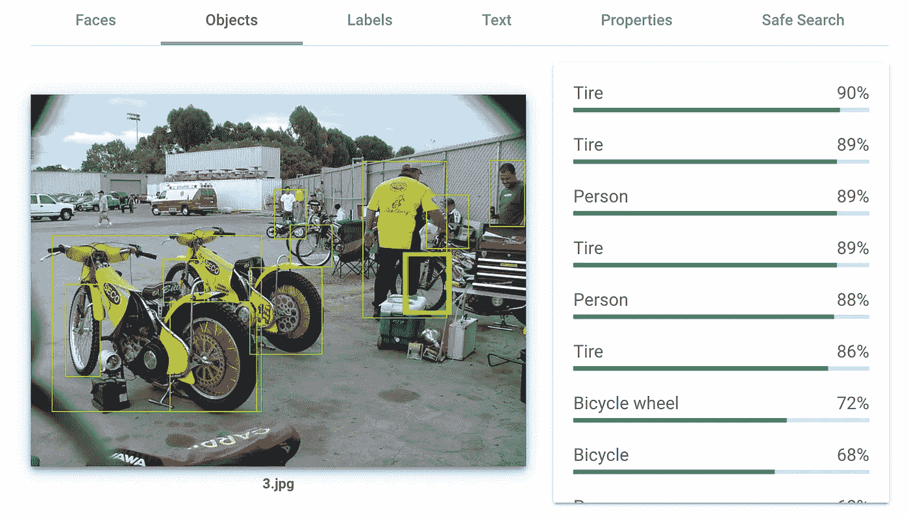***

***谷歌视觉 API 的输出，[https://cloud.google.com/vision](https://cloud.google.com/vision)***

***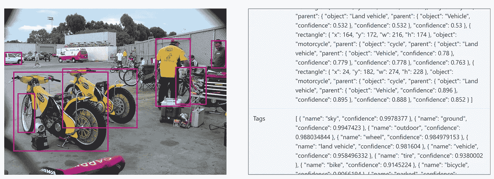***

***Azure Vision API 的输出，[https://Azure . Microsoft . com/en-in/services/cognitive-services/computer-Vision/# features](https://azure.microsoft.com/en-in/services/cognitive-services/computer-vision/#features)***

***E 就云视觉 API 而言，在测试图像上，fficientDet 输出看起来更好**。**需要进行详细的对比分析，以确定生产云视觉 API 的效率和质量。**采用新型 BiFPN 和复合缩放的 EfficientDet 无疑将成为未来目标检测相关研究的新基础，并将使目标检测模型在实际应用中更加有用。*****

*****感谢您阅读这篇文章，我希望这对您有所帮助。如果你有，请在你最喜欢的社交媒体上分享，这样其他人也可以找到它。此外，如果有不清楚或不正确的地方，请在评论区告诉我们。*****

# *****参考资料:*****

1.  *****[https://ai . Google blog . com/2020/04/efficient det-forward-scalable-and . html](https://ai.googleblog.com/2020/04/efficientdet-towards-scalable-and.html)*****
2.  *****[https://arxiv.org/pdf/1911.09070v7.pdf](https://arxiv.org/pdf/1911.09070v7.pdf)*****
3.  *****[https://arxiv.org/abs/1905.11946](https://arxiv.org/abs/1905.11946)*****
4.  *****[https://arxiv.org/pdf/1801.04381.pdf](https://arxiv.org/pdf/1801.04381.pdf)*****
5.  *****[https://github.com/google/automl/tree/master/efficientdet](https://github.com/google/automl/tree/master/efficientdet)*****