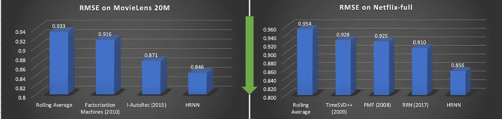
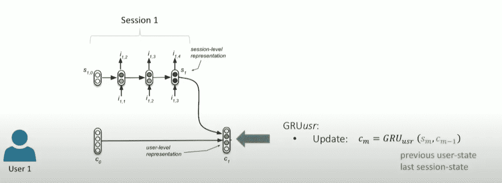
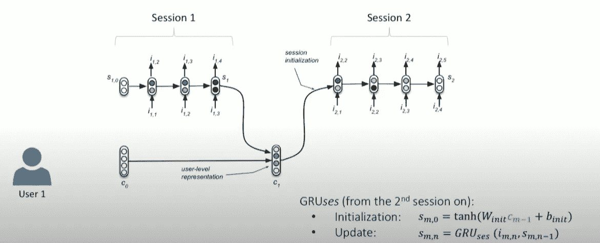
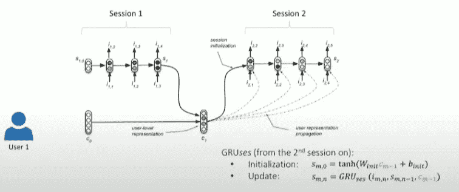
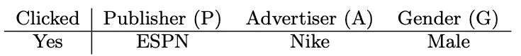
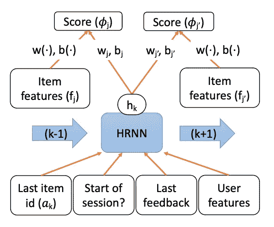
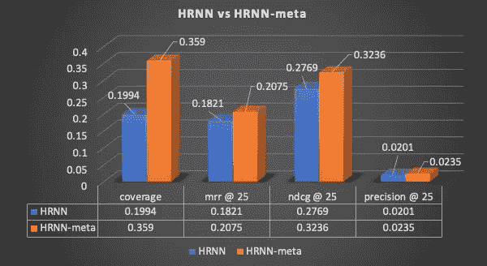

# 解码:最先进的推荐系统

> 原文：<https://towardsdatascience.com/decoding-state-of-the-art-recommender-system-38ee800f6fe?source=collection_archive---------13----------------------->

"[](https://assets.amazon.science/96/71/d1f25754497681133c7aa2b7eb05/temporal-contextual-recommendation-in-real-time.pdf)****"**被宣布为应用数据科学领域的最佳论文，最近在 2020 年 8 月 23 日至 27 日举行的 [SIGKDD-2020](https://www.kdd.org/kdd2020/) 中。在这篇博客中，我将介绍 **HRNN 元**推荐模型的关键部分，该模型在各种数据集上实现了最先进的性能，并在[sky trax-reviews-dataset](https://github.com/quankiquanki/skytrax-reviews-dataset)上对 HRNN 和 HRNN 元模型进行了比较，以实现个性化的航空公司推荐。**

****

**均方根误差:20 米电影镜头和网飞[ **越低越好** ]的 Sqrt((真实评分-预测评分) )，图片由作者提供**

****HRNN-梅塔**有效且高效地结合了以下主要思想，用于能够适应不同使用情况的 black-bok 推荐系统**

1.  **用于会话间和会话内动态的分级递归神经网络( **HRNN** )。**
2.  **字段因子分解机器( **FFM** )从元中提取丰富的上下文特征。**
3.  ****反馈编码**理解隐含否定。**
4.  **使用**采样**的高效训练技术。**

# **HRNN:**

**推荐系统已经从矩阵分解发展到关注两个重要的来源 1)事件的时间顺序 2)用户/项目元。事件的时间顺序用序列网络建模，如 [LSTM 或 GRU 或香草 RNN](https://colah.github.io/posts/2015-08-Understanding-LSTMs/) 。这些网络基于用户历史预测用户可能与之交互的下一个项目的概率，但可能会发现由于消失梯度而对长时间用户会话建模具有挑战性。**

**为了对长会话建模，通过考虑不活动时段或使用任何其他事件，将会话划分为短会话。**

**通过使用两个序列网络来学习用户和会话表示，建议使用分层网络来模拟这些长用户会话，如下图所示。在第一个会话期间，用户状态被随机初始化，在会话结束时，SessionRNN 初始化用户表示，如第一个图像所示，这又初始化了 SessionRNN 中下一个会话的状态，如第二个图像所示，并且还可以在整个第二个会话中使用，如第三个图像所示。**

****

**图片来自[https://youtu.be/M7FqgXySKYk](https://youtu.be/M7FqgXySKYk)[21:52]**

****

**图片来自 https://youtu.be/M7FqgXySKYk[22:25]**

****

**图片来自 https://youtu.be/M7FqgXySKYk[22:54]**

**想了解更多关于 HRNN 的细节，请看 Alexandros Karatzoglou 的精彩视频[。](https://youtu.be/M7FqgXySKYk)**

# **FFM:**

***“HRNN 被扩展为包括用户和物品特征，如位置、物品价格等，通过场感知多层感知将上下文信息堆叠在相应的用户/物品潜在向量之上，这种扩展我们称为 HRNN 元。”【*[*1*](https://assets.amazon.science/96/71/d1f25754497681133c7aa2b7eb05/temporal-contextual-recommendation-in-real-time.pdf)*】***

**在因式分解机器中，每个特征只有一个潜在向量来学习潜在效果，而在场感知因式分解机器中，每个特征有几个潜在向量，并且根据其他特征的场，其中一个用于做内积。**

**例如，考虑三个特征 ESPN、Vogue 和 NBC，属于领域**出版商**，而另外三个特征耐克、古驰和阿迪达斯，属于领域**广告商**。**

****

**图片来自[ [5](https://www.csie.ntu.edu.tw/~cjlin/papers/ffm.pdf)**

**FM→wes pn w Nike+wes pn w male+w Nike w male。**

**FFM →威斯普，一个女的，P +威斯普，G 男的，P +女的，G 男的，一个**

**该原始数据首先被转换为 libffm 格式，然后在馈送到网络之前被转换为 one-hot 编码。**

**LIBFFM 的数据格式为:**

**为了将原始数据转换为 FFM 格式，我们构建了两个字典，一个用于字段，一个用于要素**

```
**#Field Dictionary** DictField[Publisher]  -> 0
DictField[Advertiser] -> 1
DictField[Gender] -> 2**#Feature Dictionary** DictFeature[Publisher-ESPN]  -> 0
DictFeature[Publisher-Vogue]  -> 1
DictFeature[Publisher-NBC]  -> 2
DictFeature[Advertiser-Nike] -> 3
DictFeature[Advertiser-Gucci] -> 4
DictFeature[Advertiser-Adidas] -> 5
DictFeature[Gender-Female] -> 6
DictFeature[Gender-Male] -> 7**#Tranforming above example to FFM Format**
1 0:0:1 1:3:1 2:7:1 (since all features are cateogorical, the values are all ones)
```

# **反馈编码**

**连同用户特征、反馈事件(例如，评级、购买、成本、观看持续时间等。)被连接作为输入上下文来预测下一项，如下面的 HRNN 元单元格所示。这提供了对隐式负面的更好的响应，如没有任何点击的刷新、内容打开但没有视频视图等。**

****

**HRNN-meta 单元格，图像来自[ [1](https://assets.amazon.science/96/71/d1f25754497681133c7aa2b7eb05/temporal-contextual-recommendation-in-real-time.pdf) ]**

# **抽样**

**计算 softmax 以找出大词汇量中下一个项目的概率在计算上是具有挑战性的，并且在文献中提出了各种采样策略以利用 softmax 进行有效训练，例如:**噪声对比估计、重要性采样、负采样**等。有两种方法**

*   **软最大近似值**
*   **基于抽样的**

**所有基于采样的方法都使用一些其他损失来近似 softmax，这对于计算是有效的，并且在训练时最有用。**

**关于抽样策略的更多细节，请看看来自 [Sebastian Ruder](https://ruder.io/word-embeddings-softmax/) 的精彩博客。HRNN 依赖于**负采样**，其中是噪声对比估计的近似值，并将 softmax 转换为逻辑损失。通过将项目频率提高到 0.75 次幂来对负项目进行采样。**

****HRNN 元**是目前在[亚马逊个性化](https://docs.aws.amazon.com/personalize/latest/dg/native-recipe-hrnn-metadata.html)中可用，下图显示了它是如何工作的。**

****

**图片来源:[https://aws.amazon.com/personalize/](https://aws.amazon.com/personalize/)**

**我们在[sky trax-reviews-dataset](https://github.com/quankiquanki/skytrax-reviews-dataset)上使用 Amazon Personalize 对 HRNN-meta w.r.t HRNN 进行了快速检查，该数据集有大约 41.4K 条航空公司评论，用于基于用户历史和评论的个性化航空公司推荐。为了使用 Amazon Personalize 训练一个 HRNN 模型和**HRNN-梅塔**模型，在创建一个环境后，我们按照[个性化样本](https://github.com/aws-samples/amazon-personalize-samples/blob/master/next_steps/workshops/Immersion_Day/personalize_hrnn_metadata_contextual_example.ipynb)进行上下文推荐，使用 HRNN-梅塔 vs HRNN 的离线指标结果非常令人印象深刻，如下图所示。**

*   ****~ 80%**[覆盖率提高](https://docs.aws.amazon.com/personalize/latest/dg/working-with-training-metrics.html)，**
*   **[中的 **~17%** 表示倒数排名和 ndcg](https://docs.aws.amazon.com/personalize/latest/dg/working-with-training-metrics.html) ，**
*   ****~ 14%**[精度提高](https://docs.aws.amazon.com/personalize/latest/dg/working-with-training-metrics.html)。**

****

**HRNN-meta vs HRNN 离线指标比较，图片由作者提供**

**如果你觉得这很有趣，并想训练 HRNN 元，请跟随[开始亚马逊个性化样本](https://github.com/aws-samples/amazon-personalize-samples/tree/master/getting_started)，它将带你从环境创建到在定制数据集上训练推荐器模型。**

# **结论**

**HRNN 元通过有效地将基于会话的推荐与场感知因子分解相结合来提供情境化的推荐，从而提供了一种高效/有效的推荐解决方案。还提供了各种方法，如**项目趋势分解**来改善冷启动项目推荐。探索像 [BERT4Rec](https://arxiv.org/abs/1904.06690) 这样的其他最近的方法将会很有趣，并且也可以看到用[变压器](https://en.wikipedia.org/wiki/Transformer_(machine_learning_model))代替 GRUs 的潜力。**

**感谢您阅读这篇文章，我希望这对您有所帮助。如果你有，请在你最喜欢的社交媒体上分享，这样其他人也可以找到它。此外，如果有不清楚或不正确的地方，请在评论区告诉我们。**

# **参考:**

1.  **[https://assets . Amazon . science/96/71/d1f 25754497681133 c 7 aa 2 b 7 EB 05/temporal-contextual-recommendation-in-real-time . pdf](https://assets.amazon.science/96/71/d1f25754497681133c7aa2b7eb05/temporal-contextual-recommendation-in-real-time.pdf)**
2.  **[https://aws.amazon.com/personalize/](https://aws.amazon.com/personalize/)**
3.  **[https://www . slide share . net/Amazon web services/add-real time-personal ization-and-recommendation-to-your-applications-aim 395-AWS-reinvent-2018](https://www.slideshare.net/AmazonWebServices/add-realtime-personalization-and-recommendations-to-your-applications-aim395-aws-reinvent-2018)**
4.  **[https://openreview.net/pdf?id=ByzxsrrkJ4](https://openreview.net/pdf?id=ByzxsrrkJ4)**
5.  **[https://www.csie.ntu.edu.tw/~cjlin/papers/ffm.pdf](https://www.csie.ntu.edu.tw/~cjlin/papers/ffm.pdf)**
6.  **[https://github.com/ycjuan/libffm](https://github.com/ycjuan/libffm)**
7.  **[https://arxiv.org/pdf/1602.02410.pdf](https://arxiv.org/pdf/1602.02410.pdf)**