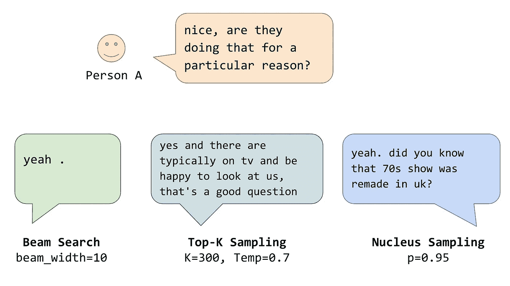
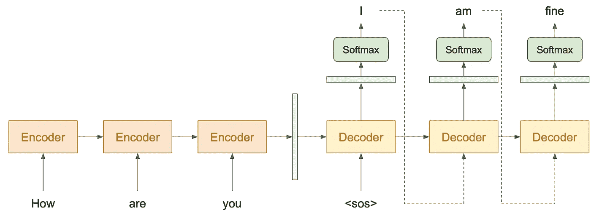
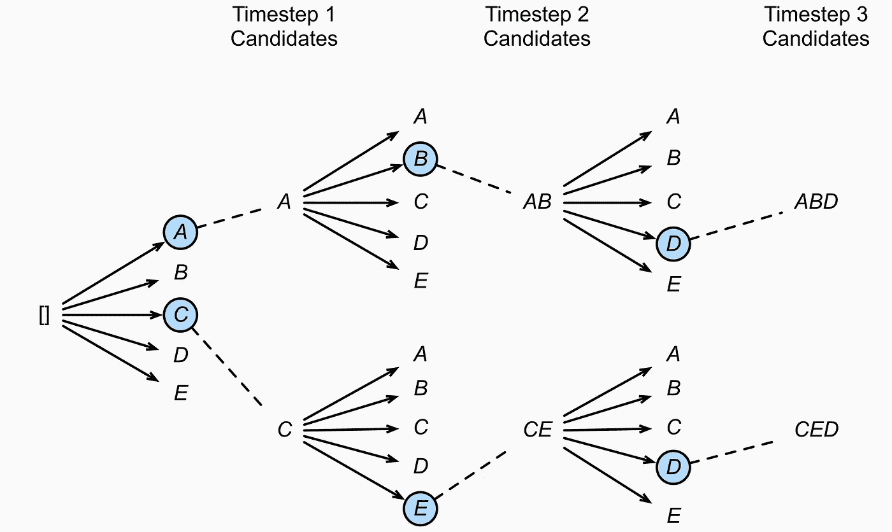
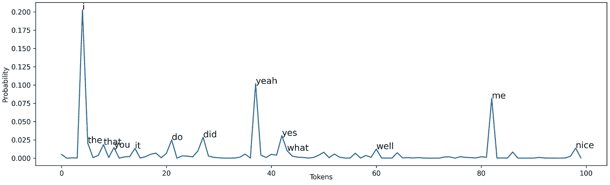
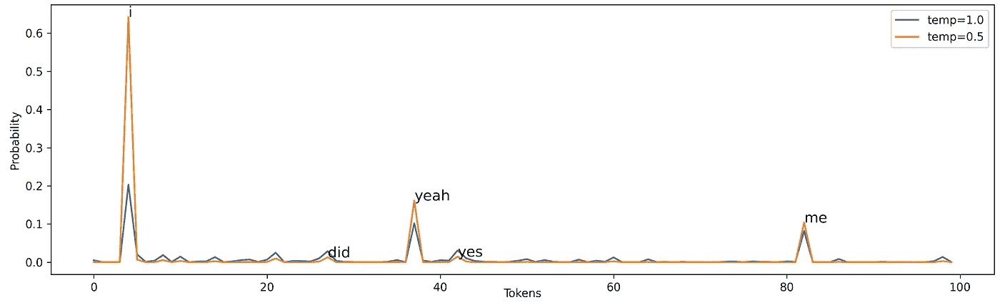
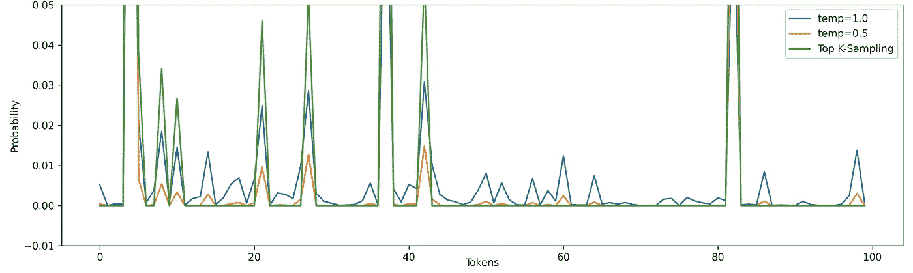
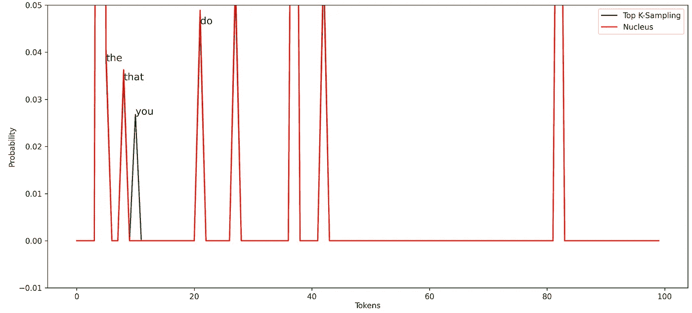

# 生成响应时需要了解的解码策略

> 原文：<https://towardsdatascience.com/decoding-strategies-that-you-need-to-know-for-response-generation-ba95ee0faadc?source=collection_archive---------7----------------------->

## 区分波束搜索、随机采样、Top-K 和 Nucleus



不同的采样技术。注意，我们在这个例子中没有使用强生成模型。

# 介绍

深度学习已经被部署在 NLP 的许多任务中，例如翻译、图像字幕和对话系统。在机器翻译中，它用于读取源语言(输入)并生成所需的语言(输出)。类似地，在对话系统中，它用于在给定上下文的情况下生成响应。这也被称为自然语言生成(NLG)。

该模型分为两部分:编码器和解码器。编码器读取输入文本，并返回一个表示该输入的向量。然后，解码器获取该向量并生成相应的文本。



图 1:编码器-解码器架构

要生成文本，通常是通过一次生成一个标记来完成的。如果没有适当的技术，生成的响应可能非常普通和乏味。在本文中，我们将探讨以下策略:

*   贪婪的
*   波束搜索
*   随意采样
*   温度
*   Top-K 抽样
*   细胞核取样

# 解码策略

在解码过程中的每个时间步长，我们取向量(保存从一个步骤到另一个步骤的信息),并用 softmax 函数将其转换为每个单词的概率数组。


等式 1: Softmax 函数。x 是时间步长 I 处的令牌。u 是包含词汇表中每个令牌的值的向量。

## 贪婪的方法

这种方法是最简单的。在每个时间步，它只选择最有可能的记号。

```
Context:            Try this cake. I baked it myself.
Optimal Response  : This cake tastes great.
Generated Response: This is okay.
```

但是，这种方法可能会产生次优的响应，如上例所示。生成的响应可能不是最佳响应。这是由于训练数据通常具有类似“这是[…]”的例子。因此，如果我们一次生成最可能的令牌，它可能输出“是”而不是“蛋糕”。

## 波束搜索

穷举搜索可以解决前面的问题，因为它将搜索整个空间。然而，这在计算上将是昂贵的。假设有 10，000 个词汇，要生成一个长度为 10 个单词的句子，将需要(10，000)个⁰.



图 2:波束宽度=2 的波束搜索([源](https://d2l.ai/chapter_recurrent-modern/beam-search.html)

波束搜索可以应对这个问题。在每个时间步，它生成词汇表中所有可能的标记；然后，它将选择概率最大的前 B 名候选人。那些 B 候选人将移动到下一个时间步，并且重复该过程。最后只会有 B 人选。搜索空间只有(10000)* b。

```
Context:    Try this cake. I baked it myself.
Response A: That cake tastes great.
Response B: Thank you.
```

但有时，它会选择一个更优的方案(对策 B)。在这种情况下，这是完全合理的。但是想象一下，这个模型喜欢玩安全的游戏，并且在大多数情况下不断地产生“我不知道”或者“谢谢你”，这是一个非常糟糕的机器人。

## 随意采样

或者，我们可以研究随机方法，以避免反应是通用的。我们可以利用来自 softmax 函数的每个令牌的概率来生成下一个令牌。

假设我们正在生成上下文的第一个单词“我喜欢看电影”，下图显示了第一个单词应该是什么的概率。



图 3:每个单词的概率。x 轴是令牌索引。即，索引 37 对应于单词“耶”

如果我们使用贪婪的方法，将选择一个令牌“I”。然而，通过随机抽样，令牌 *i* 有 0.2 左右的概率发生。同时，任何概率为 0.0001 的令牌也可能出现。只是可能性很小。

## 温度随机抽样

随机抽样本身可能会偶然产生一个非常随机的单词。温度用于增加可能令牌的概率，同时减少不是可能令牌的概率。通常情况下，范围是 0 < temp ≤ 1\. Note that when temp=1, there is no effect.


Equation 2: Random sampling with temperature. Temperature t is used to scale the value of each token before going into a softmax function



Figure 4: Random sampling vs. random sampling with temperature

In Figure 4, with temp=0.5, the most probable words like *i* ， *yeah* ， *me* ，产生的几率较大。同时，这也降低了不太可能发生的事件的概率，尽管这并不能阻止它们的发生。

## Top-K 抽样

Top-K 采样用于确保不太可能的单词根本不会有任何机会。对于一个世代，应该只考虑前 K 个可能的记号。



图 5:3 个随机抽样的分布，带 temp 的随机抽样和 top-k

如果我们使用温度=0.5 或 1.0 的随机抽样，50 到 80 之间的令牌指数有一些小概率。对于 top-k 采样(K=10)，这些令牌没有机会被生成。请注意，我们也可以将 Top-K 采样与温度相结合，但是您可能已经了解了这个概念，所以我们选择不在这里讨论它。

这种采样技术已在许多新一代任务中采用。它的性能相当不错。这种方法的一个限制是需要在开始时定义前 K 个单词的数量。假设我们选择 K = 300 然而，在解码时间步长，模型确定应该有 10 个极有可能的单词。如果我们使用 Top-K，这意味着我们也将考虑其他 290 个可能性较小的单词。

## 细胞核取样

细胞核采样类似于 Top-K 采样。nucleus sampling 不是关注 Top-K 单词，而是关注 Top-V 单词的最小可能集合，使得它们的概率之和≥ p。然后，不在 V^(p 中的记号被设置为 0；其余的被重新缩放，以确保它们的总和为 1。


等式 3:细胞核取样。V^(p)是最小的代币。P(x|…)是给定先前生成的从 1 到 i-1 的记号 x，生成记号 x 的概率

直觉是，当模型对一些记号非常确定时，潜在候选记号的集合很小，否则，将会有更多的潜在候选记号。

> C *确定→那几个记号概率大=几个记号之和足以超过 p.
> 不确定→很多记号概率小=需要很多记号之和才能超过 p.*



图 6:Top-K 和 Nucleus 采样的分布

将 nucleus 采样(p=0.5)与 top-K 采样(K = 10)进行比较，我们可以看到 nucleus 不认为令牌“you”是候选。这说明它可以适应不同的情况，选择不同数量的令牌，不像 Top-K 采样。

# 摘要

*   贪婪:一次选择最可能的令牌
*   波束搜索:选择最可能的响应
*   随机抽样:基于概率的随机抽样
*   温度:缩小还是放大概率
*   前 K 个采样:选择前 K 个可能的令牌
*   细胞核取样:动态选择 K 的数量(排序)

通常，研究人员的首选是波束搜索、top-K 采样(带温度)和原子核采样。

# 结论

我们已经讨论了一系列解码响应的不同方法。这些技术可以应用于不同的生成任务，即图像字幕、翻译和故事生成。使用具有坏解码策略的好模型或者具有好解码策略的坏模型是不够的。两者之间的良好平衡会让这一代人更有趣。

# 参考

霍尔茨曼，a .，布茨，j .，杜，l .，福布斯，m .，，崔，Y. (2020)。神经文本退化的奇特案例。在*国际学术交流会议*。

[](/word-sequence-decoding-in-seq2seq-architectures-d102000344ad) [## Seq2Seq 架构中的字序列解码

### 自然语言生成(NLG)是一项生成文本的任务。像机器这样的自然语言生成任务…

towardsdatascience.com](/word-sequence-decoding-in-seq2seq-architectures-d102000344ad) [](/an-intuitive-explanation-of-beam-search-9b1d744e7a0f) [## 波束搜索的直观解释

### 波束搜索的简单易懂的解释

towardsdatascience.com](/an-intuitive-explanation-of-beam-search-9b1d744e7a0f)