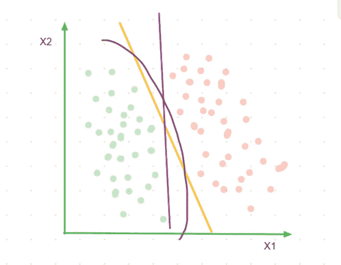
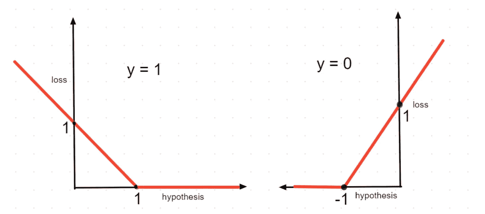
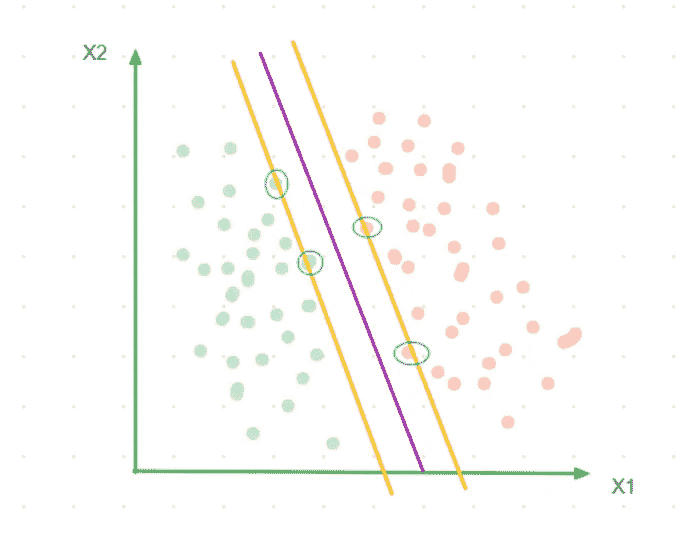
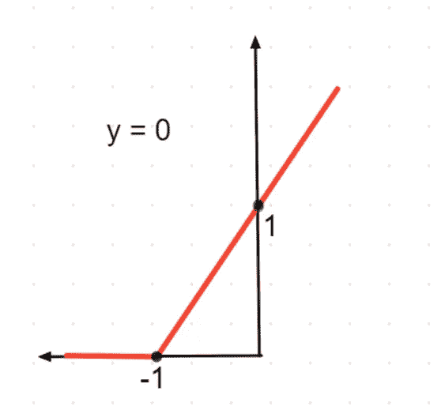
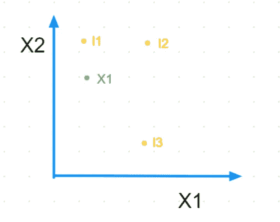
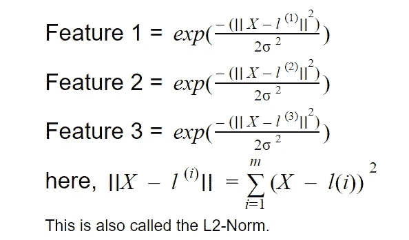
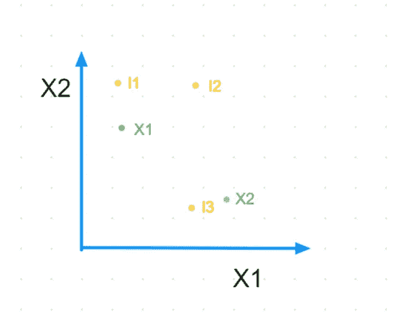
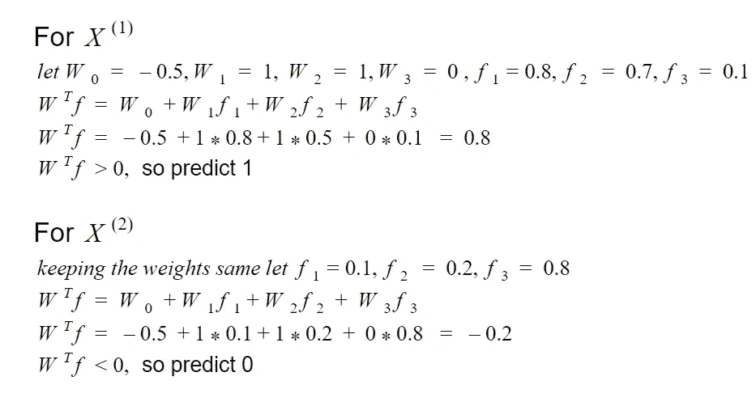
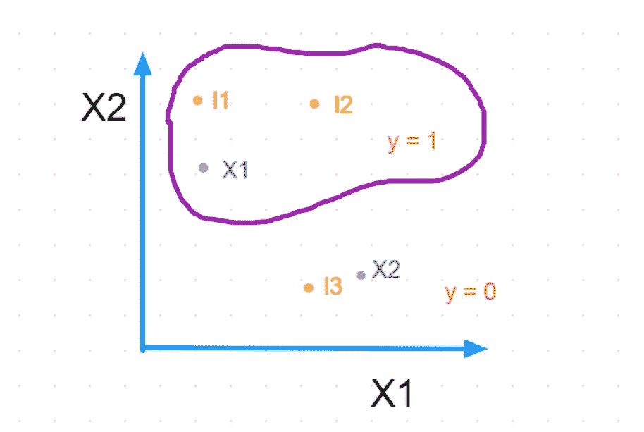
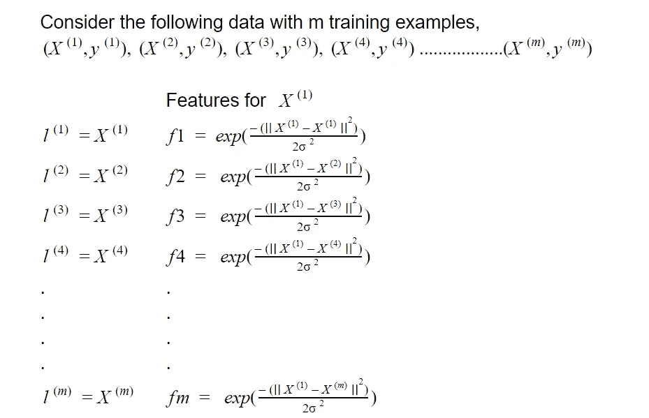

# 解码支持向量机

> 原文：<https://towardsdatascience.com/decoding-support-vector-machines-5b81d2f7b76f?source=collection_archive---------44----------------------->

## 直观理解支持向量机的工作原理

Honey Yanibel Minaya Cruz 在 [Unsplash](https://unsplash.com?utm_source=medium&utm_medium=referral) 上拍摄的照片

SVM 是一个非常简单但强大的监督机器学习算法，可用于分类以及回归，虽然它普遍用于分类。它们在中小型数据集上表现非常好，并且非常容易调优。

在这篇博文中，我们将建立我们对支持向量机的直觉，并了解其背后的数学原理。我们将首先了解什么是大间隔分类器，并了解该算法的损失函数和成本函数。然后我们将看到正则化如何为 SVM 工作，以及什么支配着偏差/方差的权衡。最后，我们将了解 SVM 最酷的特性，那就是内核技巧。

为了轻松掌握概念，您必须具备一些关于线性回归和逻辑回归工作原理的必备知识。我建议你在阅读时做笔记，以便充分利用这篇文章，这将是一个漫长而有趣的旅程。所以，事不宜迟，让我们开始吧。

# 大间距分类器

让我们马上从一个例子开始，假设我们有一些包含 2 个类的数据，为了简单起见，假设它只有 2 个特征，我们可以用许多不同的方法来分离这 2 个类。我们可以使用线性以及非线性的决策边界来做到这一点。

SVM 所做的是试图尽可能广泛地将这两个类**分开，因此在我们的示例中，它将选择黄线作为其决策边界。**

****

**图 1**

**如果黄线是我们的决策边界，那么圈起来的绿色和红色类点(图 2)是离我们的决策边界最近的点。这些点之间的距离被称为**余量**，SVM 试图最大化这个余量。这就是为什么支持向量机也被称为**大间隔分类器的原因，**这使得 SVM 具有更好的泛化精度。**

****

**图 2**

**在高维空间中，这些点只不过是 n 维向量，其中 n 是数据中特征的数量。最接近决策边界的点的样本(这里是红色和绿色的圆圈点)被称为**支持向量**。我将绿色的支持向量称为正支持向量，红色的称为负支持向量。决策边界完全取决于这些点，因为它们是决定我们的边界长度的点。如果我们改变支持向量，我们的决策边界也会改变，这也意味着支持向量以外的点在形成决策边界时并不重要。**

# **优化目标**

**要找到决策边界，我们必须:**

*   **定义我们的假设**
*   **定义损失函数**
*   **使用损失函数计算所有训练点的成本函数**
*   **使用优化算法，如梯度下降或序列最小优化，以最小化成本，并达到我们的理想参数**

**SVM 的假设相当简单，重量为 *w***

****

**图 3**

**这里你需要理解的一个关键点是，这个假设只不过是数据点和决策边界之间的距离，所以每当我说假设这个词的时候，就把它想成是这个距离。**

**在我们看到 SVM 的损失函数到底是什么之前，让我们看看单个训练例子的成本**

****

**图 4**

**第一项是 y = 1 时的损耗，第二项是 y = 0 时的损耗，而“y hat”只是我们在图 3 中定义的假设。我知道我已经给出了很多方程，不要担心，让我们开始理解它们。**

****

**图 5**

**这是实际类分别为 1 和 0 时的开销。如果你不明白 1 和-1 是从哪里来的，不要担心，当我们看到损失函数的公式时，你就会明白了。**

**让我们首先看看 y = 1 时的第一种情况。我们知道当假设为非负时，我们的预测是 1。所以对于我们假设的那些值，我们的成本一定是最小的，但这里不是这样。为什么只有当假设大于或等于 1 而不是 0 时，我们的成本才达到最小值，即值为 0？答案可以在大间隔分类器的思想中找到。**

********

**图 6**

**我们的假设对于所有位于边缘的 1 类点都是 1，换句话说，对于我们的正支持向量，假设是 1。因此，对于远离决策边界(甚至比支持向量更远)的所有点，假设将具有大于 1 的值，因此成本将最小化。如果我们有在边缘之间的点，即它们比支持向量更接近决策边界，对于它们，假设将小于 1。这些点越接近决策边界，我们的成本就越高。然而，只要假设是非负的，这些点仍然被分类为 1。**

**现在让我们看看 y = 0 时的第二种情况**

********

**图 7**

**类似于我们的第一种情况，这里假设的值将为-1，对于所有恰好位于边缘距离的 0 类点，或者换句话说，对于所有的负支持向量，假设将为-1。随着假设开始在负方向上增加，或者数据点开始变得更加远离决策边界的负支持向量(在我们的情况下，随着红色点开始变得更加远离决策边界)，成本达到 0，即最小值。这里，当这些点位于边缘之间或者当它们开始越来越接近决策边界时，成本开始增加，但是只要假设是否定的，这些点就被分类为 0。**

**综上所述，SVM 成本函数不仅会对错误分类产生不利影响，而且会在点开始越来越接近决策边界时产生不利影响，因此我们的优化算法必须找到权重，以保持类之间的距离(或余量)。**

**现在我们已经通过一个训练例子的成本理解了 SVM 背后的直觉，让我们看看铰链损耗的公式是什么。**

****

**图 8**

**现在，如果你再看一下图表，你就会明白 1 和-1 是从哪里来的。损失基本上只是说**

*   **对于 y = 1，如果假设值大于或等于 1，则损失为 0。如果假设介于 0 和 1 之间或为负，则损失保持正值并线性增加。**
*   **对于 y = 0，如果假设值大于或等于-1，则损失为 0。如果假设介于-1 和 0 之间或为正，则损失为正并线性增加。**

**我们已经看到了铰链损耗的样子，也看到了单个训练示例的成本，我们现在需要做的就是将这两个方程结合起来，形成“m”个训练示例的成本函数。这是我们得到的结果:**

****

**图 9**

**等一下…这些多余的字母是从哪里来的？？**

****

**来自[未来派](https://futuristicon.com/how-to-start-with-machine-learning/)的[亚当](https://futuristicon.com/author/adamrad/)的照片**

# **正规化**

**在上式中，“C”称为正则化参数。这是一个控制正则化数量的超参数。然而，SVM 的正则化与逻辑回归或线性回归中的正则化略有不同。让我们以逻辑回归为例，成本函数的形式如下:**

****

**图 10**

**这里，B 是正则项(L2 或 L1 ), A 是代价项，或者像有些人所说的拟合项。在逻辑回归中，通过改变正则化参数“λ”的值，我们基本上是在告诉优化算法需要给予正则化项的**注意力**的数量，这就是我们如何控制偏差/方差的权衡。但是 SVM 成本看起来是这样的:**

****

**图 11**

**这里 A 也是拟合项，B 是正则项，然而正则化参数与拟合项相关联。因此，现在通过改变我们的正则化参数的值，我们告诉优化算法对拟合项给予多少关注，或者对正则化项给予多少关注。直观上，C 和 lambda 是成反比的。**

**例如，我们有一个非常大的 C 值。即使存在单个异常值，大的 C 值也会尝试最小化错误分类的点，我们将得到紫色的决策边界，而不是 C 值合理时得到的绿色决策边界。**

****

**图 12**

**如果 C 非常小，那么裕度将会更大，但是错误分类的机会将会增加。**

****

**图 13**

**所以基本上，随着 **C 增加**我们的模型过拟合**数据的趋势增加，随着 **C 减少**我们更倾向于**欠拟合**数据。****

# **内核技巧**

**核心技巧是支持向量机如此强大的原因。它允许算法学习更复杂的决策边界，而不仅仅是线性的。那么什么是内核呢？让我们首先来看看假设和使用核 SVM 的成本函数。**

****

**图 14**

**如你所见，方程没有太大变化。假设中有“f”而不是 X，这是新特征的矩阵。我们从一个函数中得到这些特性的值，这个函数就是我们所说的**内核**。现在在我们的成本中,“y hat”代表这个新制定的假设。**

**现在让我们理解这些函数是如何计算的。假设我们有一个包含 2 个特征的数据集，我们在下面可视化一个训练示例，这里 l1、l2 和 l3 是我们选择的一些地标，现在不要担心它们的值是什么。**

****

**图 15**

**我们的核是 X 的函数。使用这些函数，我们计算模型的新特征。因此，对于每个地标，我们将有一个如下的特征:**

****

**图 16**

**这些函数或核可以是不同的类型，如高斯核、多项式核，或者如果我们只使用我们的一般特征而不使用核，它有时被称为线性核。高斯核是最广泛使用的，所以我们将在这篇文章中讨论。**

**如果我们使用高斯核，我们的特征看起来会是这样:**

****

**图 17**

**回到我们之前的例子，让我们了解使用高斯核如何影响我们的决策边界。**

**如果我们假设 X 几乎等于 l1(它们之间的距离几乎为 0)，那么高斯核输出接近 1 的值。**

****

**图 18**

**另一种情况可能是，如果 X 离一个点非常远，比如 l1，那么内核将输出一个接近 0 的值。**

**因此，点和界标之间的距离越大，特征值越低，点和界标之间的距离越近，特征值越高。现在举个例子，让我们看看决策边界是如何形成的。**

********

**图 19**

**这里，X1 非常接近 l1，它也接近 l2，但相对远离 l3，因此 f1 和 f2 的值较高，但 f3 的值非常低。(我只是出于解释的目的假设了这些值)。将它代入我们的假设，我们将得到一个正值，并预测 X1 为 1。**

**另一方面，X2 更靠近 l3，而远离 l1 和 l2。所以 f1 和 f2 的值会很小，f3 会更大。代入这些值给我们一个否定的假设，因此我们预测 X2 为 0。**

**由此我们可以看到，距离 l1 和 l2 更近的点被预测为 1，距离 l3 更近的点被预测为 0，因此这是我们得到的近似决策边界。**

****

**图 20**

**这给了我们一个直观的理解，如何使用核可以让 SVM 学习更复杂的函数，而不仅仅是一个线性函数，但是这些标志是如何选择的呢？**

**这个问题的答案很简单，每个地标对应我们的每个数据点。这意味着对于具有“m”个训练示例的数据集，我们将有“m”个界标，因此我们将计算“m”个新特征。**

****

**图 21**

**因此，对于具有“m”个示例的数据集，我们将计算“m”个特征。现在，我们用这种方法计算所有数据点的特征。这里要注意的一点是，对于第 I 个数据点，第 I 特征值总是为 1(使用高斯核)**

# **偏差/方差权衡**

**我们已经讨论了当我们改变 C 时，决策边界是如何受到影响的。如果 C 很大，则存在高方差和低偏差，如果 C 很小，则存在高偏差和低方差。**

**让我们探讨σ对我们的偏差和方差的影响。高斯核使用最广泛，因此了解σ如何影响我们的决策函数很有好处。为了简单起见，让我们假设我们有一个只有一个特征的数据集**

****

**图 22**

**这里 l(i)是第 I 个标志，我们可以看到，如果σ很大(绿线)，那么高斯核从一个训练示例到另一个训练示例变化非常平滑，无论我们的训练示例或标志的值是多少，如果σ很大，那么变化将是最小的，因此我们的模型将对数据进行欠拟合。我们将有高偏差和低方差。**

**现在，对于一个小的σ值(红线),高斯核的变化从一个训练示例到另一个训练示例将是剧烈的，因此它将给我们一个过度拟合的模型。我们将有高方差和低偏差。因此，随着σ增加，偏差增加，随着σ减少，方差增加。**

# **最佳化**

**为了优化 SVM 成本公式，我们使用 SMO(序列最小优化)。没有必要去理解 SVM 的成本函数是如何被优化来实现 SVM 的，大多数可用的软件包都可以为我们做到这一点。然而，如果你对它背后的数学感兴趣，那么你可以查阅参考文献**

**至此，我们可以结束对支持向量机的讨论，如果你坚持到最后，恭喜你，你现在一定对 SVM 算法的工作有了直观的理解。**

**希望你觉得这篇文章有用并且容易理解，请在评论区提供有价值的反馈:)**

# **参考**

**[CS229 吴恩达讲座笔记](http://cs229.stanford.edu/notes/cs229-notes3.pdf)**

**[吴恩达讲座视频](https://www.youtube.com/playlist?list=PLNeKWBMsAzboNdqcm4YY9x7Z2s9n9q_Tb)**