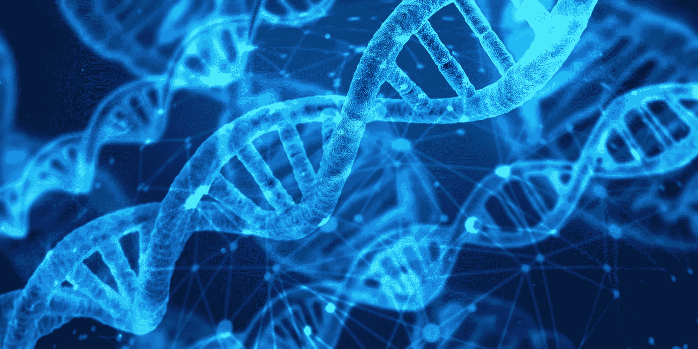
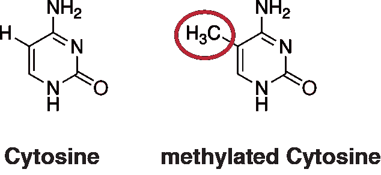
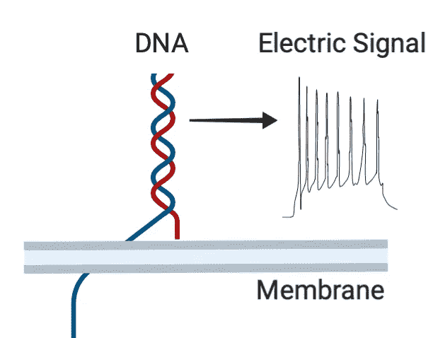
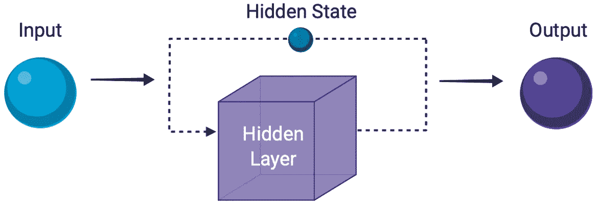
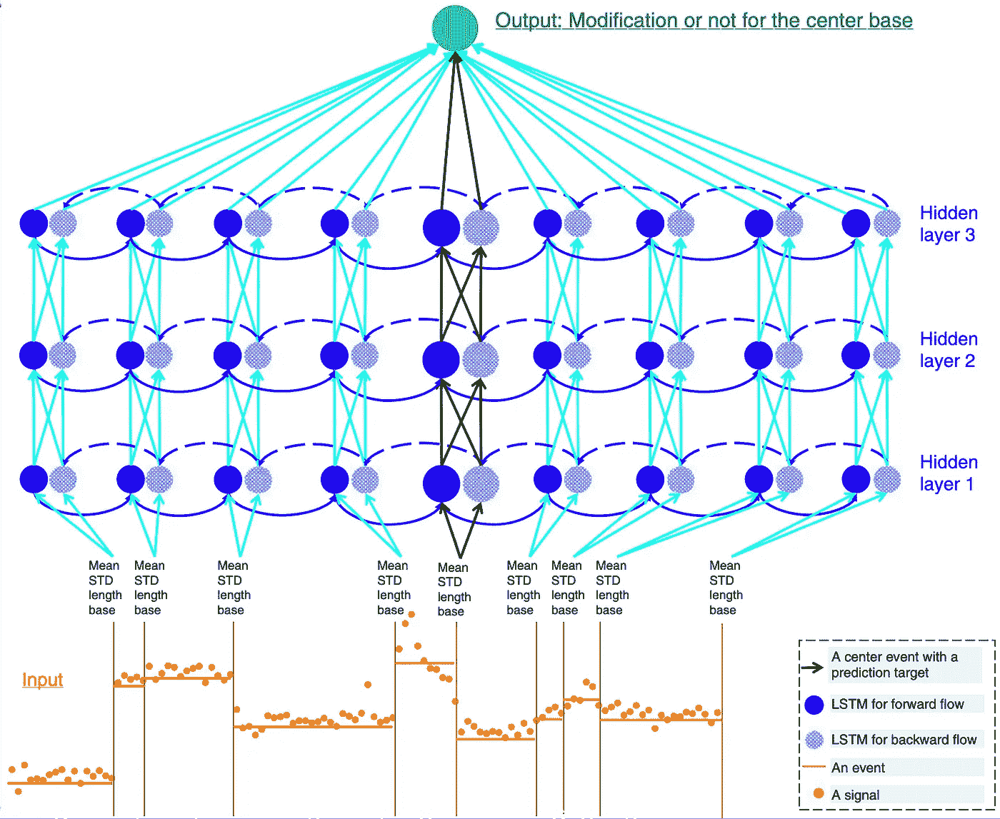
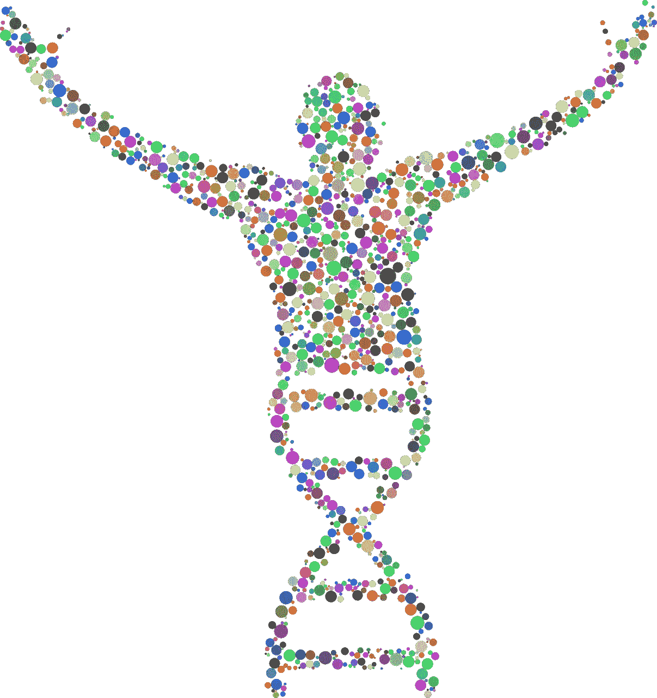

# 解码你的基因

> 原文：<https://towardsdatascience.com/decoding-your-genes-4a23e89aba98?source=collection_archive---------69----------------------->

## 神经网络能解开我们 DNA 的秘密吗？

我通过总结激动人心的新研究论文来探索人工智能对传统科学的影响。在这篇文章中我讨论的是另一篇很酷的论文:《深度递归神经网络对牛津纳米孔测序数据的 DNA 碱基修饰检测》( [*《自然通讯》，10，2449，2019*](https://www.nature.com/articles/s41467-019-10168-2) *)。*

**1 |你背后的代码**

你身体的每一部分都是你的 DNA(脱氧核糖核酸)的产物，DNA 是一种复杂的遗传密码，精确地描述了你的细胞应该做什么。我们都知道 DNA 分子著名的双螺旋形状:它由称为“碱基”(胞嘧啶[C]、鸟嘌呤[G]、腺嘌呤[A]和胸腺嘧啶[T])的不同化学单元组成，它们结合在一起形成美丽的螺旋链。这有点像二进制计算机代码，但不是 1 和 0 的序列，而是 Cs、Gs、As 和 Ts。这些链中 CGAT 碱基的精确序列编码了你和地球上其他动物的一切。

DNA 的双螺旋结构。图片来自[pixabay.com](https://pixabay.com)

一个真正重要的生物过程是 DNA 甲基化:这是一个简单的化学甲基(CH3)被添加到正常的 DNA 碱基中:下图显示了这种变化有多小。虽然这种变化看起来很小，但它可能对基因调控、衰老甚至癌症产生巨大影响。人们甚至认为这些甲基化可以作为癌症治疗的治疗靶点！

正常胞嘧啶(DNA 中的 C 碱基)和甲基化版本的比较。[在](https://en.wikipedia.org/wiki/DNA_methylation)[知识共享许可](https://creativecommons.org/licenses/by-sa/4.0/legalcode)的许可下复制。

**2|用纳米技术绘制 DNA 变化图**

显然，我们能够绘制出我们遗传密码中的修改是非常重要的……但这实际上很难做到。目前的技术噪音大，分辨率低，因此确实需要改进。最近的一个想法是基于一种非常酷的纳米孔技术。你可以看看这个[很棒的视频](https://nanoporetech.com/how-it-works)展示了它是如何工作的，但基本上离子电流是通过含有微小纳米孔的聚合物膜。当感兴趣的分子穿过这些小孔，从膜的一侧移动到另一侧时，电流以特有的方式受到干扰。所以你放入 DNA 分子，你会得到一个 2D 序列的变化的电子信号，可以用来识别遗传密码。**这项技术最近被用来在仅仅** [**7 小时**](https://nanoporetech.com/covid-19/overview) 内测序新冠肺炎的全部遗传密码！

尽管这个系统非常擅长获得整个 DNA 序列，但要定位存在微妙甲基化的位置有点困难，因为理解信号是依赖于上下文的。甲基化可以通过比较甲基化和未甲基化 DNA 序列的纳米孔电子信号来定位。

显示 DNA 穿过膜在电子信号中产生干扰的示意图。

**3 | ML 能帮上什么忙？**

如果你在序列数据中寻找模式，RNNs(递归神经网络)是最好的架构。如果你不熟悉，让我们快速看一下它们是如何工作的。

典型的“前馈”神经网络遵循将随机初始化的权重和偏差应用于输入以预测输出的过程。当将生成的输出与目标输出进行比较时，会计算出一个误差(或“损失”)。这种损失然后通过网络传播回来，以更新权重和偏差，目的是提高输出。在训练期间，这个过程用不同的输入反复重复，直到网络有希望学会产生准确的输出。这只是一个非常简单的概述，但总结了主要原则。

如果您预测的不是单个输出，而是一系列输出，该怎么办？从概念上讲，RNN 可以被认为是一系列相连的前馈网络，信息在它们之间传递。被传递的信息是隐藏状态，它代表所有先前输入到网络的信息。在 RNN 的每一步，前一步生成的隐藏状态以及下一个序列输入都会被传入。然后，这将返回一个输出以及要再次传递的新隐藏状态。这使得 RNN 能够保留迄今为止看到的序列信息的“记忆”,并使它们对于理解序列数据非常有用。你可以在这里找到一个更加数学化的描述[。](https://stanford.edu/~shervine/teaching/cs-230/cheatsheet-recurrent-neural-networks)

让我们来看看 RNNs 究竟是如何破译 DNA 修改的。

通过 RNN 表示信息的移动

**4|用 RNNs 解开 DNA**

在本文中，开发了一种新工具“DeepMod”。这是一个双向 RNN(它向前和向后传递序列信息)，具有长短期记忆(LSTM)；点击查看 lstm[的精彩摘要。](/illustrated-guide-to-lstms-and-gru-s-a-step-by-step-explanation-44e9eb85bf21)

DeepMod 将参考遗传密码和纳米孔电信号作为输入。电信号中的“事件”(由纳米孔测序仪产生的一系列信号点)与参考中的 DNA 代码对齐。这是使用 [BWA-MEM](https://arxiv.org/pdf/1303.3997.pdf) 实现的，这是一种将 DNA 序列与参考基因组匹配的比对算法。这种算法能够匹配长达百万碱基的 DNA 序列！

作者使用输入信号的 7 特征向量描述；与事件相关的信号平均值、标准偏差和信号点数，结合 DNA 碱基的四个特征描述(A、C、G 或 T)。这作为网络的输入(见下面的体系结构),预测信号事件是否是修改碱基的结果。

该算法首先使用来自大肠杆菌细菌 DNA 的数据进行训练和优化。发现具有 3 个隐藏层的 21 单元 LSTM 在保持合理的计算成本的同时实现了高精度的结果。对几个不同大肠杆菌数据集的分析显示了惊人的单碱基甲基化图谱分辨率。此外，该网络在识别哪些碱基被甲基化方面显示出很高的精确度(高达 0.99)。

显示具有 LSTM 的 DeepMod RNN 的结构的图表，表明电子输入如何通过网络输出对感兴趣位点甲基化的预测。在[知识共享许可](https://creativecommons.org/licenses/by/4.0/)下，经[原文](https://www.nature.com/articles/s41467-019-10168-2)许可复制。

T4:这能绘制出人类的遗传密码吗？

是啊！**尽管 Deepmod 只在细菌 DNA 数据上进行训练，但它被用来对人类 DNA 中的甲基化进行准确预测。**这项跨物种测试确实令人兴奋，因为它表明，在一个物种上训练的模型可以用来精确绘制该模型从未见过的物种的 DNA 结构。也许这个模型也可以应用到不同物种的负荷上，看到这些结果真的会很令人兴奋！

这是一个很好的例子，说明了神经网络归纳新任务和加快科学学习速度的能力。这也是一个很好的例子，机器学习被应用于当前的科学问题，以产生一个即时和实用的解决方案。DeepMod 代码现在可以在线获得，作者计划为未来的用户维护和更新它。这个工具分析人类 DNA 修改的高速和高精度能力可能有助于理解和治疗不同的疾病，如癌症，所以这是一个非常酷的结果！

图片来自[pixabay.com](https://pixabay.com)

**6|最终想法**

尽管取得了这些巨大的成果，但还是有一些事情需要记住:

1.  DeepMod 只对两种类型的 DNA 甲基化进行了训练和测试，但实际上有许多不同的类型。需要更多的测试来了解这个模型是否可以用来定位真实 DNA 中存在的大范围的修饰。
2.  该模型没有检测 RNA(核糖核酸)，DNA 的单链表亲。对于编码、解码和基因表达来说，这是一种必不可少的生物分子，所以看看这个模型在这项任务中的表现将会非常有趣。
3.  最后，该模型严重依赖于使用 [BWA-MEM](https://arxiv.org/pdf/1303.3997.pdf) 将输入信号与参考 DNA 进行比对。如果对齐不良，模型的性能将受到严重影响，并且在培训时需要记住这种依赖性。

总的来说，这是一个非常有前途的神经网络物理应用，如果你喜欢这个简短的总结，我鼓励你阅读[原始论文](https://www.nature.com/articles/s41467-019-10168-2)以获得关于 DeepMod 框架、训练和验证过程的更深入的细节。