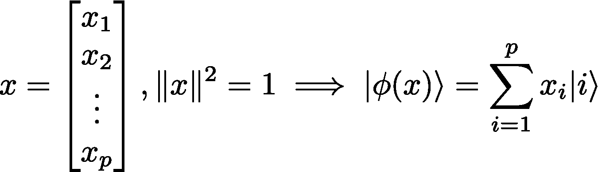

# 逐步分解量子机器学习算法。

> 原文：<https://towardsdatascience.com/decomposing-step-by-step-a-quantum-machine-learning-algorithm-8adfa66aed7e?source=collection_archive---------20----------------------->

## 二元分类器的变分电路。

图片来自[皮克斯拜](https://pixabay.com/fr/?utm_source=link-attribution&utm_medium=referral&utm_campaign=image&utm_content=3679893)的[皮特·林佛斯](https://pixabay.com/fr/users/TheDigitalArtist-202249/?utm_source=link-attribution&utm_medium=referral&utm_campaign=image&utm_content=3679893)。

量子计算机在 15 年前被认为是科幻小说。

现在，这些机器真实存在，并在云上公开。我们相信它们可以解决在经典计算机上无法解决的问题，应用于化学、最优化、机器学习、密码学和许多其他领域。

10 月，谷歌宣布了[量子优势](https://www.nature.com/articles/s41586-019-1666-5)，这意味着量子计算机第一次能够比任何现有的经典计算机更快地执行特定任务。实际上，在谷歌和 IBM 之间有一场争论，谷歌声称这项任务在经典计算机上需要 10，000 年的时间，而 IBM 则表示几个小时就可以完成。在所有情况下，量子计算机都需要几分钟，因此这是该技术潜力的证明。

在这篇文章中，我有兴趣解释量子计算如何用于机器学习。

我将展示如何用一台 2 量子位的量子计算机构建一个简单的二进制分类器。

在第一部分，我为不熟悉量子计算的读者介绍了量子计算的基础知识。然后我解释了 ML 中 QC 的一般用法，并分解了算法的不同部分。最后给出了在 iris 数据集上的实验结果。

玛利亚·舒尔德、阿历克斯·鲍恰洛夫、克里斯塔·斯沃雷和内森·维贝的作品详细解释了这种方法。

# 量子计算 101

资料来源:xkcd.com

现在让我们描述一下理解本文其余部分所需的量子计算基础知识。

量子物理学的基本原理是**在足够小的尺度下，世界变得具有概率性。**一个粒子不能像宇宙中的行星、恒星那样用固定的坐标来描述，而是用波函数来描述，波函数是粒子位于空间某个区域的概率。

## 量子态

理解量子态对于量子计算的进一步发展至关重要。

量子系统的大多数特征都不是确定性的(有些是确定性的，比如质量或电荷)，它们是概率性地分布在一组可能的状态中。然而，测量这些特征将产生一个单一的值，以及相关的概率。这叫做测量。

比如一个电子既不是自旋向上也不是自旋向下，而是以 0.5 的概率自旋向上或者自旋向下。自旋的测量结果将是 50%的时间向上自旋，50%的时间向下自旋。

这种与不同状态相关的概率组合被称为量子态。你应该把量子系统看成一个骰子。骰子没有固定的数值，只允许你掷出去读取结果。那么你会说骰子的状态是 1，2，3，4，5，6，每个概率是 1/6。如果你考虑一个得到 6 的概率为 0.5 的作弊骰子，你会说骰子的状态是概率为 0.1 的 1，2，3，4，5 和概率为 0.5 的 6。

量子态的通俗例子是薛定谔的猫，它有一定概率可以是死的，也可以是活的。打开盒子就是在“测量”猫的状态。

量子态用括号符号|s >表示。对于电子来说，它应该是|上>或|下>。不同状态的线性组合如下所示。

一般的量子态。

在这种情况下，𝑎_s 被称为与状态|s >相关的振幅，它是一个复数，如|𝑎_s|是系统处于状态|s >的概率。

同样的原理，量子计算机的基本砖块是量子比特，或**量子比特**。与经典比特相反，量子比特没有确定值 0 或 1，而是以某种概率处于状态|0 >或|1 >。

更正式的说法是，一个量子位记为|q> = 𝑎|0>+𝑏|1>，𝑎和 *b* 是两个复数，比如|𝑎| +|𝑏| =1。

一个量子位可以处于|0 >或|1 >状态，但是几个量子位会发生什么呢？

两个量子位的状态被标注为|00 >、|01 >、|10 >和|11 >，这给出了 4 种可能的状态。

3 个量子比特呢？您有 8 种可能性:|000 >，|001 >，|010 >，|011 >，|100 >，|101 >，|110 >，|111 >

你可以通过在一个 ket 上并列不同量子位的值来记录任意数量量子位的状态，比如|000110101010 >。为了简化它，请注意所获得的二进制字符串的十进制等效值，例如|101 >是|5 >。

**一般来说， *n* 个量子位给出 2 个 *ⁿ* 个可能状态。意味着有了 300 个量子比特，你可以拥有比宇宙中原子数量还要多的状态！！**这是量子计算潜力的关键要素。

于是， *n* 个量子位的一般量子态是一个复数矢量，其平方模之和等于 1。

n 个量子比特的一般量子态。

量子态也用矢量格式表示，如下例所示。可以看出，范数平方总是等于 1，因此常数 1/sqrt(2)和 1/sqrt(3)。

## 量子算符

一旦我们有了量子态，对它进行操作就好了。这是量子算符的工作。

量子算符是量子态上的线性算符，因此它们可以由复矩阵 *A.* 表示。此外，它们是酉矩阵，这意味着 *A* 的逆是它的共轭转置，记为 *A* 。

这个性质确保量子算符的输出保持量子态，这意味着振幅的平方模的和是 1。

量子算符也被称为量子门，类似于经典计算。给量子计算机编程就是写一系列要在量子位上执行的门。

作用于一个量子位的基本门的两个例子是标为 X 的非门和标为 h 的哈达玛门。

矩阵格式的 x 门和 H 门。

X 门翻转量子位(类似于经典的非门)，H 门创建量子位的相等叠加状态(在经典计算中没有等价物)。我们有以下身份:

*   X|0> = |1 >
*   X|1> = |0 >
*   X(𝑎|0>+𝑏|1>) = 𝑎|1>+𝑏|0>
*   H|0> = (|0> + |1>)/sqrt(2)
*   H|1> = (|0> -|1>)/sqrt(2)

## 为什么使用量子计算有优势？

到目前为止，我们已经看到，量子态是离散的概率分布，量子算符可以对这些分布进行线性运算。也可以通过测量状态从分布中取样。

创建一个分布，进行计算并从中取样也可以由经典计算机完成(例如用 *numpy.random* )。然而，这不是立即的，并且需要几个隐藏的中间步骤(创建伪随机整数生成器、从统一规律采样、取 cdf 的逆，等等)。所有这些过程通常是昂贵的。

**量子计算机是一种物理设备，它将利用量子力学定律，以一种廉价的方式为你进行所有这些概率运算。**

经典位的基本运算是进行 1+1、0+0、1+0、翻转位等。有了这组基本操作，您就能够对两个整数的加法进行编码，然后进行乘法运算，接下来就是其他算法了。

量子计算机的基本操作是创建一个骰子，投掷它并读取结果。从那里，你创建许多其他算法。这些算法有时可以为在传统计算机上执行的相同操作提供巨大的加速。

计算机科学的核心是把问题分成简单的步骤，然后交给一台机器，让它非常快速地执行这些简单的步骤。有了量子计算，你把你的问题分成了比以前更多的步骤，量子计算机可以非常快地执行这些步骤。你希望总成本低于一台传统计算机的成本。

## 身体上是什么？

来源:IBM Research ( [Flickr](https://www.flickr.com/photos/ibm_research_zurich/32390815144/in/photolist-RmgoS5-SrvZqe-RmgpA9-BQdkR9-Sp2BiY-2h9m1yg-SqYsEt-GG3pec-CAC6Cu-D1r1VN-Qf5bKP-2i2iZZa-D3K7hF-Y3VJ3b-22q75rD-21m7pWW-CAC6Um-Yq44fF-CAC7gy-CTbuBY-D1r2im-CueW9i-LmkLUG-SaD1c8-Yq5bAk-2e18V4e-22nSucf-215Fn2t-259cP5s-2eAQvWk-GbF3HK-GVk5AN-24MKS7H-2gwdx9x-2i2nwXf-2i2j131-2gwdwYc-2i1V7ZS-xCCCFs-2i1V7Kd-2i1V7Q3-hV9ae3-i3PaQ5-hV9zug-hV9Aw6-hV99iq-hV93hE-hV8FFP-hV92mm-2i1SFBd) )

存在很多技术，所有硬件提供商都在尝试自己的技术。它可以是硅中捕获的电子、冷原子或光子，我们可以单独控制它们。其他方法，如拓扑量子位，使用的基本粒子只在这种情况下研究。

在所有情况下，它归结为能够在个体水平上控制基本粒子。这是非常困难的，因为一切对环境的噪音都很敏感，这解释了建造量子计算机的困难。

> 总而言之，量子态是代表离散概率分布的复矢量。
> 
> 量子算符是这些向量上的线性算符，其输出保持量子态。
> 
> 衡量一个状态就是从潜在的概率分布中取样。
> 
> 量子计算机是比经典计算机执行这些操作更快的物理设备。

# 在机器学习中使用

在二元分类问题中，比方说将图像标记为猫或狗，目标是从训练集构建预测器。换句话说，我们希望构建一个函数 *f* 比如 *f(图像)* ∈ { *猫，狗* }给出尽可能接近现实的结果。

通常情况下， *f* 的图像代表图像属于某一类或另一类的概率，例如， *f(图像)= P(图像=狗)。*

这种概率形式非常适合量子计算，我们希望建立一个量子态|ψ>,例如

|ψ(image)> =*P(image = dog)|*0*>+P(image = cat)|*1>

实际上，|ψ>是通过一组参数化门和输入数据构建的。多次测量可以估计不同的结果概率。

优化电路就是找到最接近现实可能性的参数。这一步对于所有的 ML 算法都是一样的，只是这次我们通过量子测量来计算结果。

我们希望在量子计算机上执行所有这些操作会比在经典计算机上更便宜。具体来说，我们希望制备和测量量子态比在 CPU 和 GPU 上执行矩阵产品更快/更便宜。

对于狗/猫分类问题，卷积神经网络表现得非常好，量子计算不太可能会更好。但是对于不同的配置，在高维空间中，有可能在特定问题上性能会更好。

## 参数化量子电路

量子计算探索的一个完整领域是变分电路或参数化量子电路的使用。

参数化量子电路的一般思想是创建具有可调参数的量子电路，并且该电路的有效测量将接近感兴趣的量。然后，我们可以根据电路的参数最小化这个感兴趣的量。

让我们深入一个具体的例子来说明这一点。

我们考虑以下门，并将其应用于|0 >。

我们有 U(𝜃，ϕ，λ)| 0 > = cos(𝜃/2)|0>+e^(*I*ϕ)sin(𝜃/2)|1>。

假设我们想最大化结果的熵，也就是

E(𝜃，ϕ，λ)=-p(u | 0 > = 0)**log*(p(u | 0>= 0))-p(u | 0>= 1)**log*(p(u | 0>= 1))= -cos(𝜃/2)**log*(cos(𝜃/2))-sin(𝜃/2)**log*(sin(𝜃/2))

那么，最佳参数是𝜃 = π/2，ϕ和λ可以取任意值。

这个例子非常简单，所以一切都可以通过分析来计算，但在更复杂的电路中，概率是通过多次测量来估计的。

当你想用一个容易计算的参数化概率分布(如高斯混合分布)来近似一个未知的难以处理的概率分布时，这个过程与变分法(变分法的名字由此而来)是一样的。

在分类问题中，人们想要创建以下参数化的量子态:

|ψ(图片； **𝜃** ) > = *P(图片=狗*；***)|*0*>+p(image = cat*；***)| 1>*****

****请注意，上述表达式中的 **𝜃** 与前一个门的**𝜃**参数不一样。****

****训练的步骤是找到最好的***等概率接近现实。这是通过经典的优化技术如梯度下降来实现的。*******

## *******问题是*******

*******我们考虑一个二进制分类问题，在{0，1} *中输入实向量𝑥，二进制输出 *y* 。********

*******我们想要建造一个量子电路，它的输出是一个量子态*******

*******|ψ(x；**)>=*p(y = 0 | x*；***)|*0*>+p(y = 1 | x*；***)| 1>**************

## *******该算法*******

*******所提出的算法由 3 个步骤组成:*******

1.  *********状态准备*********
2.  *******模型电路*******
3.  *******测量*******

*****第一步叫做**态准备，**它包括将经典数据嵌入量子态。有几种方法可以做到这一点，其中一种被称为振幅编码。它包括把一个矢量的坐标映射成一个量子态的振幅值。它要求向量标准化，并具有二维幂。当数据集不满足这一条件时，可以填充并重正化向量。*****

**********

*****振幅编码程序。*****

*****对于熟悉量子电路符号的读者来说，状态准备电路如下:*****

**********

*****2 量子位和 4 维输入向量的状态准备电路。*****

*****第二步是**模型电路**，严格来说还是分类器。参数化酉算子 *U(𝜃)* 是创建的，使得|ψ(x；*𝜃*)>=*u(𝜃)|*ϕ(x)>。这是一系列的将军 *U (* 在前面的小节 *)* 和 CNOT 盖茨(更多关于 CNOT 门[的信息在这里](https://en.wikipedia.org/wiki/Controlled_NOT_gate))。*****

*****最后一步是**测量**步骤，通过执行几次测量来估计属于某个类别的概率。这相当于从分布中多次取样。*****

*****最终电路如下:*****

**********

*****量子分类器的最终电路。*****

## *****培养*****

*****执行训练以最小化二进制交叉熵损失。*****

*****使用批量随机梯度下降。计算损失函数的梯度并不明显。幸运的是，它们可以通过其他量子电路来估计。*****

*****这部分我就不赘述了，因为它比较技术性，需要更多的量子计算知识。如果你想了解更多，我鼓励你去看看这个笔记本(最后的链接)。*****

## *****实验和结果*****

*****该算法已经在 iris 数据集的二进制分类上进行测试，该数据集具有大约 100 个 2 个特征的点。它已经用 IBM 开发的框架 Qiskit 实现了。完整的代码和详细的解释可以在[这里](https://github.com/Slimane33/QuantumClassifier)找到。*****

*****如图所示，该算法运行良好。它在验证集中达到了几乎 100%的准确率。*****

*****主要的不方便就是很慢，至少在我一般电脑上的 Qiskit 模拟器上。代码当然可以优化，但是必须记住，这只是一个验证一般方法的玩具示例。这个问题必须足够复杂，量子计算才有用。*****

**********

*****算法的最终结果。*****

# *****结论*****

*****量子计算是一种完全不同的计算范式。在大状态空间上计算概率分布并对其进行线性运算是一种自然的方法。*****

*****这是一个很好的机器学习工具，但我们需要等待更好的硬件来开发实际的用例。*****

*****谢谢你的帮助，有很多信息，我尽量让它简洁。我希望你能更好地理解量子计算，以及如何将其用于机器学习。*****

*****欢迎分享您的反馈，您可以在 [LinkedIn](https://www.linkedin.com/in/slimane-thabet/) 上联系我，或者对文章发表回应。*****

## *****参考资料和资源*****

*   *****玛利亚·舒尔德、亚历克斯·鲍恰洛夫、克里斯塔·斯沃雷和内森·维贝，[以电路为中心的量子分类器](https://arxiv.org/pdf/1804.00633.pdf) (2018)*****
*   *****同样的算法由 [Xanadu](https://medium.com/@XanaduAI) 在 PennyLane 库中实现:[https://PennyLane . ai/qml/demos/tutorial _ variable _ classifier . html](https://pennylane.ai/qml/demos/tutorial_variational_classifier.html)*****
*   *****完整代码及解释笔记本:[https://github.com/Slimane33/QuantumClassifier](https://github.com/Slimane33/QuantumClassifier)*****