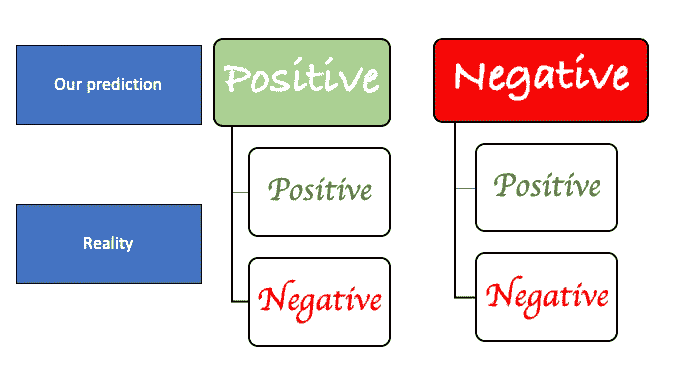
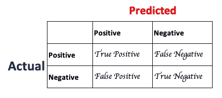

# 去融合混淆矩阵

> 原文：<https://towardsdatascience.com/deconfusing-the-confusion-matrix-84d4883816d7?source=collection_archive---------36----------------------->

数据科学家使用模型从数据中得出一些结论。在监督学习的情况下，由于输入和输出(标签)都可以用于我们的数据，我们可以尝试找到一个将输入映射到标签的函数。该模型将从一组特定的数据中学习，结果将在另一组数据中进行测试。我们将参考训练数据作为我们用于第一个任务的值和用于后者的测试数据。一旦模型被测试，下一步就是在做任何决定之前找出它的性能。混淆矩阵是用于描述分类模型成功与否的表格。

## **混淆矩阵中的元素**

我们从分类器中决定的可以是‘肯定的’或‘否定的’(是/否——有/没有)。另一方面，从我们与之比较的原始数据来看，也有两种可能的结果:“真”或“假”(是/否——有/没有)。因此，我们的表现是对来自实际数据和预测的“真/假”与“正/负”的验证。我们想衡量我们对测试数据的预测有多成功。

我们的预测分为 4 类，由可能的组合来代表。

**2 * 2 种可能的结果！！！**

*   **真阳性(TP):** 我们预测‘是’，并且它是正确的(“真”)
*   **真否定(TN):** 我们预测‘不’，也是正确的。
*   **假阳性(FP):** 我们预测了阳性结果，但它被错误地预测了。
*   **假阴性(FN):** 我们预测了一个阴性结果，它是“假的”

## **根据混淆矩阵计算的指标**

**实际阳性:TP + FN 和预测阳性:TP + FP**

这 4 个数字说明不了什么，因为我们对积极结果的百分比一无所知。我将介绍从混淆矩阵中计算出的 3 个指标。

**精度**。这个百分比帮助我们确定我们的模型有多“准确”,即模型做出正确预测的百分比。然而，使用准确性作为评估模型的主要度量标准存在一些限制。我们在研究中没有考虑假阴性。对于一家招聘公司来说，我们会拒绝一个符合条件的候选人。

大多数情况下使用更好的度量标准:精确度和召回率(或灵敏度)。

**Precision** 讲述了我们的分类器在检测正面观察时的性能。正确分类的阳性与预测阳性总数的比率。预测的阳性率有多少是正确的？

精度= TP/(TP+FP)；分母是预测的总阳性数

**回忆**(也称为 TP 率):模型在挑选积极的观察时有多敏感。它回答了这样一个问题:模型捕捉到的阳性占所有实际阳性的百分比是多少？

回忆(或敏感度)= TP / (TP+FN)

每个环境都是独特的，基于场景，数据科学家将决定什么样的指标适合他的模型。此外，他还必须考虑什么样的错误是可以接受的。这将帮助他选择假阳性和假阴性之间的界限。

如果你有任何想法，并想讨论，请让连接。