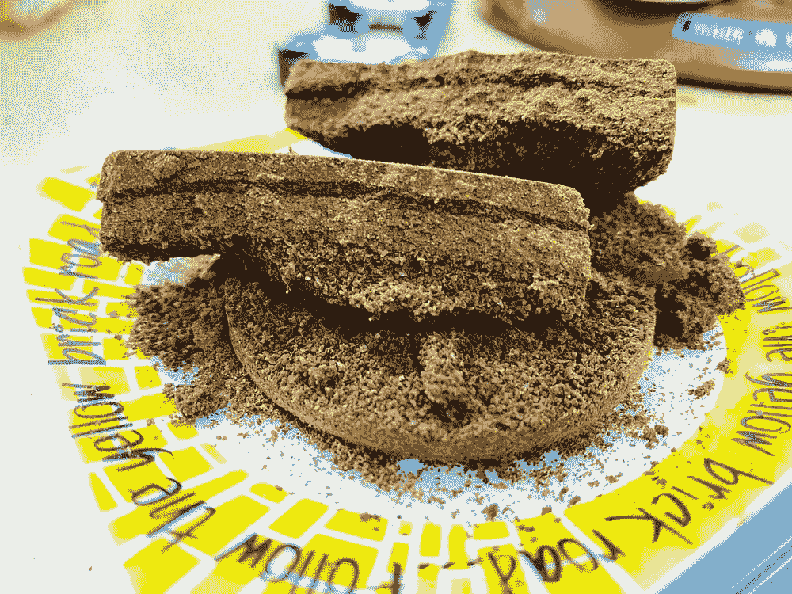
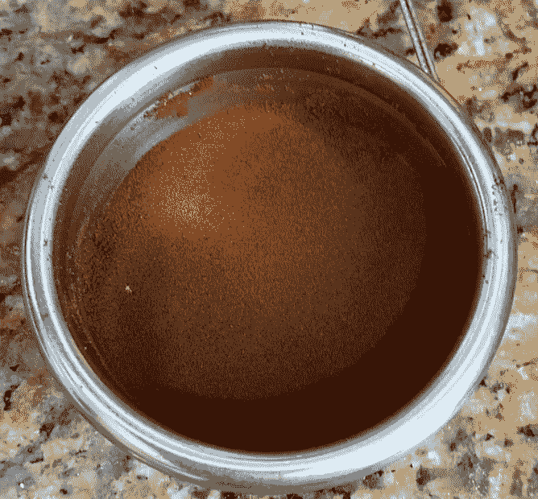

# 解构咖啡:分割烘焙、研磨和分层以获得更好的浓缩咖啡

> 原文：<https://towardsdatascience.com/deconstructed-coffee-split-roasting-grinding-and-layering-for-better-espresso-fd408c1ac535?source=collection_archive---------20----------------------->

## 使用分离咖啡混合物的断奏浓缩咖啡的下一次进化

一年多前，我开发了一种叫做[断续浓缩咖啡](https://medium.com/overthinking-life/staccato-espresso-leveling-up-espresso-70b68144f94)的技术，用筛子将咖啡渣分成细粒、中粒和粗粒。然后我做了一个分层(断奏)镜头，首先放精细层，然后是粗糙层，然后是中间层。我发现每一层都提供了特定的味道，有助于整体的味道，通过这种方法，我得到了更好的味道。然后我就开始胡思乱想了。

分裂断奏捣实拍摄使用中等和黑暗的烘烤。

我开始考虑咖啡烘焙。我不喜欢单一产地的咖啡，因为我发现它们不均衡，而且我已经在家烘焙了三年。通常，我会将一颗非洲的咖啡豆和一颗南美的咖啡豆混合在一起，制成一种很棒的混合物。我在烘烤前混合，因为我不想把时间花在烘烤两次和烘烤后混合上。

然而，分离颗粒大小的一个自然延伸是分离咖啡混合物以分离豆类。我忍不住让过程变得更复杂，因为在那个时候，我有最复杂的浓缩咖啡准备程序。我介绍了历史、断续浓缩咖啡和[断续捣实的](https://link.medium.com/DshxOaPCJ8)咖啡的技术，并展示了几个月来收集的一些数据，以展示它如何在味道和 EY 方面产生更好的照片。

# 技术发展

为了实验，我分别烘焙了两种咖啡豆的典型混合物。我将混合物分开，并分别磨碎和过筛。我开始尝试一个六层的断奏镜头:2 个精细层，2 个粗糙层，和 2 个中间层。我通过交替选择哪一层先出现，哪一层从分离中受益最大来检测味道。我发现只有精细的那一层需要被分离，但是哪一层先出现对这项技术的益处有影响。

在第一个实验中，我分别烤了哥伦比亚**蜂蜜**工艺的布宜诺斯艾利斯格沙和卢旺达**干**工艺的鲁西齐尼亚卡伦佐。然后我把它们分别磨碎过筛，开始测试。我立刻看到了分数差异。我不知道它们有多重要，在我开始分割所有镜头的时候，我只会在烤肉的前两个镜头中改变方向。

细豆 1，细豆 2，夯实，粗混合，中混合，夯实

我收集了一些不同烧烤的数据，这些数据不足以得出任何强有力的结论，但肯定会有不同烧烤之间的差异。这是一场正面交锋:

这种比较着眼于无分割与两种不同方向:

# 对断奏捣固的交叉应用

断奏捣固是断奏击球的派生物。我在研究一些夏威夷的深色烘焙咖啡，我发现把所有的咖啡渣都放在过滤器里太乱了。于是我开始只放一半，分发，捣实，接着放另一半。与此同时，我对断奏浓缩咖啡有了更深的理解，我发现中间层(断奏镜头中的顶层)是决定[镜头如何根据其夯实程度来判断](https://medium.com/@rmckeon/espresso-machine-donuts-deeper-analysis-into-extraction-cd7e602468d)是否成功的关键层。

我尝试在常规击球的前半段做一个较重的夯实，然后在上半段做一个较轻的夯实，于是断奏夯实技术诞生了。我开始跟踪底层压力，我发现底层压力在 300 克到 500 克之间是最佳的。对于顶层，我使用一个校平机，我跟踪校平机的深度。

当我对这种技术感到更加安全后，我开始将烤肉分成四层。我将称重并分配前两层，夯实，称重并分配后两层，然后整平。

对于断奏夯实准备，我还发现了分裂豆子的好处。准备工作包括两层，顶层和底层，底层比第一层夯实得更紧。类似于分割一杯不连续的浓缩咖啡，顶层不需要被分割。为了简单起见，我通常把它分开。

# 数据和分析

我花了一年的时间收集这些数据，但困难在于确保我有可控制的样本。在过去的一年里，我的技术发生了很大的变化，我会定期采集一些有无分裂的样本。最近，我整理了数据集，我发现我有合理数量的样本来说服自己，这种现象不是因为我的确认偏差，而是可以观察到的。

原始数据

## 绩效指标

我使用了两个指标来评估镜头之间的差异:[最终得分](https://link.medium.com/uzbzVt7Db7)和[咖啡萃取](https://link.medium.com/EhlakB9Db7)。

最终得分是 7 个指标(强烈、浓郁、糖浆、甜味、酸味、苦味和余味)记分卡的平均值。当然，这些分数是主观的，但它们符合我的口味，帮助我提高了我的拍摄水平。分数有一些变化。我的目标是保持每个指标的一致性，但有时粒度很难，会影响最终得分。

使用折射仪测量总溶解固体(TDS ),该数字用于确定提取到杯中的咖啡的百分比，并结合一杯咖啡的输出重量和咖啡的输入重量，称为提取率(EY)。

## 分裂分析

查看所有数据的一些散点图，很难看到常规镜头和分裂镜头的分离。这是由于我的数据收集造成的数据不平衡。

所以让我们把这些数据简化成每次烘烤的最佳组合，普通的和分开的。

模式似乎有点清晰，但我们有成对的数据，所以让我们比较一下每个镜头。就品味(最终得分)而言，分镜头似乎比普通镜头更好，对 EY 来说，它们往往更好。

当在折线图而不是散点图上查看时，我们可以对照片进行排序，并查看它们的表现。有一些异常，但不是随机的。

我们可以通过统计测试来了解这些结果差异是否具有统计显著性。就口味而言，他们是，但 ey 在分布上还是有点太接近了。需要更多的数据，但与此同时，我一直在努力增加 EY，所以我希望即使 EY 保持不变，味道也在改善。我没有足够的数据来显示这种或那种趋势。

我们可以通过烘焙和不连续浓缩咖啡或不连续捣实咖啡来进一步分解这些数据。就味道而言，有些烤肉并没有太多好处，但有些却有。对 EY 来说，有一种烤肉尤其成问题(2020 年 4 月 6 日)。

对于 2020 年 4 月 6 日的烘烤，其中两个镜头基于顶部或底部分割烘烤，而不是同时分割顶部和底部层。因此，这是 9 克的一个烤，9 克的另一个，而不是 4.5 豆 1，4.5 豆 2 在底部和顶部相同。除去这两个样本，EY 现在有了统计上的显著改善(阈值是 p 值< 0.05)。

我们可以扩展数据，将相同的常规镜头与不同的分裂镜头进行多次比较，因为分裂镜头的数量远大于常规镜头。并不是所有的分镜头都很棒。我只是在比较最好的分镜头和普通镜头。其中一些镜头有较低的最终得分和/或 EY，因为他们参与了其他实验，如加热豆，冷却研磨，或修改分配器。

## 健全性检查

其中一个不受控制的变量，也是我所希望的，是产出与投入的比率。理想情况下，每个镜头都是一样的，但是艺术的一部分是视觉上的结束。有些人使用天平，但我一直使用量杯，我知道给出期望输出水平的音量范围。然后我在拍摄后用标尺测量输出。在这次收集开始时，该比率通常为 0.9 比 1.1，到最后，该比率已经漂移到 1.2 比 1.4。

让我们假设 EY 和比率之间有一个线性关系，我们可以做一个最佳拟合线，如下所示。有各种各样的摆动，但我们仍然可以使用它来调整所有的 EY 到 EY 在 1:1 的比例。用于这种线性关系的镜头比成对的镜头多，因为我尽可能多地包括了那些烘烤的镜头，即使它们没有成对。

然后，我们可以看看调整后的 EY 氏综合症的配对，并测试统计显著性。同样，我们在 2020 年 4 月 6 日的烧烤中遇到了类似的问题，因为它们不是以相同的方式进行断奏和篡改。去除这些因素后，分割镜头和常规镜头之间的差异具有统计学意义。

这个结果不应该太令人惊讶，因为成对的镜头是在同一时间帧内拍摄的，所以比率的范围通常是相似的。

我在这里展示了一个基于断奏概念的作品，通过将烘焙咖啡豆分开来进一步改进浓缩咖啡。其结果是口味和提取得到了改善。这种分割烘焙的断奏技术对我的浓缩咖啡日常工作产生了持久的影响，这些实验进一步证明了浓缩咖啡的制作过程仍然是神秘的，还有发展的空间。

如果你愿意，可以在 Twitter 和 YouTube 上关注我，我会在那里发布不同机器上的浓缩咖啡视频和浓缩咖啡相关的东西。你也可以在 [LinkedIn](https://www.linkedin.com/in/robert-mckeon-aloe-01581595?source=post_page---------------------------) 上找到我。

# 我的进一步阅读:

[浓缩咖啡的预浸:更好的浓缩咖啡的视觉提示](/pre-infusion-for-espresso-visual-cues-for-better-espresso-c23b2542152e)

[咖啡的形状](/the-shape-of-coffee-fa87d3a67752)

[搅拌还是旋转:更好的浓缩咖啡体验](https://towardsdatascience.com/p/8cf623ea27ef)

[香辣浓缩咖啡:热磨，冷捣以获得更好的咖啡](/spicy-espresso-grind-hot-tamp-cold-36bb547211ef)

[断续浓缩咖啡:提升浓缩咖啡](https://towardsdatascience.com/overthinking-life/staccato-espresso-leveling-up-espresso-70b68144f94)

[用纸质过滤器改进浓缩咖啡](/the-impact-of-paper-filters-on-espresso-cfaf6e047456)

[浓缩咖啡中咖啡溶解度的初步研究](/coffee-solubility-in-espresso-an-initial-study-88f78a432e2c)

[断奏捣固:不用筛子改进浓缩咖啡](/staccato-tamping-improving-espresso-without-a-sifter-b22de5db28f6)

[浓缩咖啡模拟:计算机模型的第一步](https://towardsdatascience.com/@rmckeon/espresso-simulation-first-steps-in-computer-models-56e06fc9a13c)

[更好的浓缩咖啡压力脉动](/pressure-pulsing-for-better-espresso-62f09362211d)

[咖啡数据表](https://towardsdatascience.com/@rmckeon/coffee-data-sheet-d95fd241e7f6)

[工匠咖啡价格过高](https://towardsdatascience.com/overthinking-life/artisan-coffee-is-overpriced-81410a429aaa)

[被盗浓缩咖啡机的故事](https://towardsdatascience.com/overthinking-life/the-tale-of-a-stolen-espresso-machine-6cc24d2d21a3)

[浓缩咖啡过滤器分析](/espresso-filters-an-analysis-7672899ce4c0)

[便携式浓缩咖啡:指南](https://towardsdatascience.com/overthinking-life/portable-espresso-a-guide-5fb32185621)

[克鲁夫筛:一项分析](https://towardsdatascience.com/overthinking-life/kruve-coffee-sifter-an-analysis-c6bd4f843124)