# 解构关于置信区间的常见误解

> 原文：<https://towardsdatascience.com/deconstructing-a-frequent-misconception-about-confidence-intervals-33a95b24f387?source=collection_archive---------9----------------------->

## 置信区间的逐步推导以及我们如何经常曲解它们。

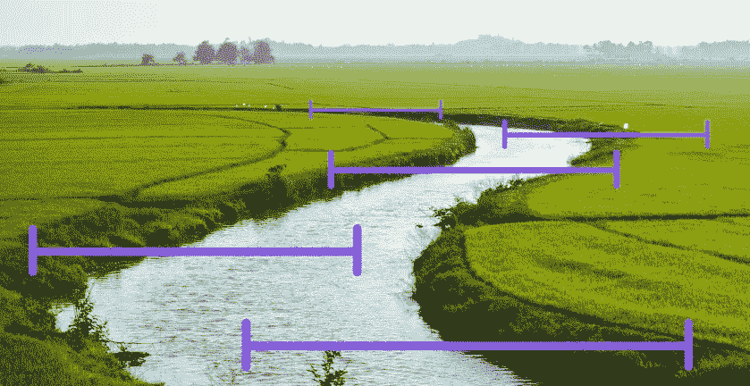

置信区间通常被用作区间估计的常规方法。如果你曾经应用过这种方法，你可能会遇到这种说法:

*   对于 90%的置信区间，真实参数位于该区间内的概率为 90%。

似乎是合法的，不是吗？至少，在我看来，一开始是合法的。这是对置信区间最常见的误解之一。根据[ [1](http://www.ejwagenmakers.com/inpress/HoekstraEtAlPBR.pdf) ]的数据，59%的被调查研究人员落入了这个陷阱。我也不例外。

因此，让我们回到起点，在一个简单的环境中应用置信区间，并认识到为什么这种常见的误解是错误的。

# 区间的求导

假设我们想估计一个城市居民的平均身高。假设这个城市生活着一百万人，身高呈正态分布。假设我们知道真实的分布参数，比如说，平均身高是*1.8m***标准差是 *0.1m* 。这些是总体参数，我们通常不知道，希望通过测量来估计。**

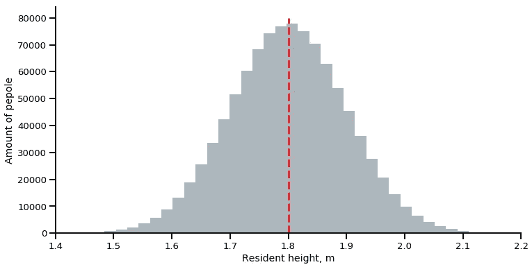

*居住在城市中的所有人的身高分布。*

当然，如果我们测量一百万人的身高，就可以得到真实的平均值，根本不需要任何估算。但在现实中，我们通常进行有限的实验，并希望使用总体中的一些有限样本来估计真实参数。

假设我们随机抽取 50 个人，测量他们的身高。这 50 个人是我们人口中的一个样本。我们给它们取一个代号“Subset-1”。我们可以通过计算子集 1 的平均身高(样本平均值)来估计城市中所有人的平均身高。这样做，我们就会得到一个所谓的 ***点估计*** 。

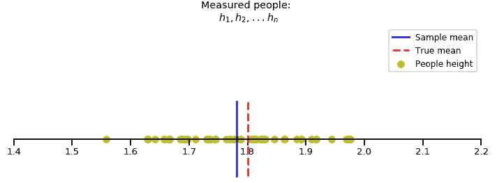

50 个随机人群平均身高的点估计

然而，如果我们随机抽取另一个 50 人的子集，平均身高的值会有所不同。每个随机子集都会给我们不同的结果。我们应该如何选择能够更好地估计真实值的唯一子集呢？

没有办法确定哪个子集会给我们更好的结果。为了将这种不确定性考虑在内，我们可以计算一个区间来估计真实的均值。那就是所谓的 ***区间估计*** 。

## **我们来找这样一个区间:**

这是对真实平均身高(样本平均值)的估计:

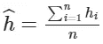

50 个人的不同子集将产生不同的估计，这就是为什么平均身高也是具有某种分布的随机变量。这是带有参数的样本平均值的采样分布:

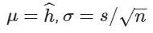

其中 ***s*** 是样本的估计标准差:

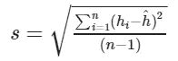

对于子集 1，我们得到以下结果:

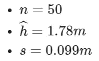

因此，对于基于子集 1 的平均高度分布，我们得到:

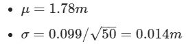

让我们画出这个分布图:

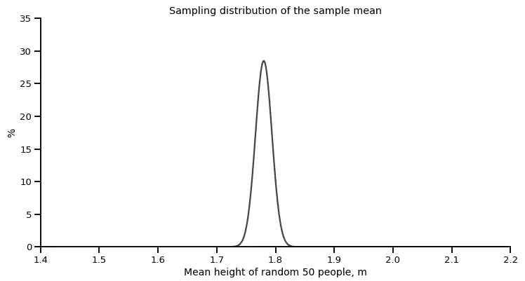

子集 1 的平均高度的估计分布

我们预计，如果我们对不同人群重复测量，平均身高值将遵循相同的分布。例如，这种测量值的 90% **将匹配区间*【1.757；1.803]* 。让我们放大 **x** 轴，并在图表中查看:**

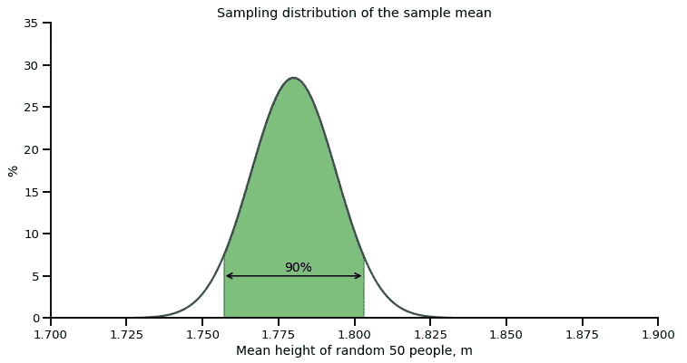

子集 1 平均高度的估计分布

**这是子集 1 的 90%置信区间。**

如果我们使用常用的公式和 Z 表，我们会得到相同的结果:

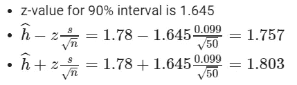

那么，我们如何解释上述区间的 90%置信水平呢？

考虑到这个区间的形成方式，我们可以得出结论，该区间覆盖了 50 个随机人的平均身高测量值的 90%。因此，人们可以期望在未来 90%的测量中找到这样一个区间内的平均高度。我们可以通过随机抽取 100 个 50 人的子集，计算平均身高，并将其与我们的分布进行比较来检查:

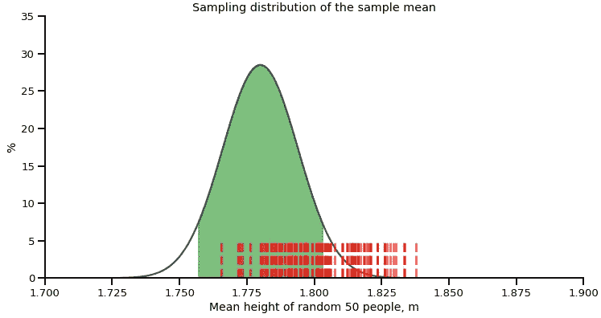

红色虚线——由 50 名随机抽样的人重复计算 100 次平均身高的结果。

但是这样的期望肯定不能满足现实。正如我们所看到的，落在估计的90%区间之外的测量值(红色虚线)的数量远大于 10。原因是我们已经根据某个**随机**样本均值计算了我们的区间。90%的观测值只有与真实值相匹配才会落在估计区间内。我们可以绘制真实区间，因为我们知道真实参数:

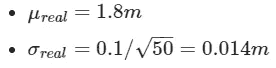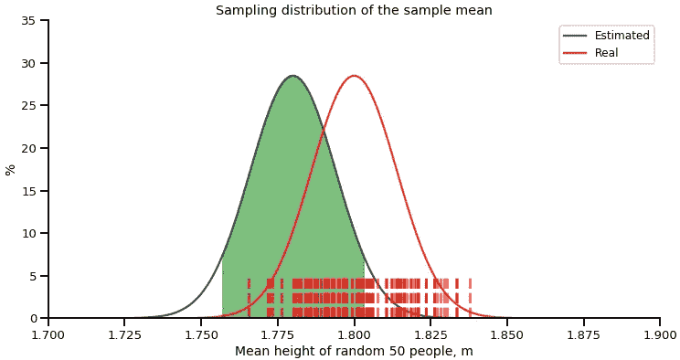

红色虚线—100 次估计的结果，50 个随机人群的平均身高

但是，如果我们重复我们的测量，并建立一个置信区间，比如说，20 个随机抽样的子集，每个子集 50 人，会发生什么？以下是我们将得到的结果:

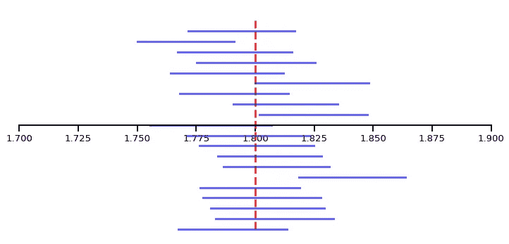

蓝线——20 个随机样本的 90%置信区间，每个样本 50 人。红色虚线——真实平均值。

可以看出，20 个置信区间中有 2 个不包括真实平均值。因此，如果我们继续进行这样的实验，一个给定的置信区间包含真实参数的几率将趋于 90% 。这就是信心水平的意义所在。

## 现在让我们回到主要问题:

***我们是否可以说，一旦创建了一个区间，真参数(我们例子中的平均身高)就会以 90%的概率落在这样一个区间内？***

答案是否定的，没有办法得出这样的概率。一旦创建了区间，真实的参数要么在区间内，要么在区间外，没有人能明确地确定它到底落在哪里。我们只能说这样的区间可能包含真实均值的频率，这就是置信度的意义所在。

置信区间的本质是它们可能包含真实值。在我们的例子中，置信区间倾向于包含 90%试验中的真实值。但这并不意味着对于某个特定的区间，有 90%的机会在该区间内找到真实值。

最后，让我们看一看原始资料，发现纽曼(作为置信区间的最初支持者)写到了它[ [2](http://gauss.stat.su.se/master/slht/probability_pdf/outline_of_a_theory_of_statistical_estimation_based_on_the_classical_theory_of_probability.pdf) ]:

> 构建置信区间的理论统计学家可以与机会游戏的组织者进行比较，在该游戏中，游戏者有一定范围的可能性可供选择，而无论他实际选择什么，他获胜的概率以及银行失败的概率都具有永久相同的值，1 — *α* 。赌徒对赌什么的选择，超出了银行的控制，对应于真实意义的不受控制的可能性，具有这样或那样的价值。银行赢得游戏的情况对应于真实均值实际值的正确陈述。在这两种情况下，在一长串未来“游戏”中“成功”的频率是大致已知的。另一方面，如果银行的所有者，比方说，在轮盘赌的情况下，知道在特定的游戏中球停在了区域№1，该信息不会以任何方式帮助他猜测赌徒们是如何下注的。同样，一旦抽取了样本，确定了置信区间的值，这里采用的概率计算就无助于提供里面的真实值是什么这个问题的答案。

## **结论**

如果遇到或者需要计算一个置信区间*【a；b]* 对于置信水平 *α* ，你需要记住:

*   置信水平**不**意味着真实值落入*[a；b]* 是等于*α；*
*   置信水平 *α* 是**而不是**落在*α内的样本数据的百分比；b]；*
*   置信水平 *α* 是**而不是**真实平均值落在*内的实验百分比；b]* 。

置信水平 *α* 意味着通过使用不同的样本进行重复的区间计算，我们将得到一个置信区间的百分比，包括一个倾向于 *α的真实总体参数。*

如果你发现一些置信区间概念令人困惑，我鼓励你去看看维基百科文章[ [3](https://en.wikipedia.org/wiki/Confidence_interval#Meaning_and_interpretation) ]中的其他误解和研究。