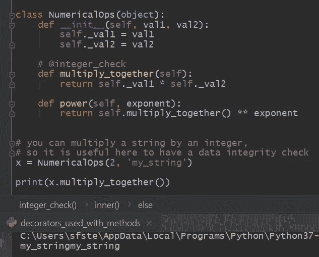

# 用 Python 修饰类中定义的方法

> 原文：<https://towardsdatascience.com/decorating-methods-defined-in-a-class-with-python-4b361589440?source=collection_archive---------11----------------------->

## 类中的方法修饰符

图片来自 [Roselyn Tirado via Unsplash](https://unsplash.com/photos/cqAX2wlK-Yw)

## 装饰方法

Decorators 为 Python 中的函数和方法添加功能提供了一种方便而优雅的方式。装饰器可以通过多种不同的方式实现。decorators 的一个有用用例涉及到将它们与类中定义的方法一起使用。在我们创建的类中修饰方法可以扩展已定义方法的功能。例如，我们可以实现数据完整性检查，或者将方法调用的输出写入文件。我们选择做什么真的取决于我们自己。方法装饰者只是为我们提供了以优雅的方式扩展功能的工具。

和往常一样，用一个例子可以很好地展示 decorators 和方法的使用。

在下面的例子中，我创建了一个名为 NumericalOps 的简单类，它需要两个参数，val1 和 val2。在 init 构造函数中，这些参数被设置为对象中的属性。接下来，我在这个类中定义了 2 个方法，即 multiply_together 和 power。

让我们提出一个相当琐碎和做作的场景。我希望对象中设置的两个属性 val1 和 val2 是数字整数。multiply_together 方法只是将两个值相乘，然后返回该操作的值。*重要的是*，在 Python 中，可以对一个字符串进行乘法运算，比如用一个整数。当我们创建 NumericalOps 类 x 的实例并传入两个参数 2 和' my_string '时，就演示了这一点，如下例的控制台输出所示。

为了提供数据输入完整性，可以使用装饰器来装饰类中定义的方法。目前，在示例中，装饰器@integer_check 被注释掉了。

为了提供数据完整性，我将编写一个名为 interger_check 的装饰器。要装饰一个类中的方法，首先使用“@”符号，后跟装饰函数的名称。

装饰器只是一个函数，它将一个函数作为参数，然后返回*和*另一个函数。在这里，当我们用 integer_check 修饰 multiply_together 时，integer 函数被调用。multiply_together 方法作为参数传递给 integer_check 函数，并返回 inner。然后调用本地内部函数，它接受我们称为 ref 的对象，并使用 *isinstance* 函数检查属性。如果传递了一个非整数类型，例如“my_string”，则会引发一个 TypeError 异常，并且会向控制台输出一条消息，告诉用户他们哪里出错了。但是，如果两个参数都是整数，inner 将返回原始方法，并将对象作为参数传递。

这个例子的源代码可以在我的 GitHub 页面上找到，这里的[和下面的](https://gist.github.com/StephenFordham/549b6796a98951b891b60eece58deceb)。

## 对多个方法使用同一个装饰器

为了增加 decorators 的可用性和实用性，我们可以将它们的实现设计为使用多种方法。

同样，这最好用一个例子来说明，所以让我们以上一节中的例子为基础。

让我们提议，我也希望 integer_check 装饰器验证我们在 power 方法中使用的指数也是一个整数。这在逻辑上是有意义的，因为当我们调用 power 方法时，它只是调用 multiply_together 方法，并将该方法的返回值乘以指数。因此，在每种情况下，我都需要确保 val1、val2 和指数都是整数。

为了实现这种行为，我对 integer_check 装饰器进行了修改。我只是在装饰器内部定义的局部内部函数中为 expo 参数设置了一个默认参数。现在，如果我们在我们的实例 y 上调用 power 方法，inner 将被返回，然后用我们在内部定义中标记为 ref 的对象和 expo 值进行调用。

在条件块中，如果 expo 被传递，我们使用 isinstance 函数检查它的类型，如果它不是整数，则引发错误，或者如果指数和 val1 和 val2 都是整数，则返回带有对象和指数的方法。

有用的是，我们仍然可以在 multiply_together 方法上使用 integer_check 装饰器，因为 expo 的缺省值为 None。

现在，我们有了一个装饰器，它可以在我们的类中跨多个方法执行用户输入验证。

使用整数作为输入，我们在控制台输出中得到预期的行为。

对于错误的输入(非整数类型)，我们得到一个有用的指示性错误消息。

这个例子的源代码可以在[这里](https://gist.github.com/StephenFordham/07550fdd967bc049aa8ec659c36f4633)找到。

## 摘要

当然，和往常一样，给出的例子相当琐碎和做作。还有其他方法来实现这里看到的行为，不需要装饰者。我在这里的目的是演示装饰器是如何工作的，以及如何将它们整合到您的代码设计中。对于那些感兴趣的人，我还写了另外两个教程，详细介绍了如何使用[装饰器来装饰函数](/how-to-use-decorators-in-python-by-example-b398328163b) s，以及[装饰器本身如何成为一个类](/using-class-decorators-in-python-2807ef52d273)。这两篇文章的链接可以通过访问链接找到。