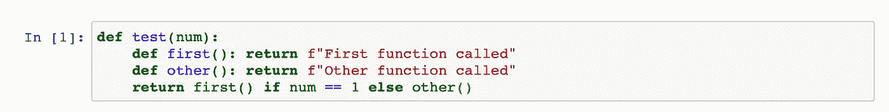
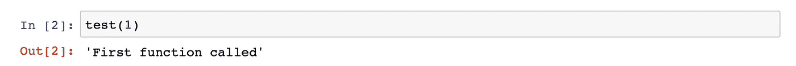
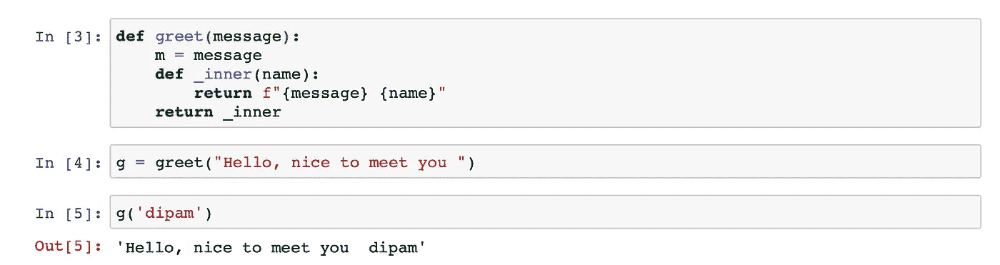
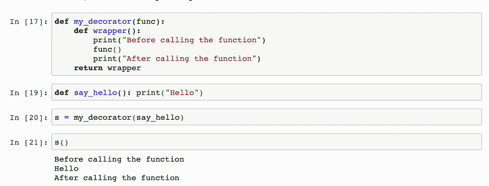
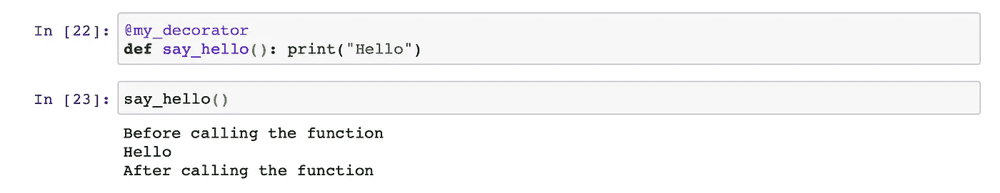
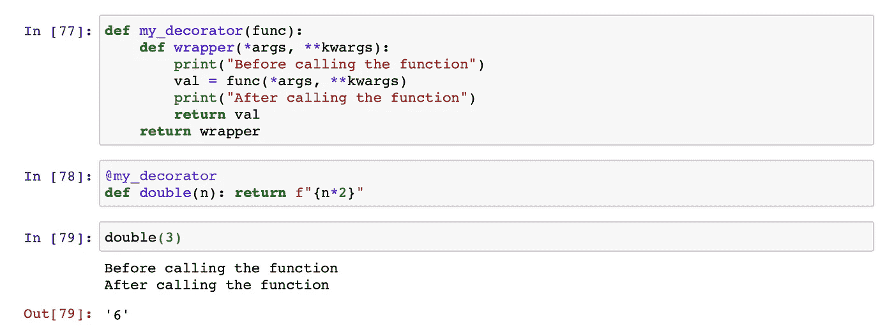
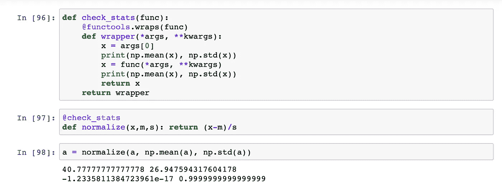
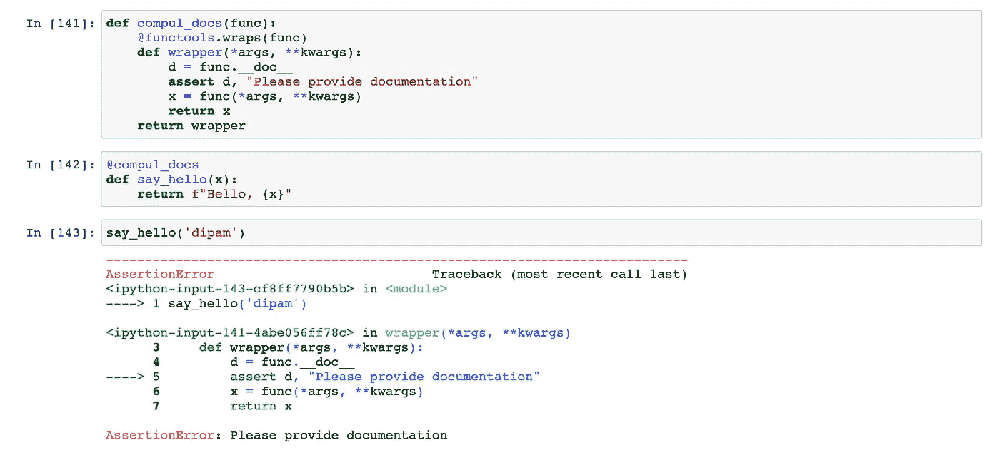
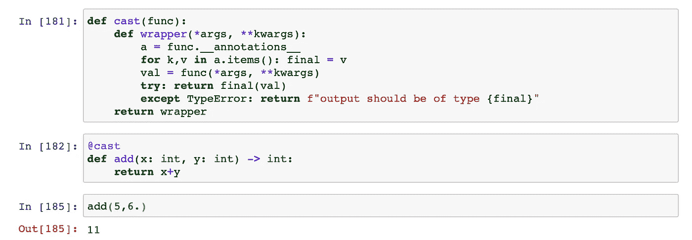

# Python 中装饰器的介绍

> 原文：<https://towardsdatascience.com/decorators-in-python-9cf8ba95e8e7?source=collection_archive---------17----------------------->

了解如何改变对象的行为

来源:[https://www . dreams time . com/photos-images/autumn-scene . html](https://www.dreamstime.com/photos-images/autumn-scenery.html)

## 介绍

我们习惯于在函数中传递和返回各种数据类型。是时候开始从函数传递和返回函数了。我们举个例子。

在这个例子中，我们有一个名为`test`的函数，它根据一个条件调用两个内部函数中的一个。

然而，我们也可以返回对函数的引用，而不是调用函数。然后可以使用该引用来调用该函数。我们再举一个例子。

在这个例子中，我们返回的是`_inner`而不是`_inner().`，这种引用的返回和以后的使用是 Python 中装饰器的基本思想。

## 装修工

装饰器只不过是 Python 中函数的包装器。它将感兴趣的函数作为参数，在调用它之前和之后执行某些任务并返回结果。

我们传递一个引用`say_hello`给我们的装饰器，然后它返回一个`wrapper.`,我们用这个包装器调用我们的函数。

现在，我们不希望每次使用 decorators 时都键入所有这些内容。我们不需要。由于 Python 的语法糖，我们可以做同样的事情，如下所示:

现在让我们稍微修改一下装饰函数。现在，它非常有限。它不接受任何参数，也不返回函数返回的值。我们来补充一下。

这是编写装饰函数的一个很好的模板。让我们尝试一些简单的例子。这些不是最好的例子，但是，我希望它们可以作为一个好的起点和尝试新奇事物的动力。

## 1.检查统计数据

我们已经看到[标准化在任何数据科学应用中都是重要的一步](/initializing-neural-networks-3a774eb63745)。因此，每当我们归一化某个东西时，我们可能想要检查归一化前后的平均值和标准偏差。为此，我们可以这样做

当我们在卷积后归一化图像以确保所有值都在 0 到 255 之间时，也可以使用这种方法。

## 2.强制性文件

您可以使用`__doc__`属性访问功能文档。如果您正在开发一个能够自动生成文档的高级应用程序，您会希望确保您的所有代码都有文档记录。让我们试试:

查看 Python 中的 inspect 库，了解更多关于如何在 Python 中检查和使用活动对象的信息[。](https://docs.python.org/3/library/inspect.html)

## 3.注释

类似于文档，我们可以改变注释在 Python 中的行为。当我们在 Python 中使用注释时，通常是为了确保输入和输出是某种类型。

但是，我们可以将注释用于其他用途。也许我们可以使用 output 注释将输出强制转换为预期的数据类型，如果它还不是该类型的话。

## 结论:

这就是本文的全部内容。我希望它能很好地介绍 Python 中的装饰者。从这里开始。了解装饰者更高级的用例。学习如何将它们应用到课堂上。学习其他库，把它们和 decorators 结合起来，构建一些有用的东西。

Decorators 和元类(下一篇文章)可以作为强大的工具，按照您想要的方式定制 Python。

~快乐学习