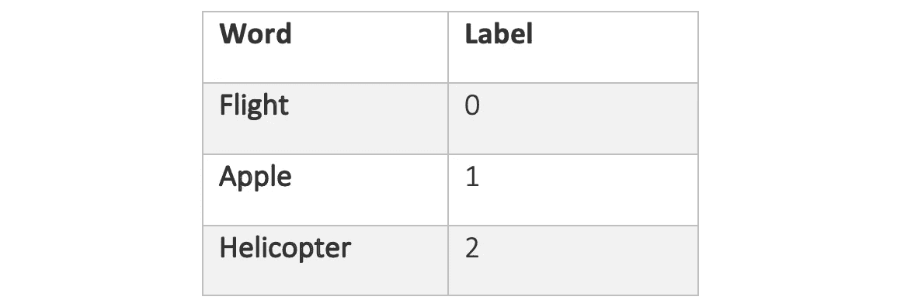
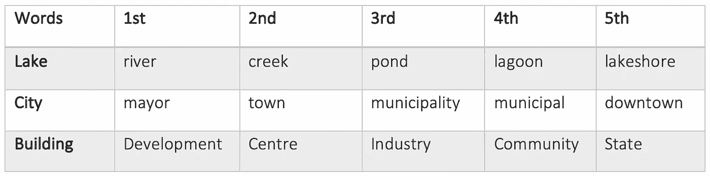
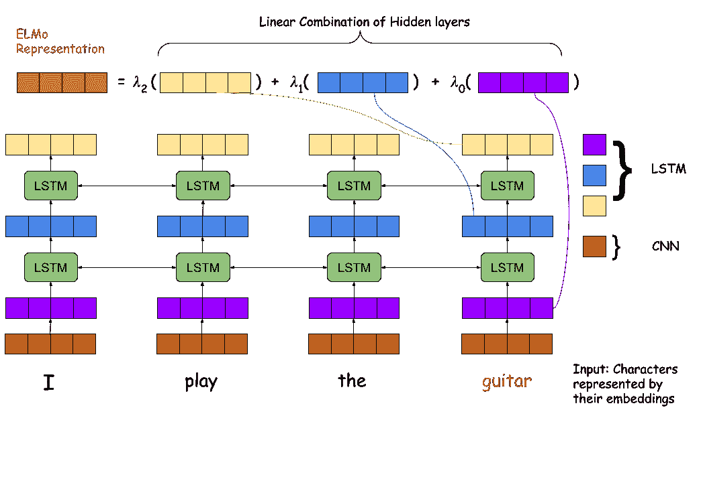
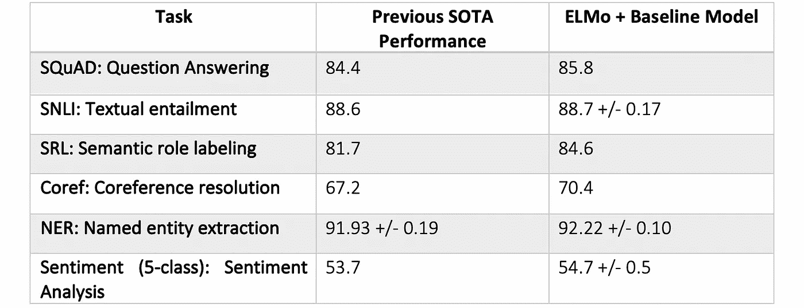

# 深度语境化的词汇表征——一种新的词汇嵌入方法

> 原文：<https://towardsdatascience.com/deep-contextualized-word-representations-a-new-approach-to-word-embeddings-66e0f520654d?source=collection_archive---------35----------------------->

桑迪·米勒在 [Unsplash](https://unsplash.com/s/photos/dictionary?utm_source=unsplash&utm_medium=referral&utm_content=creditCopyText) 上拍摄的照片

单词表示是现代自然语言处理系统的组成部分。单词表示基本上给了我们一种方法，将一段文本转换成我们的计算机系统可以阅读的数字。

多年来，已经开发了许多单词表示法，旨在捕捉单词的语义和句法依赖性。开发能够捕捉人类语言微妙之处的好的单词表示是一项极其困难的任务。好的单词表示应该把相似的单词放在一起。例如，单词`flight`的表示应该比单词`apple.`的表示更接近于单词`plane`的表示。另一个重要的考虑是语言[的多义性](https://en.wikipedia.org/wiki/Polysemy)。这是一个单词在不同的上下文中呈现不同含义的能力。举个例子，

> *一天一个* `*Apple*` *医生远离我。* `*Apple*` *今天发布了其最新的 iPhone 型号*

在上面的两个句子中，单词“Apple”有不同的含义，单词表示必须考虑到这一点，而不是独立于上下文计算单词的相同表示。

# 单词编码的历史

对单词进行编码的最简单的方法可能是标签编码或者对每个唯一的单词进行一次热编码。标签编码遇到了在机器学习模型中加入*偏差*的问题。被给予较高标签的单词可以被模型感知为更重要。

标签编码的例子

为了缓解这个问题，独热编码用一个向量来表示每个单词，该向量的特定位置被标记为 1，其余位置都是 0。向量的长度是我们的训练语料库中的总字数，可以是几千万。拥有如此巨大和稀疏的向量会导致计算和存储问题，从而使这种表示对于现实世界的应用不切实际。

*一键编码的例子*

2013 年，谷歌通过开发其 [**Word2Vec**](https://papers.nips.cc/paper/5021-distributed-representations-of-words-and-phrases-and-their-compositionality.pdf) 模型取得了突破，在单词表示领域迈出了巨大的步伐。Word2Vec 考虑了单词含义的上下文相关性质，这意味着它基于分布式语义的思想。通俗地说，我们可以用下面这句名言来总结这一点。

> 从一个人交的朋友你就可以知道他说了什么——约翰·鲁珀特·弗斯

因此，为了计算一个单词的表示，我们将首先尝试学习该单词出现的上下文。与出现在远处的单词相比，在一个句子中彼此靠近的单词将被给予相似的表示。经过训练的 **Word2Vec** 模型为我们提供了有意义的输出，如下所示:

*这里我们展示了 Word2Vec 为每个单词找到的最相似的单词——摘自* [TurkuNLP](https://turkunlp.org/) 小组的在线演示。

尽管它*没有*遭受简单方法的不良属性，但它确实有一些限制。

*   它不能为模型以前没有见过的单词产生表示。这些被称为词汇之外的单词。
*   它不能很好地学习生僻字的表达。

斯坦福研究人员发布的模型 [**GloVe**](https://nlp.stanford.edu/pubs/glove.pdf) ，是分布式语义学小组的又一成员。尽管它通过考虑除了局部上下文之外的单词的整体共现统计来改进 Word2Vec 模型，但是它仍然遭受与 Word2Vec 相同的问题。

那么，一个算法如何计算出它以前没有见过的单词或者很少在文本中出现的单词的表示呢？进入 [**深度语境化的文字表述**](https://www.aclweb.org/anthology/N18-1202.pdf) ，甚至在 NAACL 2018 正式发表之前就受到了很多关注。所提出的模型在几乎每个 NLP 基准上都取得了最先进的结果。由于这一点，以及它的独创性，它被授予了 NAACL 的**杰出论文这个模型如何解决与先前模型相关的问题？**

让我们深入这项突破性的工作，并尝试分解细节。

# 介绍

这篇论文提供的第一个观点是，为了解释词汇之外的单词，我们必须将单词分解成原子单位并对它们进行处理。这使得该模型能够获得对单词形成过程的一些洞察。例如，该模型没有将单词“destroying”作为输入，而是将单词视为字符组合的并集*‘de+stabilize+ing’*。

本文讨论的第二个问题是语言多义性问题。它认识到一个词根据上下文可能有一个以上的意思。所以它不会给一个单词分配任何一个向量。相反，它通过将整个序列作为输入来计算单词的表示。

# ELMo:来自语言模型的嵌入

埃尔莫模型:摘要——由[阿鲁纳布·戈什](http://www.linkedin.com/in/arunabh98)创建

ELMo 主要由三个单元组成——(I)卷积神经网络(CNN)，(ii)双向长短期记忆(LSTM)，以及(iii)嵌入。

## 模型的输入？

ELMo 的输入完全是基于字符的。我们使用字符嵌入将每个字符转换成一个矢量，然后传递给 CNN 层。字符嵌入使我们能够超越以前模型的缺点。首先，字符嵌入可以提取单词嵌入可能遗漏的语言细节。*其次，我们可以有效地表示词汇以外的单词，这是一个巨大的飞跃。*

## CNN 层的作用？

CNN 层将他们正在处理的单词的字符嵌入作为输入，并通过拾取 *n-gram 特征*来计算更强大的表示。CNN 层本质上是从呈现给它的令牌阵列中计算特征，从而提取一些统计、时间和空间信息。该输出然后被传递到双向 LSTM 层。

# 双向长短期记忆层的作用？

我们知道，LSTM 的核心是保存它已经看到的输入信息。这对于序列建模任务非常有用，因为记住先前的上下文是至关重要的。一般来说，LSTM 的是单向的；也就是说，他们只考虑过去的信息来预测结果？

另一方面，双向 LSTM 考虑来自两端的输入，一个来自过去，另一个来自未来，以做出预测。它可以通过考虑两个 LSTM 来做到这一点，一个从过去到未来，另一个从未来到过去。通过连接来自两个 LSTMs 的隐藏状态，它可以*在任何时间点保存关于整个序列的信息。*

举例来说，这是向前和向后 LSTM 将处理的内容:

> *前锋 LSTM:* 她去玩了……
> 
> 落后的 LSTM: …用她的球棒和球。

如你所见，双向 LSTM 通过理解过去和未来，擅长预测缺失的单词。

## 嵌入/输出

这就是 ELMo 模型真正脱离以前的架构的地方。以前的架构只是使用 LSTM 模型的最终隐藏状态作为单词表示，而 ELMo 考虑了 LSTM 所有隐藏状态的线性组合。LSTM 隐藏状态的权重是特定于任务的。这意味着，根据制图表达的用途，ELMo 模型将为每个图层赋予不同的权重。这是非常有利的，因为正如作者所展示的，不同的层捕获了语言的不同属性。

在他们的内在评估中，他们已经表明*较高级别的 LSTM 状态捕捉单词意义的上下文相关方面，而较低级别的状态模拟语言句法的方面*。同时暴露所有这些层允许模型选择它认为对手边的任务更有用的表示。例如，较高级别的层可能更有利于词义消歧任务。相比之下，较低级别的层对于诸如词性标注之类的任务可能更有用。

> 以这种方式组合内部状态允许非常丰富的单词表示

# 结果

实验结果证明了 ELMo 模型的有效性。ELMo 在一系列自然语言处理问题上，从问题回答到情感分析，都有显著的进步。ELMo 生成的表示很容易添加到现有的架构中，增强的模型实现了最先进的性能！

以下是 ELMo 达到最先进(SOTA)性能的任务:

论文结果— [艾尔默，作者 allenlp](https://allennlp.org/elmo)

这种无所不包的结果，以及它的应用的普遍性，使得这篇论文成为自然语言处理领域的一个*重要里程碑。*

# 结论

本文介绍了一种学习单词的高质量深度上下文相关表示的通用方法。这允许我们利用从单个模型获得的知识，并将其应用于不同的任务。我们不是为一个新任务从头开始训练一个模型，而是把 ELMo 学到的表示传递给它。

通过这个模型，我们可以利用迁移学习和半监督学习的力量。我们已经在计算机视觉中看到了这种方法的好处。*众所周知，当任务中的数据不足时，在 ImageNet 数据集上进行预训练以扩充新模型是提高性能的一种好方法。*

有了 ELMo，我们现在可以进入语言模型迁移学习的领域。看到我们将来如何在它的基础上发展是令人兴奋的！

*下次见！*