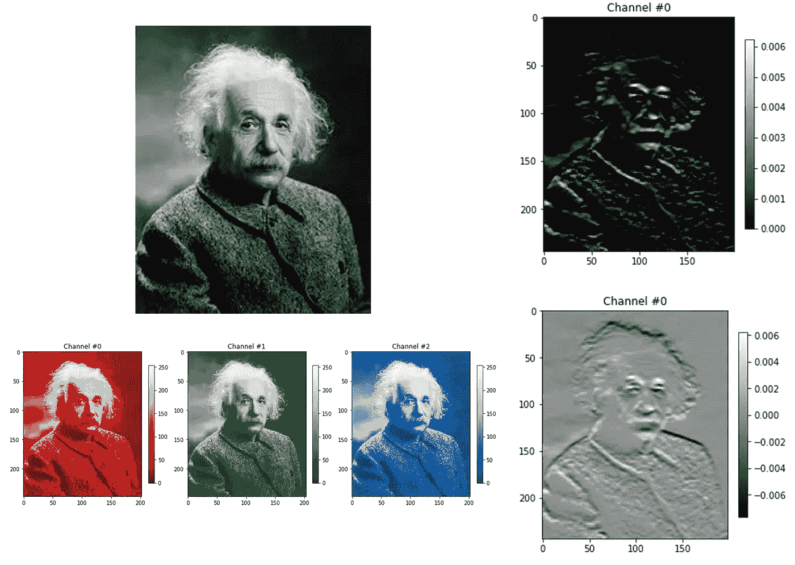
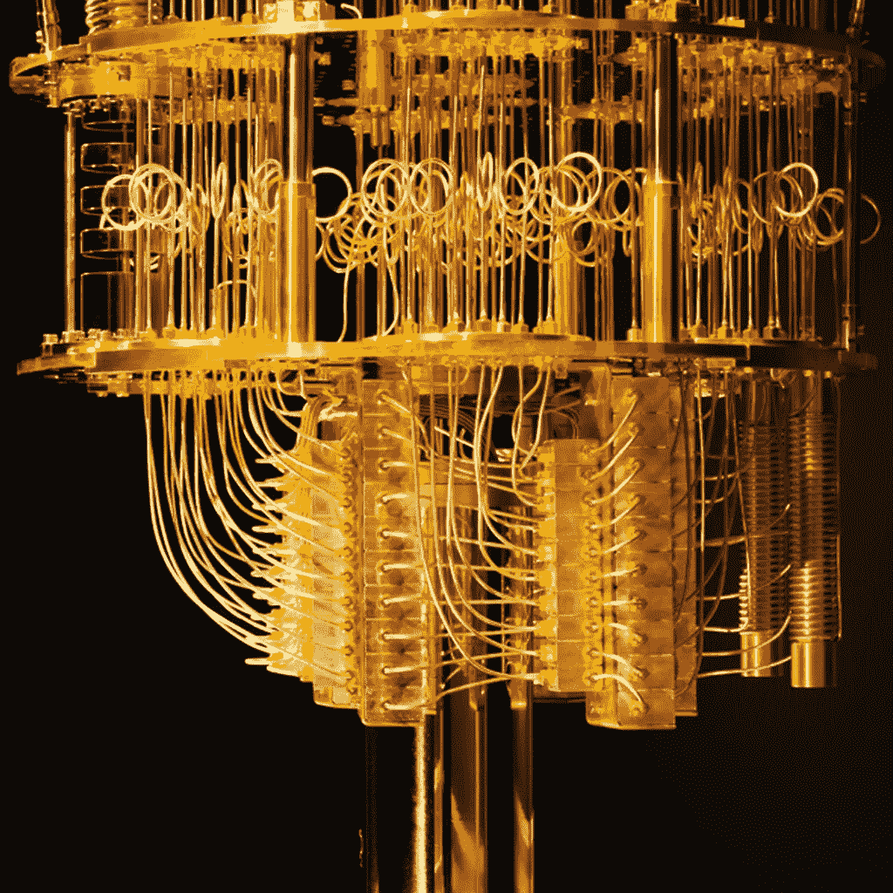
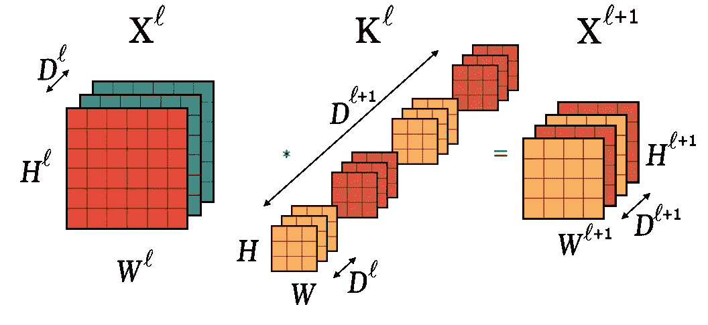
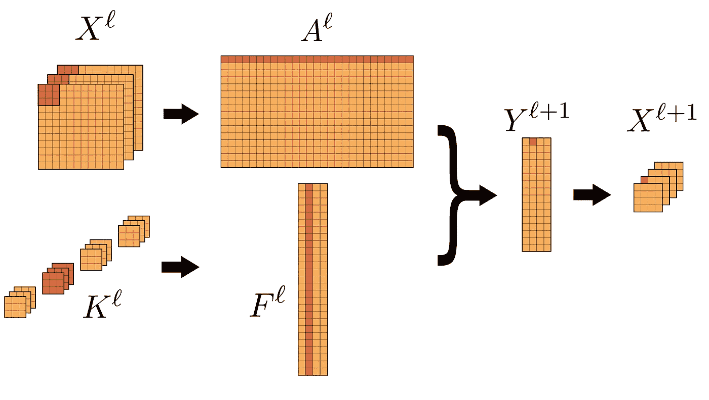
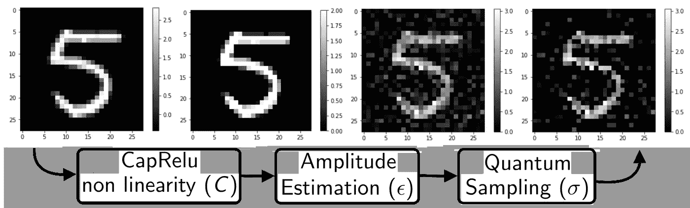
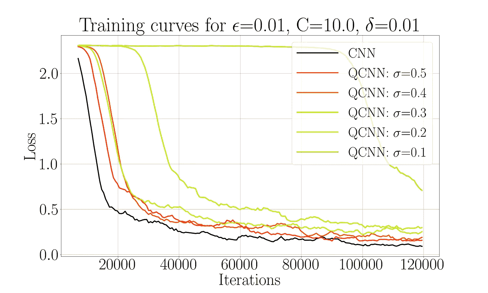

# 用于量子计算机的深度卷积神经网络

> 原文：<https://towardsdatascience.com/deep-convolutional-neural-networks-for-quantum-computers-98a6e96ee1d5?source=collection_archive---------30----------------------->

## 这项工作发表在《2020 年学习表征国际会议论文集》(ICLR)上，详细内容可以查看相关的[论文](https://openreview.net/pdf?id=Hygab1rKDS) 。

爱因斯坦和他令人费解的自我。(来源:我自己)

量子计算机会被用来做什么？量子计算机很有希望帮助解决许多领域的难题，包括机器学习。

在这项工作中，我们提出了在**量子计算机**上**卷积神经网络** (CNN)的理论实现。我们称这种算法为 **QCNN** ，我们证明它可以比 CNN 运行**更快**，并且具有良好的准确性。这是与[约尔达尼什·克里尼迪斯](https://scholar.google.ca/citations?user=poOHhXMAAAAJ&hl=en&oi=ao)和[阿努帕姆·普拉卡什](https://arxiv.org/search/quant-ph?searchtype=author&query=Prakash%2C+A)的合作作品。

为了实现这一点，我们不得不提出卷积乘积的量子版本，找到实现非线性和合并的方法，以及对代表图像的量子态进行断层成像的新方法，这种量子态代表图像保留有意义的信息。

# CNN 和量子计算机的超短介绍

简而言之，我们可以说**量子物理系统可以描述为 2^n 维的某个希尔伯特空间中的向量**，其中 n 是粒子数。事实上，这些向量代表了许多可能观测值的叠加。

另一方面，机器学习，特别是神经网络，粗略地利用向量和矩阵来理解或处理数据。**量子机器学习(QML)旨在使用量子系统对矢量进行编码，并通过新的量子算法对其进行学习**。一个关键的概念是，在许多向量上使用量子叠加，我们可以同时处理它们。

谷歌的量子计算机最近实现了“量子至上”。(来源:谷歌)

我不会深入解释量子计算或 QML。更多细节，我邀请新人阅读之前关于**量子 k-means** 的帖子(发表在*neur IPS*2019):

 [## 量子机器学习:量子计算机上的一种快速聚类算法

### 这项工作发表在 2019 年 NeurIPS 会议录上，你可以查看相关论文了解更多细节，以及…

towardsdatascience.com](/quantum-machine-learning-a-faster-clustering-algorithm-on-a-quantum-computer-9a5bf5a3061c) 

卷积神经网络(CNN)是一种用于图像分类、信号处理等的流行且有效的神经网络类型。在大多数层中，**卷积乘积**应用于输入，被视为图像或张量。随后通常是一个**非线性和汇集层**。如果你不熟悉，网上有很多教程，尤其是[这个技术介绍](https://pdfs.semanticscholar.org/450c/a19932fcef1ca6d0442cbf52fec38fb9d1e5.pdf)。

3D 张量输入 X^l (RGB 图像)和 4D 张量核 K^l.之间的卷积积(来源:我自己)

# 量子卷积层

在这一章中，我将通过集中在一层来解释什么是量子 CNN。

## 作为矩阵乘法的卷积乘积

这里的核心思想是，我们可以用矩阵乘法来重新表示卷积积。

X^l 和 K^l 之间的卷积等价于它们的整形形式 A^l 和 F^l.之间的矩阵乘法。输出 Y^l+1 可以被整形为卷积结果 X^l+1.(来源:我自己)

该算法首先加载量子叠加矩阵的所有行和列。然后我们使用之前开发的**量子内积估计**来近似输出的每个像素。实际上，这就像只计算一个输出像素(图上的红点)，但在**量子叠加中这样做允许同时计算所有像素**！然后，我们可以同时对它们中的每一个应用非线性。

不幸的是，我们*所拥有的*只是一个所有像素并行存在的量子态，这并不意味着我们*可以访问*所有像素。如果我们打开“量子盒”并查看结果(一个*测量*，我们将**每次随机只看到一个输出像素**。在我们打开盒子之前，这里有所有的“漂浮”。就像著名的活死人猫。没错。

## 只提取有意义的信息

为了处理这个问题，我们引入了一种方法**来只检索最有意义的像素**。事实上，*量子叠加*中的每个输出像素都有一个振幅，关系到**被看到的概率**如果我们测量这个系统的话。在我们的算法中，我们强制这个幅度等于像素值。**因此，高值的输出像素更有可能被看到。**

在 CNN 中，输出中的高值像素非常重要。它们表示输入中存在特定模式的区域。通过了解不同图案出现的位置，神经网络*理解*图像。因此，这些**高值像素携带有意义的信息**，我们可以丢弃其他像素，希望 CNN 能够适应。

图像上量子效应(噪声、随机性、采样)的小例子。这给人一种直觉，即我们在仅采样高值像素后仍然可以“理解”图像。(来源:我自己)

请注意，在对这些输出像素进行采样时，我们可以在存储它们时应用任何类型的**池**(技术细节请参见论文)。我们将这些像素存储在一个传统的存储器中，这样我们可以重新加载它们作为下一层的输入。

## **更快的运行时间**

传统上，CNN 层需要时间**(**输出大小 **x** 内核大小 **)** 。这就是为什么用大量大型内核来训练这些网络会变得昂贵。我们的**量子 CNN** 需要时间**(**(**σ**x 输出大小) **x Q)** 其中 **σ** 是我们从输出(< 1)中抽取样本的比例， **Q** 代表一束量子精度参数和数据相关参数。不再依赖内核大小(数量和维度),这可以允许更深层次的 CNN。更多细节参见[文件](https://openreview.net/pdf?id=Hygab1rKDS)。

# 量子反向传播

有了这个量子 CNN 的设计，我们现在想用量子算法来训练它。训练包括按照梯度下降规则更新核参数。一个更快的量子算法也可以在这里找到，它几乎等同于通常的梯度下降，但有一些额外的误差。

# 实验

QCNN 和量子反向传播看起来不错，但是隐含了大量的近似、噪声和随机性。尽管有这些人工制品，CNN 还能学习吗？在学习分类手写数字(MNIST 数据集)的任务上，我们比较了小型经典 CNN 的训练和 QCNN 的模拟。这表明 QCNN 可以以相似的精度学习。

量子和经典 CNN 训练曲线的比较。 **σ** 是每层之后从输出中抽取的高值像素的比例。除了太小的 **σ** 之外，QCNN 可以以良好的准确度学习。注意，这个数值模拟很小，只给出直觉，不是证明。(来源:我自己)

# 结论

在这项工作中，我们设计了第一个量子算法，通过引入量子卷积积和一种新的检索有意义信息的方法，几乎精确地复制了任何经典的 CNN 结构。它可以允许一个明显更快的 CNN，有更深更大的输入或内核。我们还开发了一个量子反向传播算法，并模拟了整个训练过程。

**开放性问题:**我们能在更大的架构上训练 QCNN 吗？用其他数据集？当然，当一台完整的量子计算机准备就绪时，量子 CNN 会有多好？

# 参考

[1] J. Allow， **I. Kerenidis** 等.[前馈神经网络的量子算法](https://arxiv.org/abs/1812.03089)(2018)

[2] Y. LeCun，Y. Bengio 等.[基于梯度的学习应用于文档识别](http://vision.stanford.edu/cs598_spring07/papers/Lecun98.pdf)。IEEE 会议录(1998)

[3] G. Brassard，P. Hoyer 等.[量子振幅放大与估计](https://arxiv.org/abs/quant-ph/0005055)*AMS 当代数学丛书*。(2000)

[4] **I. Kerenidis** ， **J. Landman** 等. [q-means:一种无监督机器学习的量子算法。](https://papers.nips.cc/paper/8667-q-means-a-quantum-algorithm-for-unsupervised-machine-learning)”载于*神经信息处理系统进展(NeurIPS)* (2019)。

[5] S. Chakraborty，A. Gilyén 等人在 ICALP (2019)的*会议录* *中的[分组编码矩阵幂的力量:通过更快的哈密顿模拟](http://arxiv.org/abs/1804.01973])改进回归技术*