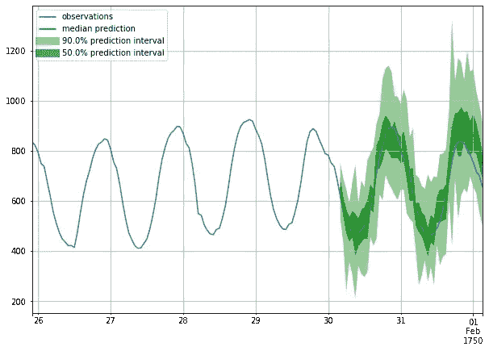
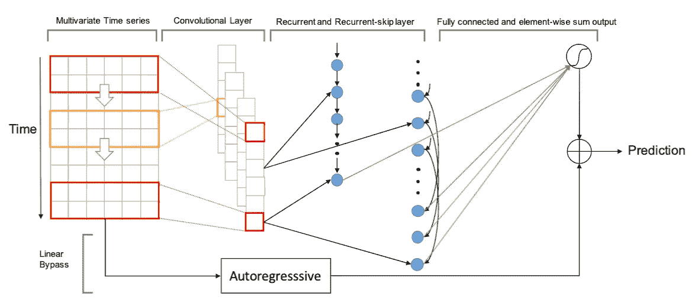
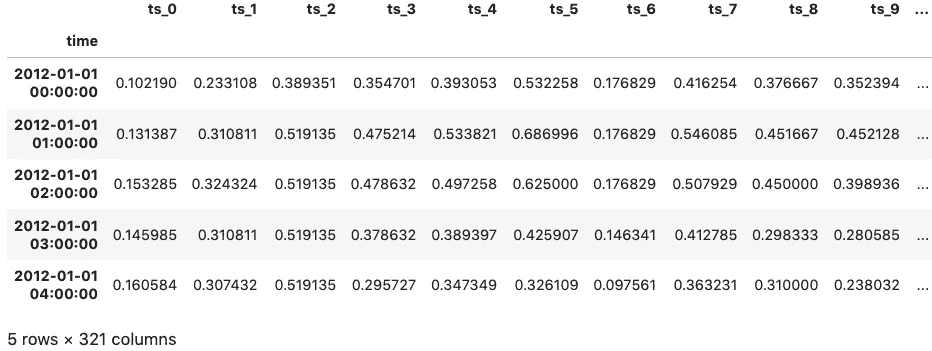
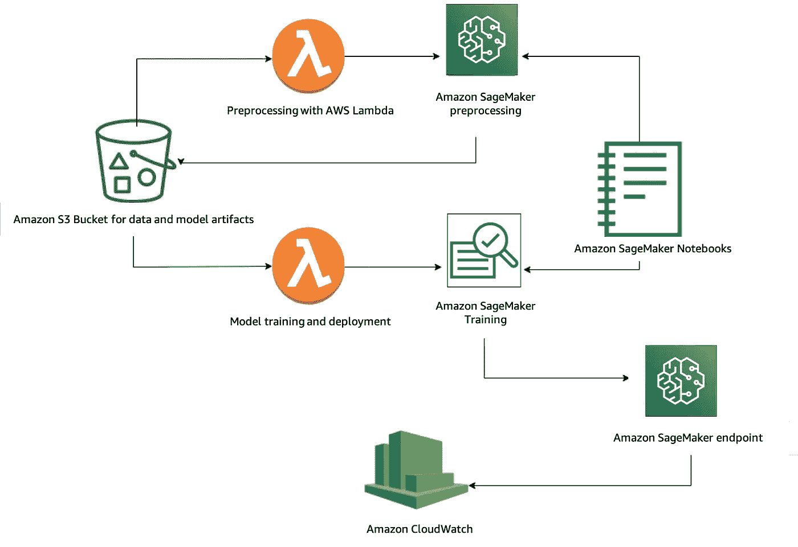
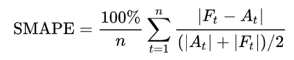
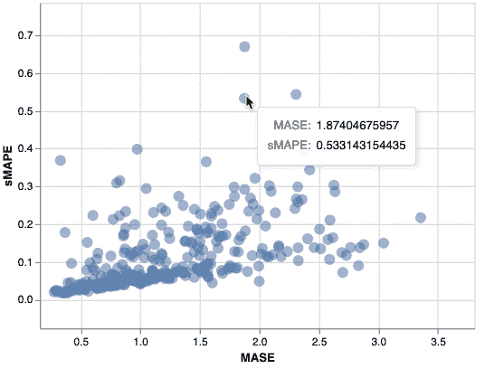
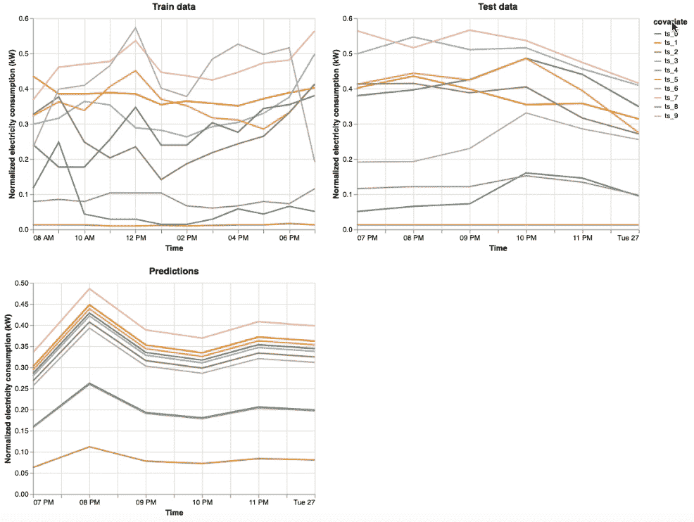

# 使用 Amazon SageMaker 进行深度需求预测

> 原文：<https://towardsdatascience.com/deep-demand-forecasting-with-amazon-sagemaker-e0226410763a?source=collection_archive---------20----------------------->

# 介绍

在本文中，我们探索如何使用深度学习方法，通过使用[亚马逊 SageMaker](https://docs.aws.amazon.com/sagemaker/index.html) 进行需求预测。

**TL；DR** :这个项目的[代码](https://github.com/awslabs/sagemaker-deep-demand-forecast)可以在 GitHub 上获得，只需[一次点击](https://github.com/awslabs/sagemaker-deep-demand-forecast#getting-started) AWS CloudFormation 模板就可以设置所需的堆栈。

# 什么是需求预测？

需求预测使用历史*时间序列*数据来帮助简化**跨业务的供需决策过程**。例子包括预测

*   下个月将在多个地点雇佣客户代表
*   下个季度跨多个地区的产品销售
*   视频流服务第二天的云服务器使用情况
*   下周多个地区的用电量
*   物联网设备和传感器等能源消耗

# 时间序列预测概述

任何用时间索引的数据*都是时序数据。时间序列数据分为**单变量**和**多变量**。例如，单个家庭的总用电量是一段时间内的单变量时间序列。这是一个单变量时间序列的样子，一些预测用绿色表示*



预测为绿色的单变量时间序列: [GluonTS 教程](https://gluon-ts.mxnet.io/examples/basic_forecasting_tutorial/tutorial.html)

当多个单变量时间序列相互叠加时，称为多变量时间序列。例如，一个街区中 10 个不同(但相关)家庭的总用电量构成了一个多变量时间序列数据。这样的数据封装了更多的信息，比如在邻域内的相关性。因此，我们有可能利用这些共享的信息对每个家庭进行更好的预测。

时间序列预测的现状方法包括自回归方法，如

*   [单变量时间序列数据的自回归综合移动平均](https://en.wikipedia.org/wiki/Autoregressive_integrated_moving_average) (ARIMA)
*   [向量自回归](https://en.wikipedia.org/wiki/Vector_autoregression) (VAR)用于**多变量**时间序列数据

这些经典方法的一个缺点是，它们需要在模型训练之前进行繁琐的数据预处理和特征工程，例如合并各种数据归一化、滞后、不同的时间尺度、一些分类数据、处理缺失值等。所有通常用[平稳性](https://en.wikipedia.org/wiki/Stationary_process)假设。然而，深度学习(DL)模型可以自动执行这些步骤。此外，众所周知，在数据足够多的领域，如**计算机视觉**或**自然语言处理**中，DL 方法已经超过了经典方法，但是*时间序列数据呢*？

# 时间序列预测的深度学习

在时间序列预测中使用深度学习方法已经成为一个主要的研究点，特别是对于(平稳/非平稳)多变量时间序列数据。借助高度优化的专用框架，如 [Apache MXNet](https://mxnet.apache.org/) 、 [PyTorch](https://pytorch.org/) 和 [TensorFlow](https://www.tensorflow.org/) ，具备快速 GPU 支持的训练和推理能力。

研究表明，DL 方法*优于*前述经典方法 ARIMA 和 VAR，特别是在处理*大量*具有*分类特征*和*缺失值*的(相关)多变量时间序列数据时。一个原因是神经网络模型可以预测新事件的季节性，因为这些全局模型在整个数据集上共同学习模式*，并且可以更好地将学习到的规律外推至新系列。一种这样的方法是 LSTNet，来自[用深度神经网络建模长期和短期时间模式。](https://arxiv.org/abs/1703.07015)*

## *LSTNet 是如何工作的？*

*[**LSTNet**](https://arxiv.org/pdf/1703.07015.pdf) 是最先进的 DL 预测方法之一。 [*我们已经把它*](https://gluon-ts.s3-accelerate.dualstack.amazonaws.com/master/api/gluonts/gluonts.model.lstnet.html) 贡献给了 [**GluonTS**](https://gluon-ts.s3-accelerate.dualstack.amazonaws.com/master/index.html) ，它目前是基于 [MXNet Gluon API](https://mxnet.apache.org/api/python/docs/api/gluon/index.html) 。LSTNet 的优势在于它将传统的自回归线性模型**与非线性神经网络部分**并行结合。这使得**非线性** DL 模型对于**违反尺度变化**的时间序列更加**鲁棒**。

以下是 LSTNet 架构，其中包含一个*

1.  ***卷积**为第一层，后面是*
2.  ***递归和跳跃递归**层*
3.  ***结合非线性特征和线性特征的全连通层***

**

**图片取自* [*用深度神经网络*](https://arxiv.org/abs/1703.07015) 建模长期和短期时间模式*

## *数据*

*在本次演示中，我们将使用**多变量时间序列** [电力消耗](https://archive.ics.uci.edu/ml/datasets/ElectricityLoadDiagrams20112014)数据。可以通过 [GluonTS](https://gluon-ts.s3-accelerate.dualstack.amazonaws.com/master/api/gluonts/gluonts.dataset.repository.datasets.html?#gluonts.dataset.repository.datasets.get_dataset) 直接下载数据的干净版本。数据包含**321**1 小时**频率的时间序列，其中***

*   *训练数据从**2012–01–01 00:00:00**开始，到**2014–05–26 19:00:00**结束*
*   *测试数据具有从**2014–05–26 19:00:00**到**2014–05–27 19:00:00**的附加数据*

*这是熊猫数据框架中标准化训练数据的快照*

**

# *组件和架构概述*

*数据集存储在 S3 存储桶中。使用[亚马逊 SageMaker](https://aws.amazon.com/sagemaker/) 的项目有如下三个主要组成部分:*

1.  *标准化数据的预处理步骤，设计为微服务来处理重型作业*
2.  *训练一个 LSTNet 模型，并检查预测的指标，如 [sMAPE](https://en.wikipedia.org/wiki/Symmetric_mean_absolute_percentage_error)*
3.  *(可选)部署并创建一个连接到 [Amazon CloudWatch](https://aws.amazon.com/cloudwatch/) 进行监控的实时预测 HTTPS 端点*

*这个完整的[代码](https://github.com/awslabs/sagemaker-deep-demand-forecast)项目可以在 GitHub 中获得。遵循[单键设置](https://github.com/awslabs/sagemaker-deep-demand-forecast#getting-started)的说明。

以下是视觉架构指南:*

**

*深度需求预测架构*

# *使用 Amazon SageMaker MXNet Estimator 进行训练*

*因为我们使用 GluonTS，我们需要通过提供`train.py`作为我们的入口点，使用 MXNet 估计器来训练我们的模型。例如，我们为`context_length=12`的 1 个时期训练我们的模型，T1 是过去 12 小时电力消耗的**训练窗口大小**，以预测未来 6 小时`prediction_length=6`的**测试窗口大小**。*

```
*import logging
from sagemaker.mxnet import MXNetCONTEXT_LENGTH = 12
PREDICTION_LENGTH = 6hyperparameters = {
    'context_length': CONTEXT_LENGTH,
    'prediction_length': PREDICTION_LENGTH,
    'skip_size': 4,
    'ar_window': 4,
    'channels': 72,
    'scaling': False,
    'output_activation': 'sigmoid',
    'epochs': 1,
}estimator = MXNet(entry_point='train.py',
                  source_dir='deep_demand_forecast',
                  role=role,
                  train_instance_count=1, 
                  train_instance_type='ml.p3.2xlarge',
                  framework_version="1.6.0",
                  py_version='py3',
                  hyperparameters=hyperparameters,
                  output_path=train_output,
                  code_location=code_location,
                  sagemaker_session=session,
                  container_log_level=logging.DEBUG,
                 )estimator.fit(train_data)*
```

## *韵律学*

*时序预测中最常见的评估指标之一是*

*   *[对称平均绝对百分比误差](https://en.wikipedia.org/wiki/Symmetric_mean_absolute_percentage_error) (sMAPE)，用于量化模型预测不足或预测过度的程度，其中时间 t 的**预测**为**英尺**，时间 t 的**实际值**为的*

******

****图片取自* [*维基百科*](https://en.wikipedia.org/wiki/Symmetric_mean_absolute_percentage_error)***

***When 可以直观地将其与另一个有用的指标进行比较，即平均绝对标度误差 (MASE)，其值越接近零，通常预测就越好。我们使用[牛郎星](https://altair-viz.github.io/) Python 包来交互式地检查它们的关系。***

******

***最后，我们可以交互式地可视化预测与训练和测试数据。例如，以下是训练、测试和预测结果中前 10 个时间序列协变量的样本。***

******

***如您所见，在捕捉总体趋势方面，该模型在 1 个时期内表现相对较好。人们可以使用 Amazon SageMaker Python SDK 中的 [HyperparameterTuner 来获得这些数据的最新结果。](https://sagemaker.readthedocs.io/en/stable/tuner.html)***

# ***部署端点***

***根据业务目标，例如在发电站设施中，当我们对模型离线运行的方式感到满意时，我们可以直接在 Amazon SageMaker 笔记本电脑中部署一个端点，如下所示:***

```
***from sagemaker.mxnet import MXNetModelmodel = MXNetModel(model_data,
                   role,
                   entry_point='inference.py',
                   source_dir='deep_demand_forecast',
                   py_version='py3',
                   framework_version='1.6.0',
                  )predictor = model.deploy(instance_type='ml.m4.xlarge', initial_instance_count=1)***
```

***之后，我们可以用一些`request_data`点击端点，在一行代码中获得带有自动 JSON 序列化和反序列化特性的预测***

```
***predictions = predictor.predict(request_data)***
```

# ***结论***

***感谢您通读这篇文章！

在这篇博客中，我们通过使用 [Amazon SageMaker](https://docs.aws.amazon.com/sagemaker/index.html) 进行预处理、训练、测试和部署，展示了深度学习模型如何用于需求预测应用。我们很想听听你的意见。如有任何问题、评论或反馈，请使用 [GitHub 问题](https://github.com/awslabs/sagemaker-deep-demand-forecast/issues/new/choose)。***

# ***承认***

***最后但同样重要的是，我要感谢 [Vishaal Kapoor](https://twitter.com/vishaal_kapoor) 、 [Jonathan Chung](https://github.com/jonomon) 和 Adriana Simmons 在撰写本文时提供的宝贵反馈。***

# ***了解更多信息***

***亚马逊 SageMaker:[https://docs.aws.amazon.com/sagemaker/index.html](https://docs.aws.amazon.com/sagemaker/index.html)
用亚马逊 SageMaker 进行深度需求预测:[https://github.com/awslabs/sagemaker-deep-demand-forecast](https://github.com/awslabs/sagemaker-deep-demand-forecast)GluonTS:[https://arxiv.org/pdf/1906.05264.pdf](https://arxiv.org/pdf/1906.05264.pdf)和[https://github.com/awslabs/gluon-ts](https://github.com/awslabs/gluon-ts)LSTNet:[https://arxiv.org/pdf/1703.07015.pdf](https://arxiv.org/pdf/1703.07015.pdf)***

***[1]: *Dua，d .和 Graff，C. (2019)。* [*UCI 机器学习知识库*](http://archive.ics.uci.edu/ml/index.php) *，加州尔湾:加州大学信息与计算机科学学院****